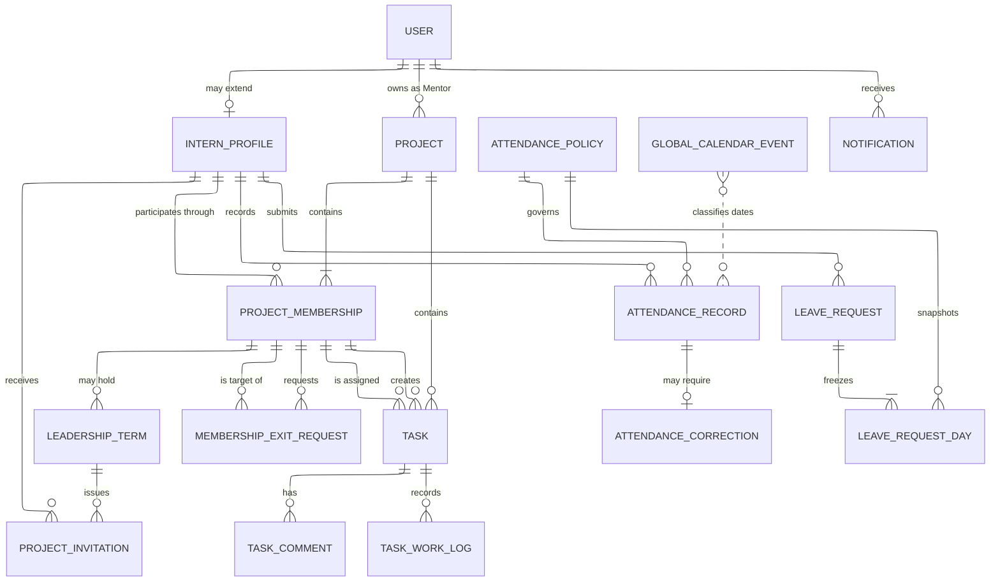

# Lab Timesheet & Project Management System

> **Status: REVIEW REQUIRED — IMPLEMENTATION NOT AUTHORIZED**
>
> This document is the authoritative review draft for the intended v1 system. It defines requirements and an approval baseline; it does not authorize application scaffolding, migrations, deployment, or production changes.

| Field | Value |
|---|---|
| Document type | Requirements, domain design, database reference, and acceptance catalogue |
| Audience | Primary implementor, five-person student team, instructor/reviewer |
| Product language | English |
| Business timezone | `Asia/Ho_Chi_Minh` |
| Database baseline | PostgreSQL 18.4, 24 application tables |
| Companion DDL | `database-schema.sql`, not tracked in this repository |
| Review state | Not approved for implementation |
| Normative rules | 269 in sections 1–22 |
| Acceptance coverage | 252 rules carry a §20 scenario; 17 governance and coordination rules are declared without one |
| Spec quality gate | 12 of 12 checks pass; no open question remains |

> **Spec quality gate.** The twelve-point specification review has been run against this
> document and passes: business context present, happy and error paths described, every
> behavioral rule carrying a testable acceptance scenario, no vague wording, edge cases named,
> no internal contradiction, naming matching the codebase, stack and security constraints
> stated, out-of-scope defined, and no unresolved specification question.
>
> Passing the gate is not approval. Approval belongs to the authority order in §1.1, and the
> review state above stays unchanged until the holder of that authority records it.

> **Companion files.** This document was authored in a separate documentation
> repository and copied here on 26 August 2026. Its companion `database-schema.sql`
> and the `assets/` images stayed behind and have never been tracked in this
> repository. Every image embed below is therefore written as a named reference
> rather than a link, so nothing renders as a broken image.
> The live schema is [`V1__baseline.sql`](../src/main/resources/db/migration/V1__baseline.sql)
> plus [`V2__add_task_effort_planning.sql`](../src/main/resources/db/migration/V2__add_task_effort_planning.sql),
> which together create twenty-four tables; §19.4 below carries the physical
> table diagram. Ask the document owner for the reference images if you need them.

## How to read a rule

Every rule that describes system behavior is written in EARS notation, which
fixes the shape of the sentence so that the triggering condition cannot be left
implicit.

| Opening | Meaning |
|---|---|
| `THE system SHALL …` | always true, no trigger |
| `WHEN <event>, THE system SHALL …` | triggered by an event |
| `WHILE <state>, THE system SHALL …` | holds continuously while a state holds |
| `WHERE <condition>, THE system SHALL …` | applies under a condition, including an error condition |

The point of the form is what it prevents. "Export failure shall return an
error" can be written and approved without anyone deciding what the error is;
`WHERE report generation fails, THE system SHALL return an error` forces the
sentence to name it. Rewriting this document into EARS on 12 September 2026
surfaced four such gaps, recorded as D6 through D9 in
[`reviews/open-decisions.md`](reviews/open-decisions.md).

**Twenty-eight rules are deliberately not in EARS**, because they bind people
rather than the system and no `THE system SHALL` sentence would be true of them:

| Rules | What they bind |
|---|---|
| `GOV-001`, `GOV-002`, `GOV-003`, `GOV-006`, `GOV-016` | how requirements are decided, named, and changed |
| `ARC-008`, `ACC-004`, `OPS-010` | a design baseline, an operational instruction, a recovery procedure |
| `AUTH-010`, `TSK-017` | pointers to the rule that actually decides, kept so a reader arrives there |
| `OPS-001`–`OPS-004` | the development environment a contributor sets up |
| `OPS-018`–`OPS-021` | ownership, integration order, and commit discipline across branches |
| `TST-001`–`TST-010` | the test-driven workflow a contributor follows |

Forcing those into the notation would make the document look uniform and say
something false. Chapter 13.6 of the playbook names that as the first
anti-pattern.

## 1. Authority, purpose, and scope

### 1.1 Decision authority

When statements conflict, use this precedence from highest to lowest:

1. Current decisions made by the primary implementor.
2. Decisions explicitly approved during the Codex brainstorming review.
3. The current Codex handoff.
4. Instructor-confirmed requirements.
5. The friend's earlier requirements answers.
6. The original Claude document, which is superseded.

> **Latest reporting-role revision — 27 August 2026.** The current approved handoff supersedes
> earlier Admin-positive reporting language in this review draft and its historical evidence.
> Admin is limited to account lifecycle and system configuration: Admin has no Attendance,
> Project/Task, or Daily Project Work Report scope, navigation, HTML/XLSX/PDF export, or report
> dataset. Attendance and Project/Task Admin requests are denied before target/Project option
> resolution or downstream reads and return the authenticated access-denied response; Daily Admin
> requests retain the existing non-disclosing `Project unavailable` behavior. The Admin dashboard
> contains account-lifecycle counts and configuration guidance only, without an Active Projects
> metric or report-like Project/Task summary. Active Interns retain own Attendance, active Mentors
> retain authorized detailed Intern Attendance, owning Mentors retain their existing Project/Task
> and Daily scopes, and current Leaders gain discoverable Daily access for each currently-led
> `PLANNED` or `ACTIVE` Project. Mentor demand for additional Daily reporting remains out-of-system
> operational communication without persisted delegation.

> **Admin Attendance-scope revision — 30 August 2026. Supersedes the 27 August block above on
> Attendance only.** Admin regains detailed Intern Attendance scope: navigation, the HTML report
> page, the XLSX and PDF exports, and the report dataset, with the same target scope an active
> Mentor holds. The acting Admin account must be active, and the target account's immutable role
> must be `INTERN`. Every other restriction in the 27 August block stands unchanged: Admin still
> has no Project/Task scope and no Daily Project Work Report scope, Admin Project/Task requests are
> still denied before Project option resolution or downstream reads, Daily Admin requests still
> return the non-disclosing `Project unavailable` response, and the Admin dashboard still carries
> account-lifecycle counts and configuration guidance only. This revision restores the position
> held by the 17 August SRS and is the current decision of the primary implementor under the
> `GOV-001` authority order; it is recorded in `.sdd/rfcs/ADR-002-attendance-report-scope.md`.

| ID | Requirement |
|---|---|
| GOV-001 | Implementers shall use the authority order above and shall not revive a lower-authority rule that conflicts with an approved higher-authority decision. |
| GOV-002 | The term **Project** replaces the obsolete term **Group** throughout code, schema, UI, and documentation. |
| GOV-003 | v1 shall be a working attendance and project/task-management system, not a prototype or static demonstration. |
| GOV-004 | THE system SHALL hold attendance time and Task work time as separate domains, and SHALL NOT derive, prove, or update either from the other. |
| GOV-005 | WHEN an Admin changes global workdays, scheduled start or end, check-in grace, checkout grace, monthly leave quota, violation penalty, or calendar configuration, THE system SHALL leave every previously computed attendance, leave, and compliance result unchanged. |
| GOV-006 | Features not specified here require a new reviewed decision; this draft does not silently authorize adjacent scope. |
| GOV-016 | Every requirement shall have exactly one canonical location, and a change in business behavior shall update that location. A new feature shall be documented in the same form as the features already documented: numbered rules under an applicable prefix, and acceptance scenarios in §20. Splitting the specification across separate documents is an organizational choice made when it helps, never a goal, and no separate document shall override the canonical location of a rule. |

### 1.2 Product objective

The system supports a university laboratory or internship program in four connected areas:

- account and internship administration;
- global attendance, leave, and missed-checkout correction;
- Mentor-owned projects with contextual Intern leadership and single-assignee tasks;
- authorized dashboards and consistent HTML, Excel, and PDF reports.

### 1.3 Explicit non-goals

| ID | Requirement |
|---|---|
| GOV-007 | THE system SHALL NOT use a SPA framework, JWT authentication, microservices, Redis, Kafka, a generic workflow engine, or a persisted `Report` entity in v1. |
| GOV-008 | THE system SHALL NOT provide project-level days off, multiple Task assignees, unconditional self-service Project joining or leaving, Task dependencies, epics, sprints, story points, labels, watchers, reactions, attachments, nested subtasks, or burndown charts. Authenticated invitation acceptance and Mentor-approved exit requests SHALL be the only member-initiated boundary workflows. |
| GOV-009 | THE system SHALL NOT persist generic domain events, login-attempt history, daily calendar materializations, or Task-assignment history. Narrow correction and leadership history SHALL be retained because current requirements depend on them. |
| GOV-010 | WHILE the deployment host and its secrets do not exist, THE delivery pipeline SHALL keep the SSH deployment job disabled and SHALL NOT attempt to connect to a deployment target. |
| GOV-015 | THE system SHALL keep the Task effort-planning slice local to this product. It SHALL NOT integrate with external Jira or Tempo, SHALL NOT mirror Jira issues, sprints, or story points, SHALL NOT hold Tempo accounts or synchronization, SHALL NOT add a `SUBMITTED` state or a Leader acceptance and rejection Task workflow, and SHALL NOT perform continuous replanning unrelated to worked reassignment. Any of these requires a new numbered requirement and a recorded decision. |

**Deferred, which is not the same as excluded.** Weekly and Monthly report
presets sit outside the v1 acceptance scope and are postponed for later
consideration. The rules above forbid their subjects; this paragraph does not.
Deferral is equally not a promise: building one later needs a numbered
requirement and an acceptance scenario like any other feature. The distinction is
recorded because `GOV-015` previously forbade these presets while the decision
behind it only postponed them.

## 2. Terminology and system-wide rules

| Term | Meaning |
|---|---|
| Global role | Exactly one immutable account role: `ADMIN`, `MENTOR`, or `INTERN`. |
| Project Leader | An Intern with the current leadership term for one Project; not a global role. |
| Active member | A project membership whose `left_at` is null and whose Intern is eligible to participate. |
| Project invitation | A current Leader's non-expiring invitation that only its authenticated intended Intern may accept or decline. |
| Membership exit request | A Leader's request to remove another member or a member's request to leave. Membership remains open until the owning Mentor approves it, while unfinished Tasks may be redistributed beforehand. |
| Pending exit target | The current member named by a pending exit request. Existing rights remain, but the target cannot receive newly created/reassigned Tasks or create a self-Task until the request is cancelled, rejected, superseded, or approved. |
| Project History | The authorized read-only Project view assembled from retained memberships, leadership terms, invitations, exit requests, completed/soft-deleted Tasks, comments, work logs, and attribution already stored by the approved schema. |
| Task creator | The membership that created a Task; creator authority is narrower than current-Leader authority and is retained historically. |
| Current assignee | The active Project member referenced by a Task's single assignee field. |
| Global day off | An Admin-authorized calendar date with `is_day_off=true`; it affects attendance and leave for all active Interns. |
| Eligible workday | A configured policy workday within the Intern's applicable internship interval that is not a global day off. |
| Expected workday | An eligible workday not covered by approved leave. |
| Raw checkout | The server timestamp recorded by normal checkout; it is never overwritten by correction. |
| Effective checkout | Raw checkout when present, otherwise an approved correction's requested checkout. |
| Task work log | A dated number of minutes spent on a Task; it is independent from attendance. |
| Task estimate | The planned effort in minutes for one whole Task. It belongs to the Task rather than to an assignee, and is independent of attendance, calendar duration, and elapsed time. |
| Actual Task effort | The lifetime sum of retained work-log minutes for one Task across every author and assignment. It does not reset when the Task is reassigned. |
| Task effort variance | For a `DONE` Task carrying an estimate, Actual Task effort minus Task estimate. It is a signed planning difference, undefined for an unfinished or unestimated Task. |
| Remaining effort forecast | A current Leader's dated prediction of the additional effort needed to finish an unfinished Task, recorded at a reassignment or replanning point. It never replaces the estimate. |
| Report date | A local business date used to select dated Task work logs for reporting. Attendance policy and calendar context may describe the date but never remove otherwise valid Task work from the report. |
| Daily Project Work Report | An authorized view of retained Task work logs for one Report date, grouped by Project and work-log author. It may show attendance context and each Task's current status, but asserts neither attendance nor that a Task was completed on that date. |

### 2.1 Words this product does not use

Six terms above have near-synonyms that carry a different meaning. Using one of
them in interface copy, a report label, or a rule turns a planning measurement
into a judgement about a person, which is the one thing `GOV-004` and the
separation of attendance from Task work exist to prevent.

| Term | Never call it |
|---|---|
| Task estimate | estimated hours, assignee estimate, time budget |
| Actual Task effort | current-assignee effort, attendance duration, selected-period effort |
| Task effort variance | efficiency score, productivity score, remaining effort |
| Remaining effort forecast | replacement estimate, assignee estimate, revised Task estimate |
| Report date | Task workday, reporting workday, attendance date |
| Daily Project Work Report | daily completion report, daily attendance report, daily productivity report |

| ID | Requirement |
|---|---|
| GOV-011 | THE system SHALL evaluate business dates and schedule boundaries in the timezone of the applicable attendance policy version, and SHALL persist instants as `timestamptz` treated as UTC. |
| GOV-012 | WHEN a check-in, checkout, submission, decision, activation, expiry, or lifecycle transition occurs, THE system SHALL record server time as the event time. THE system SHALL NOT accept a browser-supplied timestamp as event time. |
| GOV-013 | THE system SHALL perform every mutable aggregate update inside a transaction with optimistic locking. WHERE the update affects leave quota, a daily work total, bootstrap, or a Task transfer, THE system SHALL additionally serialize on the narrow affected record. |
| GOV-014 | THE system SHALL retain historical records behind restrictive foreign keys and lifecycle or soft-delete fields. THE system SHALL NOT physically delete an account, Project, membership, Task, attendance row, leave request, correction, comment, work log, or notification through a normal interface operation. |

## 3. Architecture and runtime

| ID | Requirement |
|---|---|
| ARC-001 | THE system SHALL be one server-rendered modular monolith on Java 25 and Spring Boot 4.1.0. |
| ARC-002 | THE system SHALL build with Maven and use Spring MVC, Spring Security, Spring Data JPA, Bean Validation, Thymeleaf, Spring Mail, and Flyway. |
| ARC-003 | THE system SHALL use PostgreSQL 18.4 for production, development, and integration testing. WHERE a test exercises a PostgreSQL-specific constraint, it SHALL run against PostgreSQL rather than H2. |
| ARC-004 | THE system SHALL pin Node 24 LTS and Tailwind CSS 4 for the UI toolchain, SHALL install with `npm ci`, and SHALL commit the npm lockfile. THE system SHALL constrain test tooling to a compatible range rather than pinning it by assertion, and every verification run SHALL record the version it actually resolved. A test SHALL NOT assert equality against a tool version, because that encodes a decision in a place no decision record can reach. |
| ARC-005 | THE system SHALL keep `LabtimesheetApplication` in the root package `com.lab.labtimesheet` and shared wiring in `config`. Business code SHALL be grouped below `feature.<name>` for `account`, `integration`, `project`, `task`, `attendance`, `notification`, and `reporting`, each adding only the layer subpackages it needs from `controller`, `model`, `model.dto`, `model.entity`, `repository`, `service`, and `exception`. Tests SHALL mirror those packages, and Thymeleaf templates and built static assets SHALL remain under `src/main/resources/templates` and `src/main/resources/static`. |
| ARC-006 | THE system SHALL bind validated DTOs in a feature's controllers and delegate business transactions to that feature's services, which use its repositories and entities. A feature MAY call another feature's service contract and DTOs. WHERE code reaches into another feature's repository or JPA entity, or places business SQL in a service, THE build SHALL fail. Flyway and schema verification SHALL be the only direct-SQL boundary, and THE system SHALL NOT introduce network boundaries, empty utility packages, or one-implementation abstraction layers. |
| ARC-007 | THE system SHALL treat Flyway as the sole production schema authority, and SHALL restrict JPA schema generation to validation outside disposable tests. |
| ARC-008 | The reviewed `database-schema.sql` is a design baseline rather than an executable artifact. The platform owner adapts it into Flyway migrations; it is never executed against production. |

Reference versions and primary documentation:

- [Spring Boot 4.1.0 release](https://spring.io/blog/2026/06/10/spring-boot-4/)
- [Spring Boot 4.1 code-structure guidance](https://docs.spring.io/spring-boot/4.1/reference/using/structuring-your-code.html)
- [Spring Boot SQL and Spring Data JPA guidance](https://docs.spring.io/spring-boot/reference/data/sql.html)
- [PostgreSQL support/versioning](https://www.postgresql.org/support/versioning/)
- [Tailwind CLI](https://tailwindcss.com/docs/installation/tailwind-cli)
- [Node release schedule](https://nodejs.org/en/about/previous-releases)

## 4. Accounts, bootstrap, and internship lifecycle

### 4.1 Bootstrap and accounts

| ID | Requirement |
|---|---|
| ACC-001 | WHILE the installation is uninitialized, THE system SHALL expose only the health endpoints, the static bootstrap assets, and the one-time bootstrap workflow. |
| ACC-002 | WHEN a valid first-Admin bootstrap is submitted, THE system SHALL create that `ADMIN` with a password and mark the singleton system state initialized in one transaction. WHERE two bootstrap submissions arrive concurrently, exactly one SHALL create an Admin and the other SHALL be told setup is already complete. |
| ACC-003 | WHEN initialization completes, THE system SHALL make the bootstrap route unavailable, and it SHALL remain unavailable across restarts. |
| ACC-004 | Bootstrap runs on a private interface before the installation is exposed publicly. The temporary unguarded bootstrap route is an accepted and documented operational risk, not a defect. |
| ACC-005 | WHILE bootstrap is open, THE system SHALL offer SMTP setup. WHERE the Admin defers it, THE system SHALL require five sequential distinct confirmations, SHALL offer Back and Configure SMTP on every one, and SHALL permit Finish without SMTP only on the fifth. |
| ACC-006 | THE system SHALL present the five deferral warnings in this order: account onboarding disabled, activation resend disabled, password recovery disabled, reduced email immediacy for workflow events, and final acknowledgement of a restricted installation. |
| ACC-007 | WHILE no tested SMTP configuration is active, THE system SHALL keep a persistent warning visible to every Admin. |
| ACC-008 | WHILE an Admin account is active, THE system SHALL permit it to create further Admin, Mentor, and Intern accounts. THE system SHALL treat the role chosen at creation as immutable. |
| ACC-009 | THE system SHALL use email as the only login identifier, unique case-insensitively after trimming and normalization. WHERE an Admin corrects an email identity, THE system SHALL require a tested active SMTP configuration, SHALL allow it only for a `PENDING_ACTIVATION`, `ACTIVE`, or `LOCKED` account, and SHALL commit only when the required delivery succeeds. A `DEACTIVATED` account SHALL remain read-only. |
| ACC-010 | WHEN an Admin creates an account, THE system SHALL store it as `PENDING_ACTIVATION` with no password hash and SHALL issue one single-use activation link that sets the first password. |
| ACC-011 | WHILE no tested SMTP configuration is active, THE system SHALL refuse account creation, activation resend, and password-reset delivery. Bootstrap creation of the first Admin is the only exception. |
| ACC-012 | WHERE activation delivery fails after an account is created, THE system SHALL leave the account pending, SHALL invalidate the failed token, and SHALL show the Admin a visible failure carrying an explicit Resend Activation action. |
| ACC-013 | WHEN an Admin resends activation, THE system SHALL invalidate any prior unused activation token before generating and sending the fresh one. |
| ACC-014 | THE system SHALL hold an account in exactly one of `PENDING_ACTIVATION`, `ACTIVE`, `LOCKED`, or `DEACTIVATED`. Lock and deactivation SHALL occur only through an explicit Admin action. |
| ACC-015 | WHEN an Admin unlocks a previously activated account, THE system SHALL return it to `ACTIVE` without changing its global role or recreating its credentials. |
| ACC-016 | WHILE an account is `DEACTIVATED`, THE system SHALL refuse authentication for it and SHALL keep its historical attribution visible. |
| ACC-017 | THE system SHALL allow a user to manage their own display and profile fields and their password. THE system SHALL give an Admin a server-filtered account directory searchable by display name, email, or Student Code and filterable by immutable global role. An Admin MAY correct the email identity and the permitted Intern fields; THE system SHALL NOT allow an Admin to edit a display name or a global role, SHALL change account and internship state only through the explicit lifecycle actions, and SHALL NOT fabricate session history it never stored. |
| ACC-018 | WHEN a password change, password reset, Admin email correction, lock, or deactivation succeeds, THE system SHALL invalidate that user's existing authenticated sessions. WHERE the corrected account is pending, THE system SHALL invalidate prior activation tokens and deliver a fresh activation to the corrected address; WHERE it is active or locked, THE system SHALL deliver notice to the corrected address. The identity change and its required delivery SHALL succeed or fail together. |

### 4.2 Internship lifecycle

| ID | Requirement |
|---|---|
| ACC-019 | THE system SHALL give every `INTERN` account exactly one Intern profile carrying a case-insensitively unique Student Code, internship start and end dates, and an internship status, and SHALL NOT create a profile for a non-Intern account. An Admin MAY correct the Student Code WHILE the internship is `NOT_STARTED` or `ACTIVE`, and MAY correct the dates only WHILE it is `NOT_STARTED`. WHILE a profile is `COMPLETED` or `WITHDRAWN`, THE system SHALL keep it read-only. |
| ACC-020 | THE system SHALL permit only these internship transitions: `NOT_STARTED → ACTIVE → COMPLETED` and `NOT_STARTED/ACTIVE → WITHDRAWN`. A `SUSPENDED` state SHALL NOT exist. |
| ACC-021 | WHEN the configured internship start date is reached, THE system SHALL activate an eligible `NOT_STARTED` Intern through both a scheduled guard and a guard applied at request time, so that correctness does not depend on scheduler timing. |
| ACC-022 | WHEN an Admin marks an Intern `COMPLETED` or `WITHDRAWN`, THE system SHALL apply it only through that explicit action. WHILE that Intern holds a current leadership term or owns an unfinished Task, THE system SHALL refuse both actions until the leader-transfer and Task-reassignment workflows have succeeded. |
| ACC-023 | WHILE an Intern is `COMPLETED`, THE system SHALL allow authentication in read-only mode to view retained history and manage password and session security, and SHALL refuse any attempt to create or mutate attendance, leave, correction, Project, Task, comment, or work-log data. |
| ACC-024 | WHEN an Intern becomes `WITHDRAWN`, THE system SHALL refuse normal authentication immediately and SHALL keep their historical memberships, Tasks, work logs, attendance, leave, and corrections attributable. |
| ACC-025 | WHEN a terminal lifecycle action is applied, THE system SHALL enforce it for authorization from that instant. Attendance already recorded on that local date SHALL remain reportable, and an otherwise empty terminal date SHALL NOT be newly classified as an absence. |

## 5. Authorization model

### 5.1 Authorization evaluation

| ID | Requirement |
|---|---|
| AUTH-001 | WHEN a state-changing operation is requested, THE system SHALL authorize it on the server from the global role, account and internship state, record ownership, active membership, current leadership term, current Task assignee, and aggregate lifecycle, as applicable to that operation. |
| AUTH-002 | THE system SHALL NOT treat a hidden Thymeleaf control as authorization. WHERE the caller is not authenticated, THE system SHALL redirect to the sign-in page. WHERE the caller is authenticated but holds the wrong role for the whole route, THE system SHALL return an authenticated access-denied response, which implies no record. WHERE the caller may reach the route but the record is not theirs or does not exist, THE system SHALL return the same not-found response in both cases, so that the response cannot be used to discover which records exist. |
| AUTH-003 | WHILE a Mentor account is active, THE system SHALL permit it to view Intern attendance and decide leave and correction requests for any Intern. THE system SHALL restrict Project-management authority to the Project's owning Mentor. |
| AUTH-004 | WHILE a leadership term is current, THE system SHALL grant its holder Leader permissions, and WHEN that term ends, THE system SHALL withdraw Task-management permission immediately. WHERE a Leader exit is pending, THE system SHALL require the owning Mentor to appoint the replacement before any exit-transfer work, and SHALL NOT move a Task merely because leadership changed. |
| AUTH-005 | THE system SHALL resolve current-assignee permission independently of leadership: a Leader MAY update or log work on a Task only WHILE assigned to it, and so MAY an ordinary member. |
| AUTH-006 | WHILE a Project is `COMPLETED`, THE system SHALL make it read-only to every role. An Admin MAY read every Project and its retained history. WHILE a Project is open, THE system SHALL grant history access to its owning Mentor and current members. WHEN a member is removed, THE system SHALL withdraw open-Project access and SHALL restore read-only access only after that Project completes. |

### 5.2 Permission matrix

Legend: **Yes** = permitted within the stated scope; **Own** = own Project or own record; **Assigned** = only while current assignee; **No** = forbidden.

| Capability | Admin | Owning Mentor | Current Leader | Active member / assignee |
|---|---:|---:|---:|---:|
| Manage accounts/global roles at creation | Yes | No | No | No |
| Lock/deactivate accounts; manage internship lifecycle | Yes | No | No | No |
| Manage SMTP, HolidayAPI, attendance policy, global calendar | Yes | No | No | No |
| View all Projects/tasks/progress | Yes, read-only | Own | Own | Membership scope |
| Create Project | No | Yes | No | No |
| Edit/activate/complete Project | No | Own | No | No |
| Directly add/remove Project members | No | Own | No | No |
| Issue/revoke Project invitation | No | Revoke any in Own | Issue/revoke own in Own | Accept/decline own invitation |
| Request/decide membership exit | No | Decide or remove directly in Own | Request another member's removal or own leave | Request/cancel own leave |
| Appoint/change Project Leader | No | Own | No | No |
| Redistribute unfinished Tasks for pending exit | No | No | Own, in confirmed batches | No |
| Create Task | No | No | Own; any active assignee | Self-assigned only |
| Assign/reassign Task | No | No | Own | No |
| Edit/soft-delete Task | No | No | Unfinished in Own | Unfinished self-created while still self-assigned |
| Change Task status | No | No | Assigned | Assigned |
| Comment on Task | No | Own | Own | Membership scope |
| Create/edit own Task work log | No | No | Assigned/own log | Assigned/own log |
| View aggregate Project progress | Yes | Own | Own | Membership scope |
| View Project/Task retained history | Yes, read-only | Own | Own | Current membership; former membership only after completion |
| View per-member Project hours | No | Own | Own | No |
| View Intern attendance | Yes | Yes | Own history only | Own history only |
| Decide leave/correction | No | Yes | No | No |
| Submit own leave/correction | No | No | If active Intern | If active Intern |
| Export authorized attendance/project reports | Attendance only | Authorized scope | Project scope | No detailed export |

| ID | Requirement |
|---|---|
| AUTH-007 | THE system SHALL keep Admin Project access read-only, and SHALL NOT let it imply commenting, membership, leadership, Task, or status authority. |
| AUTH-008 | THE system SHALL permit a Mentor to view a Task, comment on it, and read its retained history. THE system SHALL refuse a Mentor's attempt to create, assign, reassign, edit, soft-delete, or change the status of a Task. The automatic transfer performed by direct Mentor removal is a guarded Project-domain operation rather than Task-management authority. |
| AUTH-009 | WHILE a Project is open, THE system SHALL permit its active members to view every non-deleted Task, assignee, status, aggregate progress, comment thread, and authorized history entry in that Project, and to comment on any non-deleted Task. |
| AUTH-010 | Per-member Task-hour visibility is defined by `RPT-005`. This entry exists so that a reader of the authorization model reaches that rule; it adds nothing of its own. |
| AUTH-011 | WHEN an invitation, membership-exit, exit-transfer batch, self-Task, Task-definition, or history-read operation is requested, THE system SHALL authorize it inside the transaction or read boundary from the authenticated user, the owning Project, active membership, pending-exit state, the issuing or current leadership term, the Task creator or current assignee, and aggregate state. WHERE the identifier is cross-Project or stale, THE system SHALL disclose no protected record and SHALL commit no part of the change. |

## 6. Project, membership, and leadership

| ID | Requirement |
|---|---|
| PRJ-001 | WHEN an active Mentor creates a Project, THE system SHALL create the Project, one eligible initial Leader membership, and its first leadership term in a single transaction. THE system SHALL NOT commit a Project with no membership. |
| PRJ-002 | THE system SHALL permit only these Project transitions: `PLANNED → ACTIVE → COMPLETED`. THE system SHALL NOT reopen a `COMPLETED` Project. |
| PRJ-003 | THE system SHALL permit an Intern to hold active memberships in several Projects at once, and SHALL represent each membership explicitly with a join timestamp and an optional leave timestamp. |
| PRJ-004 | THE system SHALL permit only the owning Mentor to add or remove a member directly and to decide a membership exit. THE system SHALL permit the current Leader to invite an eligible Intern, request another member's removal, and redistribute unfinished Tasks away from a pending exit target. THE system SHALL permit an Intern to join only by accepting their own invitation, and to leave only after the owning Mentor approves. |
| PRJ-005 | WHILE a Project is `PLANNED` or `ACTIVE`, THE system SHALL maintain exactly one current Leader who is an active member of that Project. WHEN the Project completes, THE system SHALL close the final leadership term rather than delete it. |
| PRJ-006 | WHEN leadership changes, THE system SHALL close the current term and open a new term for another active member in one transaction, so that the Project never exposes two current Leaders and never exposes an active period without one. |
| PRJ-007 | WHEN leadership changes and nothing else, THE system SHALL NOT reassign any Task. The former Leader SHALL remain a normal member and SHALL retain assignee rights for Tasks still assigned to them. |
| PRJ-008 | WHILE an exit request targets the current Leader, THE system SHALL refuse Task transfer and exit approval until the owning Mentor appoints an eligible replacement. WHEN the replacement is appointed, THE system SHALL grant it current leadership and the authority to perform remaining transfer batches, and SHALL NOT move any Task merely because leadership changed. |
| PRJ-009 | WHEN an owning Mentor removes a member directly, THE system SHALL transfer that member's unfinished Tasks to the current Leader in the same transaction. WHERE the removed member is the current Leader, THE system SHALL require an eligible replacement and SHALL transfer the unfinished Tasks to that replacement. WHERE any replacement, transfer, authorization, or lock check fails, THE system SHALL leave membership and Tasks unchanged. |
| PRJ-010 | WHILE an exit request is pending, THE system SHALL permit the current Leader to redistribute work in confirmed batches, each naming one or more unfinished `TODO`, `IN_PROGRESS`, or `BLOCKED` Tasks and one eligible active current member. THE system SHALL apply each batch immediately and atomically, SHALL permit the batches to repeat, and SHALL NOT undo a completed batch when the request is later cancelled or rejected. |
| PRJ-011 | WHEN a membership closes, THE system SHALL leave completed Tasks, Task creator attribution, comments, work logs, invitations, exit requests, and leadership history unchanged. A completed Task SHALL remain assigned to the closed historical membership and SHALL display that Intern's name in authorized history. |
| PRJ-012 | WHEN a Mentor activates a Project, THE system SHALL require a current Leader, at least one active member, valid Project dates, and a valid active-member assignee on every non-deleted Task. |
| PRJ-013 | WHILE a Project is `PLANNED`, THE system SHALL permit the current Leader to prepare a Task for any active member and any active member to prepare a self-assigned Task, and SHALL refuse Task status changes and work logging until the Project is `ACTIVE`. |
| PRJ-014 | THE system SHALL permit only the owning Mentor to complete a Project, and only WHILE every non-deleted Task is `DONE`. WHEN completion commits, THE system SHALL close the current leadership and membership intervals, revoke pending invitations, supersede pending exit requests, and make the aggregate read-only. |
| PRJ-015 | THE system SHALL compute Project progress as `DONE non-deleted Tasks / all non-deleted Tasks`. WHERE a Project has no non-deleted Task, THE system SHALL render `N/A` rather than 0%. |
| PRJ-016 | THE system SHALL show, alongside Project progress, the counts of `TODO`, `IN_PROGRESS`, `BLOCKED`, and `DONE` Tasks and the total logged minutes. |
| PRJ-017 | THE system SHALL treat an Intern as eligible for direct addition or invitation only WHILE their account and internship are `ACTIVE` and they hold no active membership in that Project. WHEN an owning Mentor adds a member directly, THE system SHALL require no acceptance and SHALL record that Mentor as `added_by_user_id`; WHEN an invitation is accepted, THE system SHALL record the accepting Intern. WHERE a matching invitation is pending at the moment of a direct add, THE system SHALL mark it `SUPERSEDED` with `MENTOR_DIRECT_ADD` in the same transaction. |
| PRJ-018 | WHILE a Project is `PLANNED` or `ACTIVE`, THE system SHALL permit the current Leader at most one pending invitation per eligible Intern. THE system SHALL NOT expire an invitation by time, SHALL preserve the issuing leadership term, and SHALL require the intended Intern to authenticate before any response. An emailed URL SHALL open only the authenticated response page. |
| PRJ-019 | THE system SHALL permit only the intended Intern to accept or decline their pending invitation. WHEN acceptance is submitted, THE system SHALL recheck Project, invitee, issuing leadership, and membership state and create one membership, all in one transaction. THE system SHALL permit the issuing Leader to revoke their own pending invitations and the owning Mentor to revoke any. WHEN the issuing leadership ends, the Project completes, or the invitee becomes ineligible, THE system SHALL revoke the now-unusable pending invitation without deleting it. |
| PRJ-020 | THE system SHALL permit a current Leader to request removal of another current member, and any current member including the Leader to request their own leave. THE system SHALL require a nonblank reason, SHALL NOT expire the request, and SHALL allow at most one pending request per membership. WHILE a request is pending, THE system SHALL show every authorized Project viewer whether a replacement Leader is required, how many unfinished Tasks remain, and whether the request is ready for a Mentor decision. |
| PRJ-021 | WHILE an exit request is pending, THE system SHALL keep the target's membership, existing assignments, and existing Task rights active, and SHALL refuse to give that target a newly created or reassigned Task or to let them create a self-Task. THE system SHALL permit the requester to cancel and only the owning Mentor to approve or reject. WHEN the request is cancelled or rejected, THE system SHALL preserve completed transfer batches and restore new-assignment eligibility. WHEN an owning Mentor removes the target directly, THE system SHALL resolve the matching request as `APPROVED`; WHEN the Project completes, THE system SHALL mark unresolved requests `SUPERSEDED`. |
| PRJ-022 | WHEN exit approval is submitted, THE system SHALL lock and recheck the request, the target membership, current leadership, and the unfinished Task count. WHILE the target is the current Leader or owns any unfinished Task, THE system SHALL refuse approval. WHEN both guards pass, THE system SHALL commit membership closure and request approval together, leaving completed Tasks and all retained attribution unchanged. |

## 7. Tasks, comments, and task work

### 7.1 Task lifecycle

| ID | Requirement |
|---|---|
| TSK-001 | THE system SHALL give each Task exactly one Project and exactly one current assignee, referencing a membership in that same Project. |
| TSK-002 | THE system SHALL permit one Intern to be the current assignee of several Tasks across several Projects. |
| TSK-003 | THE system SHALL permit the current Leader to create a Task assigned to any eligible active member of the same Project. THE system SHALL permit any other eligible active member to create a Task only WHERE its initial assignee is that creating membership. WHILE a member is the target of a pending exit, THE system SHALL treat them as ineligible for a new assignment and for self-Task creation. |
| TSK-004 | THE system SHALL store, for each Task, a title, an optional description, a status, an optional due date, the current assignee, the creator membership, the current assignment actor and time, lifecycle timestamps, an optional deletion actor, and an optimistic-lock version. In an authorized view, THE system SHALL resolve the creator, the current or final assignee, comment authors, work-log authors, and the deletion actor to the retained human-readable identity. |
| TSK-005 | WHERE a due date is given, THE system SHALL require it to fall within the Project date range and SHALL refuse a date that is a currently configured global day off at the moment it is created or changed. |
| TSK-006 | WHEN an Admin creates a later global day off, THE system SHALL leave existing Task due dates unchanged, and SHALL identify the affected Tasks in the calendar preview so their Leader can reschedule them. |
| TSK-007 | THE system SHALL permit only the current assignee to change a Task status, and SHALL permit only these transitions: `TODO → IN_PROGRESS|BLOCKED`, `IN_PROGRESS → DONE|BLOCKED`, `BLOCKED → TODO|IN_PROGRESS`, and `DONE → IN_PROGRESS`. |
| TSK-008 | WHERE any other status transition is requested, THE system SHALL reject it. THE system SHALL NOT provide a configurable workflow engine in v1. |
| TSK-009 | THE system SHALL permit only the current Leader to reassign an unfinished Task, singly or within an exit-transfer batch, and SHALL require every target to be an eligible active current member who is not the target of a pending exit. WHEN a reassignment commits, THE system SHALL update the current assignment actor and time while preserving creator attribution, status, comments, work logs, and applicable lifecycle timestamps. WHILE a Task is `DONE`, THE system SHALL refuse transfer and reassignment until its current assignee reopens it to `IN_PROGRESS`. |
| TSK-010 | THE system SHALL permit the current Leader to edit or soft-delete any unfinished Task in the Project. THE system SHALL permit a non-Leader creator to edit or soft-delete an unfinished Task only WHILE the creator and the current assignee remain the same eligible active membership. WHEN a Task is soft-deleted, THE system SHALL exclude it from progress and ordinary lists and SHALL keep it visible in authorized history with its deletion attribution. |

### 7.2 Comments and work logs

| ID | Requirement |
|---|---|
| TSK-011 | THE system SHALL store Task comments as separate append-only records, and SHALL NOT provide comment editing or deletion in v1. |
| TSK-012 | WHILE a Project is not completed, THE system SHALL permit its owning Mentor, its current Leader, and every active member to comment on any non-deleted Task in that Project. |
| TSK-013 | THE system SHALL permit only the current assignee to create a work log for a Task, and SHALL require each entry to carry a work date, minutes from 1 through 1440, and an optional nonblank note. |
| TSK-014 | THE system SHALL refuse a work date that is in the future, outside the Project dates, or outside the logging member's membership interval. |
| TSK-015 | THE system SHALL refuse a work log that would take an Intern's combined Task work across all Projects above 1440 minutes on one local date, and SHALL serialize that check on the Intern so that concurrent submissions cannot over-allocate. |
| TSK-016 | WHILE the Project is active and the author remains a member, THE system SHALL permit the log author to correct their own work log, even after the Task has been reassigned. THE system SHALL refuse any other user's attempt to edit that log. |
| TSK-017 | Day-off effects on Task activity are defined by `CAL-009`, and the separation of Task work from attendance by `GOV-004`. This entry exists so that a reader of the Task domain reaches those rules; it adds nothing of its own. |
| TSK-018 | WHEN a member creates a self-Task, THE system SHALL set the creator, the assignment actor, and the assignee to the authenticated membership in one transaction, and SHALL NOT raise a notification to that same member. The current Leader's broader creation authority SHALL remain scoped to the Project. |
| TSK-019 | THE system SHALL authorize Task definition from currently stored context: the current Leader MAY manage any unfinished Task, and an eligible member creator MAY manage only an unfinished Task still assigned to them. WHILE a member is the target of a pending exit, THE system SHALL refuse new and self-assignment to them without removing their existing assignee rights. WHEN a Task is reassigned away from its creator, THE system SHALL withdraw creator control while leaving historical creator attribution unchanged, and SHALL restore that control on reassignment back only WHERE creator and current assignee are equal and currently eligible. |
| TSK-020 | THE system SHALL permit a Task to carry one optional whole-Task estimate in integer minutes from 1 through 527040. THE system SHALL permit only the current Project Leader to set, replace, or clear it, and only before the first retained work log. WHEN the first work log is retained, THE system SHALL make the estimate immutable. THE system SHALL treat estimate mutation as separate from ordinary Task editing and SHALL reject it from any other actor. |
| TSK-021 | THE system SHALL compute Actual Task effort as the lifetime sum of retained work-log minutes across every author and assignment. WHERE a Task is `DONE` and carries an estimate, THE system SHALL compute variance as actual effort minus estimate. WHERE a Task is unfinished, reopened, or unestimated, THE system SHALL treat variance as undefined. THE system SHALL NOT derive an efficiency or productivity score from any of these. |
| TSK-022 | WHERE an unfinished Task carrying retained work is reassigned, THE system SHALL require an append-only Remaining effort forecast from the current Leader containing the reassignment snapshot. THE system SHALL accept a correcting successor only before the incoming assignee's first newly created work log. WHILE a member owns a worked unfinished Task, THE system SHALL refuse direct Mentor removal, and SHALL NOT fabricate Leader provenance for a forecast. |

## 8. Global attendance policy and calendar

### 8.1 Effective-dated policy

| ID | Requirement |
|---|---|
| ATT-001 | THE system SHALL maintain one effective-dated global attendance-policy timeline managed by an Admin. THE system SHALL store, in each version, the timezone, scheduled start and end, check-in grace minutes, checkout grace minutes, monthly leave quota, violation penalty, and configured ISO weekdays. THE system SHALL expose a read-only policy History built from those retained versions and their non-secret creator and effective metadata. |
| ATT-002 | THE system SHALL seed one policy version effective `1970-01-01` with timezone `Asia/Ho_Chi_Minh`, Monday through Friday, 08:30 to 15:30, 30-minute check-in grace, 30-minute checkout grace, 3 leave workdays per month, and a 0.25 penalty per applicable violation. |
| ATT-003 | THE system SHALL require each grace value to be an integer from 0 through 720 minutes, and SHALL require scheduled end plus checkout grace to fall strictly before the next local midnight, so that an overnight schedule cannot be configured. THE system SHALL require the monthly leave quota to be an integer from 0 through 4, because four days is the largest whole number that stays within one fifth of the shortest twenty-workday month. THE system SHALL require a new policy version to begin on the first day of a future calendar month, SHALL collect that month in the Admin form and derive its first day on the server before applying the same validation, SHALL permit a not-yet-effective version to be replaced, and SHALL treat an effective version as immutable. |
| ATT-004 | WHERE a report covers a date with no attendance row, THE system SHALL resolve the immutable policy version effective on that date, so that historical absence and denominator calculations are preserved. |
| ATT-005 | WHEN check-in is accepted, THE system SHALL attach the applied policy version to that attendance row, and that version SHALL govern the row's check-in and checkout boundaries permanently. WHEN a leave request is submitted, THE system SHALL reference and snapshot the applicable policy and quota on each allocated day. |
| ATT-006 | WHEN a later policy or calendar change is scheduled, THE system SHALL leave existing leave-day allocations frozen, and SHALL apply the revised eligibility only to newly submitted requests. |

### 8.2 Global calendar and HolidayAPI

| ID | Requirement |
|---|---|
| CAL-001 | THE system SHALL permit only an Admin to create or edit a global calendar event, whether custom or imported. THE system SHALL NOT provide project-level calendar overrides. |
| CAL-002 | THE system SHALL treat the HolidayAPI integration as optional and fixed to country `VN`, and SHALL call it only from an explicit Admin preview or import action. THE system SHALL NOT call it from attendance, leave, a dashboard, or a report. |
| CAL-003 | WHEN an import preview is produced, THE system SHALL preserve the source UUID, name, actual date, observed date, public-holiday marker, import timestamp, and the non-secret provenance the Admin Calendar History needs. WHERE a candidate carries `public=true`, THE system SHALL preselect the local `is_day_off` choice without forcing it. |
| CAL-004 | THE system SHALL require an Admin to review and explicitly select the rows to import, SHALL copy the selected data locally, and SHALL NOT silently overwrite an existing source UUID. |
| CAL-005 | WHERE the HolidayAPI key is absent, invalid, rate-limited, or the service is unavailable, THE system SHALL keep manual custom calendar entry available. |
| CAL-006 | THE system SHALL treat a calendar date as globally exempt WHERE at least one local event on that date carries `is_day_off=true`. THE system SHALL display a non-day-off observance without letting it affect attendance or quota. |
| CAL-007 | WHILE a global event's calendar date has passed, THE system SHALL treat that event as immutable. THE system SHALL permit a future event to change under optimistic locking with an impact preview. THE system SHALL expose retained past and current event metadata through a Calendar History view without exposing any integration secret. |
| CAL-008 | WHEN a leave request is submitted, THE system SHALL treat a global day off as waiving attendance obligation, absence classification, compliance penalty, and quota consumption. THE system SHALL leave already-materialized leave-day allocations frozen under `ATT-006`, and SHALL disclose any such reservation in the future-calendar impact preview rather than rewriting it silently. |
| CAL-009 | WHILE a date is a global day off, THE system SHALL refuse attendance check-in on it and SHALL refuse creating or moving a Task due date onto it. THE system SHALL continue to permit voluntary Task comments, status changes, and work logs on that date. |

HolidayAPI field behavior is based on its [official API documentation](https://holidayapi.com/docs).

## 9. Attendance records and metrics

### 9.1 Check-in and checkout

| ID | Requirement |
|---|---|
| ATT-007 | WHILE an Intern account is `ACTIVE`, THE system SHALL permit at most one check-in per eligible workday that is not covered by approved leave. |
| ATT-008 | WHEN check-in is accepted, THE system SHALL store the server timestamp, the derived local work date, and the applied policy version in one transaction. WHERE the attempt falls on an off-day, on approved leave, duplicates an existing row, or comes from a non-active, completed, or withdrawn account, THE system SHALL reject it. |
| ATT-009 | WHERE `check_in > scheduled_start + check_in_grace`, THE system SHALL classify the day as late, and otherwise SHALL NOT. Under the seeded defaults, exactly 09:00:00 is on time and 09:00:00.001 is late. |
| ATT-010 | WHEN checkout is requested, THE system SHALL require that day's open attendance row and SHALL accept it once, only WHILE `server_now <= scheduled_end + checkout_grace` under the policy version attached to that row. The cutoff is inclusive: under the seeded defaults 16:00:00 is accepted and the first later instant is rejected. WHEN a checkout is accepted, THE system SHALL preserve the raw server timestamp. |
| ATT-011 | WHERE effective checkout falls before scheduled end, THE system SHALL record an early-departure violation. WHERE `server_now > scheduled_end + checkout_grace` and the row still has no effective checkout, THE system SHALL classify it as `MISSING_CHECKOUT` only and SHALL NOT also record early departure. After that cutoff THE system SHALL refuse normal checkout and SHALL NOT populate or overwrite the raw checkout. |
| ATT-012 | THE system SHALL NOT edit a raw check-in or raw checkout through any account, correction, or report operation. |

### 9.2 Daily classification and formulas

For an applicable Intern/date, classification precedence is:

1. `HOLIDAY` when an imported day-off event applies, otherwise `OFF_DAY` for another global/configured off-day;
2. `APPROVED_LEAVE`;
3. `PRESENT` when an attendance record exists, including a missing-checkout record;
4. `ABSENT` for the remaining eligible workday.

| ID | Requirement |
|---|---|
| ATT-013 | THE system SHALL exclude non-eligible dates from the attendance-rate and compliance denominators, including global days off and approved leave. |
| ATT-014 | THE system SHALL compute the attendance rate as `present eligible workdays / (eligible workdays − approved-leave workdays)`. WHERE that denominator is zero, THE system SHALL render `N/A`. |
| ATT-015 | WHERE a day is present, THE system SHALL compute daily compliance as `max(0, 1 − policy penalty × applicable violation count)`. WHERE an expected day is absent, THE system SHALL score it 0. WHERE a day is an off-day or approved leave, THE system SHALL give it no daily score. |
| ATT-016 | THE system SHALL count as applicable violations the late violation plus exactly one of early departure or missing checkout. WHEN a correction is approved, THE system SHALL recompute the effective checkout outcome without changing the historical policy penalty. |
| ATT-017 | THE system SHALL compute period compliance as the average daily score over expected workdays. WHERE a period contains no expected workday, THE system SHALL report `N/A`. |
| ATT-018 | WHEN a terminal internship timestamp is set, THE system SHALL create no further attendance obligation after that instant, and SHALL preserve any attendance already recorded on that local date. |

## 10. Missed-checkout corrections

| ID | Requirement |
|---|---|
| COR-001 | THE system SHALL permit only the owning Intern to request a correction, only WHERE the attendance row has no raw checkout, and only after the checkout cutoff of the policy version attached to that row has passed. THE system SHALL permit at most one correction request per attendance row. |
| COR-002 | THE system SHALL require the owning Intern to supply a proposed checkout and a nonblank reason, and SHALL require that proposed checkout to be after check-in, on the original local work date, and not in the future at submission. |
| COR-003 | THE system SHALL accept a submission through the inclusive deadline `scheduled end on the attendance date + 24 hours`, resolved from the attached historical policy version. THE system SHALL anchor that deadline to scheduled end rather than to the checkout cutoff; under the seeded defaults it falls at 15:30 the following day. |
| COR-004 | WHEN a submission is accepted, THE system SHALL open a separate 24-hour decision window measured from `submitted_at`. |
| COR-005 | WHILE the decision window is open, THE system SHALL permit any active Mentor to approve, reject, or revert an approved or rejected decision to `PENDING`, and SHALL write an immutable correction event for every transition. |
| COR-006 | WHEN a correction is approved, THE system SHALL leave the raw checkout null and use the proposed checkout only as the effective checkout. THE system SHALL then clear the missing-checkout classification and MAY record early departure. |
| COR-007 | WHEN the decision window expires, THE system SHALL lock an approved or rejected request, and SHALL automatically reject and then lock a request still pending. |
| COR-008 | THE system SHALL persist auto-rejection and its notifications through a scheduled worker, and SHALL apply the same deadline guard on every correction read and write path before acting. |
| COR-009 | WHILE a correction is expired or locked, THE system SHALL reject any further Mentor state change. THE system SHALL NOT permit an Admin to decide or reopen a correction. |

## 11. Leave

| ID | Requirement |
|---|---|
| LEV-001 | THE system SHALL represent leave as a full-day inclusive date range with a nonblank reason. THE system SHALL NOT provide a leave type or a seven-day advance-notice rule in v1. |
| LEV-002 | THE system SHALL require a leave request to fall within the Intern's applicable internship interval and to contain at least one eligible workday after excluding configured non-workdays and global days off. |
| LEV-003 | WHEN a leave request is submitted, THE system SHALL materialize each quota-consuming date with its policy version, calendar month, and monthly quota snapshot. WHERE a request spans months, THE system SHALL allocate each date to its own month, and SHALL show the Intern those frozen allocations grouped by quota month. |
| LEV-004 | THE system SHALL reserve quota for both `PENDING` and `APPROVED` leave days, and SHALL release it WHEN a request becomes `REJECTED` or `CANCELLED`. For a selected quota month THE system SHALL show the Intern `reserved / applicable quota / remaining`, where remaining is `max(0, quota − reserved)`. THE system SHALL default the dashboard to the current business month and SHALL permit month selection in My Leave. |
| LEV-005 | WHEN quota is validated, THE system SHALL include existing pending and approved allocations together with the candidate request, and SHALL serialize on the Intern profile so that concurrent submissions cannot overbook. |
| LEV-006 | WHERE a `PENDING` or `APPROVED` inclusive date range would overlap another for the same Intern, THE system SHALL reject it in both the application and the database. |
| LEV-007 | WHILE a request is pending and the scheduled start of its first counted workday has not passed, THE system SHALL permit the owning Intern to edit or cancel it. WHEN an edit is submitted, THE system SHALL revalidate overlap, frozen day allocations, and quota in one transaction. |
| LEV-008 | WHILE a request is pending and that same boundary has not passed, THE system SHALL permit any active Mentor to approve or reject it. THE system SHALL NOT permit an Admin to decide leave. |
| LEV-009 | THE system SHALL accept a same-day submission before the scheduled start of the first counted workday. Under the seeded defaults, a request whose first counted date is today is valid before 08:30 and invalid at or after 08:30. |
| LEV-010 | WHEN the first counted start is reached and the request is still pending, THE system SHALL set it to `REJECTED` automatically, and SHALL enforce that same boundary from both the scheduler and the access-time guard. |
| LEV-011 | WHILE the first counted start has not passed, THE system SHALL permit an approved request to be cancelled. WHEN leave begins, THE system SHALL freeze the request and its materialized day allocation. |
| LEV-012 | THE system SHALL NOT approve, cancel, or create leave retroactively. |

## 12. Integrations and notifications

### 12.1 Secret-bearing integration configuration

| ID | Requirement |
|---|---|
| INT-001 | THE system SHALL administer SMTP and HolidayAPI settings through the application. THE system SHALL NOT take SMTP configuration from a deployment environment variable, and an operator SHALL NOT configure either by editing the database directly. |
| INT-002 | WHILE running under the production profile, THE system SHALL require a deployment-provided 256-bit application master key. WHILE running under a development or test profile, THE system SHALL take an explicit non-production key from Spring configuration. |
| INT-003 | THE system SHALL store an SMTP password or HolidayAPI key only as AES-256-GCM ciphertext with a fresh 96-bit nonce and key-version metadata. THE system SHALL NOT store the master key in PostgreSQL. |
| INT-004 | THE system SHALL NOT redisplay a secret after it is submitted, and SHALL require a new value to replace a saved one. THE system SHALL omit ciphertext, nonce, passwords, API keys, tokens, and master-key material from every Configuration History view. |
| INT-005 | THE system SHALL NOT place a raw integration secret or authentication token in a log, exception message, rendered page, export, notification body, pipeline artifact, or database diagnostic view. |
| INT-006 | THE system SHALL move an SMTP revision through `DRAFT → ACTIVE → RETIRED`, and SHALL permit at most one draft and one active revision at a time. WHEN an Admin edits an active configuration, THE system SHALL create a draft and leave the active revision operational. THE system SHALL expose a read-only SMTP History carrying non-secret revision metadata, test, activation and retirement outcomes, and the responsible users. |
| INT-007 | THE system SHALL store, for SMTP, a host, a port from 1 through 65535, a security mode, an optional username and password, a From address, and a From name. WHILE running under the production profile, THE system SHALL permit `STARTTLS` or `TLS` and SHALL reject plaintext `NONE`. |
| INT-008 | WHEN an Admin tests SMTP, THE system SHALL send a message to that Admin. THE system SHALL permit activation of a draft only after a successful test, and WHEN a draft is activated SHALL retire the previous active revision in the same transaction. |
| INT-009 | THE system SHALL apply the same draft, test, activate and retire behaviour, the same encrypted key handling, and the fixed country code `VN` to the HolidayAPI configuration, and SHALL expose a read-only HolidayAPI History carrying non-secret revision metadata and outcomes. |
| INT-010 | THE system SHALL NOT provide master-key rotation or external secret-store integration in v1. THE system SHALL carry key-version metadata in every cipher envelope so that an operator-led migration remains possible later. |

### 12.2 Notification channels and retry

| ID | Requirement |
|---|---|
| NOT-001 | WHEN a notification is raised, THE system SHALL create an in-app record for its recipient. THE system SHALL attach email delivery only to an event designated for email. |
| NOT-002 | WHEN leave or a correction is submitted or decided, membership or leadership changes, a Project invitation is created or resolved, a membership exit is requested or resolved, or a Task is assigned or reassigned, THE system SHALL request both in-app and email delivery. THE system SHALL use the types `PROJECT_INVITATION_CREATED`, `PROJECT_INVITATION_RESOLVED`, `MEMBERSHIP_EXIT_REQUESTED`, and `MEMBERSHIP_EXIT_RESOLVED` for the Project workflow. |
| NOT-003 | WHEN a Task comment is added or a Task status changes, THE system SHALL create an in-app notification only. |
| NOT-004 | WHERE SMTP is absent or transiently failing, THE system SHALL still commit the domain action listed in `NOT-002`. WHERE SMTP is absent, THE system SHALL record delivery as `UNAVAILABLE`; WHERE delivery fails transiently, THE system SHALL retain `PENDING` retry state. |
| NOT-005 | WHEN SMTP is later configured, THE system SHALL NOT fabricate or retroactively send an email for an event already recorded `UNAVAILABLE`. THE system SHALL keep that event's in-app record available. |
| NOT-006 | WHEN non-secret email is raised, THE system SHALL attempt delivery immediately and, after a failure, retry after 1 minute, 5 minutes, 30 minutes, 2 hours, and 12 hours. WHERE the fifth retry also fails, THE system SHALL mark delivery terminally `FAILED`. |
| NOT-007 | THE system SHALL permit an Admin to inspect failed ordinary email and invoke a manual retry. WHEN that retry is invoked, THE system SHALL re-enter bounded retry state without duplicating the in-app notification. |
| NOT-008 | THE system SHALL NOT route activation or password-reset mail through the ordinary notification outbox, because the raw link must not be persisted. WHERE such a send fails, THE system SHALL invalidate the token and require explicit regeneration. |
| NOT-009 | THE system SHALL scope the unread count and the notification list to the authenticated recipient, and SHALL make mark-read idempotent. |
| NOT-010 | WHEN an invitation is created, THE system SHALL notify the invitee. WHEN it is answered, THE system SHALL notify the issuing Leader and the owning Mentor. WHEN it is revoked or superseded, THE system SHALL notify the invitee and the relevant Leader and Mentor. WHEN a Leader requests a removal, THE system SHALL notify the owning Mentor and the target; WHEN a member requests their own leave, THE system SHALL notify the owning Mentor and the current Leader; WHEN such a request is decided or cancelled, THE system SHALL notify the requester, the target, and the current Leader, collapsing duplicate recipients. WHEN a member creates a self-Task, THE system SHALL send no notification. |

## 13. Authentication and security

### 13.1 Controls active in every profile

| ID | Requirement |
|---|---|
| SEC-001 | THE system SHALL keep Spring Security session authentication, server-side authorization, object ownership checks, CSRF protection, Bean Validation, output escaping, and password hashing enabled under every profile, including development and test. |
| SEC-002 | THE system SHALL require a password of 12 through 128 characters and SHALL hash it with Spring Security's delegating adaptive encoder. THE system SHALL NOT impose composition rules in v1. |
| SEC-003 | THE system SHALL generate activation and reset tokens from cryptographically secure random bytes suitable for URL-safe encoding, and SHALL persist only their 32-byte SHA-256 hashes. |
| SEC-004 | THE system SHALL expire an activation token after 24 hours and a password-reset token after 30 minutes. WHEN a token is issued, THE system SHALL invalidate that user's older unused token of the same purpose. |
| SEC-005 | WHEN a login or password-reset form is submitted, THE system SHALL return a generic response that does not reveal whether the email exists, is pending, is locked, or lacks SMTP delivery. |
| SEC-006 | THE system SHALL key login throttling on the normalized email together with the source IP. WHERE five failures occur inside 15 minutes, THE system SHALL throttle that key for 15 minutes. WHEN a login succeeds, THE system SHALL clear the applicable throttle state. |
| SEC-007 | THE system MAY hold throttle state in bounded memory in v1. A restart therefore resets it, and multi-node coordination is unsupported because production runs one application instance. THE system SHALL keep manual account lock persisted separately. |
| SEC-008 | THE system SHALL restrict redirect targets to an allow-listed local set. WHERE a state-changing endpoint receives an open redirect, a user-selected class name, an arbitrary template, or an arbitrary URL, THE system SHALL reject it. |
| SEC-009 | WHERE an error page or an authorization failure is rendered, THE system SHALL NOT expose a stack trace, SQL, a secret, an internal identifier from an unauthorized record, or an existence distinction useful for enumeration. |

### 13.2 Profile-dependent hardening

| ID | Requirement |
|---|---|
| SEC-010 | WHILE running under the production profile, THE system SHALL require an HTTPS public base URL and origin and an explicit trusted-proxy configuration before it reports itself ready. |
| SEC-011 | WHILE running under the production profile, THE system SHALL send security headers that force HTTPS for at least one year including subdomains, restrict every resource, form target, and base URI to the application itself, forbid the application from being framed, and suppress referrer disclosure. THE system SHALL mark session cookies `Secure`, `HttpOnly`, and `SameSite=Strict`, and SHALL apply strict configured-origin checks. The exact directive values are fixed by `AC-SEC-008`. |
| SEC-012 | THE system SHALL trust forwarded headers only WHERE the deployment explicitly enables and constrains the known reverse-proxy path. THE system SHALL NOT let an arbitrary client-forwarded header define the scheme, host, or source IP. |
| SEC-013 | WHILE running under a development or test profile, THE system MAY use HTTP, localhost origins, `SameSite=Lax`, and neither HSTS nor Secure cookies. THE system SHALL activate those relaxations only from development or test profile state, and SHALL NOT let production inherit them. |
| SEC-014 | WHERE the master key, public origin, datasource, or explicit proxy policy required by production is absent or malformed, THE system SHALL fail production readiness. SMTP MAY remain absent, and WHILE it is absent THE system SHALL remain visibly restricted as specified. |

## 14. Reports and exports

| ID | Requirement |
|---|---|
| RPT-001 | THE system SHALL feed HTML, Excel, and PDF output from one shared report dataset and query layer, so that filters, classifications, totals, rounding, and authorization cannot drift between formats. |
| RPT-002 | THE system SHALL filter an attendance and compliance report by date range and authorized Intern scope, and SHALL include the daily classification, the applied schedule, the raw and effective checkout, the late, early-departure and missing-checkout flags, the attendance rate, and the compliance score. |
| RPT-003 | THE system SHALL filter a Project and Task report by Project, member, Task status, and work-date range, and SHALL include the completion percentage, status counts, current assignees, due dates, logged minutes, and blocked Tasks. |
| RPT-004 | WHILE a Mentor or Admin account is active, THE system SHALL permit it to view detailed Intern attendance for any target account whose immutable role is `INTERN`, with the same target scope, navigation, HTML page, XLSX and PDF export, and report dataset. THE system SHALL permit an Intern to view their own history only. THE system SHALL NOT grant a Project Leader another Intern's attendance on account of leadership; as an Intern their Attendance scope remains their own history. Admin Attendance scope SHALL NOT imply any Project, Task, or Daily Project Work Report scope. |
| RPT-005 | THE system SHALL show per-member Project hours to an owning Mentor within their owned-Project scope, and to a current Leader only for a Project they currently lead. THE system SHALL show an ordinary member aggregate Project progress and hours only. THE system SHALL NOT give an Admin any Project or Task report scope, Project option list, report dataset, or per-member hours. |
| RPT-006 | THE system SHALL provide Excel and PDF export for the attendance and compliance, Project and Task, and Daily Project Work Reports. THE system SHALL keep the leave, correction, notification, and integration queues in-app only. |
| RPT-007 | THE system SHALL produce Excel through Apache POI XSSF, and PDF through OpenPDF HTML using a dedicated print-safe Thymeleaf XHTML and CSS template with an embedded Unicode-capable font. THE system SHALL NOT pass the modern Tailwind application stylesheet to the PDF renderer. |
| RPT-008 | THE system MAY perform an export synchronously in v1, and SHALL enforce bounded date ranges and authorized filters so that a request cannot demand unbounded memory or response work. |
| RPT-009 | THE system SHALL produce identical hand-checkable totals in HTML, Excel, and PDF. WHERE Project progress has no non-deleted Task, or an attendance or compliance denominator is zero, THE system SHALL render `N/A`. |
| RPT-010 | THE system SHALL compose an export filename from the report family and the requested date range, and SHALL NOT include a user-controlled path character in it. |
| RPT-011 | THE system SHALL permit an owning Mentor to request a Daily Project Work Report for all owned Projects or one selected owned Project, and SHALL keep the global Daily entry available to Mentors. WHILE an active Intern currently leads at least one `PLANNED` or `ACTIVE` Project, THE system SHALL show them a conditional Daily entry: WHERE exactly one Project is eligible it SHALL redirect to that locked report, WHERE several are eligible it SHALL show an authorized selector, and WHERE none is eligible it SHALL return `Project unavailable`. THE system SHALL permit a current Leader to request HTML, XLSX, or PDF for one mandatory exact currently-led `PLANNED` or `ACTIVE` Project, for today or a permitted past Report date, covering the whole retained Project history including the period before the current leadership term. THE system SHALL re-authorize the exact `projectId` on every Leader request and SHALL carry a valid selected date through selection and redirection. THE system SHALL give an Admin no Daily scope: their navigation SHALL be absent and their Daily requests SHALL keep the non-disclosing `Project unavailable` response. WHERE an Admin requests a Project or Task report in any format, THE system SHALL return the authenticated access-denied response before resolving Project options, reading Tasks or work logs, building a dataset, or invoking an exporter. WHERE an Admin requests an Attendance report, THE system SHALL authorize it on the same footing as an active Mentor under `RPT-004`. WHERE the caller is an ordinary Intern without current leadership, a former Leader, the Leader of another Project, or names a completed Project, a missing `projectId`, or a guessed identifier, THE system SHALL deny before reading Attendance context or Tasks and before invoking an exporter. |
| RPT-012 | THE system SHALL keep the Daily Project Work Report's selected-date minutes distinct from lifetime Actual Task effort, the original estimate, the latest Remaining effort forecast, and the `DONE`-only signed variance. WHERE the mode is all-Projects, THE system SHALL omit an empty Project; WHERE one empty Project is selected, THE system SHALL show an explicit empty state. THE system SHALL NOT assert attendance, completion on that date, productivity, or efficiency. |
| RPT-013 | THE system SHALL build the HTML, XLSX, and PDF Daily Project Work Reports from one authorized immutable dataset, and SHALL expose identical rows, descriptions, statuses, planning values, and hand-checkable totals in all three. |

## 15. User interface and accessibility

### 15.1 Normative visual references

The following supplied screenshots are visual-direction references. Their example branding/content and surrounding documentation-site chrome are not product requirements.

> **Reference image not tracked here:** `ui-reference-light.png` — Light dashboard and sidebar reference. Held in the documentation repository; ask the document owner for the image.

> **Reference image not tracked here:** `ui-reference-dark-shell.png` — Dark sidebar/shell reference. Held in the documentation repository; ask the document owner for the image.

> **Reference image not tracked here:** `ui-reference-dark-dashboard.png` — Dark dashboard reference. Held in the documentation repository; ask the document owner for the image.

| ID | Requirement |
|---|---|
| UI-001 | THE system SHALL present a quiet, high-density operations shell built from Tailwind tokens and Thymeleaf fragments, and SHALL NOT import React or a React component runtime. |
| UI-002 | THE system SHALL treat desktop as the supported v1 interface target, with a roughly 16rem fixed sidebar collapsible to a roughly 4rem icon rail. Mobile and tablet behaviour is best-effort and SHALL NOT be required to reach workflow parity or provide a dedicated navigation pattern. |
| UI-003 | THE system SHALL persist the sidebar collapse state in `localStorage`, SHALL generate navigation from authorization scope, and SHALL NOT show an action the authenticated user cannot perform. |
| UI-004 | THE system SHALL place the sidebar toggle, breadcrumb or page title, notification access, and contextual primary actions in the content header, and SHALL expose profile, theme, and logout in the lower sidebar account area. |
| UI-005 | THE system SHALL use near-white and near-black canvases, slightly contrasting sidebar and panel surfaces, one-pixel neutral borders, 10 to 12 pixel radii, compact controls, restrained shadows, tabular numerals, and muted secondary text. |
| UI-006 | WHILE dark mode is active, THE system SHALL use the near-black canvas and charcoal panel hierarchy rather than inverting the light palette, and SHALL reserve the accent colour for status, focus, validation, and a small number of primary actions. |
| UI-007 | WHEN a visitor arrives for the first time, THE system SHALL follow the system colour preference. THE system SHALL offer a Light, Dark, and System selector, SHALL store the override in the browser, and SHALL apply it before first paint so that no theme flash occurs. THE system SHALL NOT require a database table for theme preference. |
| UI-008 | THE system SHALL provide reusable fragments for the shell, navigation, button, input, select, checkbox, cards, metric cards, badges, tabs, tables, pagination, alerts, confirmation dialog, empty state, skeleton state, and notification menu. |
| UI-009 | THE system SHALL pin Lucide Static 1.27.0 as a build dependency and reduce it to a local build-time SVG sprite. THE system SHALL NOT use an icon CDN, an icon font, a runtime DOM replacement pass, or a React adapter. |
| UI-010 | WHERE an icon sits beside visible text, THE system SHALL mark it decorative and hide it from assistive technology. WHERE a control carries only an icon, THE system SHALL give it an accessible name, a visible tooltip, keyboard focus, and an adequate target size. |
| UI-011 | THE system SHALL use Chart.js 4.5.1 only for meaningful attendance and Project trends, and SHALL give every canvas an accessible name and an adjacent text or table summary, because canvas content is not inherently available to a screen reader. |
| UI-012 | THE system SHALL draw charts from the theme tokens, SHALL honour a reduced-motion preference, and SHALL NOT let a chart be the only representation of a value or status. |
| UI-013 | THE system SHALL present the interface in English only in v1, SHALL display business dates as `dd/MM/yyyy`, and SHALL display times in 24-hour local form with timezone context where ambiguity matters. |
| UI-014 | THE system SHALL give every form field an associated label, inline field errors, an error summary, retained safe input after validation, keyboard operation, and visible focus. WHERE the selected role is not `INTERN`, THE system SHALL disable and clear the role-dependent Intern fields while server validation remains authoritative. WHERE policy input is bound to a month, THE system SHALL use a native month control rather than invite an arbitrary invalid date. THE system SHALL NOT communicate status through colour alone. |
| UI-015 | THE system SHALL keep tables fully usable at supported desktop widths. WHERE the viewport is narrower, THE system SHOULD prioritise columns, wrap, or scroll horizontally to avoid avoidable corruption, and complete mobile workflow support remains outside v1 acceptance. |
| UI-016 | WHEN a terminal or destructive action is requested, including internship withdrawal, Project completion, account deactivation, direct member removal, membership-exit approval, Task soft-delete, and SMTP retirement, THE system SHALL require an explicit confirmation describing the consequences. WHERE the action is exit approval, THE system SHALL show replacement and unfinished-Task readiness; WHERE it is a transfer, THE system SHALL show the selected Task count and the recipient. |
| UI-017 | THE system SHALL NOT use decorative gradients, glass effects, card-within-card repetition, oversized marketing headings, remote fonts or assets, or a chart that carries no information. |
| UI-018 | THE system SHALL meet WCAG 2.2 AA contrast in both light and dark themes: at least 4.5:1 for normal text, at least 3:1 for large text and meaningful non-text boundaries, and a visible focus indicator at 3:1 against adjacent colours. |
| UI-019 | THE system SHALL provide Leader invitation list, create and revoke; Intern invitation accept and decline; Leader removal request; member leave and cancel; persistent pending-exit warnings; a Leader-only side drawer for repeated multi-Task single-recipient transfer batches; and an owning-Mentor decision surface. THE system SHALL provide separate Intern My Leave and My Corrections workflows and separate Mentor Leave Decisions and Correction Decisions workflows, each placing the actionable queue before retained history and showing the monthly leave balance defined by `LEV-004`. THE system SHALL give an Admin focused Account Directory, Detail and Edit workflows, Attendance Policy with History, Global Calendar with History, Holiday Import with provider History, and SMTP with History. THE system SHALL keep Admin dashboard content account and configuration only, without an Active Projects metric or a report-like Project or Task summary, and SHALL NOT give an Admin dedicated report navigation. THE system SHALL limit dedicated Attendance and Project or Task report navigation to the non-Admin scopes in `RPT-004` and `RPT-005`. THE system SHALL keep the global Daily entry visible to Mentors, and SHALL show it to an active Intern only WHILE current leadership makes at least one `PLANNED` or `ACTIVE` Project eligible; Project-detail Daily generation SHALL remain available to the current Leader only. THE system SHALL redirect `/admin/settings` to `/admin/attendance-policies` and `/attendance/requests` to `/attendance/leave`. THE system SHALL provide one authorized Project History tab. Existing mockups are illustrative and SHALL NOT override a numbered requirement. |

Primary UI dependency references:

- [Lucide static assets](https://lucide.dev/guide/static)
- [Lucide 1.27.0 release](https://github.com/lucide-icons/lucide/releases/tag/1.27.0)
- [Chart.js 4.5.1 release](https://github.com/chartjs/Chart.js/releases/tag/v4.5.1)
- [Chart.js accessibility guidance](https://www.chartjs.org/docs/latest/general/accessibility.html)
- [WCAG 2.2 contrast minimum](https://www.w3.org/WAI/WCAG22/Understanding/contrast-minimum.html)

### 15.2 Role-oriented page map

| Role/context | Required pages |
|---|---|
| Bootstrap | First Admin; optional SMTP configuration/test; five-step defer acknowledgement; completion. |
| Admin | Account/configuration-only Dashboard (active accounts, pending activations, active internships, and system/configuration guidance); users/internships; SMTP and History; HolidayAPI and History; policy versions and History; global calendar/import and History; all-Project overview and Project History; system status; notifications. Attendance report navigation, HTML page, XLSX/PDF export, and dataset on the same footing as an active Mentor per `RPT-004`. No dedicated Project/Task or Daily report navigation, HTML, XLSX, PDF, or dataset. |
| Mentor | Dashboard; owned Projects; direct membership/leadership; pending membership-exit decisions/readiness; Project/task progress and History; comments; global leave queue; correction queue; authorized Intern attendance; notifications. |
| Intern | Dashboard/check-in; own attendance; correction requests; leave; memberships; Project invitations; own leave requests; authorized Projects and History; assigned/self-created Tasks; comments; work logs; notifications; profile/security. |
| Leader context | All Intern pages plus invitation issue/revoke, removal requests, persistent exit-readiness warnings, repeated multi-Task/one-recipient transfer batches, Task creation for eligible active members, assignment/edit/delete, detailed Project/member progress inside currently led Projects, and Daily Project Work Report navigation for each currently-led `PLANNED` or `ACTIVE` Project. |
| Completed Intern | Read-only own history, notifications, profile, password/session security. |

## 16. Development, containers, and delivery

### 16.1 Spring profiles and local development

| ID | Requirement |
|---|---|
| OPS-001 | `dev` shall support running Spring Boot directly from an IDE. The IDE run configuration shall pass Spring properties through environment variables, including dev profile, datasource, and application encryption key. |
| OPS-002 | The recommended local loop shall start PostgreSQL 18.4 and Mailpit through development Compose while the IDE runs the application. SMTP `NONE` shall be allowed only for dev/test Mailpit. |
| OPS-003 | `test` shall use a PostgreSQL Testcontainer and explicit test-only cryptographic configuration. Automated tests shall not depend on a developer's database, SMTP server, HolidayAPI key, or production settings. |
| OPS-004 | Committed examples shall contain placeholders only. Real `.env` files, IDE-private run configurations, master keys, database passwords, SMTP credentials, HolidayAPI keys, activation links, and reset links shall remain untracked. |

### 16.2 Production container topologies

| ID | Requirement |
|---|---|
| OPS-005 | THE container build SHALL compile the frontend assets and the Spring Boot artifact in separate stages and SHALL run the result on a minimal Java 25 runtime as a non-root user. |
| OPS-006 | THE application image SHALL expose liveness and readiness health endpoints. THE system SHALL report ready only WHILE the datasource is reachable and the Flyway migration set has completed, and SHALL NOT require SMTP or HolidayAPI availability to report ready. |
| OPS-007 | THE recommended production Compose file SHALL run the application together with a pinned PostgreSQL 18.4 service, with health-gated startup and a persistent named volume. |
| OPS-008 | THE same application image SHALL run against an externally managed PostgreSQL database, taking the datasource URL, username, and password from the environment, without starting a bundled database. |
| OPS-009 | THE production configuration SHALL carry the datasource, application master key, public base URL and origin, and an explicit proxy policy. SMTP and HolidayAPI credentials SHALL remain Admin-console configuration rather than deployment configuration. |
| OPS-010 | Database backup, restore, and PostgreSQL minor-upgrade procedures shall preserve the named volume or external database. Container replacement shall never be treated as a database backup. |

### 16.3 Gitea Actions

| ID | Requirement |
|---|---|
| OPS-011 | THE delivery pipeline SHALL verify Maven tests, PostgreSQL and Flyway integration, frontend assets, and workflow contracts on a trusted repository-scoped runner for every pull request and push. THE container workflow SHALL run only on manual dispatch or a push to `main`, and its own verification job SHALL succeed before any image is built. |
| OPS-012 | THE delivery pipeline SHALL publish an image to the registry only from `main`, and every publication SHALL carry the immutable commit SHA tag. A moving `main` tag MAY be published only as a convenience alias. |
| OPS-013 | THE delivery pipeline SHALL stop at build and publish, and SHALL NOT connect to an unprovisioned production host. |
| OPS-014 | THE SSH deployment job SHALL remain a dormant template, and SHALL run only on `main`, only WHILE the repository variable `DEPLOY_ENABLED` equals `true`, and only WHERE the required host, user, private-key, and known-host secrets exist. |
| OPS-015 | WHEN the deployment template is eventually enabled, it SHALL pull the selected immutable SHA image, execute the remote Compose rollout, wait for health, and retain the previous SHA for rollback. |
| OPS-016 | THE workflow SHALL take variables and secrets from the Gitea `vars` and `secrets` contexts, and SHALL NOT rely on `jobs.<job_id>.environment` as an approval boundary, because Gitea currently ignores that syntax. |
| OPS-017 | THE runner SHALL expose a Docker socket only to trusted repositories and operators, and untrusted fork code SHALL NOT receive publication or deployment secrets. |

Gitea references: [variables](https://docs.gitea.com/1.24/usage/actions/actions-variables), [secrets](https://docs.gitea.com/next/usage/actions/secrets), [workflow differences](https://docs.gitea.com/usage/actions/comparison), and [runner security](https://docs.gitea.com/1.24/usage/actions/act-runner).

## 17. Development process and test evidence

| ID | Requirement |
|---|---|
| TST-001 | Every feature, bug fix, refactor, or behavior change shall follow strict RED → verify expected failure → minimal GREEN → verify narrow and affected suites → refactor while green. |
| TST-002 | Production behavior written before its failing test shall be discarded and reimplemented from the failing test; tests written only after implementation do not satisfy TDD. |
| TST-003 | Each test shall name the observable production break it catches and derive expected values independently. Tests shall not merely mirror private implementation or assert that a mock was called. |
| TST-004 | Real components shall be used at the relevant boundary. Mock or fake only slow/external dependencies such as SMTP or HolidayAPI, with complete realistic response shapes. |
| TST-005 | Each automated test shall name, in its own source, the numbered requirements it protects. The trace shall live with the test so that it survives a rename and can be read back mechanically. |
| TST-006 | One test class shall cover one cohesive behavior rather than one production class or one entire test category. Test packages shall mirror the feature packages they exercise. |
| TST-007 | The trace shall record the requirement and scenario identifiers, the observable production break the test catches, and the hand-derived expected result. |
| TST-008 | A verification run shall record its own commands, results, and resolved tool versions. A written claim shall never replace an executable run. |
| TST-009 | Human prose and simple configuration shall not receive artificial unit tests. Their evidence shall be the smallest executable validation, such as migration replay, `docker compose config`, workflow validation, or container health smoke test. |
| TST-010 | A medium milestone may be committed only when its evidence is current, narrow and affected suites are green, and no unexplained error or warning remains. |

Trace convention. The rules a test protects are named in the test source, so the
trace moves with the class and can be read back mechanically:

```java
/**
 * Protects {@code ATT-009}, {@code ATT-010}.
 *
 * <p>Under default policy, 09:00:00 is on time and 09:00:00.001 is late;
 * checkout through 16:00:00 succeeds and the first later instant is rejected.
 */
```

This replaced a convention of one Markdown file per feature under `docs/tests/`.
The reasoning, and the measurements behind it, are in
[`rfcs/ADR-004-test-evidence-moves-into-the-test.md`](rfcs/ADR-004-test-evidence-moves-into-the-test.md).

## 18. Five-owner implementation split

This split becomes active only after this specification and DDL are approved.

| Branch | Primary ownership |
|---|---|
| `work/platform` | Maven/application baseline, approved Flyway baseline, accounts/security/bootstrap, integrations/notifications, Docker, and Gitea Actions. |
| `work/projects` | Projects, membership intervals, invitations, exit requests/readiness, leadership terms, Project lifecycle, Project-history authorization, and transfer orchestration. |
| `work/tasks` | Tasks, generic creator/assignment actors, pending-exit assignment exclusion, batch reassignment operations, self-Task rules, comments, work logs, transitions, and Project progress/history queries. |
| `work/attendance` | Policy/calendar, attendance, corrections, leave, expiry guards, metrics, and retained policy/calendar history queries. |
| `work/reports-ui` | Shared Thymeleaf shell/design system, dashboards, invitation/exit/transfer surfaces, Project and Admin-setting History tabs, report queries, Excel, and PDF. |

| ID | Requirement |
|---|---|
| OPS-018 | Platform shall publish a reviewed baseline containing shared build, security, schema, and package contracts before parallel feature work begins. |
| OPS-019 | Shared build, migration, security, navigation, and base-template files shall have one named owner at a time. A targeted fix shall use a clean, isolated `work/fix/<feature>/<what-fix>` branch from the taskmaster-verified current `main`; `work/<feature>/fix/<what-fix>` is invalid because a persistent `work/<feature>` ref already occupies that Git ref prefix. Contributors shall not revert or rewrite another branch's work. |
| OPS-020 | Integration order shall be platform, projects, tasks and attendance after their dependencies pass, then reports/UI. Cross-module conflicts shall be resolved by the integrator. |
| OPS-021 | Team members shall commit medium-sized green milestones to their respective branches; no plan item authorizes push, merge, deployment, or publication by this documentation task. |

## 19. Domain model

### 19.1 Conceptual ERD

The conceptual diagram shows business relationships without pretending to be the physical schema. Context, workflow, use-case, and screen-flow diagrams remain deferred for manual team authoring.



### 19.2 Physical table inventory

The schema contains **24 tables**. The earlier 21-table baseline was superseded by explicit invitation and membership-exit history, and migration `V2` added the Remaining effort forecast table required by `DB-013`.

| # | Table | Responsibility | Retention |
|---:|---|---|---|
| 1 | `system_state` | Singleton bootstrap closure | Permanent |
| 2 | `app_users` | Identity, immutable global role, account state | Lifecycle retained |
| 3 | `user_action_tokens` | Hashed activation/reset tokens | Retain for security audit/expiry cleanup policy |
| 4 | `intern_profiles` | Internship identity and lifecycle | Permanent history |
| 5 | `smtp_configurations` | Tested encrypted SMTP revisions | Retire, do not overwrite |
| 6 | `holiday_api_configurations` | Tested encrypted API-key revisions | Retire, do not overwrite |
| 7 | `attendance_policy_versions` | Effective-dated attendance configuration | Immutable once effective |
| 8 | `attendance_policy_workdays` | ISO weekdays for a policy | Same lifecycle as policy |
| 9 | `global_calendar_events` | Imported/custom global observances and days off | Immutable after date passes |
| 10 | `projects` | Mentor-owned Project aggregate | Terminal read-only |
| 11 | `project_memberships` | Membership intervals | Close, do not delete |
| 12 | `project_leadership_terms` | Non-overlapping Leader history | Close, do not delete |
| 13 | `project_invitations` | Leader invitation and immutable resolution provenance | Permanent history |
| 14 | `project_membership_exit_requests` | Member-removal/leave request and Mentor decision | Permanent history |
| 15 | `tasks` | Single-assignee work item with generic membership actors | Soft delete |
| 16 | `task_comments` | Append-only discussion | Permanent history |
| 17 | `task_work_logs` | Dated effort minutes | Permanent history |
| 18 | `attendance_records` | Raw server punch data | Permanent history |
| 19 | `attendance_corrections` | Current missed-checkout correction state | Permanent history |
| 20 | `attendance_correction_events` | Append-only correction transitions | Permanent history |
| 21 | `leave_requests` | Inclusive request range/current decision | Permanent history |
| 22 | `leave_request_days` | Frozen quota-consuming dates | Permanent history |
| 23 | `notifications` | In-app record and non-secret email retry state | Retained by future explicit policy |
| 24 | `task_remaining_effort_forecasts` | Append-only Remaining effort forecasts per Task reassignment | Permanent history |

### 19.3 Integrity boundary

| ID | Requirement |
|---|---|
| DB-001 | THE schema SHALL use generated `BIGINT` identity keys, `date` for local business dates, `time` for schedules, `timestamptz` for instants, and checked `varchar` states rather than PostgreSQL enums. |
| DB-002 | THE schema SHALL enable `btree_gist` and SHALL use an exclusion constraint so that a pending or approved leave range cannot overlap another for the same Intern. |
| DB-003 | THE schema SHALL enforce case-insensitive unique email and Student Code, one active membership per Intern and Project, one current Leader per Project, one pending invitation per Intern and Project, one pending exit request per target membership, one attendance row per Intern and date, one correction per attendance row, and one active and one draft revision per integration. |
| DB-004 | THE schema SHALL use composite foreign keys to keep leadership, invitation provenance and accepted membership, membership-exit requester and target, Task assignee and actors, and work-log member inside the same Project. |
| DB-005 | WHERE an update would change an existing user's global role, THE schema SHALL reject it through a trigger. THE schema SHALL default foreign keys to `RESTRICT`, so that only an explicitly modelled soft-delete or lifecycle transition removes an item from an active view. |
| DB-006 | THE schema SHALL index every foreign key, together with the active membership and Leader lookups, the pending invitation and exit queues, Project Task status and assignee, attendance date, pending deadlines, leave month, unread notification, and pending-email paths. |
| DB-007 | THE system SHALL enforce, inside application transactions, role compatibility, state graphs, ownership, exactly one live Leader, invitation eligibility and resolution, pending-exit assignment exclusion, atomic transfer batches, approval readiness, direct-removal automatic transfer, self-Task versus Leader authority, active membership, Project completion, policy immutability, calendar cutoff, due-date validation, leave quota, and the daily work-minute total. THE system SHALL build authorized history views from the retained domain rows, and SHALL NOT introduce a generic audit table or a Task-assignment-history table. |
| DB-008 | WHEN leave quota or a daily work-minute total is validated, THE system SHALL lock the affected Intern profile before reading reservations or totals and before writing the new state. |
| DB-009 | THE schema seed SHALL create the `1970-01-01` policy version and ISO workdays 1 through 5. |
| DB-010 | THE physical Mermaid diagram and the SQL SHALL describe the same tables, columns, and foreign-key relationships. WHERE they differ on composite or partial uniqueness, checks, exclusions, triggers, or lifecycle enforcement, the DDL is authoritative, because Mermaid cannot express those. |
| DB-011 | THE schema SHALL preserve, in `project_invitations`, the Project, intended Intern, issuing leadership term, status, optional accepted membership, resolution code, actor and time, and an optimistic version. THE schema SHALL constrain the resolution code to exactly these eight values, each recording why the invitation stopped being pending: `INVITEE_ACCEPTED` when the intended Intern accepted and became a member, `INVITEE_DECLINED` when they declined, `INVITER_REVOKED` when the issuing Leader withdrew it, `MENTOR_REVOKED` when the owning Mentor withdrew it, `LEADER_CHANGED` when the issuing leadership term ended before any response, `PROJECT_COMPLETED` when Project completion superseded it, `INVITEE_INELIGIBLE` when the intended Intern stopped satisfying membership eligibility, and `MENTOR_DIRECT_ADD` when a direct Mentor addition superseded it. THE schema SHALL use partial uniqueness and same-Project composite foreign keys so that a duplicate pending invitation and cross-Project provenance are both impossible. |
| DB-012 | THE schema SHALL preserve, in `project_membership_exit_requests`, the Project, requester and target memberships, request type and reason, status, optional decision details, and an optimistic version. THE schema SHALL enforce same-Project participants, the participant shape each request type requires, and one pending request per target, and SHALL name Task actor columns generically. |
| DB-013 | THE schema SHALL store a Task estimate as nullable whole-Task integer minutes constrained to `1..527040`, with no backfill. THE schema SHALL store Remaining effort forecasts as append-only rows carrying same-Project Task and membership references, the reassignment timestamp, remaining minutes, a nonnegative lifetime-actual snapshot, an optional initial note, the correction reason and supersession shape, linear successors, and indexes for Task history and latest lookup. THE schema SHALL NOT persist a derived forecast total. |

### 19.4 Physical database diagram

The following ELK-rendered Mermaid diagram lists the exact physical tables, columns, and named foreign keys. Mermaid cannot express partial indexes, full composite-key semantics, check/exclusion constraints, triggers, deadlines, authorization, or transactional invariants. When it conflicts with a numbered requirement or `database-schema.sql`, the requirement and DDL win.

```mermaid
---
config:
  layout: elk
---
erDiagram
    system_state {
        smallint singleton_id PK
        boolean initialized
        timestamptz initialized_at
        bigint bootstrap_admin_id FK
        timestamptz created_at
        timestamptz updated_at
        bigint version
    }
    app_users {
        bigint id PK
        varchar email
        varchar display_name
        varchar password_hash
        varchar global_role
        varchar account_status
        timestamptz activated_at
        timestamptz locked_at
        timestamptz deactivated_at
        timestamptz last_login_at
        bigint created_by_user_id FK
        timestamptz created_at
        timestamptz updated_at
        bigint version
    }
    user_action_tokens {
        bigint id PK
        bigint user_id FK
        varchar purpose
        bytea token_hash UK
        timestamptz expires_at
        timestamptz used_at
        timestamptz invalidated_at
        bigint issued_by_user_id FK
        timestamptz created_at
    }
    intern_profiles {
        bigint user_id PK, FK
        varchar student_code
        varchar department
        varchar phone
        date internship_start_date
        date internship_end_date
        varchar internship_status
        timestamptz activated_at
        timestamptz completed_at
        timestamptz withdrawn_at
        timestamptz created_at
        timestamptz updated_at
        bigint version
    }
    smtp_configurations {
        bigint id PK
        varchar status
        varchar host
        integer port
        varchar security_mode
        varchar username
        bytea password_ciphertext
        bytea password_nonce
        integer secret_key_version
        varchar from_address
        varchar from_name
        timestamptz tested_at
        bigint tested_by_user_id FK
        timestamptz activated_at
        bigint activated_by_user_id FK
        timestamptz retired_at
        bigint retired_by_user_id FK
        bigint created_by_user_id FK
        timestamptz created_at
        timestamptz updated_at
        bigint version
    }
    holiday_api_configurations {
        bigint id PK
        varchar status
        char country_code
        bytea api_key_ciphertext
        bytea api_key_nonce
        integer secret_key_version
        timestamptz tested_at
        bigint tested_by_user_id FK
        timestamptz activated_at
        bigint activated_by_user_id FK
        timestamptz retired_at
        bigint retired_by_user_id FK
        bigint created_by_user_id FK
        timestamptz created_at
        timestamptz updated_at
        bigint version
    }
    attendance_policy_versions {
        bigint id PK
        date effective_from UK
        varchar timezone_name
        time scheduled_start
        time scheduled_end
        integer check_in_grace_minutes
        integer checkout_grace_minutes
        integer monthly_leave_quota
        numeric violation_penalty
        bigint created_by_user_id FK
        timestamptz created_at
        timestamptz updated_at
        bigint version
    }
    attendance_policy_workdays {
        bigint policy_version_id PK, FK
        smallint iso_weekday PK
        timestamptz created_at
    }
    global_calendar_events {
        bigint id PK
        date calendar_date
        varchar name
        varchar source
        varchar source_uuid
        date actual_date
        date observed_date
        boolean public_holiday
        boolean is_day_off
        timestamptz imported_at
        bigint created_by_user_id FK
        bigint updated_by_user_id FK
        timestamptz created_at
        timestamptz updated_at
        bigint version
    }
    projects {
        bigint id PK
        bigint mentor_user_id FK
        varchar name
        text description
        varchar status
        date start_date
        date end_date
        timestamptz activated_at
        timestamptz completed_at
        timestamptz created_at
        timestamptz updated_at
        bigint version
    }
    project_memberships {
        bigint id PK, UK
        bigint project_id FK, UK
        bigint intern_user_id FK
        timestamptz joined_at
        timestamptz left_at
        bigint added_by_user_id FK
        bigint removed_by_mentor_user_id FK
        timestamptz created_at
        timestamptz updated_at
        bigint version
    }
    project_leadership_terms {
        bigint id PK, UK
        bigint project_id FK, UK
        bigint membership_id FK
        timestamptz started_at
        timestamptz ended_at
        bigint appointed_by_mentor_user_id FK
        bigint ended_by_mentor_user_id FK
        timestamptz created_at
    }
    project_invitations {
        bigint id PK
        bigint project_id FK
        bigint invited_intern_user_id FK
        bigint issuing_leadership_term_id FK
        varchar status
        bigint accepted_membership_id FK
        timestamptz resolved_at
        bigint resolved_by_user_id FK
        varchar resolution_code
        timestamptz created_at
        timestamptz updated_at
        bigint version
    }
    project_membership_exit_requests {
        bigint id PK
        bigint project_id FK
        bigint target_membership_id FK
        bigint requester_membership_id FK
        varchar request_type
        text reason
        varchar status
        text resolution_note
        timestamptz resolved_at
        bigint resolved_by_user_id FK
        timestamptz created_at
        timestamptz updated_at
        bigint version
    }
    tasks {
        bigint id PK, UK
        bigint project_id FK, UK
        bigint assignee_membership_id FK
        varchar title
        text description
        varchar status
        date due_date
        integer estimated_minutes
        timestamptz assigned_at
        bigint created_by_membership_id FK
        bigint assigned_by_membership_id FK
        timestamptz deleted_at
        bigint deleted_by_membership_id FK
        timestamptz created_at
        timestamptz updated_at
        bigint version
    }
    task_remaining_effort_forecasts {
        bigint id PK
        bigint project_id FK
        bigint task_id FK
        bigint incoming_membership_id FK
        bigint forecasting_leader_membership_id FK
        timestamptz assignment_started_at
        integer remaining_minutes
        bigint actual_minutes_snapshot
        text initial_note
        text correction_reason
        bigint supersedes_forecast_id FK
        timestamptz created_at
    }
    task_comments {
        bigint id PK
        bigint task_id FK
        bigint author_user_id FK
        text body
        timestamptz created_at
    }
    task_work_logs {
        bigint id PK
        bigint project_id FK
        bigint task_id FK
        bigint membership_id FK
        date work_date
        integer minutes
        text note
        timestamptz created_at
        timestamptz updated_at
        bigint version
    }
    attendance_records {
        bigint id PK
        bigint intern_user_id FK, UK
        date work_date UK
        bigint policy_version_id FK
        timestamptz check_in_at
        timestamptz check_out_at
        timestamptz created_at
        timestamptz updated_at
        bigint version
    }
    attendance_corrections {
        bigint id PK
        bigint attendance_record_id FK, UK
        timestamptz requested_checkout_at
        text reason
        varchar status
        timestamptz submitted_at
        timestamptz submission_deadline
        timestamptz decision_deadline
        bigint decided_by_mentor_user_id FK
        timestamptz decided_at
        text decision_note
        timestamptz locked_at
        timestamptz created_at
        timestamptz updated_at
        bigint version
    }
    attendance_correction_events {
        bigint id PK
        bigint correction_id FK
        varchar event_type
        varchar from_status
        varchar to_status
        bigint actor_user_id FK
        text note
        timestamptz occurred_at
    }
    leave_requests {
        bigint id PK
        bigint intern_user_id FK
        date start_date
        date end_date
        text reason
        varchar status
        timestamptz submitted_at
        timestamptz first_counted_start_at
        bigint decided_by_mentor_user_id FK
        timestamptz decided_at
        text decision_note
        timestamptz cancelled_at
        timestamptz created_at
        timestamptz updated_at
        bigint version
    }
    leave_request_days {
        bigint leave_request_id PK, FK
        date leave_date PK
        date quota_month
        bigint policy_version_id FK
        integer monthly_quota_snapshot
        timestamptz created_at
    }
    notifications {
        bigint id PK
        bigint recipient_user_id FK
        varchar notification_type
        varchar title
        text body
        varchar action_url
        timestamptz read_at
        varchar email_status
        varchar email_to
        varchar email_subject
        text email_body
        integer email_attempts
        timestamptz email_next_attempt_at
        timestamptz email_sent_at
        varchar email_last_error
        timestamptz created_at
        timestamptz updated_at
        bigint version
    }
    app_users o|--o{ app_users : "fk_app_users_created_by"
    app_users ||--o{ user_action_tokens : "fk_user_action_tokens_user"
    app_users o|--o{ user_action_tokens : "fk_user_action_tokens_issuer"
    app_users o|--o| intern_profiles : "fk_intern_profiles_user"
    app_users o|--o{ smtp_configurations : "fk_smtp_configurations_tested_by"
    app_users o|--o{ smtp_configurations : "fk_smtp_configurations_activated_by"
    app_users o|--o{ smtp_configurations : "fk_smtp_configurations_retired_by"
    app_users ||--o{ smtp_configurations : "fk_smtp_configurations_created_by"
    app_users o|--o{ holiday_api_configurations : "fk_holiday_api_configurations_tested_by"
    app_users o|--o{ holiday_api_configurations : "fk_holiday_api_configurations_activated_by"
    app_users o|--o{ holiday_api_configurations : "fk_holiday_api_configurations_retired_by"
    app_users ||--o{ holiday_api_configurations : "fk_holiday_api_configurations_created_by"
    app_users o|--o{ attendance_policy_versions : "fk_attendance_policy_versions_created_by"
    attendance_policy_versions ||--o{ attendance_policy_workdays : "fk_attendance_policy_workdays_policy"
    app_users ||--o{ global_calendar_events : "fk_global_calendar_events_created_by"
    app_users ||--o{ global_calendar_events : "fk_global_calendar_events_updated_by"
    app_users ||--o{ projects : "fk_projects_mentor"
    projects ||--o{ project_memberships : "fk_project_memberships_project"
    intern_profiles ||--o{ project_memberships : "fk_project_memberships_intern"
    app_users ||--o{ project_memberships : "fk_project_memberships_added_by"
    app_users o|--o{ project_memberships : "fk_project_memberships_removed_by"
    projects ||--o{ project_leadership_terms : "fk_project_leadership_terms_project"
    project_memberships ||--o{ project_leadership_terms : "fk_project_leadership_terms_membership_project"
    app_users ||--o{ project_leadership_terms : "fk_project_leadership_terms_appointed_by"
    app_users o|--o{ project_leadership_terms : "fk_project_leadership_terms_ended_by"
    projects ||--o{ project_invitations : "fk_project_invitations_project"
    intern_profiles ||--o{ project_invitations : "fk_project_invitations_invited_intern"
    project_leadership_terms ||--o{ project_invitations : "fk_project_invitations_issuing_leadership_project"
    project_memberships o|--o{ project_invitations : "fk_project_invitations_accepted_membership_project"
    app_users o|--o{ project_invitations : "fk_project_invitations_resolved_by"
    projects ||--o{ project_membership_exit_requests : "fk_project_membership_exit_requests_project"
    project_memberships ||--o{ project_membership_exit_requests : "fk_project_membership_exit_requests_target_project"
    project_memberships ||--o{ project_membership_exit_requests : "fk_project_membership_exit_requests_requester_project"
    app_users o|--o{ project_membership_exit_requests : "fk_project_membership_exit_requests_resolved_by"
    projects ||--o{ tasks : "fk_tasks_project"
    project_memberships ||--o{ tasks : "fk_tasks_assignee_project"
    project_memberships ||--o{ tasks : "fk_tasks_creator_project"
    project_memberships ||--o{ tasks : "fk_tasks_assigner_project"
    project_memberships o|--o{ tasks : "fk_tasks_deleter_project"
    tasks ||--o{ task_comments : "fk_task_comments_task"
    app_users ||--o{ task_comments : "fk_task_comments_author"
    projects ||--o{ task_work_logs : "fk_task_work_logs_project"
    tasks ||--o{ task_work_logs : "fk_task_work_logs_task_project"
    tasks ||--o{ task_remaining_effort_forecasts : "fk_task_forecasts_task_project"
    project_memberships ||--o{ task_work_logs : "fk_task_work_logs_membership_project"
    intern_profiles ||--o{ attendance_records : "fk_attendance_records_intern"
    attendance_policy_versions ||--o{ attendance_records : "fk_attendance_records_policy"
    attendance_records ||--o{ attendance_corrections : "fk_attendance_corrections_record"
    app_users o|--o{ attendance_corrections : "fk_attendance_corrections_decided_by"
    attendance_corrections ||--o{ attendance_correction_events : "fk_attendance_correction_events_correction"
    app_users o|--o{ attendance_correction_events : "fk_attendance_correction_events_actor"
    intern_profiles ||--o{ leave_requests : "fk_leave_requests_intern"
    app_users o|--o{ leave_requests : "fk_leave_requests_decided_by"
    leave_requests ||--o{ leave_request_days : "fk_leave_request_days_request"
    attendance_policy_versions ||--o{ leave_request_days : "fk_leave_request_days_policy"
    app_users ||--o{ notifications : "fk_notifications_recipient"
    app_users o|--o{ system_state : "fk_system_state_bootstrap_admin"
```



## 20. Acceptance catalogue

These scenarios define reviewable behavior. During implementation, each scenario shall map to one or more TDD evidence files and automated tests at the narrowest useful layer.

**Rules with no system-level acceptance criterion.** Seventeen requirements govern how the team
works rather than how the system behaves, so no scenario can assert them and none is written.
They are listed here so that a reader can tell a deliberate exclusion from an oversight.

| Group | IDs | Why no scenario |
|---|---|---|
| Governance | `GOV-001`, `GOV-002`, `GOV-003`, `GOV-005`–`GOV-010`, `GOV-012`, `GOV-014`–`GOV-016` | Authority order, terminology, scope discipline, non-goals, and retention intent. These bind the people writing requirements and code; an automated scenario cannot observe them. `GOV-004`, `GOV-011`, and `GOV-013` describe system behavior and are covered by `AC-ATT-*`, `AC-GOV-001`, and `AC-GOV-002`. |
| Coordination | `OPS-018`–`OPS-021` | Baseline publication, file ownership, branch naming, integration order, and commit discipline. Enforced by review and by branch policy, not by the running application. |

Excluding them is a choice, not a gap. Writing a scenario for a rule that no test can observe
produces ceremony without protection.

### 20.1 Bootstrap, accounts, and authorization

| Scenario | Requirements | Given / when | Expected result |
|---|---|---|---|
| AC-ACC-001 | ACC-001–ACC-004 | Two clients submit valid first-Admin bootstrap concurrently | Exactly one Admin and initialized singleton commit; the other request sees setup already complete; no second bootstrap Admin is created. |
| AC-ACC-002 | ACC-003 | A client requests bootstrap after initialization and restart | Route is unavailable and cannot mutate system state. |
| AC-ACC-003 | ACC-005–ACC-007 | Admin repeatedly chooses Defer SMTP | Five different confirmations appear sequentially; only the fifth permits completion; persistent warning remains. |
| AC-ACC-004 | ACC-008–ACC-011 | Admin attempts to create Admin/Mentor/Intern without active SMTP | All three creation attempts are blocked before account/token creation with an actionable SMTP message. |
| AC-ACC-005 | ACC-010, SEC-003–SEC-004 | Admin creates each role with active SMTP | Each account is pending, has no password, receives one 24-hour single-use link, and stores only a 32-byte hash. |
| AC-ACC-006 | ACC-012–ACC-013 | SMTP send fails during activation delivery | Pending account remains; first token is invalidated; resend creates a different token and successful activation can use only the new token. |
| AC-ACC-007 | ACC-008, ACC-014 | Admin creates another Admin and it activates | New account authenticates as Admin; original Admin remains unchanged. |
| AC-ACC-008 | DB-005 | Any code path attempts to update an existing `global_role` | PostgreSQL rejects the update even if application authorization is bypassed. |
| AC-ACC-009 | ACC-014–ACC-018 | Admin locks, unlocks, then deactivates a user | Sessions are invalidated; login follows state; attribution remains; role never changes. |
| AC-ACC-010 | ACC-019–ACC-025 | Start date arrives, then Admin completes an Intern | Scheduler/access guard activates once; completion is blocked until transfer guards pass; completed login is read-only. |
| AC-ACC-011 | ACC-008, ACC-017, ACC-019, UI-014 | Admin switches account creation between Intern and non-Intern roles, then submits a crafted non-Intern request containing Intern fields | The browser disables and clears inapplicable fields; the server independently rejects crafted incompatible data; role remains immutable. |
| AC-ACC-012 | ACC-009, ACC-017–ACC-019 | Admin searches and filters the account directory, then corrects account data in pending, active, locked, and terminal states | Search matches normalized display name/email/Student Code and role filtering is exact; pending email change replaces activation safely; active/locked email change invalidates sessions; SMTP/delivery/uniqueness failure leaves identity unchanged; Student Code and date edits obey their lifecycle boundaries; deactivated/terminal data and role/display name remain read-only. |
| AC-AUTH-001 | AUTH-001–AUTH-002, AUTH-011 | User guesses an unauthorized Intern, Project, invitation, membership, exit request, Task, leave, or correction ID | No record details are disclosed and no mutation occurs. |
| AC-AUTH-002 | AUTH-003 | Mentor who owns no Project views global leave/correction queue | Mentor may inspect and decide eligible requests but cannot mutate another Mentor's Project. |
| AC-AUTH-003 | AUTH-006–AUTH-007 | Admin opens a Project and its History tab | Admin sees read-only Project/tasks/progress and retained history but cannot comment, assign, change status, or manage membership. |
| AC-AUTH-004 | AUTH-008 | Owning Mentor opens a Task | Mentor can view/comment but every Task definition/status mutation is denied. |
| AC-AUTH-005 | AUTH-004–AUTH-005 | Leader opens one assigned and one unassigned Task | Leader manages definitions for both, but can change status/log work only for the assigned Task. |
| AC-AUTH-006 | AUTH-005, AUTH-009 | Ordinary member opens Project Tasks | Member sees and comments on all Tasks; status/log controls exist only on their assigned Task. |
| AC-AUTH-007 | AUTH-006 | Removed member opens the Project before and after completion | Open-Project access is denied after removal; after completion the former member receives authorized read-only Project/Task history and no mutation is accepted. |
| AC-AUTH-008 | AUTH-010 | An Admin or ordinary member requests the Project/Task report, per-member hours endpoint, or export | No Admin report dataset/project option list or detailed breakdown is constructed; the authenticated Admin request is denied at the report boundary, while an ordinary member receives only the permitted aggregate Project progress and hours. |
| AC-AUTH-009 | AUTH-001–AUTH-010 | A parameterized authorization suite evaluates every permission-matrix and history-visibility row for Admin, owning/non-owning Mentor, current/former Leader, assigned/unassigned active member, removed member in open/completed Project, and unrelated user contexts | Each allow/deny result matches the matrix; dedicated-report Admin requests are denied before target/Project option resolution and report reads, every other denial leaves state unchanged, and no unauthorized object details are revealed. |
| AC-AUTH-010 | AUTH-011 | A stale former Leader or unrelated member submits an invitation, exit, self-Task, or Task-management request by direct identifier | Authorization is re-evaluated inside the transaction; the request is denied without existence leakage or partial mutation. |

### 20.2 Projects, leadership, tasks, and work logs

| Scenario | Requirements | Given / when | Expected result |
|---|---|---|---|
| AC-PRJ-001 | PRJ-003–PRJ-005 | Same Intern is added to two Projects and appointed Leader of one | Both active memberships coexist; leadership affects only the selected Project. |
| AC-PRJ-002 | PRJ-005, DB-003 | Two transactions appoint different current Leaders | Database/transaction rules allow exactly one current term; no double-Leader state commits. |
| AC-PRJ-003 | PRJ-006–PRJ-007 | Mentor changes Leader while former Leader remains a member | Old term closes, new term opens, every Task assignee remains unchanged, and former Leader loses Task-management controls. |
| AC-PRJ-004 | PRJ-008–PRJ-011 | Mentor directly removes an ordinary member or current Leader with unfinished Tasks | Ordinary-member removal atomically transfers unfinished Tasks to the current Leader; Leader removal requires a replacement and transfers unfinished Tasks to that replacement; completed Tasks retain the removed member's displayed name and attribution. |
| AC-PRJ-005 | PRJ-009 | Mentor removes an ordinary member with no unfinished Tasks | Membership interval closes and member loses active access without deleting history. |
| AC-PRJ-006 | PRJ-012–PRJ-013 | Mentor activates a Project missing Leader or with invalid assignee | Activation is rejected atomically with specific validation; valid planned Tasks remain intact. |
| AC-PRJ-007 | PRJ-014 | Mentor completes Project with a BLOCKED Task | Completion is rejected; after all active Tasks reach DONE, completion succeeds and all mutation becomes read-only. |
| AC-PRJ-008 | PRJ-015–PRJ-016 | Project has zero, then four Tasks with two DONE | Progress changes from `N/A` to 50%, with accurate status counts and minutes. |
| AC-PRJ-009 | PRJ-001, PRJ-005 | Mentor creates a Project while two requests race | One transaction atomically commits Project, initial Leader membership, and first leadership term; no committed `PLANNED`/`ACTIVE` Project has zero or two current Leaders. |
| AC-PRJ-010 | PRJ-017–PRJ-019, DB-011 | Leader invites an eligible Intern; the Intern accepts while Mentor direct-add races | Exactly one active membership commits. Invitation becomes `ACCEPTED` for the winning acceptance or `SUPERSEDED` for Mentor direct-add; losing request returns conflict without duplicate history. |
| AC-PRJ-011 | PRJ-018–PRJ-019 | Invitee declines, issuing Leader revokes, leadership changes, Project completes, and invitee becomes ineligible in separate cases | Each pending invitation reaches the correct terminal status/code, remains historical, and cannot later be accepted. |
| AC-PRJ-012 | PRJ-020–PRJ-022, DB-012 | Leader requests another member's removal; the Project has several unfinished Tasks; Leader repeatedly selects multiple Tasks and one eligible recipient per batch; requester then cancels or Mentor rejects/approves | Pending warning shows remaining count/readiness; target keeps existing rights but cannot receive/create new Tasks; each confirmed batch commits immediately and atomically; cancellation/rejection keeps completed reassignments and restores eligibility; approval remains blocked until zero unfinished Tasks, then closes membership and request together. |
| AC-PRJ-013 | PRJ-008, PRJ-010, PRJ-020–PRJ-022 | Current Leader requests own leave with unfinished Tasks | Warning requires replacement first; owning Mentor appoints one; new Leader performs repeatable transfer batches to eligible current members, including a newly direct-added or invitation-accepted member; approval remains blocked until target is no longer Leader and has zero unfinished Tasks. |
| AC-TSK-001 | TSK-001, DB-004 | Leader attempts to assign a membership from another Project | Application and composite foreign key reject it. |
| AC-TSK-002 | TSK-005–TSK-006 | Leader chooses due date outside Project or on current day off | Save is rejected; a later Admin day-off addition leaves existing due date unchanged but flags impact. |
| AC-TSK-003 | TSK-007–TSK-008 | Assignee attempts every allowed and forbidden status edge | Four specified edge groups succeed; all other edges and all non-assignee attempts fail. |
| AC-TSK-004 | TSK-009 | Leader tries to reassign DONE Task | Reassignment fails until current assignee reopens it; later reassignment preserves IN_PROGRESS and old logs. |
| AC-TSK-005 | TSK-010, UI-019 | Leader soft-deletes an unfinished Task | Task disappears from normal lists/progress, remains visible in authorized Project History with deletion actor/time, and is not physically deleted. |
| AC-TSK-006 | TSK-011–TSK-012 | Member and Mentor comment; then try to edit/delete comments | Authorized creates succeed; edit/delete routes do not exist or deny mutation. |
| AC-TSK-007 | TSK-013–TSK-016 | Assignee logs work, Task is reassigned, former assignee corrects own prior log | Log remains attributed; correction succeeds only while former assignee is still active member and Project active. |
| AC-TSK-008 | TSK-015, DB-008 | Concurrent logs would total 1,441 minutes across Projects | Serialization permits at most totals through 1,440; one transaction is rejected without partial write. |
| AC-TSK-009 | GOV-004, TSK-017 | Intern logs work on global day off without attendance | Log succeeds; no attendance record or implied presence is created. |
| AC-TSK-010 | TSK-003–TSK-004, TSK-018 | Ordinary member creates a Task for self, then attempts to create one for another member | Self-Task stores creator/assigner/assignee as the authenticated membership and sends no self-notification; other-assignee creation is denied. |
| AC-TSK-011 | TSK-004, TSK-009–TSK-010, TSK-019 | Leader reassigns an unfinished member-created Task away, then back to its creator and opens Task history | Creator attribution, status, comments, work logs, and assignment actor/time survive; creator controls follow current eligibility/assignment; the UI shows only the current/final assignee and does not invent previous-assignee or status/edit timelines. |
| AC-TSK-012 | TSK-020–TSK-021 | Leader creates and edits an estimate before work, then a retained log is created and the Task is completed | Valid optional estimate persists, ordinary-member forged mutation is denied, first retained log freezes the estimate, lifetime actual spans authors/assignments, and DONE variance is signed actual minus estimate only. |
| AC-TSK-013 | TSK-022 | Leader reassigns worked and unworked unfinished Tasks, then corrects the latest forecast | Worked reassignment requires an atomic forecast snapshot; unworked reassignment rejects unsolicited forecast; correction appends one successor before the incoming member's first new log and rejects stale/late/unauthorized corrections. |
| AC-TSK-014 | TSK-022, PRJ-008–PRJ-010 | Mentor attempts direct removal while the target owns worked unfinished Tasks | Removal is rejected before leadership, membership, assignment, request, or notification mutation; after Leader forecast-aware transfers, eligible unworked Tasks retain existing automatic transfer behavior. |

### 20.3 Policy, calendar, attendance, corrections, and leave

| Scenario | Requirements | Given / when | Expected result |
|---|---|---|---|
| AC-ATT-001 | ATT-001–ATT-006, UI-014, UI-019 | Admin selects a future month, schedules different workdays/penalty and zero checkout grace, then opens Policy History and submits crafted arbitrary-day, out-of-range-grace, or midnight-crossing requests | The server derives day 1 from the selected month; every invalid direct request is rejected; History shows non-secret version/effective metadata; past/current policy, an older attendance row's cutoff, reports, and existing leave allocations do not drift. |
| AC-ATT-002 | ATT-007–ATT-009 | Intern checks in at 09:00:00 and another at 09:00:00.001 under defaults | First is on time; second is late. |
| AC-ATT-003 | ATT-007–ATT-008 | Intern attempts duplicate, off-day, approved-leave, or inactive check-in | Each is rejected and no additional attendance row exists. |
| AC-ATT-004 | ATT-010–ATT-012 | Under defaults, Intern checks out at 16:00:00 and retries at the first later instant; under zero checkout grace, Intern tries at 15:30:00 and the first later instant | Each exact cutoff succeeds once; every later or repeated attempt is rejected and cannot overwrite the first raw checkout. |
| AC-ATT-005 | ATT-011, ATT-016 | The attached-policy checkout cutoff passes with no raw checkout, then Intern attempts normal checkout | The day has `MISSING_CHECKOUT` only, not early departure too; the late attempt is rejected and raw checkout remains null. |
| AC-ATT-006 | ATT-013–ATT-017 | Period has 20 eligible days, one approved-leave day, 17 present, and two absent | Attendance rate is `17/19 = 89.47%`; compliance uses historical daily policy and absent days score zero. |
| AC-ATT-007 | ATT-014, ATT-017 | Filtered period has no expected workdays | Attendance and compliance display `N/A` without division error. |
| AC-CAL-001 | CAL-002–CAL-005 | HolidayAPI unavailable or unconfigured | Preview reports actionable failure; Admin can add custom event; attendance/reporting continue from local data. |
| AC-CAL-002 | CAL-003–CAL-004 | Preview returns public and non-public Vietnam events | Public is preselected only; Admin can toggle either; selected rows preserve provenance and duplicate UUID import is rejected/idempotent. |
| AC-CAL-003 | CAL-006–CAL-009 | Admin marks observed holiday as display-only, then as day off before date | Display-only date remains eligible; day-off version suppresses new attendance/quota and new due dates. |
| AC-CAL-004 | CAL-003, CAL-007, UI-019 | Admin attempts to edit an event after its date and opens Calendar History | Mutation is rejected; retained event/provenance metadata remains read-only and historical daily classification remains unchanged. |
| AC-COR-001 | COR-001–COR-003 | Under defaults, Intern attempts correction before/at the 16:00 checkout cutoff, just after it, at 15:30 the following day, and at the first later instant; an Intern with a normal checkout also tries | Before/at cutoff and normal-checkout attempts are rejected; a missing-checkout request after cutoff through the inclusive next-day 15:30 deadline is accepted once; the first later instant is rejected. |
| AC-COR-002 | COR-002 | Proposed checkout precedes check-in, crosses local date, or is future | Validation rejects each value without creating correction. |
| AC-COR-003 | COR-004–COR-005 | Mentor approves, rejects, and reopens inside decision window | Valid transitions update current state and append ordered immutable events. |
| AC-COR-004 | COR-006 | Mentor approves a proposed checkout before scheduled end | Raw checkout remains null; effective checkout becomes proposal; missing flag clears and early flag appears. |
| AC-COR-005 | COR-007–COR-009 | Pending correction reaches decision deadline while scheduler is late | First access auto-rejects/locks atomically; scheduler later behaves idempotently; no reopen succeeds. |
| AC-COR-006 | AUTH-003, COR-001–COR-009, UI-019 | Intern and Mentor open their correction workflows with pending and terminal requests | Intern sees only owned corrections; Mentor sees the global actionable queue before retained correction/event history; unauthorized users and guessed IDs disclose nothing; no Leave form is mixed into either Correction workflow. |
| AC-LEV-001 | LEV-001–LEV-003 | Request spans weekend, global day off, and two months | Only eligible dates materialize; each date uses its correct quota month/policy snapshot. |
| AC-LEV-002 | LEV-004–LEV-006 | Concurrent requests would exceed quota or overlap | Locking and exclusion constraint allow at most one valid outcome; no overbooking/overlap commits. |
| AC-LEV-003 | LEV-007 | Intern edits pending range | Original allocation is replaced only after new overlap/quota validation succeeds atomically. |
| AC-LEV-004 | LEV-008–LEV-010 | Same-day request submitted at 08:29:59 and at 08:30:00 | First may submit; second rejects. Pending at 08:30 auto-rejects through access guard even if scheduler has not run. |
| AC-LEV-005 | LEV-011–LEV-012 | Intern cancels approved leave before and after first counted start | Before succeeds and releases quota; at/after boundary rejects and allocation remains frozen. |
| AC-LEV-006 | LEV-003–LEV-004, UI-019 | Intern opens the dashboard and My Leave across pending, approved, rejected, cancelled, and cross-month requests | Dashboard shows current-month reserved/quota/remaining; month selection recomputes from frozen allocations; pending/approved reserve, rejected/cancelled release, and each cross-month allocation remains separately labelled. |

### 20.4 Integrations, notifications, security, UI, reports, and operations

| Scenario | Requirements | Given / when | Expected result |
|---|---|---|---|
| AC-INT-001 | INT-002–INT-005, UI-019 | Database, logs, and Admin History pages are inspected after saving SMTP/HolidayAPI secrets | Persistence contains only AES-GCM envelopes/nonces/version; History pages show user-meaningful non-secret metadata and never expose raw secret, token, ciphertext, nonce, password, API key, master key, bootstrap state, or internal retry records. |
| AC-INT-002 | INT-006–INT-009, UI-019 | Admin tests a bad draft while active config exists, then tests a valid draft and opens both integration History tabs; Mentor/Intern request those tabs | Failure leaves active config untouched; success atomically activates draft and retires old revision; Admin sees non-secret revision/outcome/actor metadata while non-Admins are denied without record disclosure. |
| AC-NOT-001 | NOT-002–NOT-005 | SMTP absent while Mentor approves leave | Approval and in-app notification commit; email state is UNAVAILABLE; later SMTP activation does not send it retroactively. |
| AC-NOT-002 | NOT-006–NOT-007 | Ordinary mail repeatedly fails | Worker follows five specified retry delays, reaches FAILED after six total attempts, and manual retry does not duplicate in-app record. |
| AC-NOT-003 | NOT-008 | Reset/activation delivery fails | Raw link is never queued; token is invalidated and explicit regeneration is required. |
| AC-NOT-004 | NOT-002–NOT-005, NOT-010 | SMTP is absent during invitation and membership-exit request/decision workflows | Every domain transition and in-app notification commits with deduplicated recipients; email is `UNAVAILABLE` and is not sent retroactively. |
| AC-SEC-001 | SEC-001, SEC-013 | Dev/test request a state-changing form without CSRF | Request is denied despite relaxed transport/cookie settings. |
| AC-SEC-002 | SEC-002–SEC-005 | Password is 11, 12, 128, then 129 characters; reset email is unknown | Only 12 and 128 pass length validation; response for unknown email remains generic. |
| AC-SEC-003 | SEC-006–SEC-007 | Same normalized email/IP fails login five times inside window | Sixth attempt is throttled for 15 minutes; restart may clear throttle but does not unlock a manually locked account. |
| AC-SEC-004 | SEC-010–SEC-014 | Production starts without public origin/master key or with untrusted forwarded headers | Readiness/startup fails for missing required config; client headers cannot spoof origin/scheme/IP. |
| AC-SEC-008 | SEC-011 | Production responses are inspected for security headers | `Strict-Transport-Security` carries `max-age=31536000`, `includeSubDomains`, and `preload`; `Content-Security-Policy` is `default-src 'self'; base-uri 'self'; form-action 'self'; frame-ancestors 'none'`; `Referrer-Policy` is `no-referrer` in every profile; the session cookie carries `Secure`, `HttpOnly`, and `SameSite=Strict`. |
| AC-SEC-005 | SEC-013 | Dev/test run over localhost HTTP | Session works with Lax/no-HSTS profile while hashing, CSRF, validation, and authorization remain active. |
| AC-UI-001 | UI-001–UI-007 | First visit follows dark OS, user selects Light, then selects System | No initial theme flash; local override behaves as selected; no account preference row is written. |
| AC-UI-002 | UI-002–UI-004 | Sidebar is collapsed and restored on a supported desktop viewport | Desktop becomes an icon rail, the state persists locally, and all authorized navigation remains keyboard-accessible. Mobile behavior is not part of this acceptance gate. |
| AC-UI-003 | UI-009–UI-010 | Screen reader reaches icon-only actions | Local Lucide sprite loads; decorative icons are hidden; controls have distinct accessible names/tooltips. |
| AC-UI-004 | UI-011–UI-012 | Chart JavaScript disabled or canvas unavailable | Adjacent textual/table summary still conveys the same trend values. |
| AC-UI-005 | UI-005–UI-019 | Light/dark pages, account/configuration-only Admin dashboard and focused Admin configuration/history pages, role-aware report navigation, persistent exit warnings, transfer drawer, Project History, and separate Intern/Mentor Leave/Correction workflows are reviewed at supported desktop widths | Reference hierarchy, measured AA contrast, focus, keyboard operation, selected/remaining counts, actionable-before-history ordering, confirmation, secret redaction, wrapping, non-color status requirements, absence of Admin report navigation/Active Projects metric, and conditional current-Leader Daily navigation pass. Legacy settings/request routes redirect as specified. Narrow-screen behavior receives best-effort smoke review only and does not block v1 acceptance. |
| AC-RPT-001 | RPT-001–RPT-009 | Same filter is rendered as HTML, XLSX, and PDF | Row classifications, counts, rates, progress, minutes, rounding, and `N/A` values match exactly. |
| AC-RPT-002 | RPT-002–RPT-005 | An Intern requests another Intern's Attendance, an active Mentor requests authorized detailed Attendance, an owning Mentor/current Leader requests authorized Project/Task detail, an ordinary member requests broader detail, an active Admin requests detailed Intern Attendance HTML/XLSX/PDF, and an Admin requests Project/Task HTML/XLSX/PDF | Intern scope remains own history; active Mentor and authorized owning-Mentor/current-Leader scopes remain available; ordinary members receive aggregate-only Project/Task results; the active Admin receives the same detailed Intern Attendance result an active Mentor receives; Admin Project/Task requests return authenticated access denial before Project option resolution, Task/work-log reads, dataset construction, or exporter invocation. |
| AC-RPT-003 | RPT-007–RPT-010 | Vietnamese names and safe date filter are exported | Unicode renders in XLSX/PDF; filename is deterministic and path-safe. |
| AC-RPT-004 | RPT-011–RPT-012 | Owning Mentor requests Daily Project Work Report for all owned or one selected owned Project; current Leader requests one mandatory exact currently-led `PLANNED`/`ACTIVE` Project in HTML, XLSX, or PDF for a past, current, policy non-workday, global day off, empty scope, or soft-deleted Task; an active Intern follows the conditional Leader navigation with zero, one, or multiple eligible Projects; Admin requests Daily HTML/XLSX/PDF | Authorized retained logs remain grouped by historical author and described with current status/deletion marker, including work before the current leadership term; date labels never filter valid Task work; one eligible Leader Project redirects to its locked report, multiple show only an authorized selector, none returns `Project unavailable`, and selected date survives selection/redirect. Admin, ordinary Intern without current leadership, former Leader, other-Project Leader, completed Project, missing `projectId`, and guessed-ID requests are denied before downstream reads or exporter invocation; Admin retains non-disclosing `Project unavailable` for Daily. |
| AC-RPT-005 | RPT-013 | The same Daily dataset is rendered as HTML, XLSX, and PDF | All formats contain identical authorized Projects, authors, Tasks, descriptions, statuses, planning fields, and totals; no format adds attendance/completion/productivity claims. |
| AC-OPS-001 | OPS-001–OPS-004 | Developer starts PostgreSQL/Mailpit and runs IDE `dev` profile | Application connects using environment-backed Spring properties without production transport hardening. |
| AC-OPS-002 | OPS-003 | CI executes tests on clean runner | PostgreSQL Testcontainer supplies database; no host database, SMTP, or API key is required. |
| AC-OPS-003 | OPS-005–OPS-009 | App runs through bundled Compose and against external PostgreSQL | Same non-root image becomes healthy in both topologies with no embedded database assumption. |
| AC-OPS-004 | OPS-011–OPS-017 | A work branch, pull request, `main` push, and manual container dispatch occur while deployment is disabled | Every pull request and push verifies; work branches and pull requests do not schedule container builds; manual dispatch verifies then builds without publishing; `main` verifies then builds and publishes SHA/main image tags; SSH is skipped and receives no deployment secrets. |
| AC-OPS-005 | OPS-014–OPS-016 | Future operator enables deployment with all secrets | Job selects immutable SHA, verifies known host, rolls Compose, checks health, and records previous SHA for rollback. |
| AC-TST-001 | TST-001–TST-010 | Contributor implements a feature | A failing test naming the requirements it protects precedes production code; the run records its own commands, results, and tool versions; the milestone is not green without affected suites. |
| AC-DB-001 | DB-003–DB-012 | Both review DDL files replay and their catalog metadata is compared with the physical Mermaid block | Each database has exactly 24 tables; the 23 baseline tables and their 56 named foreign keys match the diagram entity and FK names, and the twenty-fourth is verified against `DB-013` rather than against the diagram. |
| AC-DB-004 | DB-001 | Catalog metadata for every application table is read back after a clean Flyway replay | Identity keys are generated `BIGINT`; local business dates are `date`; schedule times are `time`; every instant column is `timestamptz`; no PostgreSQL enum type exists, and every state column is `varchar` with a check constraint. |
| AC-DB-005 | DB-002 | `btree_gist` is queried after replay, then one Intern is given a pending leave range and a second overlapping range is inserted directly by SQL | The extension is present; the second insert is refused by the exclusion constraint; a non-overlapping range for the same Intern and an overlapping range for a different Intern both succeed. |
| AC-CAL-005 | CAL-001 | A Mentor and an Intern each attempt to create and to edit a global calendar event, and a client attempts to attach a calendar override to one Project | All non-Admin attempts are refused before any write; no schema path or endpoint accepts a project-scoped calendar override; Admin succeeds for both a custom and an imported event. |
| AC-INT-005 | INT-001 | SMTP settings are supplied through deployment environment variables while none is configured in the Admin console, then an Admin edits SMTP in the console | The environment values are ignored and SMTP remains unconfigured; the console edit is the only change that takes effect, and it is stored through the application rather than requiring direct database editing. |
| AC-NOT-006 | NOT-001 | An event designated for email and an event not designated for email each fire while SMTP is unavailable | Both create an in-app record for the intended recipient; only the email-designated event records a delivery attempt; neither loses its in-app record because delivery failed. |
| AC-PRJ-014 | PRJ-002 | An owning Mentor completes a Project, then attempts to move it back to `ACTIVE` or `PLANNED`, and a direct request attempts the same transition | Both attempts are refused; the Project remains `COMPLETED`; no state column value outside `PLANNED`, `ACTIVE`, and `COMPLETED` can be written. |
| AC-TSK-015 | TSK-002 | One Intern is an active member of two Projects and is made current assignee of Tasks in both, then of a second Task in the first Project | Every assignment succeeds; each Task keeps exactly one current assignee; the Intern's assignment count is not capped by Project membership. |
| AC-GOV-001 | GOV-011 | The server runs with a JVM default timezone other than the policy timezone, an Intern checks in, and the attendance row is read back | The business date is derived from the applicable policy version's timezone rather than the JVM default; the persisted instant is `timestamptz` and reads back as the same moment in UTC. |
| AC-GOV-002 | GOV-013 | Two clients concurrently submit leave that would exceed the monthly quota, and separately two clients concurrently log Task work on the same Intern and date | Exactly one leave request commits within quota and the other fails with an explicit conflict; the daily work total never exceeds 1 440 minutes and no partial row survives either race. |
| AC-ATT-008 | ATT-018 | An Intern checks in, the Admin completes the internship later the same local date, and the Intern attempts a second check-in the next workday | The already-recorded attendance row for the terminal date is retained unchanged and still appears in reports; the next-day check-in is refused because the lifecycle is terminal. |
| AC-DB-003 | DB-013 | SQL probes insert a Task estimate of 0, one of 527 041, a forecast whose Task and membership belong to different Projects, a forecast with negative lifetime-actual, and an attempt to update an existing forecast row | Each is rejected by a constraint; estimates accept `NULL` and the inclusive bounds 1 and 527 040; forecasts accept inserts only, and no derived total column exists on any table. |
| AC-INT-004 | INT-010 | An operator inspects a stored SMTP and a stored HolidayAPI cipher envelope | Each envelope carries key-version metadata alongside the ciphertext; no rotation or external secret-store endpoint exists in the application. |
| AC-NOT-005 | NOT-009 | Intern A and Intern B each hold unread notifications; A requests the list and unread count, then marks one notification read twice | A sees only A's notifications and A's count; the second mark-read returns the same state as the first and does not change the count further; B's list and count are unaffected. |
| AC-OPS-006 | OPS-010 | An operator replaces the application container while the named volume or external database is retained, then performs a documented restore | Data survives container replacement, and the restore procedure reproduces the database independently of the container lifecycle; documentation states that container replacement is not a backup. |
| AC-SEC-006 | SEC-008 | A state-changing request supplies an absolute external redirect target, a second supplies a user-chosen class name, and a third supplies an arbitrary template path | All three are refused before the mutation; the response redirects only to an allow-listed local path and never to the supplied value. |
| AC-SEC-007 | SEC-009 | An unauthenticated client requests a record that does not exist and then one that exists but belongs to another user; a controller then throws an unexpected exception | Both record requests produce the same non-disclosing response, so existence cannot be inferred; the exception page shows no stack trace, SQL, secret, or internal identifier. |
| AC-ARC-001 | ARC-001–ARC-008 | The architecture and persistence structure suites run against the compiled application | Package layout, layer subpackages, mirrored test packages, the absence of cross-feature repository and entity imports, the absence of business SQL in services, and Flyway-only schema authority are each asserted by an automated structural test rather than by review. |
| AC-ERR-001 | ERR-001 | An Intern submits a Task work log with 0 minutes and a blank note | The same form redisplays with the submitted values retained, a field error on minutes, and an error summary; `task_work_logs` gains no row and the Task's daily total is unchanged. |
| AC-ERR-002 | ERR-002 | A Mentor loads an exit request, a second actor approves it, then the first Mentor submits the stale form | The stale submission is rejected with a reload invitation; the first decision stands unmodified; no second `project_membership_exit_requests` transition and no duplicate notification. |
| AC-ERR-003 | ERR-003 | A correction is submitted at the exact instant its submission deadline passes, with the deadline check and the insert in one transaction | Either the correction commits with its deadline satisfied or the whole transaction rolls back; no correction row exists whose recorded deadline had already passed at commit time. |
| AC-ERR-004 | ERR-004 | A scheduled worker runs, is interrupted, and is invoked again over the same window | Each affected row transitions once and each recipient receives one notification; the second invocation finds nothing left to do and processes no more than its bounded batch size. |
| AC-ERR-005 | ERR-005 | SMTP and HolidayAPI are both unreachable, then an Intern checks in, a Mentor opens an attendance report, and an Admin attempts to create an account | Check-in and the report succeed from local data; account creation is blocked before token creation with an actionable message naming the unavailable dependency. |
| AC-ERR-006 | ERR-006 | An XLSX export fails midway through writing the workbook | The response reports the failure rather than a truncated file; no report artifact is persisted; the workbook stream and any temporary file are closed, verified by the absence of leaked handles after the request. |
| AC-ERR-007 | ERR-007 | The application starts against a database whose Flyway migration fails | Readiness reports down and stays down; no request is served against the partially migrated schema; the failure names the migration that stopped. |
| AC-DB-002 | DB-011–DB-012 | SQL probes attempt duplicate pending invitations/exits, cross-Project references, invalid request participants, and unsupported resolution combinations | PostgreSQL rejects each invalid row while valid accepted/revoked/superseded and approved/rejected/cancelled histories commit. |

## 21. Failure handling and observable behavior

| ID | Requirement |
|---|---|
| ERR-001 | WHERE a submitted form fails validation, THE system SHALL re-render that same form with the submitted values retained, SHALL mark every invalid field, and SHALL commit no part of the requested change. |
| ERR-002 | WHERE an optimistic-lock conflict occurs, THE system SHALL return a clear stale-data response inviting reload, and SHALL NOT silently overwrite a concurrent Admin, Mentor, or Leader decision. |
| ERR-003 | THE system SHALL execute deadline guards, lifecycle guards, and authorization inside the same transaction as the mutation they protect, so that no decision can be made on state that changes before the write. |
| ERR-004 | THE system SHALL make every scheduled worker idempotent and SHALL bound the batch it processes. WHERE a worker runs late or runs twice, THE system SHALL NOT duplicate a state transition or a notification. |
| ERR-005 | WHERE HolidayAPI or ordinary SMTP delivery fails, THE system SHALL keep local attendance and Project data available. WHERE the action depends on identity mail, THE system SHALL keep it blocked or explicitly failed as specified, because it cannot complete safely without delivery. |
| ERR-006 | WHERE report generation fails, THE system SHALL return an error, SHALL persist no partial report, and SHALL close the response stream and any temporary resource. |
| ERR-007 | WHERE a database migration fails, THE system SHALL fail readiness and SHALL NOT serve requests against a partially migrated schema. |

## 22. Review and implementation gate

This section described a gate for a system that had not been built. Four iterations
have since shipped, so it now states what approval means for a specification that
documents a working product.

### 22.1 What this document currently holds

| Measure | Value |
|---|---:|
| Normative rules, sections 1–22 | 269 |
| Rules with a §20 acceptance scenario | 252 |
| Rules declared without one, with reason | 17 |
| Acceptance scenarios | 126 |
| Flyway application tables | 24 |

The specification quality review in §20 and the twelve-point gate recorded in the
header both pass. Passing them is not approval.

### 22.2 What approval requires

- The holder of the highest applicable authority in §1.1 accepts the rule set, the acceptance catalogue, and the declared exclusions.
- The open question in §22.3 is answered. Closed on 11 September 2026.
- Every disagreement between the code and this specification found during review is resolved and recorded, either by correcting the specification to match a decision that already exists or by a new decision stating which of the two is intended.

The Iteration 3 integrated review and its exit demonstration are not a condition of
approval. They validate the code against the specification, so they need the
specification fixed first and follow approval rather than preceding it. Until
14 September 2026 this list named that review as its third condition, which made
approval wait for a check that could only run after approval. The change and its
reasoning are recorded as `D11` in [`reviews/open-decisions.md`](reviews/open-decisions.md).

Until that happens the review state in the header stays as it is. A document may
satisfy every mechanical check and still be wrong about the business; only a person
with authority can close that gap.

### 22.3 Open questions

An open question means the specification cannot yet answer something an implementer
needs. None is outstanding.

| # | Question | Answer | Closed |
|---:|---|---|---|
| OQ-1 | Does this product require exact version pinning for test tooling, or is a compatible range sufficient? | A compatible range is sufficient. Each verification run records the version it resolved, and no test asserts equality against a tool version. `ARC-004` now states this. | 11 September 2026 |

Closing OQ-1 settled the specification question and did not by itself repair the
pipeline. `src/test/js/playwright-contract.test.mjs` asserted equality against
`1.55.0` while `package.json` declared `^1.62.1`, and that assertion contradicted
`ARC-004`. The repair was an ordinary defect fix with its own verification rather
than a specification change, and it waited on the four checks recorded under D4
in the decision record: why the pin existed, what the upgrade altered, what the
lockfile resolves to, and an actual run rather than an inference. All four are
answered there. The assertion now requires a compatible range, refuses an exact
pin, checks that the lockfile resolves inside that range, and records the
resolved version on every run.

## Appendix A. Implementation dependency notes

The implementation plan shall pin exact dependency versions in Maven/npm lockfiles at the approved baseline. Expected present choices are:

- Spring Boot 4.1.0 / Java 25;
- PostgreSQL 18.4;
- Node 24 LTS / Tailwind CSS 4;
- Chart.js 4.5.1;
- Lucide Static 1.27.0;
- current compatible Apache POI 5.5.x;
- current compatible OpenPDF 3.0.x `openpdf-html`.

Patch upgrades after review require normal dependency verification but do not change domain requirements. Major upgrades or library substitutions require a documented compatibility decision.

## Appendix B. Documentation validation record

Validation performed on 14 August 2026 established the review artifacts below. These checks validate the documentation baseline; they do not approve application implementation.

| Check | Observed result |
|---|---|
| Requirement identifiers | Exactly 260 unique normative rows exist in the authoritative, explained, simple, and generated-SRS catalogues; prefix totals match the approved 13-ID addition. |
| Diagram boundary | Mermaid CLI 11.16.0 rendered all seven copies: authoritative 2, explained 2, simple 1, and generated SRS 2. Every block uses the exact ELK ER frontmatter. |
| Schema replay | `psql -v ON_ERROR_STOP=1` applied both DDL files independently to empty PostgreSQL 18.4 databases. |
| Seed/catalog | Each replay produced exactly 23 public tables, 56 named foreign keys, one `1970-01-01` policy with both grace values 30, and five ISO workdays. Column, constraint, and index metadata hashes match between copies. |
| Integrity probes | Positive invitation/exit/notification histories committed. Twenty-four expected-failure probes rejected normalized duplicate identities, role mutation, duplicate live/pending rows, cross-Project invitation/exit/Task actors, invalid resolution shapes, duplicate attendance, overlapping leave, second active integrations, unsupported notification type, and invalid checkout grace. |
| FK indexing | PostgreSQL catalog audit found zero foreign keys without a valid, ready, full non-partial child index whose leading columns equal the complete foreign-key column sequence. |
| Diagram/schema parity | The byte-equivalent physical blocks contain exactly 23 catalog entities, all 267 columns in order/type, and 56 unique relationship labels matching every PostgreSQL `fk_*` constraint. The explained DDL adds comments, so catalog/executable parity—not byte equality—is authoritative. |
| SRS and links | Deterministic regeneration produced exactly 14 use cases and 48 unchanged mockup embeds; every local Markdown target resolves. |
| UI assets | All three reference PNGs are byte-identical to the supplied screenshots. The 48 mockup images and protected screen/render sources retain their pre-update hashes. |
| Git hygiene | `git diff --check` passed, and `git check-ignore -v` resolved this hub through the root `/labtimesheet-docs-hub/` rule. No hub artifact was staged or committed. |


---

# Recovered appendices

> **What these are.** Two appendices, both explanatory rather than normative.
> Where either disagrees with sections 1 through 22, those sections win.
>
> - **Appendix C** holds the fourteen use-case flows recovered from the detailed SRS added on 17 August 2026 in commit `0430718` and deleted on 20 August by an unexplained revert in commit `66f0da4`. All 260 requirement identifiers in that document are present here, so nothing normative was lost; the flows are the elaboration that was.
> - **Appendix D** is not recovered. It was rewritten on 12 September 2026 from the controllers, and every route in it exists.
>
> Two appendices were removed rather than carried forward. The desktop mockup
> catalogue repeated Appendix D's own fields across 589 lines and ended each entry
> with a note that the image lives in a repository not tracked here. The
> high-impact business rules table restated numbered rules in different words,
> which `GOV-016` forbids. Appendix F now holds only the message families, which
> state what interface copy must communicate and are guidance, not rules.
>
> **Appendix C is still behind the product in two places**, and both are named
> rather than silently left:
>
> - No use case covers the Daily Project Work Report, added in Iteration 4. The rules are `RPT-011` through `RPT-013`.
> - No use case covers Task estimates or Remaining effort forecasts, added in Iteration 4. The rules are `TSK-020` through `TSK-022` and `DB-013`.
>
> Admin reporting scope inside Appendix C predates the decision recorded in
> [`.sdd/rfcs/ADR-002-attendance-report-scope.md`](rfcs/ADR-002-attendance-report-scope.md).
> Where a flow there says an Admin has no Attendance report, `RPT-004` overrides it.

## Appendix C. Use-case specifications


#### 5.1 UC-01 — Initialize the installation

| Field | Specification |
|---|---|
| Primary actor(s) | First Admin (installer) |
| Trigger | The uninitialized installation is opened on a private interface. |
| Preconditions | No bootstrap has completed; the singleton system state is uninitialized. |
| Postconditions | Exactly one first Admin exists and bootstrap cannot be reopened. |
| Traced requirements | ACC-001–ACC-007, INT-001–INT-003, SEC-001 |

**Main success flow**

1. Enter the first Admin identity and password.
2. Optionally configure and test an SMTP draft.
3. If SMTP is deferred, pass through five distinct warning screens in order.
4. Submit the final bootstrap action.
5. Create the first Admin and close bootstrap atomically.
6. Enter the initialized Admin workspace.

**Alternatives and exceptions**

- A competing bootstrap submission loses the atomic race and cannot create another first Admin.
- An SMTP test failure leaves the draft inactive and allows correction.
- Before the fifth warning, the user may go back or configure SMTP but may not finish the deferral.

#### 5.2 UC-02 — Activate, authenticate, and recover an account

| Field | Specification |
|---|---|
| Primary actor(s) | Admin-created user |
| Trigger | A user receives an activation link, signs in, or requests password recovery. |
| Preconditions | The account and token state permit the selected action. |
| Postconditions | The user has a valid authorized session, or the attempt fails without changing protected state. |
| Traced requirements | ACC-009–ACC-018, NOT-005–NOT-008, SEC-002–SEC-010 |

**Main success flow**

1. Open a single-use activation or reset link.
2. Set a policy-compliant password before token expiry.
3. Sign in with normalized email and password.
4. Open only the workspace and records permitted by role and context.
5. Manage profile, password, sessions, and local theme preference.

**Alternatives and exceptions**

- Expired, used, invalidated, or superseded tokens fail without revealing secret data.
- Five failed sign-ins in 15 minutes produce a 15-minute temporary throttle.
- Password recovery delivery is unavailable without active SMTP.
- Locked, deactivated, withdrawn, or otherwise ineligible users cannot obtain normal write access.

#### 5.3 UC-03 — Administer accounts and internship lifecycle

| Field | Specification |
|---|---|
| Primary actor(s) | Admin |
| Trigger | An Admin creates an account or changes account/internship lifecycle state. |
| Preconditions | The Admin is active; SMTP is active for non-bootstrap account creation. |
| Postconditions | Account and internship state change transactionally while historical attribution remains. |
| Traced requirements | ACC-008–ACC-025, AUTH-001–AUTH-002 |

**Main success flow**

1. Choose immutable global role and enter identity fields.
2. For an Intern, enter unique student code and internship dates.
3. Create a pending account and deliver a 24-hour activation link.
4. Inspect activation, account, session, membership, leadership, and unfinished-task context.
5. Lock, unlock, deactivate, complete, or withdraw only when guards pass.

**Alternatives and exceptions**

- Failed activation delivery retains the pending account, invalidates the token, and exposes explicit resend.
- Completion or withdrawal is blocked while the Intern is a Leader or owns unfinished Tasks.
- Completed Interns retain read-only historical access; withdrawn Interns lose normal authentication.

#### 5.4 UC-04 — Configure policy, calendar, and integrations

| Field | Specification |
|---|---|
| Primary actor(s) | Admin |
| Trigger | An Admin changes future attendance policy, global calendar, SMTP, or HolidayAPI configuration. |
| Preconditions | The Admin is active and has the deployment-provided encryption master key available to the application. |
| Postconditions | New decisions use the new effective configuration; historical calculations remain stable. |
| Traced requirements | ATT-001–ATT-006, CAL-001–CAL-009, INT-001–INT-008 |

**Main success flow**

1. Create a draft integration revision or future policy version.
2. Preview the effect of the change.
3. Test integration drafts before activation.
4. For HolidayAPI, preview VN holidays and explicitly select/import local rows.
5. Create or edit future global calendar events and decide which are days off.
6. Activate or schedule the reviewed revision.

**Alternatives and exceptions**

- Effective policy versions and past calendar events are immutable.
- A failed integration test cannot replace the working active revision.
- Manual calendar entry remains available without HolidayAPI.
- Existing frozen leave allocations are disclosed but not rewritten.

#### 5.5 UC-05 — Manage a Project, membership, and leadership

| Field | Specification |
|---|---|
| Primary actor(s) | Owning Mentor |
| Trigger | A Mentor creates or manages an owned Project. |
| Preconditions | The Mentor is active and owns the Project for every operation after creation. |
| Postconditions | Intervals and historical attribution remain intact; a completed Project is terminal and read-only. |
| Traced requirements | PRJ-001–PRJ-022, AUTH-003–AUTH-011 |

**Main success flow**

1. Create a PLANNED Project, initial Leader membership, and first leadership term atomically.
2. Directly add eligible active Intern members when needed.
3. Keep exactly one current Leader throughout PLANNED and ACTIVE.
4. Activate the Project when membership, Leader, dates, and assignees are valid.
5. Inspect Task progress and comment without changing Task definitions or status.
6. Decide membership exits through the approved transfer workflow.
7. Complete the Project only after every non-deleted Task is DONE.

**Alternatives and exceptions**

- Leadership reassignment leaves the former Leader’s Task assignments unchanged.
- Removing a member with unfinished Tasks requires assisted reassignment to the current Leader.
- Removing or approving leave for the current Leader requires a replacement first.
- Project completion revokes pending invitations and supersedes pending exit requests.

#### 5.6 UC-06 — Manage Tasks as current Project Leader

| Field | Specification |
|---|---|
| Primary actor(s) | Current Project Leader |
| Trigger | The current Leader creates, edits, assigns, reassigns, or soft-deletes a Task. |
| Preconditions | The Leader has a current leadership term and active membership in a non-completed Project. |
| Postconditions | The Task definition or assignment changes without falsifying creator or assignee-controlled history. |
| Traced requirements | TSK-001–TSK-019, AUTH-004–AUTH-011 |

**Main success flow**

1. Create or edit a Task with one active same-Project assignee.
2. Choose an optional due date inside Project dates and not on a current global day off.
3. Reassign an unfinished Task while preserving creator, status, comments, and work logs.
4. Inspect status counts, progress, logged minutes, and per-member work.

**Alternatives and exceptions**

- A DONE Task must be reopened by its current assignee before reassignment.
- A stale leadership term or guessed Project/Task identifier is denied.
- Soft deletion removes the Task from current lists and progress but preserves history.

#### 5.7 UC-07 — Perform assigned Project work

| Field | Specification |
|---|---|
| Primary actor(s) | Current Task assignee; active Project member; owning Mentor for comments only |
| Trigger | A user opens a Task, comments, changes assigned status, or records work. |
| Preconditions | The Project and membership/context authorize the selected action. |
| Postconditions | Task creator, status, comments, and work logs retain separate, attributable history. |
| Traced requirements | TSK-007–TSK-019 |

**Main success flow**

1. View every non-deleted Task and comment in an authorized Project.
2. As an active member, optionally create a Task assigned only to self.
3. As current assignee, follow the fixed Task status graph.
4. As current assignee, add a dated 1–1440 minute work entry.
5. As an active member, Leader, or owning Mentor, append a Task comment.
6. View aggregate progress appropriate to the user’s authorization.

**Alternatives and exceptions**

- The daily total across all Projects cannot exceed 1440 minutes.
- Task work on a global day off is allowed and never creates attendance.
- A former assignee may correct their own earlier log while the Project is active and membership remains current.

#### 5.8 UC-08 — Check in and check out

| Field | Specification |
|---|---|
| Primary actor(s) | Active Intern |
| Trigger | An eligible Intern starts or ends an attendance day. |
| Preconditions | The local date is an eligible workday, not a global day off, and not covered by approved leave. |
| Postconditions | One immutable raw attendance record represents the date; reports derive authorized metrics from it. |
| Traced requirements | ATT-007–ATT-018 |

**Main success flow**

1. Open My attendance.
2. Submit check-in; the server records its own instant and attached historical policy.
3. Submit checkout at most once through that policy’s inclusive scheduled-end-plus-checkout-grace cutoff; the server records its own instant.
4. View derived classification and metrics.

**Alternatives and exceptions**

- Duplicate, off-day, leave-covered, ineligible-lifecycle, or uninitialized requests are rejected.
- Exactly scheduled start plus check-in grace is on time; any later instant is late.
- Under defaults, checkout at 16:00:00 succeeds and the first later instant is rejected.
- After cutoff with no effective checkout, the record has only MISSING_CHECKOUT; normal checkout stays closed and cannot change raw checkout.

#### 5.9 UC-09 — Correct a missed checkout

| Field | Specification |
|---|---|
| Primary actor(s) | Intern (submitter); any active Mentor (decision maker) |
| Trigger | An Intern with MISSING_CHECKOUT proposes a checkout, or a Mentor reviews the request. |
| Preconditions | The attendance row has a check-in and no raw checkout; its attached-policy checkout cutoff has passed; the submission deadline remains open. |
| Postconditions | The request/event history explains the effective attendance result while preserving the raw record. |
| Traced requirements | COR-001–COR-009 |

**Main success flow**

1. After the checkout cutoff, submit one proposed checkout through the inclusive scheduled-end-plus-24-hours deadline.
2. Start a separate 24-hour Mentor decision window.
3. A Mentor approves or rejects the request.
4. Within the same decision window, a Mentor may revert a decided request to pending.
5. After the window, lock the final state and derive effective checkout without overwriting raw data.

**Alternatives and exceptions**

- A correction before or at the checkout cutoff is rejected because normal checkout remains available.
- The submission deadline stays anchored to scheduled end, not checkout grace; under defaults it is 15:30 the next day.
- The scheduler and request-time guard both auto-reject expired pending requests.
- Expired decided requests lock and cannot be reverted.
- Concurrent decisions serialize so only a valid current transition wins.

#### 5.10 UC-10 — Request and decide leave

| Field | Specification |
|---|---|
| Primary actor(s) | Active Intern; any active Mentor |
| Trigger | An Intern requests/cancels leave, or a Mentor decides a pending request. |
| Preconditions | The date range is valid, non-overlapping, within internship dates, and before the first counted workday’s scheduled start. |
| Postconditions | The request and frozen day allocations preserve historical quota and attendance meaning. |
| Traced requirements | LEV-001–LEV-012 |

**Main success flow**

1. Enter an inclusive full-day range and reason.
2. Freeze eligible workdays, policies, quota months, and counted-day snapshots.
3. Reserve monthly quota for pending and approved days.
4. A Mentor approves or rejects before the boundary.
5. Allow approved cancellation only before the same boundary.

**Alternatives and exceptions**

- Global days off and non-workdays do not consume quota.
- Cross-month requests reserve each month independently.
- Pending requests auto-reject at the boundary.
- Overlapping pending/approved ranges and exhausted quota are rejected transactionally.

#### 5.11 UC-11 — Receive and manage notifications

| Field | Specification |
|---|---|
| Primary actor(s) | Authenticated user; notification worker |
| Trigger | A domain event requires an in-app notification and possibly email. |
| Preconditions | The domain transaction is valid; email eligibility depends on active SMTP. |
| Postconditions | The in-app record remains authoritative for delivery visibility; email cannot roll back the domain action. |
| Traced requirements | NOT-001–NOT-008 |

**Main success flow**

1. Commit the domain action and its in-app notification atomically.
2. Render non-secret email content from the same event context.
3. Attempt email through the active SMTP revision.
4. Retry ordinary email at the configured bounded schedule.
5. Let the recipient read and mark the in-app notification.

**Alternatives and exceptions**

- Without SMTP, the domain action still succeeds and email state is UNAVAILABLE.
- Activation/reset emails do not use ordinary queued retry because links are secret and short-lived.
- After the final ordinary retry, email state becomes terminal failure.

#### 5.12 UC-12 — Review and export reports

| Field | Specification |
|---|---|
| Primary actor(s) | Admin; Mentor; authorized Intern/Leader for their own/current scope |
| Trigger | A user opens a report or requests Excel/PDF export. |
| Preconditions | The user is authorized for every row in the requested dataset. |
| Postconditions | HTML, XLSX, and PDF expose identical authorized totals without persisting a Report entity. |
| Traced requirements | RPT-001–RPT-010, AUTH-010 |

**Main success flow**

1. Choose date, Project, member, or status filters.
2. Build one authorized report dataset.
3. Render HTML totals and accessible chart/table alternatives.
4. Export the same dataset to XLSX or PDF.
5. Compare totals and no-data behavior across formats.

**Alternatives and exceptions**

- Zero denominators render N/A.
- Ordinary members cannot see per-member work breakdowns.
- Unauthorized identifiers fail without leaking record existence.

**Not covered by this flow.** The Daily Project Work Report shipped after this
use case was written, and its scope rules differ: the audience is the owning
Mentor and whoever currently leads an eligible Project, which is a stored
leadership term rather than a role. Read `RPT-011` through `RPT-013` instead of
inferring it from the steps above.

#### 5.13 UC-13 — Respond to a Project invitation

| Field | Specification |
|---|---|
| Primary actor(s) | Current Project Leader; invited Intern; owning Mentor |
| Trigger | A Leader invites an eligible Intern, or the intended Intern opens their pending invitation. |
| Preconditions | The Project is PLANNED or ACTIVE, the issuing leadership term is current, and the invitee is an active eligible Intern with no active membership in that Project. |
| Postconditions | The invitation reaches one terminal state with retained provenance; acceptance creates at most one active membership. |
| Traced requirements | AUTH-011, PRJ-017–PRJ-019, NOT-010, UI-019, DB-011 |

**Main success flow**

1. The current Leader creates one pending invitation for the eligible Intern.
2. The system commits an in-app notification and attempts ordinary email when SMTP is available.
3. The intended Intern authenticates and opens the invitation response page.
4. The Intern accepts or declines explicitly.
5. Acceptance locks and rechecks invitation, Project, issuing leadership, eligibility, and current membership before creating exactly one membership.

**Alternatives and exceptions**

- The issuing Leader may revoke an invitation they issued; the owning Mentor may revoke any Project invitation.
- Mentor direct-add wins by creating membership and marking the pending invitation SUPERSEDED.
- Leadership change, Project completion, or invitee ineligibility makes the invitation unusable while retaining history.
- A concurrent loser receives a safe conflict and no duplicate membership.

#### 5.14 UC-14 — Request and decide Project membership exit

| Field | Specification |
|---|---|
| Primary actor(s) | Current Leader; current Project member; owning Mentor |
| Trigger | A Leader requests another member’s removal, a member asks to leave, or the owning Mentor decides the request. |
| Preconditions | Requester and target have active memberships in the same PLANNED or ACTIVE Project; no pending request already targets that membership. |
| Postconditions | Approved exit changes membership only after safe transfer; every request and original attribution remains historical. |
| Traced requirements | AUTH-011, PRJ-020–PRJ-022, NOT-010, UI-019, DB-012 |

**Main success flow**

1. Create a pending request with the correct type and a nonblank reason.
2. Keep membership, leadership, assignments, and rights unchanged while pending.
3. Allow the requester to cancel, or the owning Mentor to approve or reject.
4. On approval, lock the request, target membership, Project leadership, and unfinished Tasks.
5. Move unfinished Tasks to the current Leader, or atomically appoint a replacement and move them there when the Leader leaves.
6. Close membership/leadership intervals and resolve the request in the same transaction.

**Alternatives and exceptions**

- Reject and cancel change only the request.
- Direct Mentor removal resolves a matching pending request as APPROVED.
- Project completion marks unresolved requests SUPERSEDED.
- Optimistic or authorization conflict leaves every membership and historical row unchanged.

## Appendix D. Screen inventory

Every row is a route that exists in a controller today. The earlier version of
this appendix listed forty-eight screen identifiers such as `admin-users` and
`intern-leave`; forty-five of them appeared nowhere in the source and none
resolved to a route, so a reader holding one could not find anything. The real
paths are `/admin/accounts` and `/leave`.

The **Filter chain** column is what `SecurityConfiguration` admits before a
controller runs. It is coarse on purpose. Whether a particular Mentor may open a
particular Project is decided inside the transaction from stored context, never
from the URL, so a row admitting `authenticated` is not a claim that every signed
in user sees data.

### D.1 Reachable without signing in

| Route | Feature | Renders |
|---|---|---|
| `/login` | account | sign-in form |
| `/forgot-password` | account | recovery request form |
| `/reset-password` | account | new-password form |
| `/activate` | account | activation landing |
| `/bootstrap`, `/bootstrap/**` | account | first-Admin installation flow, closed permanently after it completes |
| `/error` | shared | the shared error shell, which discloses nothing about the record that failed |
| `/assets/**` | shared | compiled stylesheet and icon sprite |
| `/actuator/health`, `/actuator/health/**` | platform | liveness and readiness |

### D.2 Admin only

`SecurityConfiguration` gates the whole `/admin/**` prefix on the `ADMIN` role.

| Route | Feature | Renders |
|---|---|---|
| `/admin/accounts` | account | account directory with server-side search and role filter |
| `/admin/accounts/new` | account | create an Admin, Mentor, or Intern |
| `/admin/accounts/{targetUserId}` | account | one account with its lifecycle actions |
| `/admin/accounts/{targetUserId}/edit` | account | controlled identity correction |
| `/admin/attendance-policies` | attendance | effective-dated policy versions and their history |
| `/admin/settings` | reporting | configuration landing with account and internship counts |
| `/admin/smtp` | integration | SMTP draft, connection test, activation |
| `/admin/smtp/defer` | integration | the deferral path used during installation |

### D.3 Reports, gated by role at the filter chain

Two report families are separated in the filter chain rather than only in a
service, so a guessed URL cannot cross the boundary.

| Route | Filter chain admits | Rules |
|---|---|---|
| `/reports/attendance`, `/reports/attendance.xlsx`, `/reports/attendance.pdf` | `ADMIN`, `MENTOR`, `INTERN` | `RPT-004`, and `ADR-002` for why Admin is present |
| `/reports/project-tasks`, `/reports/project-tasks.xlsx`, `/reports/project-tasks.pdf` | `MENTOR`, `INTERN`, and explicitly not `ADMIN` | `RPT-005`, `AUTH-010` |
| `/reports/daily`, `/reports/daily.xlsx`, `/reports/daily.pdf` | any signed-in user; scope resolved in the service | `RPT-011` through `RPT-013` |

The Daily report is deliberately not in the filter chain. Its audience is the
owning Mentor and whoever currently leads an eligible Project, and current
leadership is a row in `project_leadership_terms` rather than a role, so it
cannot be expressed as a URL rule.

### D.4 Signed in, scope resolved from stored context

| Route | Feature | Renders |
|---|---|---|
| `/` | account | redirect to the right landing page for the account |
| `/dashboard` | reporting | role-aware dashboard |
| `/notifications` | notification | own inbox only |
| `/projects` | project | the Projects this account may see |
| `/projects/new` | project | create a Project, owning Mentor only |
| `/projects/{projectId}` | project | Project detail |
| `/projects/{projectId}/members` | project | membership, with direct add and removal for the owning Mentor |
| `/projects/{projectId}/leadership` | project | leadership terms and reassignment |
| `/projects/{projectId}/invitations/{invitationId}` | project | one invitation, answerable only by its intended Intern |
| `/projects/invitations` | project | invitations addressed to this account |
| `/projects/{projectId}/workflows` | project | exit requests and Task redistribution |
| `/projects/{projectId}/history` | project | retained Project history |
| `/projects/{projectId}/tasks` | task | Task list for the Project |
| `/projects/{projectId}/tasks/new` | task | create a Task, self-assigned or Leader-assigned |
| `/projects/{projectId}/tasks/{taskId}` | task | Task detail, comments, work logs, estimates |
| `/attendance` | attendance | own check-in and checkout |
| `/attendance/requests` | attendance | Mentor decision queues |
| `/attendance/leave`, `/attendance/leave/{requestId}` | attendance | own leave, and Mentor decisions |
| `/attendance/corrections`, `/attendance/corrections/{correctionId}` | attendance | own corrections, and Mentor decisions |
| `/attendance/calendar` | attendance | global calendar and Vietnam holiday import, Admin actions guarded in the service |
| `/attendance/interns/{internId}` | attendance | one Intern's attendance, for authorized readers |

### D.5 What this appendix does not claim

It lists forty-five `GET` routes. It does not list the `POST` endpoints that
mutate state, and it is not a UI specification: field labels, table columns, and
secondary actions come from the numbered rules in sections 4 through 15, not from
here.

A row proves that a path exists and which coarse gate it sits behind. It proves
nothing about whether a given account may see a given record.


## Appendix F. Interface message families

The section that stood here listing eleven high-impact business rules has been
removed. Every one of them restated a numbered rule in different words, which is
a second place for the same requirement and is what `GOV-016` forbids. A reader
who needs those rules reads sections 2 through 15.

What follows is not a rule set. It is guidance for whoever writes interface copy,
stating what each family of message has to communicate. The behavior behind these
messages is normative and lives in the `ERR` rules and in each feature section;
the wording is not.

### Message families

| Message family | Example required information |
|---|---|
| Authorization denial | The action is unavailable without disclosing whether an unauthorized identifier exists. |
| Optimistic conflict | The record changed since it was opened; reload current state before deciding again. |
| SMTP restricted | State which onboarding/recovery action is blocked and link Admin to SMTP configuration. |
| Integration unavailable | Explain that manual calendar configuration remains available. |
| Deadline closed | Show the authoritative local deadline and final locked state. |
| Quota/overlap rejection | Identify month-level counted days or the conflicting range without exposing another Intern’s data. |
| Membership removal guard | Identify unfinished Task count and offer the approved assisted transfer to current Leader. |
| Invitation conflict | Explain that eligibility, leadership, or membership changed and reload current state without leaking another user’s protected details. |
| Membership-exit decision | Show requester, target, reason, unfinished Task transfer, and required replacement when the Leader leaves. |
| Project completion guard | Identify remaining non-deleted Tasks not in DONE. |
| No-data metric | Render `N/A` and explain the zero denominator; do not render a misleading 0%. |
| Successful mutation | Confirm the resulting state and the next available action without implying email delivery unless it succeeded. |
