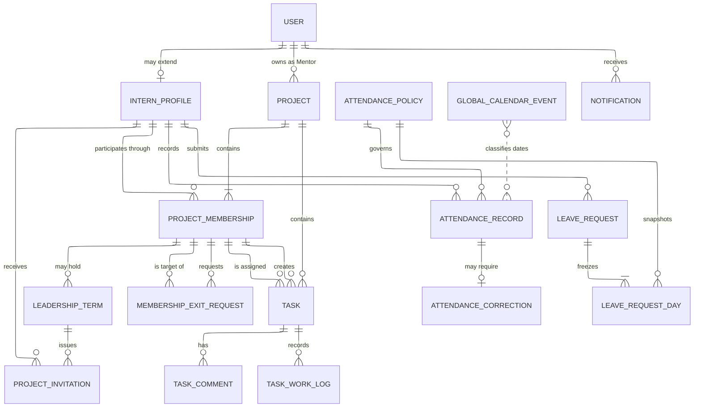

# Platform Spec

**Version:** 1.5.0 · **Owner:** Loc-LX · **Status:** APPROVED · **Date:** 2026-09-17

Part of the Lab Timesheet specification. Rules every feature shares, including the
glossary, the authorization model, the domain model, and failure handling, are in
[the platform spec](../feature-platform/SPEC.md). Section numbers marked `§` are one
numbering shared by all the specs, so a reference such as §5.2 names the same section
wherever it appears.

This spec holds what every feature shares. It is not a feature in the code; the name keeps the
`feature-{name}` convention of the other specs so every spec is found and tagged the same way.

## 1. Context & Goal

| Field | Value |
|---|---|
| Document type | Requirements, domain design, database reference, and acceptance catalogue, split into eight specs |
| Audience | Maintainer, contributors, instructor/reviewer |
| Product language | English |
| Business timezone | `Asia/Ho_Chi_Minh` |
| Database baseline | PostgreSQL 18.4, 24 application tables |
| Companion DDL | `database-schema.sql`, not tracked in this repository |
| Review state | Approved; each spec's version is in its header, its changes in its `CHANGELOG.md`, and its open questions in its Notes section |
| Normative rules | 296 across the eight specs |
| Acceptance scenarios | 145 across the eight specs |

> **Companion files.** The companion `database-schema.sql` and the reference images
> under `assets/` are not tracked in this repository. Every image embed below is
> therefore written as a named reference rather than a link, so nothing renders as a
> broken image.
> The live schema is [`V1__baseline.sql`](../../../src/main/resources/db/migration/V1__baseline.sql)
> plus [`V2__add_task_effort_planning.sql`](../../../src/main/resources/db/migration/V2__add_task_effort_planning.sql),
> which together create twenty-four tables; §19.4 below carries the physical
> table diagram. Ask the document owner for the reference images if you need them.

### How to read a rule

Every rule that describes system behavior is written in EARS notation, which
fixes the shape of the sentence so that the triggering condition cannot be left
implicit.

| Opening | Meaning |
|---|---|
| `THE system SHALL …` | always true, no trigger |
| `WHEN <event>, THE system SHALL …` | triggered by an event |
| `WHILE <state>, THE system SHALL …` | holds continuously while a state holds |
| `WHERE <condition>, THE system SHALL …` | applies under a condition, including an error condition |

The point of the form is what it prevents. "Export failure shall return an
error" can be written and approved without anyone deciding what the error is;
`WHERE report generation fails, THE system SHALL return an error` forces the
sentence to name it.

**Thirty rules are deliberately not in EARS**, because they bind people
rather than the system and no `THE system SHALL` sentence would be true of them:

| Rules | What they bind |
|---|---|
| `GOV-001`, `GOV-002`, `GOV-003`, `GOV-006`, `GOV-016` | how requirements are decided, named, and changed |
| `ARC-008`, `ARC-009`, `ACC-004`, `OPS-010` | a design baseline, a migration discipline, an operational instruction, a recovery procedure |
| `AUTH-010`, `TSK-017` | pointers to the rule that actually decides, kept so a reader arrives there |
| `OPS-001`–`OPS-004` | the development environment a contributor sets up |
| `OPS-019` | file ownership and branch naming |
| `OPS-018`, `OPS-020`, `OPS-021` | nothing: withdrawn, and kept so that their identifiers are never reused |
| `TST-001`–`TST-011` | the test-driven workflow a contributor follows |

Forcing those into the notation would make the document look uniform and say
something false.

### §1. Authority, purpose, and scope

#### §1.1 Decision authority

When statements conflict, use this precedence from highest to lowest:

1. [`.sdd/constitution.md`](../../constitution.md), for what it states canonically: each indexed rule's layer and exception, the standing deviations, the definition of done, and the AI agent policy. The wording of a rule is in its spec.
2. The feature specs under `.sdd/specs/`, where each rule has its one canonical location (`GOV-016`).
3. `AGENTS.md`, `CONTRIBUTING.md`, and `CLAUDE.md`.
4. Code and tests. Where they disagree with a spec, the code changes.

[`.sdd/decisions.md`](../../decisions.md) and the ADRs under `.sdd/rfcs/` record why a rule reads as it does; they do not outrank the spec. Where one is newer than the spec it concerns, the spec is stale and is corrected. The maintainer decides a change under the constitution's Amendment section. The instructor reviews those decisions and is not a gate on them (`D26`): a revision they ask for arrives as a new decision that supersedes the one it replaces.

| ID | Requirement |
|---|---|
| GOV-001 | Implementers shall use the authority order above and shall not revive a lower-authority rule that conflicts with an approved higher-authority decision. |
| GOV-002 | The term **Project** replaces the obsolete term **Group** throughout code, schema, UI, and documentation. |
| GOV-003 | v1 shall be a working attendance and project/task-management system, not a prototype or static demonstration. |
| GOV-004 | THE system SHALL hold attendance time and Task work time as separate domains, and SHALL NOT derive, prove, or update either from the other. |
| GOV-005 | WHEN an Admin changes global workdays, scheduled start or end, check-in grace, checkout grace, monthly leave quota, violation penalty, or calendar configuration, THE system SHALL leave every previously computed attendance, leave, and compliance result unchanged. |
| GOV-006 | Features not specified here require a new reviewed decision; this draft does not silently authorize adjacent scope. |
| GOV-016 | Every requirement shall have exactly one canonical location, and a change in business behavior shall update that location. A new feature shall be documented in the same form as the features already documented: numbered rules under an applicable prefix in the spec of the feature it belongs to, and acceptance scenarios in section 7 of that same spec. Splitting the specification across separate documents is an organizational choice made when it helps, never a goal, and no separate document shall override the canonical location of a rule. |

#### §1.2 Product objective

The system supports a university laboratory or internship program in four connected areas:

- account and internship administration;
- global attendance, leave, and missed-checkout correction;
- Mentor-owned projects with contextual Intern leadership and single-assignee tasks;
- authorized dashboards and consistent HTML, Excel, and PDF reports.

## 2. Actors & Roles

Primary actors named by this spec's use cases:

- **UC-19 — Configure SMTP:** Admin

### §5. Authorization model

#### §5.1 Authorization evaluation

`AUTH-004`–`AUTH-009` and `AUTH-011` are in [the project spec](../feature-project/SPEC.md).

| ID | Requirement |
|---|---|
| AUTH-001 | WHEN a state-changing operation is requested, THE system SHALL authorize it on the server from the global role, account and internship state, record ownership, active membership, current leadership term, current Task assignee, and aggregate lifecycle, as applicable to that operation. |
| AUTH-002 | THE system SHALL NOT treat a hidden Thymeleaf control as authorization. WHERE the caller is not authenticated, THE system SHALL redirect to the sign-in page. WHERE the caller is authenticated but holds the wrong role for the whole route, THE system SHALL return an authenticated access-denied response, which implies no record. WHERE the caller may reach the route but the record is not theirs or does not exist, THE system SHALL return the same not-found response in both cases, so that the response cannot be used to discover which records exist. |
| AUTH-003 | WHILE a Mentor account is active, THE system SHALL permit it to view any Intern's attendance, and SHALL permit only an Intern's responsible Mentor under `ACC-026` to decide that Intern's leave, correction, and attendance exception requests. THE system SHALL restrict Project-management authority to the Project's owning Mentor. |

#### §5.2 Permission matrix

Legend: **Yes** = permitted within the stated scope; **Own** = own Project or own record; **Assigned** = only while current assignee; **No** = forbidden.

| Capability | Admin | Owning Mentor | Current Leader | Active member / assignee |
|---|---:|---:|---:|---:|
| Manage accounts/global roles at creation | Yes | No | No | No |
| Lock/deactivate accounts; manage internship lifecycle | Yes | No | No | No |
| Manage SMTP, HolidayAPI, attendance policy, global calendar | Yes | No | No | No |
| View all Projects/tasks/progress | Yes, read-only | Own | Own | Membership scope |
| Create Project | No | Yes | No | No |
| Edit/activate/complete Project | No | Own | No | No |
| Delete an empty `PLANNED` Project (`PRJ-002`) | No | Own | No | No |
| Cancel a `PLANNED` or `ACTIVE` Project (`PRJ-023`) | No | Own | No | No |
| Directly add/remove Project members | No | Own | No | No |
| Issue/revoke Project invitation | No | Revoke any in Own | Issue/revoke own in Own | Accept/decline own invitation |
| Request/decide membership exit | No | Decide or remove directly in Own | Request another member's removal or own leave | Request/cancel own leave |
| Appoint/change Project Leader | No | Own | No | No |
| Redistribute unfinished Tasks for pending exit | No | No | Own, in confirmed batches | No |
| Create Task | No | No | Own; any active assignee | Self-assigned only |
| Assign/reassign Task | No | No | Own | No |
| Set/replace/clear Task estimate before the first work log | No | No | Own | No |
| Record a Remaining effort forecast (`TSK-022`, `TSK-024`) | No | No | Own | No |
| Edit/soft-delete Task | No | No | Unfinished in Own | Unfinished self-created while still self-assigned |
| Change the status of one's own assigned Task (any `TSK-007` transition) | No | No | Assigned | Assigned |
| Block, unblock, or reopen another member's Task (`TSK-023`) | No | Own, `ACTIVE` Project | Own, `ACTIVE` Project | No |
| Start another member's Task or mark it `DONE` | No | No | No | No |
| Comment on Task | No | Own | Own | Membership scope |
| Create/edit own Task work log | No | No | Assigned/own log | Assigned/own log |
| View aggregate Project progress | Yes | Own | Own | Membership scope |
| View Project/Task retained history | Yes, read-only | Own | Own | Current membership; former membership only after completion |
| View per-member Project hours | Yes, read-only | Own | Own | No |
| View Intern attendance | Yes | Yes | Own history only | Own history only |
| Decide leave, correction, or attendance exception; amend or reverse that decision where its rule permits (`ATT-024`) | No | Responsible Mentor only (`ACC-026`) | No | No |
| Submit own leave, correction, or exception request | No | No | If active Intern | If active Intern |
| Withdraw own `PENDING` or `OVERDUE` leave request (`LEV-013`) | No | No | If active Intern | If active Intern |
| Ask to reopen a finalized attendance period (`ATT-022`) | No | Responsible Mentor only (`ACC-026`) | Own, if active Intern | Own, if active Intern |
| Approve or reject a request to reopen a finalized attendance period (`ATT-022`) | Yes | No | No | No |
| View and export the Attendance report (`RPT-004`) | Yes | Yes | Own history only | Own history only |
| View and export the Project/Task report (`RPT-005`) | Yes, read-only | Own | Project scope | Aggregate only |
| View and export the Daily Project Work Report (`RPT-011`) | Yes, read-only | Own | Led `PLANNED` or `ACTIVE` Project | No |
| View own attendance for a date (`RPT-015`) | No | No | Own, if active Intern | Own, if active Intern |

| ID | Requirement |
|---|---|
| AUTH-010 | Per-member Task-hour visibility is defined by `RPT-005`. This entry exists so that a reader of the authorization model reaches that rule; it adds nothing of its own. |
| AUTH-012 | THE system SHALL decide every business permission through one authorization policy that takes the actor's role, the actor's scope in stored context, the current state of the record, and, for a transition, the target state. THE system SHALL NOT infer from a higher role a capability the §5.2 matrix does not grant, SHALL give each capability of that matrix its own entry in the policy so that it can be withdrawn from one role alone, and SHALL NOT decide a business permission from a role check outside the policy. Route protection MAY remain coarse; the service SHALL enforce the policy's decision; a template SHALL ask the same policy only to decide what to show. The decision is `ADR-005`. |

## 3. Functional Requirements

### §2. Terminology and system-wide rules

| Term | Meaning |
|---|---|
| Global role | Exactly one immutable account role: `ADMIN`, `MENTOR`, or `INTERN`. |
| Project Leader | An Intern with the current leadership term for one Project; not a global role. |
| Active member | A project membership whose `left_at` is null and whose Intern is eligible to participate. |
| Project invitation | A current Leader's non-expiring invitation that only its authenticated intended Intern may accept or decline. |
| Membership exit request | A Leader's request to remove another member or a member's request to leave. Membership remains open until the owning Mentor approves it, while unfinished Tasks may be redistributed beforehand. |
| Pending exit target | The current member named by a pending exit request. Existing rights remain, but the target cannot receive newly created/reassigned Tasks or create a self-Task until the request is cancelled, rejected, superseded, or approved. |
| Project History | The authorized read-only Project view assembled from retained memberships, leadership terms, invitations, exit requests, completed/soft-deleted Tasks, comments, work logs, and attribution already stored by the approved schema. |
| Task creator | The membership that created a Task; creator authority is narrower than current-Leader authority and is retained historically. |
| Current assignee | The active Project member referenced by a Task's single assignee field. |
| Global day off | An Admin-authorized calendar date with `is_day_off=true`; it affects attendance and leave for all active Interns. |
| Eligible workday | A configured policy workday within the Intern's applicable internship interval that is not a global day off. |
| Expected workday | An eligible workday not covered by approved leave. |
| Raw checkout | The server timestamp recorded by normal checkout; it is never overwritten by correction. |
| Effective checkout | Raw checkout when present, otherwise an approved correction's requested checkout. |
| Task work log | A dated number of minutes spent on a Task; it is independent from attendance. |
| Task estimate | The planned effort in minutes for one whole Task. It belongs to the Task rather than to an assignee, and is independent of attendance, calendar duration, and elapsed time. It is the Task's baseline: once work is retained it never changes. |
| Actual Task effort | The lifetime sum of retained work-log minutes for one Task across every author and assignment. It does not reset when the Task is reassigned. |
| Task effort variance | Current Work minus Task estimate, a signed planning difference. It is undefined for an unestimated Task, and for an unfinished Task with no Remaining effort forecast. |
| Remaining effort forecast | A current Leader's dated prediction of the additional effort needed to finish an unfinished Task, recorded at a reassignment or whenever that prediction changes. It never replaces the estimate. |
| Current Remaining effort | Zero for a `DONE` Task; otherwise the latest effective Remaining effort forecast, the most recent one no correction has superseded, less the Actual Task effort added since that forecast was recorded, never below zero. |
| Current Work | Actual Task effort plus current Remaining effort. |
| Attendance period | One Intern's attendance for one calendar month. It finalizes at 23:59 on the fifth day of the next month once no request affecting it is pending or overdue, and after that changes only inside a range reopened when an Admin approves a reopen request (`ATT-019`–`ATT-024`). |
| Overdue request | A leave, correction, or attendance exception request submitted in time whose approver missed the decision deadline. It is neither approved nor rejected and is never held against the Intern. |
| Attendance adjustment request | A missed-checkout correction or an attendance exception request. Both are raised after the attendance event, both are decided by the responsible Mentor, and both share one submission and decision window (`COR-003`, `COR-004`, `EXC-002`, `EXC-003`). What differs is the evidence each carries. |
| Decision amendment | A new decision entry that changes the content of the current decision on a leave, correction, or attendance exception request, such as its note or the dates an approved leave still covers. It never overwrites the earlier entry (`ATT-024`). |
| Decision reversal | A new decision entry that reverses the outcome of the previous decision, such as excused to unexcused. It never returns a request to pending, and a leave decision is never reversed (`ATT-024`, `LEV-011`). |
| Report date | A local business date used to select dated Task work logs for reporting. Attendance policy and calendar context may describe the date but never remove otherwise valid Task work from the report. |
| Daily Project Work Report | An authorized view of retained Task work logs for one Report date, shown by Task, with each Task's planning values once, and by work-log author, with minutes only. It may show attendance context and each Task's current status, but asserts neither attendance nor that a Task was completed on that date. |

#### §2.1 Words this product does not use

Six terms above have near-synonyms that carry a different meaning. Using one of
them in interface copy, a report label, or a rule turns a planning measurement
into a judgement about a person, which is the one thing `GOV-004` and the
separation of attendance from Task work exist to prevent.

| Term | Never call it |
|---|---|
| Task estimate | estimated hours, assignee estimate, time budget |
| Actual Task effort | current-assignee effort, attendance duration, selected-period effort |
| Task effort variance | efficiency score, productivity score, remaining effort |
| Remaining effort forecast | replacement estimate, assignee estimate, revised Task estimate |
| Report date | Task workday, reporting workday, attendance date |
| Daily Project Work Report | daily completion report, daily attendance report, daily productivity report |

| ID | Requirement |
|---|---|
| GOV-011 | THE system SHALL evaluate business dates and schedule boundaries in the timezone of the applicable attendance policy version, and SHALL persist instants as `timestamptz` treated as UTC. |
| GOV-012 | WHEN a check-in, checkout, submission, decision, activation, expiry, or lifecycle transition occurs, THE system SHALL record server time as the event time. THE system SHALL NOT accept a browser-supplied timestamp as event time. |
| GOV-013 | THE system SHALL perform every mutable aggregate update inside a transaction with optimistic locking. WHERE the update affects leave quota, a daily work total, bootstrap, or a Task transfer, THE system SHALL additionally serialize on the narrow affected record. |
| GOV-014 | THE system SHALL retain historical records behind restrictive foreign keys and lifecycle or soft-delete fields. THE system SHALL NOT physically delete an account, Project, membership, Task, attendance row, leave request, correction, comment, work log, or notification through a normal interface operation, except the deletion of a `PLANNED` Project and the rows it owns that `PRJ-002` permits. |

### §12. Integrations and notifications

#### §12.1 Secret-bearing integration configuration

`INT-009`, which applies these rules to HolidayAPI, is in [the calendar spec](../feature-calendar/SPEC.md).

| ID | Requirement |
|---|---|
| INT-001 | THE system SHALL administer SMTP and HolidayAPI settings through the application. THE system SHALL NOT take SMTP configuration from a deployment environment variable, and an operator SHALL NOT configure either by editing the database directly. |
| INT-002 | WHILE running under the production profile, THE system SHALL require a deployment-provided 256-bit application master key. WHILE running under a development or test profile, THE system SHALL take an explicit non-production key from Spring configuration. |
| INT-003 | THE system SHALL store an SMTP password or HolidayAPI key only as AES-256-GCM ciphertext with a fresh 96-bit nonce and key-version metadata. THE system SHALL NOT store the master key in PostgreSQL. |
| INT-004 | THE system SHALL NOT redisplay a secret after it is submitted, and SHALL require a new value to replace a saved one. THE system SHALL omit ciphertext, nonce, passwords, API keys, tokens, and master-key material from every Configuration History view. |
| INT-005 | THE system SHALL NOT place a raw integration secret or authentication token in a log, exception message, rendered page, export, notification body, pipeline artifact, or database diagnostic view. |
| INT-006 | THE system SHALL move an SMTP revision through `DRAFT → ACTIVE → RETIRED`, and SHALL permit at most one draft and one active revision at a time. WHEN an Admin edits an active configuration, THE system SHALL create a draft and leave the active revision operational. THE system SHALL expose a read-only SMTP History carrying non-secret revision metadata, test, activation and retirement outcomes, and the responsible users. |
| INT-007 | THE system SHALL store, for SMTP, a host, a port from 1 through 65535, a security mode, an optional username and password, a From address, and a From name. WHILE running under the production profile, THE system SHALL permit `STARTTLS` or `TLS` and SHALL reject plaintext `NONE`. |
| INT-008 | WHEN an Admin tests SMTP, THE system SHALL send a message to that Admin. THE system SHALL permit activation of a draft only after a successful test, and WHEN a draft is activated SHALL retire the previous active revision in the same transaction. |
| INT-010 | THE system SHALL NOT provide master-key rotation or external secret-store integration in v1. THE system SHALL carry key-version metadata in every cipher envelope so that an operator-led migration remains possible later. |

### Use cases

#### UC-19 — Configure SMTP

| Field | Specification |
|---|---|
| Primary actor(s) | Admin |
| Trigger | An Admin changes SMTP configuration. |
| Preconditions | The Admin is active and has the deployment-provided encryption master key available to the application. |
| Postconditions | Mail uses the newly activated revision; any previously active revision is retired and remains in SMTP History without its secrets. |
| Traced requirements | INT-001–INT-008 |

**Main success flow**

1. Create a draft SMTP revision.
2. Test the draft before activation.
3. Activate the tested draft.

**Alternatives and exceptions**

- A failed SMTP test cannot replace the working active revision.

## 4. Non-functional Requirements

### §3. Architecture and runtime

| ID | Requirement |
|---|---|
| ARC-001 | THE system SHALL be one server-rendered modular monolith on Java 25 and Spring Boot 4.1.0. |
| ARC-002 | THE system SHALL build with Maven and use Spring MVC, Spring Security, Spring Data JPA, Bean Validation, Thymeleaf, Spring Mail, and Flyway. |
| ARC-003 | THE system SHALL use PostgreSQL 18.4 for production, development, and integration testing. WHERE a test exercises a PostgreSQL-specific constraint, it SHALL run against PostgreSQL rather than H2. |
| ARC-004 | THE system SHALL pin Node 24 LTS and Tailwind CSS 4 for the UI toolchain, SHALL install with `npm ci`, and SHALL commit the npm lockfile. THE system SHALL constrain test tooling to a compatible range rather than pinning it by assertion, and every verification run SHALL record the version it actually resolved. A test SHALL NOT assert equality against a tool version, because that encodes a decision in a place no decision record can reach. |
| ARC-005 | THE system SHALL keep `LabtimesheetApplication` in the root package `com.lab.labtimesheet`, shared wiring in `config`, and code that belongs to no single feature in `platform`. Business code SHALL be grouped below `feature.<name>` for `attendance`, `calendar`, `identity`, `internship`, `notification`, `project`, and `reporting`, each adding only the layer subpackages it needs from `controller`, `model`, `model.dto`, `model.entity`, `repository`, `service`, and `exception`. THE dependencies among `platform` and those features SHALL form a directed acyclic graph in which `platform` depends on no feature. `config` MAY depend on `platform` and on any feature, and neither `platform` nor any feature SHALL depend on `config`. Tests SHALL mirror those packages, except the `architecture` and `ui` test packages, and Thymeleaf templates and built static assets SHALL remain under `src/main/resources/templates` and `src/main/resources/static`. |
| ARC-006 | THE system SHALL bind validated DTOs in a feature's controllers and delegate business transactions to that feature's services, which use its repositories and entities. A feature MAY call another feature's service contract and DTOs. WHERE code reaches into another feature's repository or JPA entity, or places business SQL in a service, THE build SHALL fail. The same boundary holds for `platform`: a feature MAY call its service contracts and DTOs, and SHALL NOT reach into its repositories or JPA entities. Flyway and schema verification SHALL be the only direct-SQL boundary, and THE system SHALL NOT introduce network boundaries, empty utility packages, or one-implementation abstraction layers. The one exception is an interface that a module declares and itself calls, every implementation of which lives in a different module that would still depend on the declaring module under `ARC-005` if that implementation were removed, so that data or behavior owned by that dependent module reaches the declaring module without a dependency cycle. |
| ARC-007 | THE system SHALL treat Flyway as the sole production schema authority, and SHALL restrict JPA schema generation to validation outside disposable tests. |
| ARC-008 | The reviewed `database-schema.sql` is a design baseline rather than an executable artifact. The platform owner adapts it into Flyway migrations; it is never executed against production. |
| ARC-009 | A Flyway migration that has been applied is never edited. A schema change adds a new migration. |
| ARC-010 | THE system SHALL keep the number of authorization decisions and database queries a request performs independent of the number of rows it renders. WHERE a page, report, or export renders more rows, THE system SHALL NOT ask the authorization policy of `AUTH-012` once per row and SHALL NOT issue a query per row. THE system SHALL NOT state a time budget while no deployment environment exists to measure one; `RPT-008` bounds what a single request may demand until then. |

Reference versions and primary documentation:

- [Spring Boot 4.1.0 release](https://spring.io/blog/2026/06/10/spring-boot-4/)
- [Spring Boot 4.1 code-structure guidance](https://docs.spring.io/spring-boot/4.1/reference/using/structuring-your-code.html)
- [Spring Boot SQL and Spring Data JPA guidance](https://docs.spring.io/spring-boot/reference/data/sql.html)
- [PostgreSQL support/versioning](https://www.postgresql.org/support/versioning/)
- [Tailwind CLI](https://tailwindcss.com/docs/installation/tailwind-cli)
- [Node release schedule](https://nodejs.org/en/about/previous-releases)

### §13. Authentication and security

#### §13.1 Controls active in every profile

`SEC-002`–`SEC-007`, which concern accounts, are in [the identity spec](../feature-identity/SPEC.md).

| ID | Requirement |
|---|---|
| SEC-001 | THE system SHALL keep Spring Security session authentication, server-side authorization, object ownership checks, CSRF protection, Bean Validation, output escaping, and password hashing enabled under every profile, including development and test. |
| SEC-008 | THE system SHALL restrict redirect targets to an allow-listed local set. WHERE a state-changing endpoint receives an open redirect, a user-selected class name, an arbitrary template, or an arbitrary URL, THE system SHALL reject it. |
| SEC-009 | WHERE an error page or an authorization failure is rendered, THE system SHALL NOT expose a stack trace, SQL, a secret, an internal identifier from an unauthorized record, or an existence distinction useful for enumeration. |

#### §13.2 Profile-dependent hardening

| ID | Requirement |
|---|---|
| SEC-010 | WHILE running under the production profile, THE system SHALL require an HTTPS public base URL and origin and an explicit trusted-proxy configuration before it reports itself ready. |
| SEC-011 | WHILE running under the production profile, THE system SHALL send security headers that force HTTPS for at least one year including subdomains, restrict every resource, form target, and base URI to the application itself, forbid the application from being framed, and suppress referrer disclosure. THE system SHALL mark session cookies `Secure`, `HttpOnly`, and `SameSite=Strict`, and SHALL apply strict configured-origin checks. The exact directive values are fixed by `AC-SEC-008`. |
| SEC-012 | THE system SHALL trust forwarded headers only WHERE the deployment explicitly enables and constrains the known reverse-proxy path. THE system SHALL NOT let an arbitrary client-forwarded header define the scheme, host, or source IP. |
| SEC-013 | WHILE running under a development or test profile, THE system MAY use HTTP, localhost origins, `SameSite=Lax`, and neither HSTS nor Secure cookies. THE system SHALL activate those relaxations only from development or test profile state, and SHALL NOT let production inherit them. |
| SEC-014 | WHERE the master key, public origin, datasource, or explicit proxy policy required by production is absent or malformed, THE system SHALL fail production readiness. SMTP MAY remain absent, and WHILE it is absent THE system SHALL remain visibly restricted as specified. |

### §15. User interface and accessibility

#### §15.1 Normative visual references

The following supplied screenshots are visual-direction references. Their example branding/content and surrounding documentation-site chrome are not product requirements.

> **Reference image not tracked here:** `ui-reference-light.png` — Light dashboard and sidebar reference. Held in the documentation repository; ask the document owner for the image.

> **Reference image not tracked here:** `ui-reference-dark-shell.png` — Dark sidebar/shell reference. Held in the documentation repository; ask the document owner for the image.

> **Reference image not tracked here:** `ui-reference-dark-dashboard.png` — Dark dashboard reference. Held in the documentation repository; ask the document owner for the image.

| ID | Requirement |
|---|---|
| UI-001 | THE system SHALL present a quiet, high-density operations shell built from Tailwind tokens and Thymeleaf fragments, and SHALL NOT import React or a React component runtime. |
| UI-002 | THE system SHALL treat desktop as the supported v1 interface target, with a roughly 16rem fixed sidebar collapsible to a roughly 4rem icon rail. Mobile and tablet behavior is best-effort and SHALL NOT be required to reach workflow parity or provide a dedicated navigation pattern. |
| UI-003 | THE system SHALL persist the sidebar collapse state in `localStorage`, SHALL generate navigation from authorization scope, and SHALL NOT show an action the authenticated user cannot perform. |
| UI-004 | THE system SHALL place the sidebar toggle, breadcrumb or page title, notification access, and contextual primary actions in the content header, and SHALL expose profile, theme, and logout in the lower sidebar account area. |
| UI-005 | THE system SHALL use near-white and near-black canvases, slightly contrasting sidebar and panel surfaces, one-pixel neutral borders, 10 to 12 pixel radii, compact controls, restrained shadows, tabular numerals, and muted secondary text. |
| UI-006 | WHILE dark mode is active, THE system SHALL use the near-black canvas and charcoal panel hierarchy rather than inverting the light palette, and SHALL reserve the accent color for status, focus, validation, and a small number of primary actions. |
| UI-007 | WHEN a visitor arrives for the first time, THE system SHALL follow the system color preference. THE system SHALL offer a Light, Dark, and System selector, SHALL store the override in the browser, and SHALL apply it before first paint so that no theme flash occurs. THE system SHALL NOT require a database table for theme preference. |
| UI-008 | THE system SHALL provide reusable fragments for the shell, navigation, button, input, select, checkbox, cards, metric cards, badges, tabs, tables, pagination, alerts, confirmation dialog, empty state, skeleton state, and notification menu. |
| UI-009 | THE system SHALL pin Lucide Static 1.27.0 as a build dependency and reduce it to a local build-time SVG sprite. THE system SHALL NOT use an icon CDN, an icon font, a runtime DOM replacement pass, or a React adapter. |
| UI-010 | WHERE an icon sits beside visible text, THE system SHALL mark it decorative and hide it from assistive technology. WHERE a control carries only an icon, THE system SHALL give it an accessible name, a visible tooltip, keyboard focus, and a target of at least 24 by 24 CSS pixels, the WCAG 2.2 AA minimum under success criterion 2.5.8. |
| UI-011 | THE system SHALL use Chart.js 4.5.1 only for meaningful attendance and Project trends, and SHALL give every canvas an accessible name and an adjacent text or table summary, because canvas content is not inherently available to a screen reader. |
| UI-012 | THE system SHALL draw charts from the theme tokens, SHALL honor a reduced-motion preference, and SHALL NOT let a chart be the only representation of a value or status. |
| UI-013 | THE system SHALL present the interface in English only in v1, SHALL display business dates as `dd/MM/yyyy`, and SHALL display times in 24-hour local form with timezone context where ambiguity matters. |
| UI-014 | THE system SHALL give every form field an associated label, inline field errors, an error summary, retained safe input after validation, keyboard operation, and visible focus. WHERE the selected role is not `INTERN`, THE system SHALL disable and clear the role-dependent Intern fields while server validation remains authoritative. WHERE policy input is bound to a month, THE system SHALL use a native month control rather than invite an arbitrary invalid date. THE system SHALL NOT communicate status through color alone. |
| UI-015 | THE system SHALL keep tables fully usable at supported desktop widths. WHERE the viewport is narrower, THE system SHOULD prioritize columns, wrap, or scroll horizontally to avoid avoidable corruption, and complete mobile workflow support remains outside v1 acceptance. |
| UI-016 | WHEN a terminal or destructive action is requested, including internship withdrawal, Project completion, Project cancellation, Project deletion, account deactivation, direct member removal, membership-exit approval, Task soft-delete, and SMTP retirement, THE system SHALL require an explicit confirmation describing the consequences. WHERE the action is exit approval, THE system SHALL show replacement and unfinished-Task readiness; WHERE it is a transfer, THE system SHALL show the selected Task count and the recipient. |
| UI-017 | THE system SHALL NOT use decorative gradients, glass effects, card-within-card repetition, oversized marketing headings, remote fonts or assets, or a chart that carries no information. |
| UI-018 | THE system SHALL meet WCAG 2.2 AA contrast in both light and dark themes: at least 4.5:1 for normal text, at least 3:1 for large text and meaningful non-text boundaries, and a visible focus indicator at 3:1 against adjacent colors. |
| UI-019 | THE system SHALL provide Leader invitation list, create and revoke; Intern invitation accept and decline; Leader removal request; member leave and cancel; persistent pending-exit warnings; a Leader-only side drawer for repeated multi-Task single-recipient transfer batches; and an owning-Mentor decision surface. THE system SHALL provide separate Intern My Leave, My Corrections, and My Exceptions workflows and separate Mentor Leave Decisions, Correction Decisions, and Exception Decisions workflows, each Mentor queue listing only the Interns that Mentor is responsible for, and each placing the actionable queue before retained history and showing the monthly leave balance defined by `LEV-004`. THE system SHALL give an Admin focused Account Directory, Detail and Edit workflows, Attendance Policy with History, Global Calendar with History, Holiday Import with provider History, and SMTP with History. THE system SHALL keep Admin dashboard content account and configuration only, without an Active Projects metric or a report-like Project or Task summary. THE system SHALL give an Admin read-only dedicated Attendance, Project or Task, and Daily Project Work Report navigation, as `RPT-004`, `RPT-005`, and `RPT-011` grant, and SHALL limit each report's navigation to the scopes its rule grants. THE system SHALL keep the global Daily entry visible to Mentors and Admins, and SHALL show it to an active Intern only WHILE current leadership makes at least one `PLANNED` or `ACTIVE` Project eligible; Project-detail Daily generation SHALL remain available to the current Leader only. THE system SHALL redirect `/admin/settings` to `/admin/attendance-policies` and `/attendance/requests` to `/attendance/leave`. THE system SHALL provide one authorized Project History tab. Existing mockups are illustrative and SHALL NOT override a numbered requirement. |

Primary UI dependency references:

- [Lucide static assets](https://lucide.dev/guide/static)
- [Lucide 1.27.0 release](https://github.com/lucide-icons/lucide/releases/tag/1.27.0)
- [Chart.js 4.5.1 release](https://github.com/chartjs/Chart.js/releases/tag/v4.5.1)
- [Chart.js accessibility guidance](https://www.chartjs.org/docs/latest/general/accessibility.html)
- [WCAG 2.2 contrast minimum](https://www.w3.org/WAI/WCAG22/Understanding/contrast-minimum.html)
- [WCAG 2.2 target size minimum](https://www.w3.org/WAI/WCAG22/Understanding/target-size-minimum.html)

#### §15.2 Role-oriented page map

| Role/context | Required pages |
|---|---|
| Bootstrap | First Admin; optional SMTP configuration/test; five-step defer acknowledgement; completion. |
| Admin | Account/configuration-only Dashboard (active accounts, pending activations, active internships, and system/configuration guidance); users/internships; SMTP and History; HolidayAPI and History; policy versions and History; global calendar/import and History; all-Project overview and Project History; system status; notifications. Read-only navigation, HTML pages, and XLSX/PDF exports for the Attendance report per `RPT-004`, the Project/Task report per `RPT-005`, and the Daily Project Work Report per `RPT-011`. |
| Mentor | Dashboard; owned Projects; direct membership/leadership; pending membership-exit decisions/readiness; Project/task progress and History; comments; global leave queue; correction queue; authorized Intern attendance; notifications. |
| Intern | Dashboard/check-in; own attendance; correction requests; leave; memberships; Project invitations; own leave requests; authorized Projects and History; assigned/self-created Tasks; comments; work logs; notifications; profile/security. |
| Leader context | All Intern pages plus invitation issue/revoke, removal requests, persistent exit-readiness warnings, repeated multi-Task/one-recipient transfer batches, Task creation for eligible active members, assignment/edit/delete, detailed Project/member progress inside currently led Projects, and Daily Project Work Report navigation for each currently-led `PLANNED` or `ACTIVE` Project. |
| Completed Intern | Read-only own history, notifications, profile, password/session security. |

### Appendix D. Screen inventory

Every row is a route that exists in a controller. Routes are named by their paths, such as
`/admin/accounts` and `/leave`, so a reader can find each one in the source.

The **Filter chain** column is what `SecurityConfiguration` admits before a
controller runs. It is coarse on purpose. Whether a particular Mentor may open a
particular Project is decided inside the transaction from stored context, never
from the URL, so a row admitting `authenticated` is not a claim that every signed
in user sees data.

#### D.1 Reachable without signing in

| Route | Feature | Renders |
|---|---|---|
| `/login` | account | sign-in form |
| `/forgot-password` | account | recovery request form |
| `/reset-password` | account | new-password form |
| `/activate` | account | activation landing |
| `/bootstrap`, `/bootstrap/**` | account | first-Admin installation flow, closed permanently after it completes |
| `/error` | shared | the shared error shell, which discloses nothing about the record that failed |
| `/assets/**` | shared | compiled stylesheet and icon sprite |
| `/actuator/health`, `/actuator/health/**` | platform | liveness and readiness |

#### D.2 Admin only

`SecurityConfiguration` gates the whole `/admin/**` prefix on the `ADMIN` role.

| Route | Feature | Renders |
|---|---|---|
| `/admin/accounts` | account | account directory with server-side search and role filter |
| `/admin/accounts/new` | account | create an Admin, Mentor, or Intern |
| `/admin/accounts/{targetUserId}` | account | one account with its lifecycle actions |
| `/admin/accounts/{targetUserId}/edit` | account | controlled identity correction |
| `/admin/attendance-policies` | attendance | effective-dated policy versions and their history |
| `/admin/settings` | reporting | configuration landing with account and internship counts |
| `/admin/smtp` | integration | SMTP draft, connection test, activation |
| `/admin/smtp/defer` | integration | the deferral path used during installation |

#### D.3 Reports, gated by role at the filter chain

Two report families are separated in the filter chain rather than only in a
service, so a guessed URL cannot cross the boundary.

| Route | Filter chain admits | Rules |
|---|---|---|
| `/reports/attendance`, `/reports/attendance.xlsx`, `/reports/attendance.pdf` | `ADMIN`, `MENTOR`, `INTERN` | `RPT-004`, and `ADR-002` for why Admin is present |
| `/reports/project-tasks`, `/reports/project-tasks.xlsx`, `/reports/project-tasks.pdf` | `MENTOR`, `INTERN`, and explicitly not `ADMIN` | `RPT-005`, `AUTH-010` |
| `/reports/daily`, `/reports/daily.xlsx`, `/reports/daily.pdf` | any signed-in user; scope resolved in the service | `RPT-011` through `RPT-013` |

The Daily report is deliberately not in the filter chain. Its audience is the
owning Mentor and whoever currently leads an eligible Project, and current
leadership is a row in `project_leadership_terms` rather than a role, so it
cannot be expressed as a URL rule.

#### D.4 Signed in, scope resolved from stored context

| Route | Feature | Renders |
|---|---|---|
| `/` | account | redirect to the right landing page for the account |
| `/dashboard` | reporting | role-aware dashboard |
| `/notifications` | notification | own inbox only |
| `/projects` | project | the Projects this account may see |
| `/projects/new` | project | create a Project, owning Mentor only |
| `/projects/{projectId}` | project | Project detail |
| `/projects/{projectId}/members` | project | membership, with direct add and removal for the owning Mentor |
| `/projects/{projectId}/leadership` | project | leadership terms and reassignment |
| `/projects/{projectId}/invitations/{invitationId}` | project | one invitation, answerable only by its intended Intern |
| `/projects/invitations` | project | invitations addressed to this account |
| `/projects/{projectId}/workflows` | project | exit requests and Task redistribution |
| `/projects/{projectId}/history` | project | retained Project history |
| `/projects/{projectId}/tasks` | task | Task list for the Project |
| `/projects/{projectId}/tasks/new` | task | create a Task, self-assigned or Leader-assigned |
| `/projects/{projectId}/tasks/{taskId}` | task | Task detail, comments, work logs, estimates |
| `/attendance` | attendance | own check-in and checkout |
| `/attendance/requests` | attendance | Mentor decision queues |
| `/attendance/leave`, `/attendance/leave/{requestId}` | attendance | own leave, and Mentor decisions |
| `/attendance/corrections`, `/attendance/corrections/{correctionId}` | attendance | own corrections, and Mentor decisions |
| `/attendance/calendar` | attendance | global calendar and Vietnam holiday import, Admin actions guarded in the service |
| `/attendance/interns/{internId}` | attendance | one Intern's attendance, for authorized readers |

#### D.5 What this appendix does not claim

It lists forty-five `GET` routes. It does not list the `POST` endpoints that
mutate state, and it is not a UI specification: field labels, table columns, and
secondary actions come from the numbered rules in sections 4 through 15, not from
here.

A row proves that a path exists and which coarse gate it sits behind. It proves
nothing about whether a given account may see a given record.

### §16. Development, containers, and delivery

#### §16.1 Spring profiles and local development

| ID | Requirement |
|---|---|
| OPS-001 | `dev` shall support running Spring Boot directly from an IDE. The IDE run configuration shall pass Spring properties through environment variables, including dev profile, datasource, and application encryption key. |
| OPS-002 | The recommended local loop shall start PostgreSQL 18.4 and Mailpit through development Compose while the IDE runs the application. SMTP `NONE` shall be allowed only for dev/test Mailpit. |
| OPS-003 | `test` shall use a PostgreSQL Testcontainer and explicit test-only cryptographic configuration. Automated tests shall not depend on a developer's database, SMTP server, HolidayAPI key, or production settings. |
| OPS-004 | Committed examples shall contain placeholders only. Real `.env` files, IDE-private run configurations, master keys, database passwords, SMTP credentials, HolidayAPI keys, activation links, and reset links shall remain untracked. |

#### §16.2 Production container topologies

| ID | Requirement |
|---|---|
| OPS-005 | THE container build SHALL compile the frontend assets and the Spring Boot artifact in separate stages and SHALL run the result on a minimal Java 25 runtime as a non-root user. |
| OPS-006 | THE application image SHALL expose liveness and readiness health endpoints. THE system SHALL report ready only WHILE the datasource is reachable and the Flyway migration set has completed, and SHALL NOT require SMTP or HolidayAPI availability to report ready. |
| OPS-007 | THE recommended production Compose file SHALL run the application together with a pinned PostgreSQL 18.4 service, with health-gated startup and a persistent named volume. |
| OPS-008 | THE same application image SHALL run against an externally managed PostgreSQL database, taking the datasource URL, username, and password from the environment, without starting a bundled database. |
| OPS-009 | THE production configuration SHALL carry the datasource, application master key, public base URL and origin, and an explicit proxy policy. SMTP and HolidayAPI credentials SHALL remain Admin-console configuration rather than deployment configuration. |
| OPS-010 | Database backup, restore, and PostgreSQL minor-upgrade procedures shall preserve the named volume or external database. Container replacement shall never be treated as a database backup. |

#### §16.3 Gitea Actions

| ID | Requirement |
|---|---|
| OPS-011 | THE delivery pipeline SHALL verify Maven tests, PostgreSQL and Flyway integration, frontend assets, and workflow contracts on a trusted repository-scoped runner for every pull request and push. THE container workflow SHALL run only on manual dispatch or a push to `main`, and its own verification job SHALL succeed before any image is built. |
| OPS-012 | THE delivery pipeline SHALL publish an image to the registry only from `main`, and every publication SHALL carry the immutable commit SHA tag. A moving `main` tag MAY be published only as a convenience alias. |
| OPS-013 | THE delivery pipeline SHALL stop at build and publish, and SHALL NOT connect to an unprovisioned production host. |
| OPS-014 | THE SSH deployment job SHALL remain a dormant template, and SHALL run only on `main`, only WHILE the repository variable `DEPLOY_ENABLED` equals `true`, and only WHERE the required host, user, private-key, and known-host secrets exist. |
| OPS-015 | WHEN the deployment template is eventually enabled, it SHALL pull the selected immutable SHA image, execute the remote Compose rollout, wait for health, and retain the previous SHA for rollback. |
| OPS-016 | THE workflow SHALL take variables and secrets from the Gitea `vars` and `secrets` contexts, and SHALL NOT rely on `jobs.<job_id>.environment` as an approval boundary, because Gitea currently ignores that syntax. |
| OPS-017 | THE runner SHALL expose a Docker socket only to trusted repositories and operators, and untrusted fork code SHALL NOT receive publication or deployment secrets. |

Gitea references: [variables](https://docs.gitea.com/1.24/usage/actions/actions-variables), [secrets](https://docs.gitea.com/next/usage/actions/secrets), [workflow differences](https://docs.gitea.com/usage/actions/comparison), and [runner security](https://docs.gitea.com/1.24/usage/actions/act-runner).

### §17. Development process and test evidence

| ID | Requirement |
|---|---|
| TST-001 | Every feature, bug fix, refactor, or behavior change shall follow strict RED → verify expected failure → minimal GREEN → verify narrow and affected suites → refactor while green. |
| TST-002 | Production behavior written before its failing test shall be discarded and reimplemented from the failing test; tests written only after implementation do not satisfy TDD. |
| TST-003 | Each test shall name the observable production break it catches and derive expected values independently. Tests shall not merely mirror private implementation or assert that a mock was called. |
| TST-004 | Real components shall be used at the relevant boundary. Mock or fake only slow/external dependencies such as SMTP or HolidayAPI, with complete realistic response shapes. |
| TST-005 | Each automated test shall name, in its own source, the numbered requirements it protects. The trace shall live with the test so that it survives a rename and can be read back mechanically. |
| TST-006 | One test class shall cover one cohesive behavior rather than one production class or one entire test category. Test packages shall mirror the feature packages they exercise. |
| TST-007 | The trace shall record the requirement and scenario identifiers, the observable production break the test catches, and the hand-derived expected result. |
| TST-008 | A verification run shall record its own commands, results, and resolved tool versions. A written claim shall never replace an executable run. |
| TST-009 | Human prose and simple configuration shall not receive artificial unit tests. Their evidence shall be the smallest executable validation, such as migration replay, `docker compose config`, workflow validation, or container health smoke test. |
| TST-010 | A medium milestone may be committed only when its evidence is current, narrow and affected suites are green, and no unexplained error or warning remains. |
| TST-011 | A test assertion is never weakened or deleted to make a test pass. A failing assertion is either a defect in the code or a decision recorded before the assertion changes. |

Trace convention. The rules a test protects are named in the test source, so the
trace moves with the class and can be read back mechanically:

```java
/**
 * Protects {@code ATT-009}, {@code ATT-010}.
 *
 * <p>Under default policy, 09:00:00 is on time and 09:00:00.001 is late;
 * checkout through 16:00:00 succeeds and the first later instant is rejected.
 */
```

This replaced a convention of one Markdown file per feature under `docs/tests/`.
The reasoning, and the measurements behind it, are in
[`rfcs/ADR-004-test-evidence-moves-into-the-test.md`](../../rfcs/ADR-004-test-evidence-moves-into-the-test.md).

## 5. Data

### §19. Domain model

#### §19.1 Conceptual ERD

The conceptual diagram shows business relationships without pretending to be the physical schema. Context, workflow, use-case, and screen-flow diagrams remain deferred for manual team authoring.



#### §19.2 Physical table inventory

The schema contains **24 tables**: migration `V1` creates twenty-three, and `V2` adds the Remaining effort forecast table required by `DB-013`.

| # | Table | Responsibility | Retention |
|---:|---|---|---|
| 1 | `system_state` | Singleton bootstrap closure | Permanent |
| 2 | `app_users` | Identity, immutable global role, account state | Lifecycle retained |
| 3 | `user_action_tokens` | Hashed activation/reset tokens | Retain for security audit/expiry cleanup policy |
| 4 | `intern_profiles` | Internship identity and lifecycle | Permanent history |
| 5 | `smtp_configurations` | Tested encrypted SMTP revisions | Retire, do not overwrite |
| 6 | `holiday_api_configurations` | Tested encrypted API-key revisions | Retire, do not overwrite |
| 7 | `attendance_policy_versions` | Effective-dated attendance configuration | Immutable once effective |
| 8 | `attendance_policy_workdays` | ISO weekdays for a policy | Same lifecycle as policy |
| 9 | `global_calendar_events` | Imported/custom global observances and days off | Immutable after date passes |
| 10 | `projects` | Mentor-owned Project aggregate | Terminal read-only |
| 11 | `project_memberships` | Membership intervals | Close, do not delete |
| 12 | `project_leadership_terms` | Non-overlapping Leader history | Close, do not delete |
| 13 | `project_invitations` | Leader invitation and immutable resolution provenance | Permanent history |
| 14 | `project_membership_exit_requests` | Member-removal/leave request and Mentor decision | Permanent history |
| 15 | `tasks` | Single-assignee work item with generic membership actors | Soft delete |
| 16 | `task_comments` | Append-only discussion | Permanent history |
| 17 | `task_work_logs` | Dated effort minutes | Permanent history |
| 18 | `attendance_records` | Raw server punch data | Permanent history |
| 19 | `attendance_corrections` | Current missed-checkout correction state | Permanent history |
| 20 | `attendance_correction_events` | Append-only correction transitions | Permanent history |
| 21 | `leave_requests` | Inclusive request range/current decision | Permanent history |
| 22 | `leave_request_days` | Frozen quota-consuming dates | Permanent history |
| 23 | `notifications` | In-app record and non-secret email retry state | Retained by future explicit policy |
| 24 | `task_remaining_effort_forecasts` | Append-only Remaining effort forecasts per Task reassignment | Permanent history |

#### §19.3 Integrity boundary

`DB-002` is in [the attendance spec](../feature-attendance/SPEC.md), `DB-009` in [the calendar spec](../feature-calendar/SPEC.md), and `DB-011`–`DB-013` in [the project spec](../feature-project/SPEC.md).

| ID | Requirement |
|---|---|
| DB-001 | THE schema SHALL use generated `BIGINT` identity keys, `date` for local business dates, `time` for schedules, `timestamptz` for instants, and checked `varchar` states rather than PostgreSQL enums. |
| DB-003 | THE schema SHALL enforce case-insensitive unique email and Student Code, one active membership per Intern and Project, one current Leader per Project, one pending invitation per Intern and Project, one pending exit request per target membership, one attendance row per Intern and date, one correction per attendance row, one attendance exception per attendance row and violation kind, and one active and one draft revision per integration. |
| DB-004 | THE schema SHALL use composite foreign keys to keep leadership, invitation provenance and accepted membership, membership-exit requester and target, Task assignee and actors, and work-log member inside the same Project. |
| DB-005 | WHERE an update would change an existing user's global role, THE schema SHALL reject it through a trigger. THE schema SHALL default foreign keys to `RESTRICT`, so that only an explicitly modelled soft-delete or lifecycle transition removes an item from an active view. |
| DB-006 | THE schema SHALL index every foreign key, together with the active membership and Leader lookups, the pending invitation and exit queues, Project Task status and assignee, attendance date, pending deadlines, leave month, unread notification, and pending-email paths. |
| DB-007 | THE system SHALL enforce, inside application transactions, role compatibility, state graphs, ownership, exactly one live Leader, invitation eligibility and resolution, pending-exit assignment exclusion, atomic transfer batches, approval readiness, direct-removal automatic transfer, self-Task versus Leader authority, active membership, Project completion, policy immutability, calendar cutoff, due-date validation, leave quota, and the daily work-minute total. THE system SHALL build authorized history views from the retained domain rows, and SHALL NOT introduce a generic audit table or a Task-assignment-history table. |
| DB-008 | WHEN leave quota or a daily work-minute total is validated, THE system SHALL lock the affected Intern profile before reading reservations or totals and before writing the new state. |
| DB-010 | THE physical Mermaid diagram and the SQL SHALL describe the same tables, columns, and foreign-key relationships. WHERE they differ on composite or partial uniqueness, checks, exclusions, triggers, or lifecycle enforcement, the DDL is authoritative, because Mermaid cannot express those. |

#### §19.4 Physical database diagram

The following ELK-rendered Mermaid diagram lists the exact physical tables, columns, and named foreign keys. Mermaid cannot express partial indexes, full composite-key semantics, check/exclusion constraints, triggers, deadlines, authorization, or transactional invariants. When it conflicts with a numbered requirement or `database-schema.sql`, the requirement and DDL win.

```mermaid
---
config:
  layout: elk
---
erDiagram
    system_state {
        smallint singleton_id PK
        boolean initialized
        timestamptz initialized_at
        bigint bootstrap_admin_id FK
        timestamptz created_at
        timestamptz updated_at
        bigint version
    }
    app_users {
        bigint id PK
        varchar email
        varchar display_name
        varchar password_hash
        varchar global_role
        varchar account_status
        timestamptz activated_at
        timestamptz locked_at
        timestamptz deactivated_at
        timestamptz last_login_at
        bigint created_by_user_id FK
        timestamptz created_at
        timestamptz updated_at
        bigint version
    }
    user_action_tokens {
        bigint id PK
        bigint user_id FK
        varchar purpose
        bytea token_hash UK
        timestamptz expires_at
        timestamptz used_at
        timestamptz invalidated_at
        bigint issued_by_user_id FK
        timestamptz created_at
    }
    intern_profiles {
        bigint user_id PK, FK
        varchar student_code
        varchar department
        varchar phone
        date internship_start_date
        date internship_end_date
        varchar internship_status
        timestamptz activated_at
        timestamptz completed_at
        timestamptz withdrawn_at
        timestamptz created_at
        timestamptz updated_at
        bigint version
    }
    smtp_configurations {
        bigint id PK
        varchar status
        varchar host
        integer port
        varchar security_mode
        varchar username
        bytea password_ciphertext
        bytea password_nonce
        integer secret_key_version
        varchar from_address
        varchar from_name
        timestamptz tested_at
        bigint tested_by_user_id FK
        timestamptz activated_at
        bigint activated_by_user_id FK
        timestamptz retired_at
        bigint retired_by_user_id FK
        bigint created_by_user_id FK
        timestamptz created_at
        timestamptz updated_at
        bigint version
    }
    holiday_api_configurations {
        bigint id PK
        varchar status
        char country_code
        bytea api_key_ciphertext
        bytea api_key_nonce
        integer secret_key_version
        timestamptz tested_at
        bigint tested_by_user_id FK
        timestamptz activated_at
        bigint activated_by_user_id FK
        timestamptz retired_at
        bigint retired_by_user_id FK
        bigint created_by_user_id FK
        timestamptz created_at
        timestamptz updated_at
        bigint version
    }
    attendance_policy_versions {
        bigint id PK
        date effective_from UK
        varchar timezone_name
        time scheduled_start
        time scheduled_end
        integer check_in_grace_minutes
        integer checkout_grace_minutes
        integer monthly_leave_quota
        numeric violation_penalty
        bigint created_by_user_id FK
        timestamptz created_at
        timestamptz updated_at
        bigint version
    }
    attendance_policy_workdays {
        bigint policy_version_id PK, FK
        smallint iso_weekday PK
        timestamptz created_at
    }
    global_calendar_events {
        bigint id PK
        date calendar_date
        varchar name
        varchar source
        varchar source_uuid
        date actual_date
        date observed_date
        boolean public_holiday
        boolean is_day_off
        timestamptz imported_at
        bigint created_by_user_id FK
        bigint updated_by_user_id FK
        timestamptz created_at
        timestamptz updated_at
        bigint version
    }
    projects {
        bigint id PK
        bigint mentor_user_id FK
        varchar name
        text description
        varchar status
        date start_date
        date end_date
        timestamptz activated_at
        timestamptz completed_at
        timestamptz created_at
        timestamptz updated_at
        bigint version
    }
    project_memberships {
        bigint id PK, UK
        bigint project_id FK, UK
        bigint intern_user_id FK
        timestamptz joined_at
        timestamptz left_at
        bigint added_by_user_id FK
        bigint removed_by_mentor_user_id FK
        timestamptz created_at
        timestamptz updated_at
        bigint version
    }
    project_leadership_terms {
        bigint id PK, UK
        bigint project_id FK, UK
        bigint membership_id FK
        timestamptz started_at
        timestamptz ended_at
        bigint appointed_by_mentor_user_id FK
        bigint ended_by_mentor_user_id FK
        timestamptz created_at
    }
    project_invitations {
        bigint id PK
        bigint project_id FK
        bigint invited_intern_user_id FK
        bigint issuing_leadership_term_id FK
        varchar status
        bigint accepted_membership_id FK
        timestamptz resolved_at
        bigint resolved_by_user_id FK
        varchar resolution_code
        timestamptz created_at
        timestamptz updated_at
        bigint version
    }
    project_membership_exit_requests {
        bigint id PK
        bigint project_id FK
        bigint target_membership_id FK
        bigint requester_membership_id FK
        varchar request_type
        text reason
        varchar status
        text resolution_note
        timestamptz resolved_at
        bigint resolved_by_user_id FK
        timestamptz created_at
        timestamptz updated_at
        bigint version
    }
    tasks {
        bigint id PK, UK
        bigint project_id FK, UK
        bigint assignee_membership_id FK
        varchar title
        text description
        varchar status
        date due_date
        integer estimated_minutes
        timestamptz assigned_at
        bigint created_by_membership_id FK
        bigint assigned_by_membership_id FK
        timestamptz deleted_at
        bigint deleted_by_membership_id FK
        timestamptz created_at
        timestamptz updated_at
        bigint version
    }
    task_remaining_effort_forecasts {
        bigint id PK
        bigint project_id FK
        bigint task_id FK
        bigint incoming_membership_id FK
        bigint forecasting_leader_membership_id FK
        timestamptz assignment_started_at
        integer remaining_minutes
        bigint actual_minutes_snapshot
        text initial_note
        text correction_reason
        bigint supersedes_forecast_id FK
        timestamptz created_at
    }
    task_comments {
        bigint id PK
        bigint task_id FK
        bigint author_user_id FK
        text body
        timestamptz created_at
    }
    task_work_logs {
        bigint id PK
        bigint project_id FK
        bigint task_id FK
        bigint membership_id FK
        date work_date
        integer minutes
        text note
        timestamptz created_at
        timestamptz updated_at
        bigint version
    }
    attendance_records {
        bigint id PK
        bigint intern_user_id FK, UK
        date work_date UK
        bigint policy_version_id FK
        timestamptz check_in_at
        timestamptz check_out_at
        timestamptz created_at
        timestamptz updated_at
        bigint version
    }
    attendance_corrections {
        bigint id PK
        bigint attendance_record_id FK, UK
        timestamptz requested_checkout_at
        text reason
        varchar status
        timestamptz submitted_at
        timestamptz submission_deadline
        timestamptz decision_deadline
        bigint decided_by_mentor_user_id FK
        timestamptz decided_at
        text decision_note
        timestamptz locked_at
        timestamptz created_at
        timestamptz updated_at
        bigint version
    }
    attendance_correction_events {
        bigint id PK
        bigint correction_id FK
        varchar event_type
        varchar from_status
        varchar to_status
        bigint actor_user_id FK
        text note
        timestamptz occurred_at
    }
    leave_requests {
        bigint id PK
        bigint intern_user_id FK
        date start_date
        date end_date
        text reason
        varchar status
        timestamptz submitted_at
        timestamptz first_counted_start_at
        bigint decided_by_mentor_user_id FK
        timestamptz decided_at
        text decision_note
        timestamptz cancelled_at
        timestamptz created_at
        timestamptz updated_at
        bigint version
    }
    leave_request_days {
        bigint leave_request_id PK, FK
        date leave_date PK
        date quota_month
        bigint policy_version_id FK
        integer monthly_quota_snapshot
        timestamptz created_at
    }
    notifications {
        bigint id PK
        bigint recipient_user_id FK
        varchar notification_type
        varchar title
        text body
        varchar action_url
        timestamptz read_at
        varchar email_status
        varchar email_to
        varchar email_subject
        text email_body
        integer email_attempts
        timestamptz email_next_attempt_at
        timestamptz email_sent_at
        varchar email_last_error
        timestamptz created_at
        timestamptz updated_at
        bigint version
    }
    app_users o|--o{ app_users : "fk_app_users_created_by"
    app_users ||--o{ user_action_tokens : "fk_user_action_tokens_user"
    app_users o|--o{ user_action_tokens : "fk_user_action_tokens_issuer"
    app_users o|--o| intern_profiles : "fk_intern_profiles_user"
    app_users o|--o{ smtp_configurations : "fk_smtp_configurations_tested_by"
    app_users o|--o{ smtp_configurations : "fk_smtp_configurations_activated_by"
    app_users o|--o{ smtp_configurations : "fk_smtp_configurations_retired_by"
    app_users ||--o{ smtp_configurations : "fk_smtp_configurations_created_by"
    app_users o|--o{ holiday_api_configurations : "fk_holiday_api_configurations_tested_by"
    app_users o|--o{ holiday_api_configurations : "fk_holiday_api_configurations_activated_by"
    app_users o|--o{ holiday_api_configurations : "fk_holiday_api_configurations_retired_by"
    app_users ||--o{ holiday_api_configurations : "fk_holiday_api_configurations_created_by"
    app_users o|--o{ attendance_policy_versions : "fk_attendance_policy_versions_created_by"
    attendance_policy_versions ||--o{ attendance_policy_workdays : "fk_attendance_policy_workdays_policy"
    app_users ||--o{ global_calendar_events : "fk_global_calendar_events_created_by"
    app_users ||--o{ global_calendar_events : "fk_global_calendar_events_updated_by"
    app_users ||--o{ projects : "fk_projects_mentor"
    projects ||--o{ project_memberships : "fk_project_memberships_project"
    intern_profiles ||--o{ project_memberships : "fk_project_memberships_intern"
    app_users ||--o{ project_memberships : "fk_project_memberships_added_by"
    app_users o|--o{ project_memberships : "fk_project_memberships_removed_by"
    projects ||--o{ project_leadership_terms : "fk_project_leadership_terms_project"
    project_memberships ||--o{ project_leadership_terms : "fk_project_leadership_terms_membership_project"
    app_users ||--o{ project_leadership_terms : "fk_project_leadership_terms_appointed_by"
    app_users o|--o{ project_leadership_terms : "fk_project_leadership_terms_ended_by"
    projects ||--o{ project_invitations : "fk_project_invitations_project"
    intern_profiles ||--o{ project_invitations : "fk_project_invitations_invited_intern"
    project_leadership_terms ||--o{ project_invitations : "fk_project_invitations_issuing_leadership_project"
    project_memberships o|--o{ project_invitations : "fk_project_invitations_accepted_membership_project"
    app_users o|--o{ project_invitations : "fk_project_invitations_resolved_by"
    projects ||--o{ project_membership_exit_requests : "fk_project_membership_exit_requests_project"
    project_memberships ||--o{ project_membership_exit_requests : "fk_project_membership_exit_requests_target_project"
    project_memberships ||--o{ project_membership_exit_requests : "fk_project_membership_exit_requests_requester_project"
    app_users o|--o{ project_membership_exit_requests : "fk_project_membership_exit_requests_resolved_by"
    projects ||--o{ tasks : "fk_tasks_project"
    project_memberships ||--o{ tasks : "fk_tasks_assignee_project"
    project_memberships ||--o{ tasks : "fk_tasks_creator_project"
    project_memberships ||--o{ tasks : "fk_tasks_assigner_project"
    project_memberships o|--o{ tasks : "fk_tasks_deleter_project"
    tasks ||--o{ task_comments : "fk_task_comments_task"
    app_users ||--o{ task_comments : "fk_task_comments_author"
    projects ||--o{ task_work_logs : "fk_task_work_logs_project"
    tasks ||--o{ task_work_logs : "fk_task_work_logs_task_project"
    tasks ||--o{ task_remaining_effort_forecasts : "fk_task_forecasts_task_project"
    project_memberships ||--o{ task_work_logs : "fk_task_work_logs_membership_project"
    intern_profiles ||--o{ attendance_records : "fk_attendance_records_intern"
    attendance_policy_versions ||--o{ attendance_records : "fk_attendance_records_policy"
    attendance_records ||--o{ attendance_corrections : "fk_attendance_corrections_record"
    app_users o|--o{ attendance_corrections : "fk_attendance_corrections_decided_by"
    attendance_corrections ||--o{ attendance_correction_events : "fk_attendance_correction_events_correction"
    app_users o|--o{ attendance_correction_events : "fk_attendance_correction_events_actor"
    intern_profiles ||--o{ leave_requests : "fk_leave_requests_intern"
    app_users o|--o{ leave_requests : "fk_leave_requests_decided_by"
    leave_requests ||--o{ leave_request_days : "fk_leave_request_days_request"
    attendance_policy_versions ||--o{ leave_request_days : "fk_leave_request_days_policy"
    app_users ||--o{ notifications : "fk_notifications_recipient"
    app_users o|--o{ system_state : "fk_system_state_bootstrap_admin"
```



## 6. Error Handling

### §21. Failure handling and observable behavior

`ERR-006`, which concerns report exports, is in [the reporting spec](../feature-reporting/SPEC.md).

| ID | Requirement |
|---|---|
| ERR-001 | WHERE a submitted form fails validation, THE system SHALL re-render that same form with the submitted values retained, SHALL mark every invalid field, and SHALL commit no part of the requested change. |
| ERR-002 | WHERE an optimistic-lock conflict occurs, THE system SHALL return a clear stale-data response inviting reload, and SHALL NOT silently overwrite a concurrent Admin, Mentor, or Leader decision. |
| ERR-003 | THE system SHALL execute deadline guards, lifecycle guards, and authorization inside the same transaction as the mutation they protect, so that no decision can be made on state that changes before the write. |
| ERR-004 | THE system SHALL make every scheduled worker idempotent and SHALL bound the batch it processes. WHERE a worker runs late or runs twice, THE system SHALL NOT duplicate a state transition or a notification. |
| ERR-005 | WHERE HolidayAPI or ordinary SMTP delivery fails, THE system SHALL keep local attendance and Project data available. WHERE the action depends on identity mail, THE system SHALL keep it blocked or explicitly failed as specified, because it cannot complete safely without delivery. |
| ERR-007 | WHERE a database migration fails, THE system SHALL fail readiness and SHALL NOT serve requests against a partially migrated schema. |

Outside this catalogue, `INT-007` in section 3 also names a rejection.

### Appendix F. Interface message families

What follows is not a rule set. It is guidance for whoever writes interface copy,
stating what each family of message has to communicate. The behavior behind these
messages is normative and lives in the `ERR` rules and in each feature section;
the wording is not.

#### Message families

| Message family | Example required information |
|---|---|
| Authorization denial | The action is unavailable without disclosing whether an unauthorized identifier exists. |
| Optimistic conflict | The record changed since it was opened; reload current state before deciding again. |
| SMTP restricted | State which onboarding/recovery action is blocked and link Admin to SMTP configuration. |
| Integration unavailable | Explain that manual calendar configuration remains available. |
| Deadline closed | Show the authoritative local deadline and the request's current state. |
| Period finalized | State that the attendance period is finalized and that a change needs a reopen request with a reason (`ATT-021`, `ATT-022`). |
| Quota/overlap rejection | Identify month-level counted days or the conflicting range without exposing another Intern’s data. |
| Membership removal guard | Identify the unfinished Task count, state that worked unfinished Tasks must be transferred with a forecast before direct removal, and that the rest move to the current Leader. |
| Invitation conflict | Explain that eligibility, leadership, or membership changed and reload current state without leaking another user’s protected details. |
| Membership-exit decision | Show requester, target, reason, the remaining unfinished Task count, whether a replacement Leader is still required, and whether the request is ready for approval. |
| Project completion guard | Identify remaining non-deleted Tasks not in DONE. |
| No-data metric | Render `N/A` and explain the zero denominator; do not render a misleading 0%. |
| Successful mutation | Confirm the resulting state and the next available action without implying email delivery unless it succeeded. |

## 7. Acceptance Criteria

### §20. Acceptance catalogue

These scenarios define reviewable behavior. During implementation, each scenario shall map to automated tests at the narrowest useful layer that name the scenario and its rules in their own source (`TST-005`).

**Where a scenario lives.** A scenario lives in the spec of the module that owns the rules its Given and When actually exercise. Steps that only set up or trigger the behavior under test, rules cited only in the expected result, and shared platform rules do not decide where it lives; a scenario whose exercised rules are platform rules lives in the platform spec. Where a reading could still place it in two specs, the CHANGELOG entry that places it records the reason.

**Rules with no system-level acceptance criterion.** Nineteen requirements govern how the team
works rather than how the system behaves, so no scenario can assert them and none is written.
They are listed here so that a reader can tell a deliberate exclusion from an oversight.

| Group | IDs | Why no scenario |
|---|---|---|
| Governance | `GOV-001`, `GOV-002`, `GOV-003`, `GOV-005`–`GOV-010`, `GOV-012`, `GOV-014`–`GOV-016` | Authority order, terminology, scope discipline, non-goals, and retention intent. These bind the people writing requirements and code; an automated scenario cannot observe them. `GOV-004`, `GOV-011`, and `GOV-013` describe system behavior and are covered by `AC-ATT-*`, `AC-GOV-001`, and `AC-GOV-002`. |
| Engineering discipline | `ARC-009`, `TST-011` | Migration immutability and assertion integrity bind contributors; no running system can observe them. |
| Coordination | `OPS-018`–`OPS-021` | `OPS-019`, file ownership and branch naming, is enforced by review and by branch policy, not by the running application. `OPS-018`, `OPS-020` and `OPS-021` are withdrawn and bind nothing. |

Excluding them is a choice, not a gap. Writing a scenario for a rule that no test can observe
produces ceremony without protection.

Scenarios for a feature are in section 7 of that feature's spec. The scenarios below cover the shared rules.

| Scenario | Requirements | Given / when | Expected result |
|---|---|---|---|
| AC-GOV-001 | GOV-011 | The server runs with a JVM default timezone other than the policy timezone, an Intern checks in, and the attendance row is read back | The business date is derived from the applicable policy version's timezone rather than the JVM default; the persisted instant is `timestamptz` and reads back as the same moment in UTC. |
| AC-GOV-002 | GOV-013 | Two clients concurrently submit leave that would exceed the monthly quota, and separately two clients concurrently log Task work on the same Intern and date | Exactly one leave request commits within quota and the other fails with an explicit conflict; the daily work total never exceeds 1 440 minutes and no partial row survives either race. |
| AC-ARC-001 | ARC-001–ARC-008 | The architecture and persistence structure suites run against the compiled application | Package layout, layer subpackages, test packages that mirror production except `architecture` and `ui`, the absence of repository and entity imports across modules including into `platform`, an acyclic dependency graph among `platform` and the features with no dependency into `config`, the four conditions of the `ARC-006` exception for every interface that uses it, the absence of business SQL in services, and Flyway-only schema authority are each asserted by an automated structural test rather than by review. |
| AC-ARC-002 | ARC-010, AUTH-012 | The same authorized list page and the same report are rendered twice, once with one row and once with fifty, counting the authorization decisions and the statements the data source runs | Both counts are equal at both sizes, so neither grows with the rows rendered; the rendered rows themselves differ only in number. |
| AC-AUTH-001 | AUTH-001–AUTH-002, AUTH-011 | User guesses an unauthorized Intern, Project, invitation, membership, exit request, Task, leave, or correction ID | No record details are disclosed and no mutation occurs. |
| AC-AUTH-002 | AUTH-003 | Mentor who owns no Project views global leave/correction queue | Mentor may inspect and decide eligible requests but cannot mutate another Mentor's Project. |
| AC-AUTH-008 | AUTH-010 | An Admin or ordinary member requests the Project/Task report, per-member hours endpoint, or export | No Admin report dataset/project option list or detailed breakdown is constructed; the authenticated Admin request is denied at the report boundary, while an ordinary member receives only the permitted aggregate Project progress and hours. |
| AC-AUTH-009 | AUTH-001–AUTH-010 | A parameterized authorization suite evaluates every permission-matrix and history-visibility row for Admin, owning/non-owning Mentor, current/former Leader, assigned/unassigned active member, removed member in open/completed Project, and unrelated user contexts | Each allow/deny result matches the matrix; dedicated-report Admin requests are denied before target/Project option resolution and report reads, every other denial leaves state unchanged, and no unauthorized object details are revealed. |
| AC-AUTH-011 | AUTH-012 | Every cell of the §5.2 permission matrix is exercised for each role, then one Admin capability is withdrawn from the policy | Each granted cell succeeds and each refused cell is denied at the service; no route or template grants what the service refuses; withdrawing the one Admin capability changes that capability's outcome and no other. |
| AC-SEC-001 | SEC-001, SEC-013 | Dev/test request a state-changing form without CSRF | Request is denied despite relaxed transport/cookie settings. |
| AC-SEC-004 | SEC-010–SEC-014 | Production starts without public origin/master key or with untrusted forwarded headers | Readiness/startup fails for missing required config; client headers cannot spoof origin/scheme/IP. |
| AC-SEC-008 | SEC-011 | Production responses are inspected for security headers | `Strict-Transport-Security` carries `max-age=31536000`, `includeSubDomains`, and `preload`; `Content-Security-Policy` is `default-src 'self'; base-uri 'self'; form-action 'self'; frame-ancestors 'none'`; `Referrer-Policy` is `no-referrer` in every profile; the session cookie carries `Secure`, `HttpOnly`, and `SameSite=Strict`. |
| AC-SEC-005 | SEC-013 | Dev/test run over localhost HTTP | Session works with Lax/no-HSTS profile while hashing, CSRF, validation, and authorization remain active. |
| AC-SEC-006 | SEC-008 | A state-changing request supplies an absolute external redirect target, a second supplies a user-chosen class name, and a third supplies an arbitrary template path | All three are refused before the mutation; the response redirects only to an allow-listed local path and never to the supplied value. |
| AC-SEC-007 | SEC-009 | An unauthenticated client requests a record that does not exist and then one that exists but belongs to another user; a controller then throws an unexpected exception | Both record requests produce the same non-disclosing response, so existence cannot be inferred; the exception page shows no stack trace, SQL, secret, or internal identifier. |
| AC-UI-001 | UI-001–UI-007 | First visit follows dark OS, user selects Light, then selects System | No initial theme flash; local override behaves as selected; no account preference row is written. |
| AC-UI-002 | UI-002–UI-004 | Sidebar is collapsed and restored on a supported desktop viewport | Desktop becomes an icon rail, the state persists locally, and all authorized navigation remains keyboard-accessible. Mobile behavior is not part of this acceptance gate. |
| AC-UI-003 | UI-009–UI-010 | Screen reader reaches icon-only actions | Local Lucide sprite loads; decorative icons are hidden; controls have distinct accessible names/tooltips. |
| AC-UI-004 | UI-011–UI-012 | Chart JavaScript disabled or canvas unavailable | Adjacent textual/table summary still conveys the same trend values. |
| AC-UI-005 | UI-005–UI-019 | Light/dark pages, account/configuration-only Admin dashboard and focused Admin configuration/history pages, role-aware report navigation, persistent exit warnings, transfer drawer, Project History, and separate Intern/Mentor Leave/Correction workflows are reviewed at supported desktop widths | Reference hierarchy, measured AA contrast, focus, keyboard operation, selected/remaining counts, actionable-before-history ordering, confirmation, secret redaction, wrapping, non-color status requirements, presence of Admin Attendance, Project/Task, and Daily report navigation, absence of the Active Projects metric, and conditional current-Leader Daily navigation pass. Legacy settings/request routes redirect as specified. Narrow-screen behavior receives best-effort smoke review only and does not block v1 acceptance. |
| AC-OPS-001 | OPS-001–OPS-004 | Developer starts PostgreSQL/Mailpit and runs IDE `dev` profile | Application connects using environment-backed Spring properties without production transport hardening. |
| AC-OPS-002 | OPS-003 | CI executes tests on clean runner | PostgreSQL Testcontainer supplies database; no host database, SMTP, or API key is required. |
| AC-OPS-003 | OPS-005–OPS-009 | App runs through bundled Compose and against external PostgreSQL | Same non-root image becomes healthy in both topologies with no embedded database assumption. |
| AC-OPS-004 | OPS-011–OPS-017 | A work branch, pull request, `main` push, and manual container dispatch occur while deployment is disabled | Every pull request and push verifies; work branches and pull requests do not schedule container builds; manual dispatch verifies then builds without publishing; `main` verifies then builds and publishes SHA/main image tags; SSH is skipped and receives no deployment secrets. |
| AC-OPS-005 | OPS-014–OPS-016 | Future operator enables deployment with all secrets | Job selects immutable SHA, verifies known host, rolls Compose, checks health, and records previous SHA for rollback. |
| AC-OPS-006 | OPS-010 | An operator replaces the application container while the named volume or external database is retained, then performs a documented restore | Data survives container replacement, and the restore procedure reproduces the database independently of the container lifecycle; documentation states that container replacement is not a backup. |
| AC-TST-001 | TST-001–TST-010 | Contributor implements a feature | A failing test naming the requirements it protects precedes production code; the run records its own commands, results, and tool versions; the milestone is not green without affected suites. |
| AC-DB-001 | DB-003–DB-012 | Both review DDL files replay and their catalog metadata is compared with the physical Mermaid block | Each database has exactly 24 tables; the 23 baseline tables and their 56 named foreign keys match the diagram entity and FK names, and the twenty-fourth is verified against `DB-013` rather than against the diagram. |
| AC-DB-004 | DB-001 | Catalog metadata for every application table is read back after a clean Flyway replay | Identity keys are generated `BIGINT`; local business dates are `date`; schedule times are `time`; every instant column is `timestamptz`; no PostgreSQL enum type exists, and every state column is `varchar` with a check constraint. |
| AC-ERR-001 | ERR-001 | An Intern submits a Task work log with 0 minutes and a blank note | The same form redisplays with the submitted values retained, a field error on minutes, and an error summary; `task_work_logs` gains no row and the Task's daily total is unchanged. |
| AC-ERR-002 | ERR-002 | A Mentor loads an exit request, a second actor approves it, then the first Mentor submits the stale form | The stale submission is rejected with a reload invitation; the first decision stands unmodified; no second `project_membership_exit_requests` transition and no duplicate notification. |
| AC-ERR-003 | ERR-003 | A correction is submitted at the exact instant its submission deadline passes, with the deadline check and the insert in one transaction | Either the correction commits with its deadline satisfied or the whole transaction rolls back; no correction row exists whose recorded deadline had already passed at commit time. |
| AC-ERR-004 | ERR-004 | A scheduled worker runs, is interrupted, and is invoked again over the same window | Each affected row transitions once and each recipient receives one notification; the second invocation finds nothing left to do and processes no more than its bounded batch size. |
| AC-ERR-005 | ERR-005 | SMTP and HolidayAPI are both unreachable, then an Intern checks in, a Mentor opens an attendance report, and an Admin attempts to create an account | Check-in and the report succeed from local data; account creation is blocked before token creation with an actionable message naming the unavailable dependency. |
| AC-ERR-007 | ERR-007 | The application starts against a database whose Flyway migration fails | Readiness reports down and stays down; no request is served against the partially migrated schema; the failure names the migration that stopped. |
| AC-INT-001 | INT-002–INT-005, UI-019 | Database, logs, and Admin History pages are inspected after saving SMTP/HolidayAPI secrets | Persistence contains only AES-GCM envelopes/nonces/version; History pages show user-meaningful non-secret metadata and never expose raw secret, token, ciphertext, nonce, password, API key, master key, bootstrap state, or internal retry records. |
| AC-INT-002 | INT-006–INT-009, UI-019 | Admin tests a bad draft while active config exists, then tests a valid draft and opens both integration History tabs; Mentor/Intern request those tabs | Failure leaves active config untouched; success atomically activates draft and retires old revision; Admin sees non-secret revision/outcome/actor metadata while non-Admins are denied without record disclosure. |
| AC-INT-005 | INT-001 | SMTP settings are supplied through deployment environment variables while none is configured in the Admin console, then an Admin edits SMTP in the console | The environment values are ignored and SMTP remains unconfigured; the console edit is the only change that takes effect, and it is stored through the application rather than requiring direct database editing. |
| AC-INT-004 | INT-010 | An operator inspects a stored SMTP and a stored HolidayAPI cipher envelope | Each envelope carries key-version metadata alongside the ciphertext; no rotation or external secret-store endpoint exists in the application. |

## 8. Out of Scope

### §1.3 Explicit non-goals

| ID | Requirement |
|---|---|
| GOV-007 | THE system SHALL NOT use a SPA framework, JWT authentication, microservices, Redis, Kafka, a generic workflow engine, or a persisted `Report` entity in v1. |
| GOV-008 | THE system SHALL NOT provide project-level days off, multiple Task assignees, unconditional self-service Project joining or leaving, Task dependencies, epics, sprints, story points, labels, watchers, reactions, attachments, nested subtasks, or burndown charts. Authenticated invitation acceptance and Mentor-approved exit requests SHALL be the only member-initiated boundary workflows. |
| GOV-009 | THE system SHALL NOT persist generic domain events, login-attempt history, daily calendar materializations, or Task-assignment history. Narrow correction, leave and attendance exception decision, leadership, Task block, unblock and reopen, and attendance period reopen request and decision history SHALL be retained because current requirements depend on them. |
| GOV-010 | WHILE the deployment host and its secrets do not exist, THE delivery pipeline SHALL keep the SSH deployment job disabled and SHALL NOT attempt to connect to a deployment target. |
| GOV-015 | THE system SHALL keep the Task effort-planning slice local to this product. It SHALL NOT integrate with external Jira or Tempo, SHALL NOT mirror Jira issues, sprints, or story points, SHALL NOT hold Tempo accounts or synchronization, and SHALL NOT add a `SUBMITTED`, `ACCEPTED`, or `REJECTED` state or any acceptance and rejection state machine for Tasks. Reopening a `DONE` Task under `TSK-023` so that its assignee corrects it is a status transition, not such a workflow. THE system SHALL NOT re-baseline a Task: once work is retained the estimate stays as `TSK-020` fixes it, and recording a Remaining effort forecast under `TSK-022` or `TSK-024` is not re-baselining. Any of these requires a new numbered requirement and a recorded decision. |

Exclusions stated inside this spec's other rules: `INT-010`.

**Deferred, which is not the same as excluded.** Weekly and Monthly report
presets sit outside the v1 acceptance scope and are postponed for later
consideration. The rules above forbid their subjects; this paragraph does not.
Deferral is equally not a promise: building one later needs a numbered
requirement and an acceptance scenario like any other feature.

## Notes / Open Questions

### §22. Review and implementation gate

What approval means for a specification that documents a working product.

#### §22.1 What this document currently holds

| Measure | Value |
|---|---:|
| Normative rules, sections 1–22 | 296 |
| Rules with a §20 acceptance scenario | 277 |
| Rules declared without one, with reason | 19 |
| Acceptance scenarios | 145 |
| Flyway application tables | 24 |

#### §22.2 What approval requires

- The holder of the highest applicable authority in §1.1 accepts the rule set, the acceptance catalogue, and the declared exclusions.
- No question in §22.3 is open.
- Every disagreement between the code and this specification found during review is resolved and recorded, either by correcting the specification to match a decision that already exists or by a new decision stating which of the two is intended.

Integrated reviews and demonstrations of the code are not a condition of approval. They
validate the code against the specification, so they need the specification fixed first
and follow approval rather than preceding it (`D11` in [`decisions.md`](../../decisions.md)).

Each spec under `.sdd/specs/` is approved by Loc-LX, the maintainer. Decisions the code does
not implement yet are recorded in [`decisions.md`](../../decisions.md) and tracked in
[`plan.md`](../../../plan.md). A change to a rule changes that spec's version and is recorded
in its `CHANGELOG.md`.

A document may
satisfy every mechanical check and still be wrong about the business; only a person
with authority can close that gap.

#### §22.3 Open questions

An open question means the specification cannot yet answer something an implementer
needs. None is open: every question listed in a spec's Notes section already has a current answer in the rules, which the instructor may confirm or change.

### §18. Ownership and branches

| ID | Requirement |
|---|---|
| OPS-018 | Withdrawn by `D30`. It required a reviewed platform baseline before parallel feature work began, which is complete. The entry keeps the identifier so that it is never reused. |
| OPS-019 | Shared build, migration, security, navigation, and base-template files shall have one named owner at a time, whether that owner is a person or an agent session. A targeted change shall use a clean, isolated `work/fix/<area>/<what>` branch from the current `main`, where `<area>` is a module of `ARC-005`, `platform`, `architecture` for a change that spans modules, or `docs` for documentation only. A branch name is invalid when it begins with an existing branch name followed by `/`, or when an existing branch name begins with it followed by `/`: `work/<area>/fix/<what>` is invalid where a persistent `work/<area>` exists, and where a branch named `work/fix/<area>` exists the change uses `work/fix/<area>-<what>` instead. Contributors shall not revert or rewrite another branch's work. |
| OPS-020 | Withdrawn by `D30`. It set the integration order of the team's feature branches; the order that binds now is the dependency layering of `ARC-005`, recorded in `ADR-006`. The entry keeps the identifier so that it is never reused. |
| OPS-021 | Withdrawn by `D30`. Its limit on push, merge, deployment and publication is held by the constitution's AI agent policy and `AGENTS.md`. The entry keeps the identifier so that it is never reused. |

### Appendix A. Implementation dependency notes

The implementation plan shall pin exact dependency versions in Maven/npm lockfiles at the approved baseline. Expected present choices are:

- Spring Boot 4.1.0 / Java 25;
- PostgreSQL 18.4;
- Node 24 LTS / Tailwind CSS 4;
- Chart.js 4.5.1;
- Lucide Static 1.27.0;
- current compatible Apache POI 5.5.x;
- current compatible OpenPDF 3.0.x `openpdf-html`.

Patch upgrades after review require normal dependency verification but do not change domain requirements. Major upgrades or library substitutions require a documented compatibility decision.
