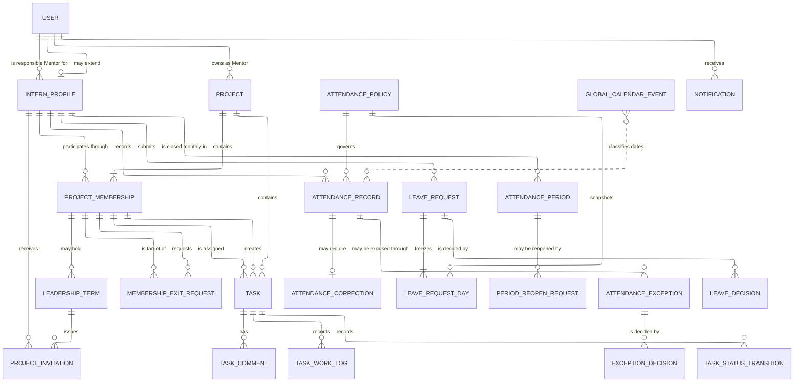

# Data model Spec

**Version:** 1.0.0 · **Owner:** Loc-LX · **Status:** APPROVED BUSINESS BASELINE · **Date:** 2026-09-23

**Module:** `platform` · **Shared contract:** [MODULE.md](../../MODULE.md)

## 1. Context & Goal

Keep one physical schema whose keys and constraints retain history and hold the shared
invariants, and whose diagram describes the tables the migrations actually create.

This is one cohesive planning scope. Operations below are sections of this feature,
not separate modules or mandatory branches. Its rules moved here from the platform shared
contract unchanged (`D40`). A schema change shared by several features is planned once here,
and each affected feature's plan points to it.

## 2. Actors & Roles

The maintainer and every contributor, person or agent, who writes a migration or reads the
schema. No use case is defined here: the schema serves every feature's use cases.

## 3. Functional Requirements

The operation summaries below are navigation. The numbered rules remain authoritative;
they do not acquire additional behavior from a heading or summary.

### Define the physical schema

DB-001, DB-003, DB-004, DB-006 and DB-010 fix column types, uniqueness, same-Project keys, indexes and agreement with the diagram.

### Guard integrity in transactions

DB-005, DB-007 and DB-008 fix the role trigger, restrictive keys, the invariants held inside transactions, and the locks taken before quota or daily totals are read.

### Canonical feature rules

The numbered rules of this feature stay with the domain model in section 5 under §19.3,
where the platform shared contract held them.

## 4. Non-functional Requirements

Inherit [platform constraints](../../MODULE.md#4-non-functional-requirements). `ARC-007` to
`ARC-009` in the [Architecture](../architecture/SPEC.md) feature govern how the schema changes.

## 5. Data

### §19. Domain model

**Part F6.**

#### §19.1 Conceptual ERD

The conceptual diagram shows business relationships without pretending to be the physical schema. Context, workflow, use-case, and screen-flow diagrams remain deferred for manual team authoring.

#### §19.2 Physical table inventory

The schema contains **30 tables**.

| # | Table | Responsibility | Retention |
|---:|---|---|---|
| 1 | `system_state` | Singleton bootstrap closure | Permanent |
| 2 | `app_users` | Identity, immutable global role, account state | Lifecycle retained |
| 3 | `user_action_tokens` | Hashed activation/reset tokens | Retain for security audit/expiry cleanup policy |
| 4 | `intern_profiles` | Internship identity and lifecycle | Permanent history |
| 5 | `smtp_configurations` | Tested encrypted SMTP revisions | Retire, do not overwrite |
| 6 | `holiday_api_configurations` | Tested encrypted API-key revisions | Retire, do not overwrite |
| 7 | `attendance_policy_versions` | Effective-dated attendance configuration | Immutable once effective |
| 8 | `attendance_policy_workdays` | ISO weekdays for a policy | Same lifecycle as policy |
| 9 | `global_calendar_events` | Imported/custom global observances and days off | Immutable after date passes |
| 10 | `projects` | Mentor-owned Project aggregate | Terminal read-only |
| 11 | `project_memberships` | Membership intervals | Close, do not delete |
| 12 | `project_leadership_terms` | Non-overlapping Leader history | Close, do not delete |
| 13 | `project_invitations` | Leader invitation and immutable resolution provenance | Permanent history |
| 14 | `project_membership_exit_requests` | Member-removal/leave request and Mentor decision | Permanent history |
| 15 | `tasks` | Single-assignee work item with generic membership actors | Soft delete |
| 16 | `task_comments` | Append-only discussion | Permanent history |
| 17 | `task_work_logs` | Dated effort minutes | Permanent history |
| 18 | `attendance_records` | Raw server punch data | Permanent history |
| 19 | `attendance_corrections` | Current missed-checkout correction state | Permanent history |
| 20 | `attendance_correction_events` | Append-only correction transitions | Permanent history |
| 21 | `leave_requests` | Inclusive request range/current decision | Permanent history |
| 22 | `leave_request_days` | Frozen quota-consuming dates | Permanent history |
| 23 | `notifications` | In-app record and non-secret email retry state | Retained by future explicit policy |
| 24 | `task_remaining_effort_forecasts` | Append-only Remaining effort forecasts per Task reassignment | Permanent history |
| 25 | `attendance_periods` | One Intern's attendance for one calendar month and whether it is finalized | Permanent history |
| 26 | `attendance_period_reopens` | Requests to reopen a finalized period, the Admin's decision, and the range finalized again | Permanent history |
| 27 | `attendance_exceptions` | A late arrival or early departure raised for excuse by request or mark, and its current outcome | Permanent history |
| 28 | `attendance_exception_decisions` | Append-only exception decisions, amendments and reversals | Permanent history |
| 29 | `leave_request_decisions` | Append-only leave decisions and amendments | Permanent history |
| 30 | `task_status_transitions` | Append-only Task block, unblock and reopen records | Permanent history |

#### §19.3 Integrity boundary

`DB-002` and `DB-014`–`DB-018` are in [the attendance spec](../../../attendance/MODULE.md), `DB-009` in [the calendar spec](../../../calendar/MODULE.md), `DB-011`–`DB-013` and `DB-019`–`DB-020` in [the project spec](../../../project/MODULE.md), and `DB-021` in [the internship spec](../../../internship/MODULE.md).

| ID | Requirement |
|---|---|
| DB-001 | THE schema SHALL use generated `BIGINT` identity keys, `date` for local business dates, `time` for schedules, `timestamptz` for instants, and checked `varchar` states rather than PostgreSQL enums. |
| DB-003 | THE schema SHALL enforce case-insensitive unique email and Student Code, one active membership per Intern and Project, one current Leader per Project, one pending invitation per Intern and Project, one pending exit request per target membership, one attendance row per Intern and date, one correction per attendance row, one attendance exception per attendance row and violation kind, and one active and one draft revision per integration. |
| DB-004 | THE schema SHALL use composite foreign keys to keep leadership, invitation provenance and accepted membership, membership-exit requester and target, Task assignee and actors, and work-log member inside the same Project. |
| DB-005 | WHERE an update would change an existing user's global role, THE schema SHALL reject it through a trigger. THE schema SHALL default foreign keys to `RESTRICT`, so that only an explicitly modelled soft-delete or lifecycle transition removes an item from an active view. |
| DB-006 | THE schema SHALL index every foreign key, together with the active membership and Leader lookups, the pending invitation and exit queues, Project Task status and assignee, attendance date, pending deadlines, leave month, unread notification, and pending-email paths. |
| DB-007 | THE system SHALL enforce, inside application transactions, role compatibility, state graphs, ownership, exactly one live Leader, invitation eligibility and resolution, pending-exit assignment exclusion, atomic transfer batches, approval readiness, direct-removal automatic transfer, self-Task versus Leader authority, active membership, Project completion, policy immutability, calendar cutoff, due-date validation, leave quota, and the daily work-minute total. THE system SHALL build authorized history views from the retained domain rows, and SHALL NOT introduce a generic audit table or a Task-assignment-history table. |
| DB-008 | WHEN leave quota or a daily work-minute total is validated, THE system SHALL lock the affected Intern profile before reading reservations or totals and before writing the new state. |
| DB-010 | THE physical Mermaid diagram and the SQL SHALL describe the same tables, columns, and foreign-key relationships. WHERE they differ on composite or partial uniqueness, checks, exclusions, triggers, or lifecycle enforcement, the DDL is authoritative, because Mermaid cannot express those. |

#### §19.4 Physical database diagram

The physical diagram describes the tables the Flyway migrations create, column by column. The following ELK-rendered Mermaid diagram lists the exact physical tables, columns, and named foreign keys. Mermaid cannot express partial indexes, full composite-key semantics, check/exclusion constraints, triggers, deadlines, authorization, or transactional invariants. When it conflicts with a numbered requirement or `database-schema.sql`, the requirement and DDL win.

```mermaid
---
config:
  layout: elk
---
erDiagram
    system_state {
        smallint singleton_id PK
        boolean initialized
        timestamptz initialized_at
        bigint bootstrap_admin_id FK
        timestamptz created_at
        timestamptz updated_at
        bigint version
    }
    app_users {
        bigint id PK
        varchar email
        varchar display_name
        varchar password_hash
        varchar global_role
        varchar account_status
        timestamptz activated_at
        timestamptz locked_at
        timestamptz deactivated_at
        timestamptz last_login_at
        bigint created_by_user_id FK
        timestamptz created_at
        timestamptz updated_at
        bigint version
    }
    user_action_tokens {
        bigint id PK
        bigint user_id FK
        varchar purpose
        bytea token_hash UK
        timestamptz expires_at
        timestamptz used_at
        timestamptz invalidated_at
        bigint issued_by_user_id FK
        timestamptz created_at
    }
    intern_profiles {
        bigint user_id PK, FK
        varchar student_code
        varchar department
        varchar phone
        date internship_start_date
        date internship_end_date
        varchar internship_status
        timestamptz activated_at
        timestamptz completed_at
        timestamptz withdrawn_at
        timestamptz created_at
        timestamptz updated_at
        bigint version
    }
    smtp_configurations {
        bigint id PK
        varchar status
        varchar host
        integer port
        varchar security_mode
        varchar username
        bytea password_ciphertext
        bytea password_nonce
        integer secret_key_version
        varchar from_address
        varchar from_name
        timestamptz tested_at
        bigint tested_by_user_id FK
        timestamptz activated_at
        bigint activated_by_user_id FK
        timestamptz retired_at
        bigint retired_by_user_id FK
        bigint created_by_user_id FK
        timestamptz created_at
        timestamptz updated_at
        bigint version
    }
    holiday_api_configurations {
        bigint id PK
        varchar status
        char country_code
        bytea api_key_ciphertext
        bytea api_key_nonce
        integer secret_key_version
        timestamptz tested_at
        bigint tested_by_user_id FK
        timestamptz activated_at
        bigint activated_by_user_id FK
        timestamptz retired_at
        bigint retired_by_user_id FK
        bigint created_by_user_id FK
        timestamptz created_at
        timestamptz updated_at
        bigint version
    }
    attendance_policy_versions {
        bigint id PK
        date effective_from UK
        varchar timezone_name
        time scheduled_start
        time scheduled_end
        integer check_in_grace_minutes
        integer checkout_grace_minutes
        integer monthly_leave_quota
        numeric violation_penalty
        bigint created_by_user_id FK
        timestamptz created_at
        timestamptz updated_at
        bigint version
    }
    attendance_policy_workdays {
        bigint policy_version_id PK, FK
        smallint iso_weekday PK
        timestamptz created_at
    }
    global_calendar_events {
        bigint id PK
        date calendar_date
        varchar name
        varchar source
        varchar source_uuid
        date actual_date
        date observed_date
        boolean public_holiday
        boolean is_day_off
        timestamptz imported_at
        bigint created_by_user_id FK
        bigint updated_by_user_id FK
        timestamptz created_at
        timestamptz updated_at
        bigint version
    }
    projects {
        bigint id PK
        bigint mentor_user_id FK
        varchar name
        text description
        varchar status
        date start_date
        date end_date
        timestamptz activated_at
        timestamptz completed_at
        timestamptz created_at
        timestamptz updated_at
        bigint version
    }
    project_memberships {
        bigint id PK, UK
        bigint project_id FK, UK
        bigint intern_user_id FK
        timestamptz joined_at
        timestamptz left_at
        bigint added_by_user_id FK
        bigint removed_by_mentor_user_id FK
        timestamptz created_at
        timestamptz updated_at
        bigint version
    }
    project_leadership_terms {
        bigint id PK, UK
        bigint project_id FK, UK
        bigint membership_id FK
        timestamptz started_at
        timestamptz ended_at
        bigint appointed_by_mentor_user_id FK
        bigint ended_by_mentor_user_id FK
        timestamptz created_at
    }
    project_invitations {
        bigint id PK
        bigint project_id FK
        bigint invited_intern_user_id FK
        bigint issuing_leadership_term_id FK
        varchar status
        bigint accepted_membership_id FK
        timestamptz resolved_at
        bigint resolved_by_user_id FK
        varchar resolution_code
        timestamptz created_at
        timestamptz updated_at
        bigint version
    }
    project_membership_exit_requests {
        bigint id PK
        bigint project_id FK
        bigint target_membership_id FK
        bigint requester_membership_id FK
        varchar request_type
        text reason
        varchar status
        text resolution_note
        timestamptz resolved_at
        bigint resolved_by_user_id FK
        timestamptz created_at
        timestamptz updated_at
        bigint version
    }
    tasks {
        bigint id PK, UK
        bigint project_id FK, UK
        bigint assignee_membership_id FK
        varchar title
        text description
        varchar status
        date due_date
        integer estimated_minutes
        timestamptz assigned_at
        bigint created_by_membership_id FK
        bigint assigned_by_membership_id FK
        timestamptz deleted_at
        bigint deleted_by_membership_id FK
        timestamptz created_at
        timestamptz updated_at
        bigint version
    }
    task_remaining_effort_forecasts {
        bigint id PK
        bigint project_id FK
        bigint task_id FK
        bigint incoming_membership_id FK
        bigint forecasting_leader_membership_id FK
        timestamptz assignment_started_at
        integer remaining_minutes
        bigint actual_minutes_snapshot
        text initial_note
        text correction_reason
        bigint supersedes_forecast_id FK
        timestamptz created_at
    }
    task_comments {
        bigint id PK
        bigint task_id FK
        bigint author_user_id FK
        text body
        timestamptz created_at
    }
    task_work_logs {
        bigint id PK
        bigint project_id FK
        bigint task_id FK
        bigint membership_id FK
        date work_date
        integer minutes
        text note
        timestamptz created_at
        timestamptz updated_at
        bigint version
    }
    attendance_records {
        bigint id PK
        bigint intern_user_id FK, UK
        date work_date UK
        bigint policy_version_id FK
        timestamptz check_in_at
        timestamptz check_out_at
        timestamptz created_at
        timestamptz updated_at
        bigint version
    }
    attendance_corrections {
        bigint id PK
        bigint attendance_record_id FK, UK
        timestamptz requested_checkout_at
        text reason
        varchar status
        timestamptz submitted_at
        timestamptz submission_deadline
        timestamptz decision_deadline
        bigint decided_by_mentor_user_id FK
        timestamptz decided_at
        text decision_note
        timestamptz locked_at
        timestamptz created_at
        timestamptz updated_at
        bigint version
    }
    attendance_correction_events {
        bigint id PK
        bigint correction_id FK
        varchar event_type
        varchar from_status
        varchar to_status
        bigint actor_user_id FK
        text note
        timestamptz occurred_at
    }
    leave_requests {
        bigint id PK
        bigint intern_user_id FK
        date start_date
        date end_date
        text reason
        varchar status
        timestamptz submitted_at
        timestamptz first_counted_start_at
        bigint decided_by_mentor_user_id FK
        timestamptz decided_at
        text decision_note
        timestamptz cancelled_at
        timestamptz created_at
        timestamptz updated_at
        bigint version
    }
    leave_request_days {
        bigint leave_request_id PK, FK
        date leave_date PK
        date quota_month
        bigint policy_version_id FK
        integer monthly_quota_snapshot
        timestamptz created_at
    }
    notifications {
        bigint id PK
        bigint recipient_user_id FK
        varchar notification_type
        varchar title
        text body
        varchar action_url
        timestamptz read_at
        varchar email_status
        varchar email_to
        varchar email_subject
        text email_body
        integer email_attempts
        timestamptz email_next_attempt_at
        timestamptz email_sent_at
        varchar email_last_error
        timestamptz created_at
        timestamptz updated_at
        bigint version
    }
    app_users o|--o{ app_users : "fk_app_users_created_by"
    app_users ||--o{ user_action_tokens : "fk_user_action_tokens_user"
    app_users o|--o{ user_action_tokens : "fk_user_action_tokens_issuer"
    app_users o|--o| intern_profiles : "fk_intern_profiles_user"
    app_users o|--o{ smtp_configurations : "fk_smtp_configurations_tested_by"
    app_users o|--o{ smtp_configurations : "fk_smtp_configurations_activated_by"
    app_users o|--o{ smtp_configurations : "fk_smtp_configurations_retired_by"
    app_users ||--o{ smtp_configurations : "fk_smtp_configurations_created_by"
    app_users o|--o{ holiday_api_configurations : "fk_holiday_api_configurations_tested_by"
    app_users o|--o{ holiday_api_configurations : "fk_holiday_api_configurations_activated_by"
    app_users o|--o{ holiday_api_configurations : "fk_holiday_api_configurations_retired_by"
    app_users ||--o{ holiday_api_configurations : "fk_holiday_api_configurations_created_by"
    app_users o|--o{ attendance_policy_versions : "fk_attendance_policy_versions_created_by"
    attendance_policy_versions ||--o{ attendance_policy_workdays : "fk_attendance_policy_workdays_policy"
    app_users ||--o{ global_calendar_events : "fk_global_calendar_events_created_by"
    app_users ||--o{ global_calendar_events : "fk_global_calendar_events_updated_by"
    app_users ||--o{ projects : "fk_projects_mentor"
    projects ||--o{ project_memberships : "fk_project_memberships_project"
    intern_profiles ||--o{ project_memberships : "fk_project_memberships_intern"
    app_users ||--o{ project_memberships : "fk_project_memberships_added_by"
    app_users o|--o{ project_memberships : "fk_project_memberships_removed_by"
    projects ||--o{ project_leadership_terms : "fk_project_leadership_terms_project"
    project_memberships ||--o{ project_leadership_terms : "fk_project_leadership_terms_membership_project"
    app_users ||--o{ project_leadership_terms : "fk_project_leadership_terms_appointed_by"
    app_users o|--o{ project_leadership_terms : "fk_project_leadership_terms_ended_by"
    projects ||--o{ project_invitations : "fk_project_invitations_project"
    intern_profiles ||--o{ project_invitations : "fk_project_invitations_invited_intern"
    project_leadership_terms ||--o{ project_invitations : "fk_project_invitations_issuing_leadership_project"
    project_memberships o|--o{ project_invitations : "fk_project_invitations_accepted_membership_project"
    app_users o|--o{ project_invitations : "fk_project_invitations_resolved_by"
    projects ||--o{ project_membership_exit_requests : "fk_project_membership_exit_requests_project"
    project_memberships ||--o{ project_membership_exit_requests : "fk_project_membership_exit_requests_target_project"
    project_memberships ||--o{ project_membership_exit_requests : "fk_project_membership_exit_requests_requester_project"
    app_users o|--o{ project_membership_exit_requests : "fk_project_membership_exit_requests_resolved_by"
    projects ||--o{ tasks : "fk_tasks_project"
    project_memberships ||--o{ tasks : "fk_tasks_assignee_project"
    project_memberships ||--o{ tasks : "fk_tasks_creator_project"
    project_memberships ||--o{ tasks : "fk_tasks_assigner_project"
    project_memberships o|--o{ tasks : "fk_tasks_deleter_project"
    tasks ||--o{ task_comments : "fk_task_comments_task"
    app_users ||--o{ task_comments : "fk_task_comments_author"
    projects ||--o{ task_work_logs : "fk_task_work_logs_project"
    tasks ||--o{ task_work_logs : "fk_task_work_logs_task_project"
    tasks ||--o{ task_remaining_effort_forecasts : "fk_task_forecasts_task_project"
    project_memberships ||--o{ task_work_logs : "fk_task_work_logs_membership_project"
    intern_profiles ||--o{ attendance_records : "fk_attendance_records_intern"
    attendance_policy_versions ||--o{ attendance_records : "fk_attendance_records_policy"
    attendance_records ||--o{ attendance_corrections : "fk_attendance_corrections_record"
    app_users o|--o{ attendance_corrections : "fk_attendance_corrections_decided_by"
    attendance_corrections ||--o{ attendance_correction_events : "fk_attendance_correction_events_correction"
    app_users o|--o{ attendance_correction_events : "fk_attendance_correction_events_actor"
    intern_profiles ||--o{ leave_requests : "fk_leave_requests_intern"
    app_users o|--o{ leave_requests : "fk_leave_requests_decided_by"
    leave_requests ||--o{ leave_request_days : "fk_leave_request_days_request"
    attendance_policy_versions ||--o{ leave_request_days : "fk_leave_request_days_policy"
    app_users ||--o{ notifications : "fk_notifications_recipient"
    app_users o|--o{ system_state : "fk_system_state_bootstrap_admin"
```

### Required contracts

These are required facts or behaviors, not prescribed cross-module imports or an
automatic implementation order.

| Provider | Required fact or behavior | Rule trace |
|---|---|---|
| [Architecture](../architecture/SPEC.md) | Flyway is the only schema authority, and an applied migration is never edited | [ARC-007](../architecture/SPEC.md), [ARC-009](../architecture/SPEC.md) |

### Related workflows and joint checks

- The `DB-*` rules that §19.3 names outside this feature stay in their modules' specs; each
  owning feature proves them with its own scenarios.
- No scenario observes the locks of `DB-008`. `AC-TSK-008`, which names that rule, and `AC-GOV-002` in
  the platform shared contract check only the outcome of the races the locks serve.

## 6. Error Handling

`DB-005` rejects a role change through a trigger. Stale and deadline races follow `ERR-002`
and `ERR-003`. Apply [module error handling](../../MODULE.md#6-error-handling).

## 7. Acceptance Criteria

### Operation and acceptance map

This map traces existing behavior; its gap column does not define a new rule or
claim full test coverage. Actors and outcomes are summaries of the canonical rules.

| Operation | Actor and observable outcome | Canonical rules | Existing acceptance scenarios | Acceptance boundary or open decision |
|---|---|---|---|---|
| [Define the physical schema](#define-the-physical-schema) | After a clean replay the catalog matches the rules and the diagram | [DB-001](SPEC.md), [DB-003](SPEC.md), [DB-004](SPEC.md), [DB-006](SPEC.md), [DB-010](SPEC.md) | [AC-DB-001](SPEC.md), [AC-DB-004](SPEC.md) | Where Mermaid cannot express a constraint, the DDL is authoritative (`DB-010`). |
| [Guard integrity in transactions](#guard-integrity-in-transactions) | An invalid update or a race leaves no partial or inconsistent row | [DB-005](SPEC.md), [DB-007](SPEC.md), [DB-008](SPEC.md) | [AC-DB-001](SPEC.md), [AC-ACC-008](../../../identity/features/account-lifecycle/SPEC.md), [AC-TSK-008](../../../project/features/work-logs-and-effort/SPEC.md) | `AC-DB-001` names these rules by range and `AC-ACC-008` exercises the role trigger; `AC-TSK-008` checks the outcome that the locks of `DB-008` serve, and no scenario observes the locks themselves. |

### Canonical acceptance scenarios

| Scenario | Requirements | Given / when | Expected result |
|---|---|---|---|
| AC-DB-001 | DB-003–DB-012 | Both review DDL files replay and their catalog metadata is compared with the physical Mermaid block | Each database has exactly 30 tables; the 23 baseline tables and their 56 named foreign keys match the diagram entity and FK names, the twenty-fourth is verified against `DB-013`, and the six added tables against `DB-014`–`DB-017` and `DB-020`. |
| AC-DB-004 | DB-001 | Catalog metadata for every application table is read back after a clean Flyway replay | Identity keys are generated `BIGINT`; local business dates are `date`; schedule times are `time`; every instant column is `timestamptz`; no PostgreSQL enum type exists, and every state column is `varchar` with a check constraint. |

Shared and cross-feature scenarios in [MODULE.md](../../MODULE.md#7-acceptance-criteria)
also apply.

## 8. Out of Scope

Inherit [module exclusions](../../MODULE.md#8-out-of-scope), including `GOV-009`.

## Notes / Open Questions

No question affecting this feature is open. Its technical design is [PLAN.md](PLAN.md),
with tasks in [TASKS.md](TASKS.md).

Read [shared open questions](../../MODULE.md#notes--open-questions) before approving
the technical plan. [plan.md](../../../../../plan.md) is the only progress tracker.
