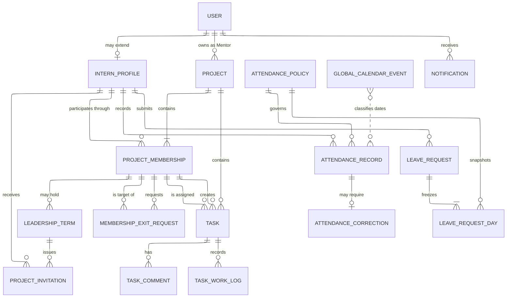

# Lab Timesheet & Project Management System

> **Status: REVIEW REQUIRED — IMPLEMENTATION NOT AUTHORIZED**
>
> This document is the authoritative review draft for the intended v1 system. It defines requirements and an approval baseline; it does not authorize application scaffolding, migrations, deployment, or production changes.

| Field | Value |
|---|---|
| Document type | Requirements, domain design, database reference, and acceptance catalogue |
| Audience | Primary implementor, five-person student team, instructor/reviewer |
| Product language | English |
| Business timezone | `Asia/Ho_Chi_Minh` |
| Database baseline | PostgreSQL 18.4, 23 application tables |
| Companion DDL | `database-schema.sql`, not tracked in this repository |
| Review state | Not approved for implementation |

> **Companion files.** This document was authored in a separate documentation
> repository and copied here on 26 August 2026. Its companion `database-schema.sql`
> and the `assets/` images stayed behind and have never been tracked in this
> repository. Every image embed below is therefore written as a named reference
> rather than a link, so nothing renders as a broken image.
> The live schema is [`V1__baseline.sql`](../../src/main/resources/db/migration/V1__baseline.sql)
> plus [`V2__add_task_effort_planning.sql`](../../src/main/resources/db/migration/V2__add_task_effort_planning.sql),
> which together create twenty-four tables; §19.4 below carries the physical
> table diagram. Ask the document owner for the reference images if you need them.

## 1. Authority, purpose, and scope

### 1.1 Decision authority

When statements conflict, use this precedence from highest to lowest:

1. Current decisions made by the primary implementor.
2. Decisions explicitly approved during the Codex brainstorming review.
3. The current Codex handoff.
4. Instructor-confirmed requirements.
5. The friend's earlier requirements answers.
6. The original Claude document, which is superseded.

> **Latest reporting-role revision — 27 August 2026.** The current approved handoff supersedes
> earlier Admin-positive reporting language in this review draft and its historical evidence.
> Admin is limited to account lifecycle and system configuration: Admin has no Attendance,
> Project/Task, or Daily Project Work Report scope, navigation, HTML/XLSX/PDF export, or report
> dataset. Attendance and Project/Task Admin requests are denied before target/Project option
> resolution or downstream reads and return the authenticated access-denied response; Daily Admin
> requests retain the existing non-disclosing `Project unavailable` behavior. The Admin dashboard
> contains account-lifecycle counts and configuration guidance only, without an Active Projects
> metric or report-like Project/Task summary. Active Interns retain own Attendance, active Mentors
> retain authorized detailed Intern Attendance, owning Mentors retain their existing Project/Task
> and Daily scopes, and current Leaders gain discoverable Daily access for each currently-led
> `PLANNED` or `ACTIVE` Project. Mentor demand for additional Daily reporting remains out-of-system
> operational communication without persisted delegation.

> **Admin Attendance-scope revision — 30 August 2026. Supersedes the 27 August block above on
> Attendance only.** Admin regains detailed Intern Attendance scope: navigation, the HTML report
> page, the XLSX and PDF exports, and the report dataset, with the same target scope an active
> Mentor holds. The acting Admin account must be active, and the target account's immutable role
> must be `INTERN`. Every other restriction in the 27 August block stands unchanged: Admin still
> has no Project/Task scope and no Daily Project Work Report scope, Admin Project/Task requests are
> still denied before Project option resolution or downstream reads, Daily Admin requests still
> return the non-disclosing `Project unavailable` response, and the Admin dashboard still carries
> account-lifecycle counts and configuration guidance only. This revision restores the position
> held by the 17 August SRS and is the current decision of the primary implementor under the
> `GOV-001` authority order; it is recorded in `docs/adr/0002-admin-attendance-report-scope.md`.

| ID | Requirement |
|---|---|
| GOV-001 | Implementers shall use the authority order above and shall not revive a lower-authority rule that conflicts with an approved higher-authority decision. |
| GOV-002 | The term **Project** replaces the obsolete term **Group** throughout code, schema, UI, and documentation. |
| GOV-003 | v1 shall be a working attendance and project/task-management system, not a prototype or static demonstration. |
| GOV-004 | Attendance time and task work time shall remain separate domains; neither proves or derives the other. |
| GOV-005 | Historical business results shall not change merely because an Admin later changes global workdays, schedule, check-in grace, checkout grace, quota, penalty, or calendar configuration. |
| GOV-006 | Features not specified here require a new reviewed decision; this draft does not silently authorize adjacent scope. |

### 1.2 Product objective

The system supports a university laboratory or internship program in four connected areas:

- account and internship administration;
- global attendance, leave, and missed-checkout correction;
- Mentor-owned projects with contextual Intern leadership and single-assignee tasks;
- authorized dashboards and consistent HTML, Excel, and PDF reports.

### 1.3 Explicit non-goals

| ID | Requirement |
|---|---|
| GOV-007 | v1 shall not use a SPA framework, JWT authentication, microservices, Redis, Kafka, a generic workflow engine, or a persisted `Report` entity. |
| GOV-008 | v1 shall not include project-level days off, multiple task assignees, unconditional self-service Project joining/leaving, task dependencies, epics, sprints, story points, labels, watchers, reactions, attachments, nested subtasks, or burndown charts. Authenticated invitation acceptance and Mentor-approved exit requests are the only member-initiated boundary workflows. |
| GOV-009 | v1 shall not persist generic domain events, login-attempt history, daily calendar materializations, or task-assignment history. Narrow correction and leadership history are retained because current requirements depend on them. |
| GOV-010 | Automatic SSH deployment is not active until the deployment VM and its secrets exist; the workflow contains only a disabled template. |

## 2. Terminology and system-wide rules

| Term | Meaning |
|---|---|
| Global role | Exactly one immutable account role: `ADMIN`, `MENTOR`, or `INTERN`. |
| Project Leader | An Intern with the current leadership term for one Project; not a global role. |
| Active member | A project membership whose `left_at` is null and whose Intern is eligible to participate. |
| Project invitation | A current Leader's non-expiring invitation that only its authenticated intended Intern may accept or decline. |
| Membership exit request | A Leader's request to remove another member or a member's request to leave. Membership remains open until the owning Mentor approves it, while unfinished Tasks may be redistributed beforehand. |
| Pending exit target | The current member named by a pending exit request. Existing rights remain, but the target cannot receive newly created/reassigned Tasks or create a self-Task until the request is cancelled, rejected, superseded, or approved. |
| Project History | The authorized read-only Project view assembled from retained memberships, leadership terms, invitations, exit requests, completed/soft-deleted Tasks, comments, work logs, and attribution already stored by the approved schema. |
| Task creator | The membership that created a Task; creator authority is narrower than current-Leader authority and is retained historically. |
| Current assignee | The active Project member referenced by a Task's single assignee field. |
| Global day off | An Admin-authorized calendar date with `is_day_off=true`; it affects attendance and leave for all active Interns. |
| Eligible workday | A configured policy workday within the Intern's applicable internship interval that is not a global day off. |
| Expected workday | An eligible workday not covered by approved leave. |
| Raw checkout | The server timestamp recorded by normal checkout; it is never overwritten by correction. |
| Effective checkout | Raw checkout when present, otherwise an approved correction's requested checkout. |
| Task work log | A dated number of minutes spent on a Task; it is independent from attendance. |

| ID | Requirement |
|---|---|
| GOV-011 | Business dates and schedule boundaries shall be evaluated in the attendance policy version's timezone; persisted instants shall use `timestamptz` and be treated as UTC instants. |
| GOV-012 | Server time shall be authoritative for check-in, checkout, submission, decision, activation, expiry, and lifecycle timestamps. Browser-supplied timestamps shall not be trusted as event time. |
| GOV-013 | All mutable aggregate updates shall be transactional and use optimistic locking; quota, daily work totals, bootstrap, and transfer workflows shall additionally serialize on the narrow affected record. |
| GOV-014 | Historical records shall be retained with restrictive foreign keys and lifecycle/soft-delete fields. Normal UI operations shall not physically delete accounts, projects, memberships, tasks, attendance, leave, corrections, comments, logs, or notifications. |

## 3. Architecture and runtime

| ID | Requirement |
|---|---|
| ARC-001 | The application shall be one server-rendered modular monolith using Java 25 and Spring Boot 4.1.0. |
| ARC-002 | The backend shall use Maven, Spring MVC, Spring Security, Spring Data JPA, Bean Validation, Thymeleaf, Spring Mail, and Flyway. |
| ARC-003 | PostgreSQL 18.4 shall be the production, development, and integration-test database family. Tests exercising PostgreSQL-specific constraints shall use PostgreSQL rather than H2. |
| ARC-004 | The UI toolchain shall pin Node 24 LTS and Tailwind CSS 4, use `npm ci`, and commit the npm lockfile when implementation begins. |
| ARC-005 | `LabtimesheetApplication` shall remain in the root package `com.lab.labtimesheet`. Shared application wiring shall live in `config`. Business code shall be grouped below `feature.<name>` for `account`, `integration`, `project`, `task`, `attendance`, `notification`, and `reporting`; each feature shall add only the layer subpackages it needs from `controller`, `model`, `model.dto`, `model.entity`, `repository`, `service`, and `exception`. Tests shall mirror those feature/layer packages. Thymeleaf templates and built static assets shall remain under `src/main/resources/templates` and `src/main/resources/static`. |
| ARC-006 | Within a feature, MVC controllers shall bind validated DTOs and delegate business transactions to services; services shall use Spring Data JPA repositories and model entities/value objects. A feature may call another feature's service contract and DTOs but shall not reach into that feature's repository or JPA entities. Business services shall not contain direct SQL. Flyway/schema/catalog verification is the only approved direct-SQL boundary, and the application shall not introduce network boundaries, empty utility/core packages, or one-implementation abstraction layers. |
| ARC-007 | Flyway shall be the sole production schema authority. JPA schema generation shall be validation-only outside disposable tests. |
| ARC-008 | The reviewed `database-schema.sql` is a design baseline. After approval, the platform owner shall adapt it into the initial Flyway migration rather than executing the review file in production. |

Reference versions and primary documentation:

- [Spring Boot 4.1.0 release](https://spring.io/blog/2026/06/10/spring-boot-4/)
- [Spring Boot 4.1 code-structure guidance](https://docs.spring.io/spring-boot/4.1/reference/using/structuring-your-code.html)
- [Spring Boot SQL and Spring Data JPA guidance](https://docs.spring.io/spring-boot/reference/data/sql.html)
- [PostgreSQL support/versioning](https://www.postgresql.org/support/versioning/)
- [Tailwind CLI](https://tailwindcss.com/docs/installation/tailwind-cli)
- [Node release schedule](https://nodejs.org/en/about/previous-releases)

## 4. Accounts, bootstrap, and internship lifecycle

### 4.1 Bootstrap and accounts

| ID | Requirement |
|---|---|
| ACC-001 | Before initialization, the application shall expose only health endpoints, static bootstrap assets, and the one-time bootstrap workflow. |
| ACC-002 | Bootstrap shall create the first `ADMIN` with a password directly and atomically mark the singleton system state initialized. Concurrent bootstrap submissions shall result in exactly one first Admin. |
| ACC-003 | The bootstrap route shall become unavailable immediately after initialization and remain unavailable after restart. |
| ACC-004 | Deployment instructions shall require bootstrap on a private interface before public network exposure; the temporary unguarded bootstrap route is an accepted, documented operational risk. |
| ACC-005 | Bootstrap shall offer SMTP setup. Admin may defer it only after five sequential, distinct confirmation screens; every screen shall offer Back and Configure SMTP, and only the fifth shall permit Finish without SMTP. |
| ACC-006 | The five deferral warnings shall cover, in order: account onboarding disabled, activation resend disabled, password recovery disabled, reduced email immediacy for workflow events, and final acknowledgement of a restricted installation. |
| ACC-007 | A persistent Admin warning shall remain visible until a tested SMTP configuration is active. |
| ACC-008 | After bootstrap, an active Admin may create additional Admin, Mentor, and Intern accounts. A role chosen at creation is immutable. |
| ACC-009 | Email shall be the only login identifier and shall be unique case-insensitively after trimming and normalization. Admin email correction shall require tested active SMTP, shall be allowed only for `PENDING_ACTIVATION`, `ACTIVE`, or `LOCKED` accounts, and shall commit only when its required delivery succeeds. A `DEACTIVATED` account shall remain read-only. |
| ACC-010 | Admin-created accounts shall start `PENDING_ACTIVATION`, without a password hash, and receive a single-use activation link that sets the first password. |
| ACC-011 | Account creation, activation resend, and password-reset delivery shall be unavailable when no tested SMTP configuration is active. Bootstrap creation of the first Admin is the sole exception. |
| ACC-012 | If activation delivery fails after account creation, the account shall remain pending, the failed token shall be invalidated, and Admin shall receive a visible failure with an explicit Resend Activation action. |
| ACC-013 | Resend Activation shall invalidate any prior unused activation token before generating and sending a fresh token. |
| ACC-014 | Account states shall be `PENDING_ACTIVATION`, `ACTIVE`, `LOCKED`, and `DEACTIVATED`. Admin lock and deactivation are explicit manual actions. |
| ACC-015 | Unlock shall return a previously activated locked account to `ACTIVE`; it shall not change its global role or recreate credentials. |
| ACC-016 | Deactivated accounts shall not authenticate. Their historical attribution shall remain visible. |
| ACC-017 | Users shall manage their own display/profile fields and password. Admin shall have a server-filtered account directory searchable by display name, email, or Student Code and filterable by immutable global role. Admin may correct email identity and the permitted Intern fields, but shall not edit display name or global role; account and internship states shall continue to change only through their explicit lifecycle actions. No persisted session history shall be fabricated. |
| ACC-018 | Password change, password reset, Admin email correction, lock, and deactivation shall invalidate the affected user's existing authenticated sessions. A pending-account email correction shall invalidate prior activation tokens and deliver a fresh activation to the corrected address; an active/locked-account correction shall deliver notice to the corrected address. The identity change and its required delivery shall succeed or fail together. |

### 4.2 Internship lifecycle

| ID | Requirement |
|---|---|
| ACC-019 | Every `INTERN` account shall have one Intern profile with case-insensitively unique Student Code, internship start/end dates, and internship status. Non-Intern accounts shall not have Intern profiles. Admin may correct Student Code while the internship is `NOT_STARTED` or `ACTIVE`; start/end dates may be corrected only while `NOT_STARTED`; `COMPLETED` and `WITHDRAWN` profiles shall be read-only. |
| ACC-020 | Internship states shall be `NOT_STARTED → ACTIVE → COMPLETED` or `NOT_STARTED/ACTIVE → WITHDRAWN`; `SUSPENDED` shall not exist. |
| ACC-021 | Reaching the configured internship start date shall activate an eligible `NOT_STARTED` Intern through both a scheduled guard and a request-time guard. Correctness shall not depend on scheduler timing. |
| ACC-022 | Admin shall explicitly mark an Intern `COMPLETED` or `WITHDRAWN`. Both actions shall be blocked while that Intern is a current Leader or owns unfinished Tasks until the normal leader-transfer/task-reassignment workflow succeeds. |
| ACC-023 | A completed Intern may authenticate in read-only mode to view their retained history and manage password/session security; they may not create or mutate attendance, leave, correction, project, task, comment, or work-log data. |
| ACC-024 | A withdrawn Intern shall lose normal authentication access immediately. Historical memberships, tasks, logs, attendance, leave, and corrections shall remain attributable. |
| ACC-025 | A terminal lifecycle action takes effect immediately for authorization. Attendance already recorded on that local date remains reportable; an otherwise empty terminal date is not newly classified as an absence. |

## 5. Authorization model

### 5.1 Authorization evaluation

| ID | Requirement |
|---|---|
| AUTH-001 | Every state-changing operation shall be authorized server-side using global role, account/intern state, record ownership, active membership, current leadership term, current task assignee, and aggregate lifecycle as applicable. |
| AUTH-002 | Hiding a control in Thymeleaf shall not substitute for server authorization. Direct URL access and guessed identifiers shall produce an access-denied or not-found result without disclosing unauthorized record details. |
| AUTH-003 | Any active Mentor may view Intern attendance and decide leave/correction requests globally. Project-management authority is restricted to the Project's owning Mentor. |
| AUTH-004 | Leader permissions shall begin and end with the stored leadership term. Losing leadership shall remove task-management permissions immediately. For a pending Leader exit, the owning Mentor shall appoint the replacement before any exit-transfer work; the new Leader then receives transfer authority without silently moving Tasks merely because leadership changed. |
| AUTH-005 | Current-assignee permission shall apply independently of leadership: a Leader may update/log only a Task assigned to them, and an ordinary member may update/log only their assigned Task. |
| AUTH-006 | Completed Projects are read-only to every role. Admin may read every Project and its retained history; the owning Mentor and current members may read authorized open-Project history. A removed member shall lose open-Project access and regain read-only access only after that Project is completed. |

### 5.2 Permission matrix

Legend: **Yes** = permitted within the stated scope; **Own** = own Project or own record; **Assigned** = only while current assignee; **No** = forbidden.

| Capability | Admin | Owning Mentor | Current Leader | Active member / assignee |
|---|---:|---:|---:|---:|
| Manage accounts/global roles at creation | Yes | No | No | No |
| Lock/deactivate accounts; manage internship lifecycle | Yes | No | No | No |
| Manage SMTP, HolidayAPI, attendance policy, global calendar | Yes | No | No | No |
| View all Projects/tasks/progress | Yes, read-only | Own | Own | Membership scope |
| Create Project | No | Yes | No | No |
| Edit/activate/complete Project | No | Own | No | No |
| Directly add/remove Project members | No | Own | No | No |
| Issue/revoke Project invitation | No | Revoke any in Own | Issue/revoke own in Own | Accept/decline own invitation |
| Request/decide membership exit | No | Decide or remove directly in Own | Request another member's removal or own leave | Request/cancel own leave |
| Appoint/change Project Leader | No | Own | No | No |
| Redistribute unfinished Tasks for pending exit | No | No | Own, in confirmed batches | No |
| Create Task | No | No | Own; any active assignee | Self-assigned only |
| Assign/reassign Task | No | No | Own | No |
| Edit/soft-delete Task | No | No | Unfinished in Own | Unfinished self-created while still self-assigned |
| Change Task status | No | No | Assigned | Assigned |
| Comment on Task | No | Own | Own | Membership scope |
| Create/edit own Task work log | No | No | Assigned/own log | Assigned/own log |
| View aggregate Project progress | Yes | Own | Own | Membership scope |
| View Project/Task retained history | Yes, read-only | Own | Own | Current membership; former membership only after completion |
| View per-member Project hours | No | Own | Own | No |
| View Intern attendance | Yes | Yes | Own history only | Own history only |
| Decide leave/correction | No | Yes | No | No |
| Submit own leave/correction | No | No | If active Intern | If active Intern |
| Export authorized attendance/project reports | Attendance only | Authorized scope | Project scope | No detailed export |

| ID | Requirement |
|---|---|
| AUTH-007 | Admin project access shall be read-only and shall not imply commenting, membership, leadership, Task, or status authority. |
| AUTH-008 | Mentor Task access shall permit view, comment, and read retained Task history but shall forbid manual create, assign, reassign, edit, soft-delete, and status change. The automatic transfer performed by direct Mentor removal is a guarded Project-domain operation, not Mentor Task-management authority. |
| AUTH-009 | Active Project members may view every non-deleted Task, assignee, status, aggregate progress, comment thread, and authorized Project History entry in that Project and may add comments to any non-deleted Task while the Project remains open. |
| AUTH-010 | Per-member task-hour breakdowns shall be limited to the owning Mentor for owned Projects and the current Leader for a Project they currently lead. Ordinary members receive aggregate Project totals only; Admin has no Project/Task-report scope or report dataset. |
| AUTH-011 | Invitation, membership-exit, exit-transfer batch, self-Task, Task-definition, and history-read operations shall authorize from the authenticated user, owning Project, active membership, pending-exit state, issuing/current leadership term, Task creator/current assignee, and aggregate state inside the transaction or read boundary. Guessed cross-Project or stale identifiers shall not disclose protected records or cause partial changes. |

## 6. Project, membership, and leadership

| ID | Requirement |
|---|---|
| PRJ-001 | An active Mentor shall create and own a Project. Creation shall atomically create the Project, one eligible initial Leader membership, and its first leadership term; an empty committed Project is invalid. |
| PRJ-002 | Project states shall be `PLANNED → ACTIVE → COMPLETED`. There is no reopen transition from `COMPLETED`. |
| PRJ-003 | An Intern may hold active memberships in multiple Projects simultaneously. Membership shall be represented explicitly with join and optional leave timestamps. |
| PRJ-004 | Only the owning Mentor shall directly add/remove members or decide membership exits. The current Leader may invite eligible Interns, request another member's removal, and redistribute unfinished Tasks away from a pending exit target. An Intern may join only by accepting their own invitation and may leave only after owning-Mentor approval. |
| PRJ-005 | A `PLANNED` or `ACTIVE` Project shall have exactly one current Leader who is an active member of that Project. Completion shall close, not delete, the final leadership term. |
| PRJ-006 | Leadership changes shall close the current leadership term and open a new term for another active member in one transaction, so the Project never exposes two current Leaders or an active period without one. |
| PRJ-007 | Merely changing the Leader shall not reassign any Task. The former Leader remains a normal member and retains assignee rights for Tasks still assigned to them. |
| PRJ-008 | Before a pending current-Leader exit can transfer Tasks or be approved, the owning Mentor shall appoint an eligible replacement. The replacement becomes the current Leader and performs any remaining transfer batches; leadership reassignment by itself shall not move Tasks. |
| PRJ-009 | Direct Mentor removal shall remain an atomic shortcut: unfinished Tasks of an ordinary member transfer to the current Leader, while removal of the current Leader requires an eligible replacement and transfers unfinished Tasks to that replacement. Any failed replacement, transfer, authorization, or lock check shall leave membership and Tasks unchanged. |
| PRJ-010 | A pending exit request shall use Leader-managed redistribution before approval. The current Leader shall select one or more unfinished `TODO`, `IN_PROGRESS`, or `BLOCKED` Tasks and one eligible active current member per confirmed batch; each batch reassigns immediately and atomically, may be repeated, and shall not be undone by later cancellation or rejection. |
| PRJ-011 | Membership closure shall not rewrite completed Tasks, Task creator attribution, comments, work logs, invitations, exit requests, or leadership history. Completed Tasks shall remain assigned to the closed historical membership and display that removed Intern's name in authorized history. |
| PRJ-012 | Project activation shall require a current Leader, at least one active member, valid Project dates, and valid active-member assignees for all non-deleted Tasks. |
| PRJ-013 | The current Leader may prepare Tasks for any active member, and any active member may prepare a self-assigned Task, while a Project is `PLANNED`; Task status changes and work logging shall remain disabled until `ACTIVE`. |
| PRJ-014 | Only the owning Mentor shall complete a Project, and only when every non-deleted Task is `DONE`. Completion shall close current leadership/membership intervals, revoke pending invitations, supersede pending exit requests, and make the aggregate read-only. |
| PRJ-015 | Project progress shall be `DONE non-deleted Tasks / all non-deleted Tasks`. A Project with no non-deleted Tasks shall show `N/A`, not 0%. |
| PRJ-016 | Project progress views shall also show TODO, IN_PROGRESS, BLOCKED, and DONE counts plus total logged minutes. |
| PRJ-017 | An Intern is eligible for direct addition or invitation only when their account and internship are `ACTIVE` and they have no active membership in that Project. Owning-Mentor direct addition needs no acceptance and records that Mentor as `added_by_user_id`; invitation acceptance records the accepting Intern. If a matching invitation is pending, Mentor direct-add shall mark it `SUPERSEDED` with `MENTOR_DIRECT_ADD` in the same transaction. |
| PRJ-018 | In a `PLANNED` or `ACTIVE` Project, the current Leader may create at most one pending invitation per eligible Intern. Invitations have no time expiry, preserve the issuing leadership term, and require the intended Intern to authenticate before any response. An email URL shall only open the authenticated response page. |
| PRJ-019 | The intended Intern may accept or decline their pending invitation. Acceptance shall atomically recheck Project, invitee, issuing leadership, and membership state before creating one membership. The issuing Leader may revoke their pending invitations; the owning Mentor may revoke any. Losing leadership, Project completion, or invitee ineligibility shall revoke unusable pending invitations without deleting them. |
| PRJ-020 | A current Leader may request removal of another current member. Any current member, including the Leader, may request their own leave. A request shall contain a nonblank reason, shall not expire, and only one pending request may target a membership. While pending, every authorized Project viewer shall see whether a replacement Leader is required, how many unfinished Tasks remain, or whether the request is ready for Mentor decision. |
| PRJ-021 | A pending membership-exit request shall leave membership, existing assignments, and existing Task rights active, but the target shall be ineligible to receive newly created/reassigned Tasks or create a self-Task. The requester may cancel it; only the owning Mentor may approve or reject it. Cancellation or rejection shall preserve completed transfer batches and restore new-assignment eligibility. Direct Mentor removal shall resolve a matching request as `APPROVED`, and Project completion shall mark unresolved requests `SUPERSEDED`. |
| PRJ-022 | Exit approval shall lock and recheck the request, target membership, current leadership, and unfinished Task count. Approval shall be blocked while the target is current Leader or owns any unfinished Task; when both guards pass, membership closure and request approval shall commit atomically. Completed Tasks and all retained attribution shall remain unchanged. |

## 7. Tasks, comments, and task work

### 7.1 Task lifecycle

| ID | Requirement |
|---|---|
| TSK-001 | Each Task shall belong to one Project and have exactly one current assignee referencing a membership in that Project. |
| TSK-002 | One Intern may be the current assignee of multiple Tasks across multiple Projects. |
| TSK-003 | The current Leader may create a Task assigned to any eligible active same-Project member. Any eligible active member may create a Task only when its initial assignee is that same creating membership. A pending exit target is not eligible for either new assignment or self-Task creation. |
| TSK-004 | Task fields shall include title, optional description, status, optional due date, current assignee, creator membership, current assignment actor/time, lifecycle timestamps, optional deletion actor, and optimistic-lock version. Authorized views shall resolve creator, current/final assignee, comment authors, work-log authors, and deletion actor to human-readable retained identity. |
| TSK-005 | A due date, when present, shall be within the Project date range and shall not be a currently configured global day off when it is created or changed. |
| TSK-006 | Creating a later global day off shall not rewrite existing Task due dates. The calendar preview shall identify affected existing Tasks so their Leader can reschedule them. |
| TSK-007 | Only the current assignee shall change Task status. Allowed transitions are `TODO → IN_PROGRESS|BLOCKED`, `IN_PROGRESS → DONE|BLOCKED`, `BLOCKED → TODO|IN_PROGRESS`, and `DONE → IN_PROGRESS`. |
| TSK-008 | No other status transition shall be accepted, and v1 shall not implement a configurable workflow engine. |
| TSK-009 | Only the current Leader may reassign an unfinished Task, including one or more Tasks in an exit-transfer batch. Every target shall be an eligible active current member who is not pending exit. Reassignment shall update current assignment actor/time while preserving creator attribution, status, comments, work logs, and applicable lifecycle timestamps. A `DONE` Task shall not be transferred or reassigned unless its current assignee first reopens it to `IN_PROGRESS`. |
| TSK-010 | The current Leader may edit or soft-delete any unfinished Task in the Project. A non-Leader creator may edit or soft-delete an unfinished Task only while creator and current assignee remain the same eligible active membership. Soft-deleted Tasks are excluded from progress and normal lists but remain visible in authorized Project/Task history with deletion attribution. |

### 7.2 Comments and work logs

| ID | Requirement |
|---|---|
| TSK-011 | Task comments shall be separate append-only records. v1 shall not provide comment edit or delete. |
| TSK-012 | The owning Mentor, current Leader, and every active member may comment on any non-deleted Task in their authorized Project while the Project is not completed. |
| TSK-013 | Only the current assignee shall create a work log for a Task. Each entry shall contain work date, minutes from 1 through 1440, and an optional non-blank note. |
| TSK-014 | Work date shall not be in the future, shall fall within Project dates, and shall fall within the logging member's membership interval. |
| TSK-015 | An Intern's combined Task work across all Projects shall not exceed 1440 minutes on one local date. Validation shall serialize on that Intern to prevent concurrent over-allocation. |
| TSK-016 | The log author may correct their own log while the Project is active and they remain a member, even if the Task was subsequently reassigned. Other users shall not edit the log. |
| TSK-017 | Global days off shall not prevent voluntary comments, status changes, or Task work logs. Task work shall never create, amend, or imply attendance. |
| TSK-018 | Member self-Task creation shall set creator, assignment actor, and assignee to the authenticated membership in one transaction. It shall not create a self-notification. The current Leader's broader creation authority shall remain Project-scoped. |
| TSK-019 | Task definition authorization shall use current stored context: the Leader may manage any unfinished Task, while an eligible member creator may manage only an unfinished Task still assigned to them. Pending exit prevents new/self-assignment without removing existing assignee rights. Reassignment away removes creator control without changing historical creator attribution; assignment back restores it only when creator/current-assignee equality and current eligibility both hold. |
| TSK-020 | A Task may have one optional whole-Task estimate in integer minutes from 1 through 527040. Only the current Project Leader may set, replace, or clear it before the first retained work log; after that log the estimate is immutable. Estimate mutation is separate from ordinary Task editing and is rejected for other actors. |
| TSK-021 | Actual Task effort is the lifetime sum of all retained work-log minutes across authors and assignments. For a DONE Task with an estimate, variance is actual effort minus estimate; unfinished/reopened estimated Tasks have undefined variance and unestimated Tasks have no variance. No efficiency or productivity score is derived. |
| TSK-022 | Reassigning an unfinished Task with retained work requires an append-only Project Leader Remaining effort forecast containing the reassignment snapshot. Corrections append a successor only before the incoming assignee's first newly created work log. Direct Mentor removal is blocked while worked unfinished Tasks remain and must not fabricate Leader forecast provenance. |

## 8. Global attendance policy and calendar

### 8.1 Effective-dated policy

| ID | Requirement |
|---|---|
| ATT-001 | Admin shall manage one effective-dated global attendance-policy timeline. Each version shall store timezone, scheduled start/end, check-in grace minutes, checkout grace minutes, monthly leave quota, violation penalty, and configured ISO weekdays. The Admin UI shall expose a read-only policy History tab using these retained versions and non-secret creator/effective metadata. |
| ATT-002 | The seed version shall be effective `1970-01-01` with timezone `Asia/Ho_Chi_Minh`, Monday–Friday, 08:30–15:30, 30-minute check-in grace, 30-minute checkout grace, 3 leave workdays per month, and 0.25 penalty per applicable violation. |
| ATT-003 | Each grace value shall be an integer from 0 through 720 minutes. Scheduled end plus checkout grace shall remain strictly before the next local midnight, so overnight attendance schedules remain out of scope. A new policy version shall begin on the first day of a future calendar month. The Admin form shall collect a future calendar month and the server shall derive its first day before applying the same domain validation. A not-yet-effective version may be replaced; an effective version shall be immutable. |
| ATT-004 | Reports for a date without an attendance row shall resolve the immutable policy version effective on that date, preserving historical absence and denominator calculations. |
| ATT-005 | Attendance rows shall reference the policy version applied when check-in was accepted; that attached version shall govern the row's check-in and checkout boundaries permanently. Leave-day allocations shall reference and snapshot the applicable policy/quota when submitted. |
| ATT-006 | Existing leave-day allocations shall remain frozen when a later future policy or calendar change is scheduled; only newly submitted requests use the revised eligibility. |

### 8.2 Global calendar and HolidayAPI

| ID | Requirement |
|---|---|
| CAL-001 | Only Admin shall create or edit global calendar events. Events may be custom or imported from HolidayAPI; project-level calendar overrides shall not exist. |
| CAL-002 | HolidayAPI integration shall be optional, fixed to country `VN`, and invoked only by an Admin preview/import action. Attendance, leave, dashboards, and reports shall never call it live. |
| CAL-003 | Import preview shall preserve source UUID, name, actual date, observed date, public-holiday marker, import timestamp, and non-secret provenance required by the Admin Calendar History view. `public=true` shall preselect—but not force—the local `is_day_off` choice. |
| CAL-004 | Admin shall review and explicitly select imported rows. Import shall copy data locally and shall not silently overwrite an existing source UUID. |
| CAL-005 | Manual custom calendar entry shall remain available when the API key is absent, invalid, rate-limited, or unavailable. |
| CAL-006 | A calendar date is globally exempt when at least one local event on that date has `is_day_off=true`. Non-day-off observances are displayed but do not affect attendance or quota. |
| CAL-007 | Global events whose calendar date has passed shall be immutable. Future events may be changed with optimistic locking and impact preview. The focused Global Calendar workflow shall expose retained past and current event metadata through a Calendar History view without exposing integration secrets. |
| CAL-008 | A global day off shall waive attendance obligation, absence classification, compliance penalty, and quota consumption when a leave request is submitted. Existing materialized leave-day allocations remain frozen under ATT-006; the future-calendar impact preview shall disclose any such reservations rather than rewriting them silently. |
| CAL-009 | A global day off shall block attendance check-in and creation/change of a Task due date on that date, but shall not block voluntary Task comments, status changes, or work logs. |

HolidayAPI field behavior is based on its [official API documentation](https://holidayapi.com/docs).

## 9. Attendance records and metrics

### 9.1 Check-in and checkout

| ID | Requirement |
|---|---|
| ATT-007 | An `ACTIVE` Intern may check in at most once on an eligible workday that is not covered by approved leave. |
| ATT-008 | Check-in shall store server timestamp, derived local work date, and applied policy version in one transaction. Off-day, approved-leave, duplicate, non-active, completed, and withdrawn attempts shall be rejected. |
| ATT-009 | Late shall be true only when `check_in > scheduled_start + check_in_grace`. Under defaults, exactly 09:00:00 is on time and 09:00:00.001 is late. |
| ATT-010 | Checkout shall require that day's open attendance record and shall be accepted once only when `server_now <= scheduled_end + checkout_grace` under the attendance row's attached policy version. The cutoff is inclusive: under defaults, 16:00:00 is accepted and the first later instant is rejected. An accepted checkout shall preserve the raw server timestamp. |
| ATT-011 | Effective checkout before scheduled end shall create an early-departure violation. Once `server_now > scheduled_end + checkout_grace`, an attendance row with no effective checkout shall classify as `MISSING_CHECKOUT` only and shall not simultaneously create early departure. Normal checkout shall remain closed after that cutoff and shall not populate or overwrite raw checkout. |
| ATT-012 | Raw check-in and checkout shall never be edited through normal account, correction, or report operations. |

### 9.2 Daily classification and formulas

For an applicable Intern/date, classification precedence is:

1. `HOLIDAY` when an imported day-off event applies, otherwise `OFF_DAY` for another global/configured off-day;
2. `APPROVED_LEAVE`;
3. `PRESENT` when an attendance record exists, including a missing-checkout record;
4. `ABSENT` for the remaining eligible workday.

| ID | Requirement |
|---|---|
| ATT-013 | Non-eligible dates shall not enter the attendance-rate or compliance denominator. Global off-days and approved leave shall be excluded. |
| ATT-014 | Attendance rate shall be `present eligible workdays / (eligible workdays − approved-leave workdays)`. When the denominator is zero, the result shall be `N/A`. |
| ATT-015 | For a present day, daily compliance shall be `max(0, 1 − policy penalty × applicable violation count)`. An absent expected day scores 0. Off-days and approved leave have no daily score. |
| ATT-016 | Applicable violations shall be late plus exactly one of early departure or missing checkout. Approved correction shall recompute the effective checkout outcome without changing the historical policy penalty. |
| ATT-017 | Period compliance shall be the average daily score over expected workdays. A period with no expected workdays shall report `N/A`. |
| ATT-018 | Terminal internship timestamps shall prevent new attendance obligations after the lifecycle action while preserving any attendance already recorded on that local date. |

## 10. Missed-checkout corrections

| ID | Requirement |
|---|---|
| COR-001 | Only the owning Intern may request a correction for an attendance record with no raw checkout, and only after the attached policy version's checkout cutoff has passed. At most one correction request shall exist per attendance record. |
| COR-002 | The owning Intern shall supply proposed checkout and a non-blank reason. Proposed checkout shall be after check-in, on the original local work date, and not in the future at submission. |
| COR-003 | Submission shall be accepted through the inclusive deadline `scheduled end on the attendance date + 24 hours`, using the attached historical policy version. The deadline shall remain anchored to scheduled end rather than the checkout cutoff; under defaults it is 15:30 the following day. |
| COR-004 | Accepted submission shall start a separate 24-hour decision window from `submitted_at`. |
| COR-005 | During that decision window, any active Mentor may approve, reject, or revert an approved/rejected decision to `PENDING`. Every transition shall create an immutable correction event. |
| COR-006 | Approval shall leave raw checkout null and use proposed checkout only as effective checkout. It shall remove missing checkout and may create early departure. |
| COR-007 | At decision-window expiry, approved/rejected state shall lock; a still-pending request shall become automatically rejected and lock. |
| COR-008 | A scheduled expiry worker shall persist auto-rejection and notifications. Every correction read/write path shall also apply the same deadline guard before acting. |
| COR-009 | Expired or locked corrections shall reject further Mentor state changes. Admin shall not decide or reopen corrections. |

## 11. Leave

| ID | Requirement |
|---|---|
| LEV-001 | Leave shall be a full-day inclusive date range plus a non-blank reason. v1 shall have no leave type and no seven-day advance-notice rule. |
| LEV-002 | A request shall lie within the Intern's applicable internship interval and contain at least one eligible workday after excluding configured non-workdays and global days off. |
| LEV-003 | Submission shall materialize each quota-consuming date with its policy version, calendar month, and monthly quota snapshot. Cross-month requests shall allocate dates to their respective months, and Intern views shall show those frozen allocations grouped by quota month. |
| LEV-004 | `PENDING` and `APPROVED` leave days shall both reserve quota. `REJECTED` and `CANCELLED` requests shall release quota. For a selected quota month, the Intern balance shall show `reserved / applicable quota / remaining`, where remaining is `max(0, quota − reserved)`. The dashboard shall default to the current business month; My Leave shall permit month selection. |
| LEV-005 | Quota validation shall include existing pending/approved allocations plus the candidate request and shall serialize on the Intern profile to prevent concurrent overbooking. |
| LEV-006 | PostgreSQL and application validation shall reject any overlapping `PENDING` or `APPROVED` inclusive date range for the same Intern. |
| LEV-007 | The Intern may edit or cancel a pending request before the scheduled start of its first counted workday. Editing shall revalidate overlap, frozen day allocations, and quota atomically. |
| LEV-008 | Any active Mentor may approve or reject a pending request before that same boundary; Admin shall not decide leave. |
| LEV-009 | Same-day submission is allowed before the first counted workday's scheduled start. Under defaults, a request whose first counted date is today is valid before 08:30 and invalid at or after 08:30. |
| LEV-010 | A pending request still unresolved at the first counted start shall automatically become `REJECTED`. Scheduler and access-time guards shall enforce the same boundary. |
| LEV-011 | An approved request may be cancelled only before the first counted start. Once leave begins, the request and its materialized day allocation are frozen. |
| LEV-012 | Leave shall not be approved, cancelled, or created retroactively. |

## 12. Integrations and notifications

### 12.1 Secret-bearing integration configuration

| ID | Requirement |
|---|---|
| INT-001 | SMTP and HolidayAPI settings shall be administered through the application, not through direct database editing. SMTP shall not be configured through deployment environment variables. |
| INT-002 | Production startup shall require a deployment-provided 256-bit application master key. Dev/test shall receive explicit non-production keys through Spring configuration. |
| INT-003 | SMTP passwords and HolidayAPI keys shall be stored only as AES-256-GCM ciphertext with a fresh 96-bit nonce and key-version metadata. The master key shall never be stored in PostgreSQL. |
| INT-004 | Secret values shall never be redisplayed after submission. Replacing a saved secret shall require entering a new value. Configuration History views shall omit ciphertext, nonce, passwords, API keys, tokens, and master-key material. |
| INT-005 | Logs, exception messages, HTML, exports, notification bodies, CI artifacts, and database diagnostic views shall not contain raw integration secrets or authentication tokens. |
| INT-006 | SMTP revisions shall use `DRAFT → ACTIVE → RETIRED`. At most one draft and one active revision shall exist. Editing active configuration shall create a draft and leave the active revision operational. The focused SMTP workflow shall include read-only SMTP History showing non-secret revision metadata, test/activation/retirement outcomes, and responsible users. |
| INT-007 | SMTP fields shall include host, port, security mode, optional username/password, From address, and From name. Production shall permit `STARTTLS` or `TLS`; plaintext `NONE` shall be rejected outside dev/test. |
| INT-008 | Testing SMTP shall send a message to the current Admin. Only a successful test may activate a draft. Activating a draft shall retire the previous active revision atomically. |
| INT-009 | HolidayAPI configuration shall use the same draft/test/activate/retire behavior, encrypted key handling, and fixed country code `VN`. The focused Holiday Import workflow shall include read-only HolidayAPI History showing non-secret revision metadata and outcomes. |
| INT-010 | Master-key rotation UI and external secret-store integration are outside v1. Cipher envelopes shall carry key-version metadata so an operator-led future migration remains possible. |

### 12.2 Notification channels and retry

| ID | Requirement |
|---|---|
| NOT-001 | Every notification shall create an in-app record for its recipient. Email is an optional delivery channel attached only to events designated for email. |
| NOT-002 | Leave/correction submission and decision, membership/leadership change, Project invitation creation/resolution, membership-exit request/resolution, and Task assignment/reassignment shall request both in-app and email delivery. Project workflow notifications shall use `PROJECT_INVITATION_CREATED`, `PROJECT_INVITATION_RESOLVED`, `MEMBERSHIP_EXIT_REQUESTED`, and `MEMBERSHIP_EXIT_RESOLVED`. |
| NOT-003 | Task comments and Task status changes shall create in-app notifications only. |
| NOT-004 | Domain actions in NOT-002 shall commit even when SMTP is absent or transiently failing. Absence shall record `UNAVAILABLE`; transient delivery failure shall retain `PENDING` retry state. |
| NOT-005 | Events recorded `UNAVAILABLE` shall not be fabricated or retroactively emailed after SMTP is later configured. Their in-app records remain available. |
| NOT-006 | Non-secret email delivery shall attempt immediately and, after failure, retry after 1 minute, 5 minutes, 30 minutes, 2 hours, and 12 hours. Failure after the fifth retry shall become terminal `FAILED`. |
| NOT-007 | Admin shall be able to inspect failed ordinary email and invoke a manual retry, which shall re-enter bounded retry state without duplicating the in-app notification. |
| NOT-008 | Activation and password-reset mail shall not use the ordinary notification outbox because the raw link must not be persisted. A send failure shall invalidate the token and require explicit regeneration. |
| NOT-009 | Unread count and notification list shall be scoped to the authenticated recipient. Mark-read shall be idempotent. |
| NOT-010 | Invitation creation shall notify the invitee; response shall notify issuing Leader and owning Mentor; revocation/supersession shall notify the invitee and relevant Leader/Mentor. Leader removal requests shall notify owning Mentor and target; member-leave requests shall notify owning Mentor and current Leader; decisions/cancellation shall notify requester, target, and current Leader with duplicate recipients collapsed. Self-Task creation shall send no notification. |

## 13. Authentication and security

### 13.1 Controls active in every profile

| ID | Requirement |
|---|---|
| SEC-001 | Spring Security session authentication, server authorization, object ownership checks, CSRF protection, Bean Validation, output escaping, and password hashing shall remain enabled in dev, test, and production. |
| SEC-002 | Passwords shall be 12 through 128 characters and use Spring Security's delegating adaptive password encoder. v1 shall not impose composition rules. |
| SEC-003 | Activation and reset tokens shall use cryptographically secure random bytes suitable for URL-safe encoding. Only their 32-byte SHA-256 hashes shall be persisted. |
| SEC-004 | Activation tokens shall expire after 24 hours and password-reset tokens after 30 minutes. Issuing a token shall invalidate the user's older unused token of the same purpose. |
| SEC-005 | Login and password-reset forms shall return generic responses that do not reveal whether an email exists, is pending, is locked, or lacks SMTP delivery. |
| SEC-006 | Login throttling shall key on normalized email plus source IP. Five failures inside 15 minutes shall create a 15-minute throttle; successful login shall clear the applicable state. |
| SEC-007 | Throttle state may be bounded in-memory in v1. Restart resets it and multi-node coordination is unsupported because production is a single application instance. Manual account lock shall remain persisted separately. |
| SEC-008 | Redirect targets shall be allow-listed/local. State-changing endpoints shall not accept open redirects, user-selected class names, arbitrary templates, or arbitrary URLs. |
| SEC-009 | Error pages and authorization failures shall not expose stack traces, SQL, secrets, internal IDs from unauthorized records, or existence distinctions useful for enumeration. |

### 13.2 Profile-dependent hardening

| ID | Requirement |
|---|---|
| SEC-010 | Production shall require an HTTPS public base URL/origin and explicit trusted-proxy configuration before startup is considered ready. |
| SEC-011 | Production shall enable HSTS, `Secure` and `HttpOnly` session cookies, `SameSite=Strict`, strict configured-origin checks, and appropriate content/security headers. |
| SEC-012 | Forwarded headers shall be trusted only when the deployment explicitly enables and constrains the known reverse-proxy path. Arbitrary client-forwarded headers shall not define scheme, host, or source IP. |
| SEC-013 | Dev/test may use HTTP, localhost origins, `SameSite=Lax`, and no HSTS or Secure-cookie requirement. These relaxations shall be activated only by dev/test profile state and shall not be silently inherited by production. |
| SEC-014 | Production readiness shall fail when the master key, public origin, datasource, or explicit proxy policy required by production is absent or malformed. SMTP may remain absent, but the application shall remain visibly restricted as specified. |

## 14. Reports and exports

| ID | Requirement |
|---|---|
| RPT-001 | One shared report dataset/query layer shall feed HTML, Excel, and PDF output so filters, classifications, totals, rounding, and authorization cannot drift. |
| RPT-002 | Attendance/compliance reports shall filter by date range and authorized Intern scope and include daily classification, applied schedule, raw/effective checkout, late/early/missing flags, attendance rate, and compliance score. |
| RPT-003 | Project/task reports shall filter by Project, member, Task status, and work-date range and include completion percentage, status counts, current assignees, due dates, logged minutes, and blocked Tasks. |
| RPT-004 | Active Mentors and active Admins may view detailed Intern attendance for any target account whose immutable role is `INTERN`, and both hold the same target scope, navigation, HTML page, XLSX/PDF export, and report dataset. Interns may view their own history. Project Leaders do not receive another Intern's attendance merely because they lead a Project; as Interns, their Attendance scope remains their own history. Admin Attendance scope does not imply any Project/Task or Daily Project Work Report scope. |
| RPT-005 | Owning Mentors may see per-member Project hours within their owned-Project scope, and current Leaders may see them only for Projects they currently lead. Ordinary members receive aggregate Project progress and hours only. Admins have no Project/Task-report scope, Project option list, report dataset, or per-member hours. |
| RPT-006 | Excel and PDF export shall cover attendance/compliance, project/task, and Daily Project Work Reports. Leave, correction, notification, and integration queues remain in-app. |
| RPT-007 | Excel shall use Apache POI XSSF. PDF shall use OpenPDF HTML with a dedicated print-safe Thymeleaf XHTML/CSS template and an embedded Unicode-capable font. Modern Tailwind application CSS shall not be passed directly to the PDF renderer. |
| RPT-008 | Export operations may be synchronous in v1. They shall enforce bounded date ranges and authorized filters to avoid unbounded memory/response work. |
| RPT-009 | HTML, Excel, and PDF shall use identical hand-checkable totals. Empty Project progress and zero attendance/compliance denominators shall render `N/A`. |
| RPT-010 | Export filenames shall contain report family and requested date range without user-controlled path characters. |
| RPT-011 | An owning Mentor may request a Daily Project Work Report for all owned Projects or one selected owned Project. The global Daily entry remains available to Mentors. An active Intern sees a conditional Daily entry only when the server confirms that they currently lead at least one `PLANNED` or `ACTIVE` Project; one eligible Project redirects directly to its locked report, while multiple eligible Projects show an authorized selector and no eligible Project returns `Project unavailable`. A current Project Leader may request HTML, XLSX, or PDF for one mandatory exact currently-led `PLANNED` or `ACTIVE` Project, for today or a permitted past Report date, including the whole retained Project history before the current leadership term. Leader HTML/XLSX/PDF requests re-authorize the exact `projectId`, and a valid selected date survives selection or redirection. Admins have no Daily-report scope: their navigation is absent and Daily HTML/XLSX/PDF requests retain the non-disclosing `Project unavailable` response. Admin Project/Task HTML/XLSX/PDF requests are denied with the authenticated access-denied response before Project option resolution, Task/work-log reads, dataset construction, or exporter invocation. Admin Attendance HTML/XLSX/PDF requests are authorized on the same footing as an active Mentor per `RPT-004` and are not denied. Ordinary Interns without current leadership, former Leaders, Leaders of another Project, completed Projects, missing `projectId` requests, and guessed IDs shall be denied before Attendance context, Task reads, or exporter invocation. |
| RPT-012 | Daily Project Work Report selected-date minutes remain distinct from lifetime Task actual effort, original estimate, latest Remaining effort forecast, and DONE-only signed variance. The report shall omit empty Projects in all-Projects mode, show an explicit empty state for a selected empty Project, and make no attendance, completion-on-date, productivity, or efficiency claim. |
| RPT-013 | HTML, XLSX, and PDF Daily Project Work Reports shall use one authorized immutable dataset and expose identical rows, descriptions, statuses, planning values, and hand-checkable totals. |

## 15. User interface and accessibility

### 15.1 Normative visual references

The following supplied screenshots are visual-direction references. Their example branding/content and surrounding documentation-site chrome are not product requirements.

> **Reference image not tracked here:** `ui-reference-light.png` — Light dashboard and sidebar reference. Held in the documentation repository; ask the document owner for the image.

> **Reference image not tracked here:** `ui-reference-dark-shell.png` — Dark sidebar/shell reference. Held in the documentation repository; ask the document owner for the image.

> **Reference image not tracked here:** `ui-reference-dark-dashboard.png` — Dark dashboard reference. Held in the documentation repository; ask the document owner for the image.

| ID | Requirement |
|---|---|
| UI-001 | The application shall use a quiet, high-density Vercel/shadcn-style operations shell implemented with Tailwind tokens and Thymeleaf fragments, without importing React or the shadcn React runtime. |
| UI-002 | Desktop is the supported v1 interface target and shall use an approximately 16rem fixed sidebar that can collapse to an approximately 4rem icon rail. Mobile and tablet behavior is best-effort only and is not required to provide complete workflow parity or a dedicated navigation pattern. |
| UI-003 | Sidebar collapse state shall persist in `localStorage`. Navigation shall be generated by authorization scope and shall never show actions the authenticated user cannot perform. |
| UI-004 | The content header shall contain sidebar toggle, breadcrumb/page title, notification access, and contextual primary actions. The lower sidebar account area shall expose profile, theme, and logout. |
| UI-005 | Visual tokens shall use near-white/near-black canvases, slightly contrasting sidebar/panels, one-pixel neutral borders, 10–12px radii, compact controls, restrained shadows, tabular numerals, and muted secondary text. |
| UI-006 | Dark mode shall use the supplied near-black canvas and charcoal panel hierarchy rather than a naïve color inversion. Accent color shall be reserved for status, focus, validation, and a small number of primary actions. |
| UI-007 | First visit shall follow system color preference. A Light/Dark/System selector shall store a browser-local override and apply it before first paint to prevent theme flash. No database theme-preference table is required. |
| UI-008 | Reusable fragments shall cover the shell, navigation, button, input, select, checkbox, cards, metric cards, badges, tabs, tables, pagination, alerts, confirmation dialog, empty state, skeleton state, and notification menu. |
| UI-009 | Lucide Static 1.27.0 shall be pinned as a build dependency and reduced to a local build-time SVG sprite. There shall be no icon CDN, icon font, runtime DOM-replacement pass, or React adapter. |
| UI-010 | An icon adjacent to visible text shall be decorative and hidden from assistive technology. Every icon-only control shall have an accessible name, visible tooltip, keyboard focus, and adequate target size. |
| UI-011 | Chart.js 4.5.1 shall be used only for meaningful attendance and Project trends. Each canvas shall have an accessible name and an adjacent text/table summary because canvas data is not inherently screen-reader accessible. |
| UI-012 | Charts shall consume theme tokens, honor reduced motion, and never be the only representation of a value or status. |
| UI-013 | The interface shall be English-only in v1. Business dates display `dd/MM/yyyy`; times display 24-hour local time with timezone context where ambiguity matters. |
| UI-014 | Forms shall provide associated labels, inline field errors, an error summary, retained safe input after validation, keyboard operation, and visible focus. Role-dependent Intern fields shall be disabled and cleared when the selected role is not `INTERN`, while server validation remains authoritative. Month-bound policy input shall use a native month control rather than inviting invalid arbitrary dates. Status shall never be communicated through color alone. |
| UI-015 | Tables shall remain fully usable at supported desktop widths. On narrower mobile/tablet screens, deliberate column prioritization, wrapping, or horizontal scrolling should prevent avoidable corruption on a best-effort basis, but complete mobile workflow support is outside v1 acceptance. |
| UI-016 | Terminal/destructive actions such as withdrawal, completion, deactivation, direct member removal, membership-exit approval, Task soft-delete, and SMTP retirement shall require an explicit confirmation describing consequences. Exit approval shall show replacement/unfinished-Task readiness; transfer confirmation shall show selected Task count and recipient. |
| UI-017 | The design shall avoid decorative gradients, glass effects, card-within-card repetition, oversized marketing headings, remote fonts/assets, and non-informational charts. |
| UI-018 | Light and dark themes shall meet WCAG 2.2 AA contrast: at least 4.5:1 for normal text, 3:1 for large text and meaningful non-text UI boundaries, and a visible 3:1 focus indicator against adjacent colors. |
| UI-019 | The implemented desktop product shall provide Leader invitation list/create/revoke, Intern invitation accept/decline, Leader removal-request, member leave/cancel, persistent pending-exit warnings, a Leader-only side drawer for repeated multi-Task/one-recipient transfer batches, and an owning-Mentor decision surface. It shall provide separate Intern My Leave/My Corrections and Mentor Leave Decisions/Correction Decisions workflows, with actionable queues before retained history and the monthly leave balance defined by LEV-004. Admin shall receive focused Account Directory/Detail/Edit, Attendance Policy with History, Global Calendar with History, Holiday Import with provider History, and SMTP with History workflows; Admin dashboard content shall remain account/configuration-only and shall not include an Active Projects metric or report-like Project/Task summary. Dedicated Attendance and Project/Task report navigation shall be limited to the non-Admin scopes in RPT-004/RPT-005. The global Daily entry shall remain visible to Mentors and shall be conditionally visible to an active Intern only when current leadership makes at least one `PLANNED` or `ACTIVE` Project eligible; Project-detail Daily generation remains current-Leader-only. Admin shall not receive dedicated report navigation. The legacy `/admin/settings` route shall redirect to `/admin/attendance-policies`, and `/attendance/requests` shall redirect to `/attendance/leave`. It shall also provide one authorized Project History tab. Existing mockups remain illustrative and do not override numbered requirements. |

Primary UI dependency references:

- [Lucide static assets](https://lucide.dev/guide/static)
- [Lucide 1.27.0 release](https://github.com/lucide-icons/lucide/releases/tag/1.27.0)
- [Chart.js 4.5.1 release](https://github.com/chartjs/Chart.js/releases/tag/v4.5.1)
- [Chart.js accessibility guidance](https://www.chartjs.org/docs/latest/general/accessibility.html)
- [WCAG 2.2 contrast minimum](https://www.w3.org/WAI/WCAG22/Understanding/contrast-minimum.html)

### 15.2 Role-oriented page map

| Role/context | Required pages |
|---|---|
| Bootstrap | First Admin; optional SMTP configuration/test; five-step defer acknowledgement; completion. |
| Admin | Account/configuration-only Dashboard (active accounts, pending activations, active internships, and system/configuration guidance); users/internships; SMTP and History; HolidayAPI and History; policy versions and History; global calendar/import and History; all-Project overview and Project History; system status; notifications. Attendance report navigation, HTML page, XLSX/PDF export, and dataset on the same footing as an active Mentor per `RPT-004`. No dedicated Project/Task or Daily report navigation, HTML, XLSX, PDF, or dataset. |
| Mentor | Dashboard; owned Projects; direct membership/leadership; pending membership-exit decisions/readiness; Project/task progress and History; comments; global leave queue; correction queue; authorized Intern attendance; notifications. |
| Intern | Dashboard/check-in; own attendance; correction requests; leave; memberships; Project invitations; own leave requests; authorized Projects and History; assigned/self-created Tasks; comments; work logs; notifications; profile/security. |
| Leader context | All Intern pages plus invitation issue/revoke, removal requests, persistent exit-readiness warnings, repeated multi-Task/one-recipient transfer batches, Task creation for eligible active members, assignment/edit/delete, detailed Project/member progress inside currently led Projects, and Daily Project Work Report navigation for each currently-led `PLANNED` or `ACTIVE` Project. |
| Completed Intern | Read-only own history, notifications, profile, password/session security. |

## 16. Development, containers, and delivery

### 16.1 Spring profiles and local development

| ID | Requirement |
|---|---|
| OPS-001 | `dev` shall support running Spring Boot directly from an IDE. The IDE run configuration shall pass Spring properties through environment variables, including dev profile, datasource, and application encryption key. |
| OPS-002 | The recommended local loop shall start PostgreSQL 18.4 and Mailpit through development Compose while the IDE runs the application. SMTP `NONE` shall be allowed only for dev/test Mailpit. |
| OPS-003 | `test` shall use a PostgreSQL Testcontainer and explicit test-only cryptographic configuration. Automated tests shall not depend on a developer's database, SMTP server, HolidayAPI key, or production settings. |
| OPS-004 | Committed examples shall contain placeholders only. Real `.env` files, IDE-private run configurations, master keys, database passwords, SMTP credentials, HolidayAPI keys, activation links, and reset links shall remain untracked. |

### 16.2 Production container topologies

| ID | Requirement |
|---|---|
| OPS-005 | A multi-stage Docker build shall compile frontend assets and the Spring Boot artifact, then run on a minimal Java 25 runtime as a non-root user. |
| OPS-006 | The application image shall expose liveness and readiness health endpoints. Readiness shall require initialized runtime dependencies appropriate to the active profile, not SMTP availability. |
| OPS-007 | Recommended production Compose shall run the application plus a pinned PostgreSQL 18.4 service with health-gated startup and a persistent named volume. |
| OPS-008 | The same application image shall support an externally managed PostgreSQL database through datasource URL, username, and password environment values without starting a bundled database. |
| OPS-009 | Production configuration shall include datasource, application master key, public base URL/origin, and explicit proxy policy. SMTP and HolidayAPI credentials shall remain Admin-console configuration. |
| OPS-010 | Database backup, restore, and PostgreSQL minor-upgrade procedures shall preserve the named volume or external database. Container replacement shall never be treated as a database backup. |

### 16.3 Gitea Actions

| ID | Requirement |
|---|---|
| OPS-011 | A trusted repository-scoped Gitea Actions runner shall verify Maven tests, PostgreSQL/Flyway integration, frontend assets, and workflow contracts for every pull request and push. The container workflow shall run only by manual dispatch or a push to `main`, and its own verification job shall succeed before any image build. |
| OPS-012 | Only `main` shall publish an OCI image to the Gitea registry. Every publication shall use the immutable commit SHA tag; a moving `main` tag may be published only as a convenience alias. |
| OPS-013 | The current pipeline shall stop at build and publish. It shall not connect to an unprovisioned production host. |
| OPS-014 | A dormant SSH deployment job template shall run only on `main` when repository variable `DEPLOY_ENABLED` equals `true` and required host, user, private-key, and known-host secrets exist. |
| OPS-015 | The future deployment template shall pull the selected immutable SHA image, execute the remote Compose rollout, wait for health, and retain the previous SHA for rollback. |
| OPS-016 | The workflow shall use Gitea `vars` and `secrets` contexts and shall not rely on `jobs.<job_id>.environment` as an approval boundary because Gitea currently ignores that syntax. |
| OPS-017 | Runner access to a Docker socket shall be limited to trusted repositories and operators; untrusted fork code shall not receive publication/deployment secrets. |

Gitea references: [variables](https://docs.gitea.com/1.24/usage/actions/actions-variables), [secrets](https://docs.gitea.com/next/usage/actions/secrets), [workflow differences](https://docs.gitea.com/usage/actions/comparison), and [runner security](https://docs.gitea.com/1.24/usage/actions/act-runner).

## 17. Development process and test evidence

| ID | Requirement |
|---|---|
| TST-001 | Every feature, bug fix, refactor, or behavior change shall follow strict RED → verify expected failure → minimal GREEN → verify narrow and affected suites → refactor while green. |
| TST-002 | Production behavior written before its failing test shall be discarded and reimplemented from the failing test; tests written only after implementation do not satisfy TDD. |
| TST-003 | Each test shall name the observable production break it catches and derive expected values independently. Tests shall not merely mirror private implementation or assert that a mock was called. |
| TST-004 | Real components shall be used at the relevant boundary. Mock or fake only slow/external dependencies such as SMTP or HolidayAPI, with complete realistic response shapes. |
| TST-005 | A tracked Markdown evidence file shall be created with the first failing test for each feature or medium milestone under `docs/tests/<test-type>/`. |
| TST-006 | Valid test-type directories shall be `unit`, `integration`, `web`, and `e2e`. One Markdown file shall cover one feature, not one Java test class or one entire test category. |
| TST-007 | Evidence shall record requirement/scenario IDs, protected behavior, preconditions, automated class/method, hand-derived expected result, exact RED command and failure summary, exact GREEN/regression commands/results, and unavoidable external stubs. |
| TST-008 | Evidence shall be updated on the same development branch as its tests and implementation. A Markdown claim shall not replace executable CI evidence. |
| TST-009 | Human prose and simple configuration shall not receive artificial unit tests. Their evidence shall be the smallest executable validation, such as migration replay, `docker compose config`, workflow validation, or container health smoke test. |
| TST-010 | A medium milestone may be committed only when its evidence is current, narrow and affected suites are green, and no unexplained error or warning remains. |

Evidence path convention:

```text
docs/tests/unit/<feature>-test-cases.md
docs/tests/integration/<feature>-test-cases.md
docs/tests/web/<feature>-test-cases.md
docs/tests/e2e/<feature>-test-cases.md
```

## 18. Five-owner implementation split

This split becomes active only after this specification and DDL are approved.

| Branch | Primary ownership |
|---|---|
| `work/platform` | Maven/application baseline, approved Flyway baseline, accounts/security/bootstrap, integrations/notifications, Docker, and Gitea Actions. |
| `work/projects` | Projects, membership intervals, invitations, exit requests/readiness, leadership terms, Project lifecycle, Project-history authorization, and transfer orchestration. |
| `work/tasks` | Tasks, generic creator/assignment actors, pending-exit assignment exclusion, batch reassignment operations, self-Task rules, comments, work logs, transitions, and Project progress/history queries. |
| `work/attendance` | Policy/calendar, attendance, corrections, leave, expiry guards, metrics, and retained policy/calendar history queries. |
| `work/reports-ui` | Shared Thymeleaf shell/design system, dashboards, invitation/exit/transfer surfaces, Project and Admin-setting History tabs, report queries, Excel, and PDF. |

| ID | Requirement |
|---|---|
| OPS-018 | Platform shall publish a reviewed baseline containing shared build, security, schema, and package contracts before parallel feature work begins. |
| OPS-019 | Shared build, migration, security, navigation, and base-template files shall have one named owner at a time. A targeted fix shall use a clean, isolated `work/fix/<feature>/<what-fix>` branch from the taskmaster-verified current `main`; `work/<feature>/fix/<what-fix>` is invalid because a persistent `work/<feature>` ref already occupies that Git ref prefix. Contributors shall not revert or rewrite another branch's work. |
| OPS-020 | Integration order shall be platform, projects, tasks and attendance after their dependencies pass, then reports/UI. Cross-module conflicts shall be resolved by the integrator. |
| OPS-021 | Team members shall commit medium-sized green milestones to their respective branches; no plan item authorizes push, merge, deployment, or publication by this documentation task. |

## 19. Domain model

### 19.1 Conceptual ERD

The conceptual diagram shows business relationships without pretending to be the physical schema. Context, workflow, use-case, and screen-flow diagrams remain deferred for manual team authoring.



### 19.2 Physical table inventory

The approved schema contains **23 tables**. The earlier 21-table baseline was superseded by explicit invitation and membership-exit history.

| # | Table | Responsibility | Retention |
|---:|---|---|---|
| 1 | `system_state` | Singleton bootstrap closure | Permanent |
| 2 | `app_users` | Identity, immutable global role, account state | Lifecycle retained |
| 3 | `user_action_tokens` | Hashed activation/reset tokens | Retain for security audit/expiry cleanup policy |
| 4 | `intern_profiles` | Internship identity and lifecycle | Permanent history |
| 5 | `smtp_configurations` | Tested encrypted SMTP revisions | Retire, do not overwrite |
| 6 | `holiday_api_configurations` | Tested encrypted API-key revisions | Retire, do not overwrite |
| 7 | `attendance_policy_versions` | Effective-dated attendance configuration | Immutable once effective |
| 8 | `attendance_policy_workdays` | ISO weekdays for a policy | Same lifecycle as policy |
| 9 | `global_calendar_events` | Imported/custom global observances and days off | Immutable after date passes |
| 10 | `projects` | Mentor-owned Project aggregate | Terminal read-only |
| 11 | `project_memberships` | Membership intervals | Close, do not delete |
| 12 | `project_leadership_terms` | Non-overlapping Leader history | Close, do not delete |
| 13 | `project_invitations` | Leader invitation and immutable resolution provenance | Permanent history |
| 14 | `project_membership_exit_requests` | Member-removal/leave request and Mentor decision | Permanent history |
| 15 | `tasks` | Single-assignee work item with generic membership actors | Soft delete |
| 16 | `task_comments` | Append-only discussion | Permanent history |
| 17 | `task_work_logs` | Dated effort minutes | Permanent history |
| 18 | `attendance_records` | Raw server punch data | Permanent history |
| 19 | `attendance_corrections` | Current missed-checkout correction state | Permanent history |
| 20 | `attendance_correction_events` | Append-only correction transitions | Permanent history |
| 21 | `leave_requests` | Inclusive request range/current decision | Permanent history |
| 22 | `leave_request_days` | Frozen quota-consuming dates | Permanent history |
| 23 | `notifications` | In-app record and non-secret email retry state | Retained by future explicit policy |

### 19.3 Integrity boundary

| ID | Requirement |
|---|---|
| DB-001 | DDL shall use generated `BIGINT` identity keys, `date` for local business dates, `time` for schedules, `timestamptz` for instants, and checked `varchar` states rather than PostgreSQL enums. |
| DB-002 | DDL shall enable `btree_gist` and use an exclusion constraint to prevent overlapping pending/approved leave ranges per Intern. |
| DB-003 | DDL shall enforce case-insensitive unique email/student code, one active membership per Intern/Project, one current Leader per Project, one pending invitation per Intern/Project, one pending exit request per target membership, one attendance record per Intern/date, one correction per attendance record, and one active/draft integration revision. |
| DB-004 | Composite foreign keys shall keep leadership, invitation provenance/accepted membership, membership-exit requester/target, Task assignee/actors, and work-log member inside the same Project. |
| DB-005 | A trigger shall reject mutation of an existing user's global role. Foreign keys shall default to `RESTRICT`; only explicitly modeled soft/lifecycle transitions shall remove items from active views. |
| DB-006 | Database indexes shall cover every foreign key plus active membership/Leader, pending invitation/exit queues, Project Task status/assignee, attendance date, pending deadlines, leave month, unread notification, and pending-email lookup paths. |
| DB-007 | Application transactions shall enforce role compatibility, state graphs, ownership, exact-one live Leader, invitation eligibility/resolution, pending-exit assignment exclusion, atomic transfer batches, approval readiness, direct-removal automatic transfer, self-Task versus Leader authority, active membership, Project completion, policy immutability, calendar cutoff, due-date validation, leave quota, and daily work-minute total. Existing retained rows supply authorized history views; no generic audit or Task-assignment-history table shall be introduced. |
| DB-008 | Leave quota and daily work-minute validation shall lock the affected Intern profile before reading reservations/totals and writing the new state. |
| DB-009 | The DDL seed shall create the `1970-01-01` policy and ISO workdays 1 through 5. |
| DB-010 | The physical Mermaid database diagram and SQL shall describe the same 23 tables, columns, and 56 foreign-key relationships. The DDL is authoritative for composite/partial uniqueness, checks, exclusions, triggers, and lifecycle enforcement that Mermaid cannot express. |
| DB-011 | `project_invitations` shall preserve Project, intended Intern, issuing leadership term, status, optional accepted membership, resolution code/actor/time, and optimistic version. Partial uniqueness and same-Project composite foreign keys shall prevent duplicate pending invitations and cross-Project provenance. |
| DB-012 | `project_membership_exit_requests` shall preserve Project, requester/target memberships, request type/reason, status, optional decision details, and optimistic version. The schema shall enforce same-Project participants, request-type participant shape, and one pending request per target; Task actor columns shall use generic membership names. |
| DB-013 | Task estimates shall be nullable whole-Task integer minutes constrained to 1..527040 with no backfill. Remaining-effort forecasts shall be append-only rows with same-Project Task/membership references, reassignment timestamp, remaining minutes, nonnegative lifetime-actual snapshot, optional initial note, correction reason/supersession shape, linear successors, and indexes for Task history/latest lookup. Derived forecast totals shall not be persisted. |

### 19.4 Physical database diagram

The following ELK-rendered Mermaid diagram lists the exact physical tables, columns, and named foreign keys. Mermaid cannot express partial indexes, full composite-key semantics, check/exclusion constraints, triggers, deadlines, authorization, or transactional invariants. When it conflicts with a numbered requirement or `database-schema.sql`, the requirement and DDL win.

```mermaid
---
config:
  layout: elk
---
erDiagram
    system_state {
        smallint singleton_id PK
        boolean initialized
        timestamptz initialized_at
        bigint bootstrap_admin_id FK
        timestamptz created_at
        timestamptz updated_at
        bigint version
    }
    app_users {
        bigint id PK
        varchar email
        varchar display_name
        varchar password_hash
        varchar global_role
        varchar account_status
        timestamptz activated_at
        timestamptz locked_at
        timestamptz deactivated_at
        timestamptz last_login_at
        bigint created_by_user_id FK
        timestamptz created_at
        timestamptz updated_at
        bigint version
    }
    user_action_tokens {
        bigint id PK
        bigint user_id FK
        varchar purpose
        bytea token_hash UK
        timestamptz expires_at
        timestamptz used_at
        timestamptz invalidated_at
        bigint issued_by_user_id FK
        timestamptz created_at
    }
    intern_profiles {
        bigint user_id PK, FK
        varchar student_code
        varchar department
        varchar phone
        date internship_start_date
        date internship_end_date
        varchar internship_status
        timestamptz activated_at
        timestamptz completed_at
        timestamptz withdrawn_at
        timestamptz created_at
        timestamptz updated_at
        bigint version
    }
    smtp_configurations {
        bigint id PK
        varchar status
        varchar host
        integer port
        varchar security_mode
        varchar username
        bytea password_ciphertext
        bytea password_nonce
        integer secret_key_version
        varchar from_address
        varchar from_name
        timestamptz tested_at
        bigint tested_by_user_id FK
        timestamptz activated_at
        bigint activated_by_user_id FK
        timestamptz retired_at
        bigint retired_by_user_id FK
        bigint created_by_user_id FK
        timestamptz created_at
        timestamptz updated_at
        bigint version
    }
    holiday_api_configurations {
        bigint id PK
        varchar status
        char country_code
        bytea api_key_ciphertext
        bytea api_key_nonce
        integer secret_key_version
        timestamptz tested_at
        bigint tested_by_user_id FK
        timestamptz activated_at
        bigint activated_by_user_id FK
        timestamptz retired_at
        bigint retired_by_user_id FK
        bigint created_by_user_id FK
        timestamptz created_at
        timestamptz updated_at
        bigint version
    }
    attendance_policy_versions {
        bigint id PK
        date effective_from UK
        varchar timezone_name
        time scheduled_start
        time scheduled_end
        integer check_in_grace_minutes
        integer checkout_grace_minutes
        integer monthly_leave_quota
        numeric violation_penalty
        bigint created_by_user_id FK
        timestamptz created_at
        timestamptz updated_at
        bigint version
    }
    attendance_policy_workdays {
        bigint policy_version_id PK, FK
        smallint iso_weekday PK
        timestamptz created_at
    }
    global_calendar_events {
        bigint id PK
        date calendar_date
        varchar name
        varchar source
        varchar source_uuid
        date actual_date
        date observed_date
        boolean public_holiday
        boolean is_day_off
        timestamptz imported_at
        bigint created_by_user_id FK
        bigint updated_by_user_id FK
        timestamptz created_at
        timestamptz updated_at
        bigint version
    }
    projects {
        bigint id PK
        bigint mentor_user_id FK
        varchar name
        text description
        varchar status
        date start_date
        date end_date
        timestamptz activated_at
        timestamptz completed_at
        timestamptz created_at
        timestamptz updated_at
        bigint version
    }
    project_memberships {
        bigint id PK, UK
        bigint project_id FK, UK
        bigint intern_user_id FK
        timestamptz joined_at
        timestamptz left_at
        bigint added_by_user_id FK
        bigint removed_by_mentor_user_id FK
        timestamptz created_at
        timestamptz updated_at
        bigint version
    }
    project_leadership_terms {
        bigint id PK, UK
        bigint project_id FK, UK
        bigint membership_id FK
        timestamptz started_at
        timestamptz ended_at
        bigint appointed_by_mentor_user_id FK
        bigint ended_by_mentor_user_id FK
        timestamptz created_at
    }
    project_invitations {
        bigint id PK
        bigint project_id FK
        bigint invited_intern_user_id FK
        bigint issuing_leadership_term_id FK
        varchar status
        bigint accepted_membership_id FK
        timestamptz resolved_at
        bigint resolved_by_user_id FK
        varchar resolution_code
        timestamptz created_at
        timestamptz updated_at
        bigint version
    }
    project_membership_exit_requests {
        bigint id PK
        bigint project_id FK
        bigint target_membership_id FK
        bigint requester_membership_id FK
        varchar request_type
        text reason
        varchar status
        text resolution_note
        timestamptz resolved_at
        bigint resolved_by_user_id FK
        timestamptz created_at
        timestamptz updated_at
        bigint version
    }
    tasks {
        bigint id PK, UK
        bigint project_id FK, UK
        bigint assignee_membership_id FK
        varchar title
        text description
        varchar status
        date due_date
        timestamptz assigned_at
        bigint created_by_membership_id FK
        bigint assigned_by_membership_id FK
        timestamptz deleted_at
        bigint deleted_by_membership_id FK
        timestamptz created_at
        timestamptz updated_at
        bigint version
    }
    task_comments {
        bigint id PK
        bigint task_id FK
        bigint author_user_id FK
        text body
        timestamptz created_at
    }
    task_work_logs {
        bigint id PK
        bigint project_id FK
        bigint task_id FK
        bigint membership_id FK
        date work_date
        integer minutes
        text note
        timestamptz created_at
        timestamptz updated_at
        bigint version
    }
    attendance_records {
        bigint id PK
        bigint intern_user_id FK, UK
        date work_date UK
        bigint policy_version_id FK
        timestamptz check_in_at
        timestamptz check_out_at
        timestamptz created_at
        timestamptz updated_at
        bigint version
    }
    attendance_corrections {
        bigint id PK
        bigint attendance_record_id FK, UK
        timestamptz requested_checkout_at
        text reason
        varchar status
        timestamptz submitted_at
        timestamptz submission_deadline
        timestamptz decision_deadline
        bigint decided_by_mentor_user_id FK
        timestamptz decided_at
        text decision_note
        timestamptz locked_at
        timestamptz created_at
        timestamptz updated_at
        bigint version
    }
    attendance_correction_events {
        bigint id PK
        bigint correction_id FK
        varchar event_type
        varchar from_status
        varchar to_status
        bigint actor_user_id FK
        text note
        timestamptz occurred_at
    }
    leave_requests {
        bigint id PK
        bigint intern_user_id FK
        date start_date
        date end_date
        text reason
        varchar status
        timestamptz submitted_at
        timestamptz first_counted_start_at
        bigint decided_by_mentor_user_id FK
        timestamptz decided_at
        text decision_note
        timestamptz cancelled_at
        timestamptz created_at
        timestamptz updated_at
        bigint version
    }
    leave_request_days {
        bigint leave_request_id PK, FK
        date leave_date PK
        date quota_month
        bigint policy_version_id FK
        integer monthly_quota_snapshot
        timestamptz created_at
    }
    notifications {
        bigint id PK
        bigint recipient_user_id FK
        varchar notification_type
        varchar title
        text body
        varchar action_url
        timestamptz read_at
        varchar email_status
        varchar email_to
        varchar email_subject
        text email_body
        integer email_attempts
        timestamptz email_next_attempt_at
        timestamptz email_sent_at
        varchar email_last_error
        timestamptz created_at
        timestamptz updated_at
        bigint version
    }
    app_users o|--o{ app_users : "fk_app_users_created_by"
    app_users ||--o{ user_action_tokens : "fk_user_action_tokens_user"
    app_users o|--o{ user_action_tokens : "fk_user_action_tokens_issuer"
    app_users o|--o| intern_profiles : "fk_intern_profiles_user"
    app_users o|--o{ smtp_configurations : "fk_smtp_configurations_tested_by"
    app_users o|--o{ smtp_configurations : "fk_smtp_configurations_activated_by"
    app_users o|--o{ smtp_configurations : "fk_smtp_configurations_retired_by"
    app_users ||--o{ smtp_configurations : "fk_smtp_configurations_created_by"
    app_users o|--o{ holiday_api_configurations : "fk_holiday_api_configurations_tested_by"
    app_users o|--o{ holiday_api_configurations : "fk_holiday_api_configurations_activated_by"
    app_users o|--o{ holiday_api_configurations : "fk_holiday_api_configurations_retired_by"
    app_users ||--o{ holiday_api_configurations : "fk_holiday_api_configurations_created_by"
    app_users o|--o{ attendance_policy_versions : "fk_attendance_policy_versions_created_by"
    attendance_policy_versions ||--o{ attendance_policy_workdays : "fk_attendance_policy_workdays_policy"
    app_users ||--o{ global_calendar_events : "fk_global_calendar_events_created_by"
    app_users ||--o{ global_calendar_events : "fk_global_calendar_events_updated_by"
    app_users ||--o{ projects : "fk_projects_mentor"
    projects ||--o{ project_memberships : "fk_project_memberships_project"
    intern_profiles ||--o{ project_memberships : "fk_project_memberships_intern"
    app_users ||--o{ project_memberships : "fk_project_memberships_added_by"
    app_users o|--o{ project_memberships : "fk_project_memberships_removed_by"
    projects ||--o{ project_leadership_terms : "fk_project_leadership_terms_project"
    project_memberships ||--o{ project_leadership_terms : "fk_project_leadership_terms_membership_project"
    app_users ||--o{ project_leadership_terms : "fk_project_leadership_terms_appointed_by"
    app_users o|--o{ project_leadership_terms : "fk_project_leadership_terms_ended_by"
    projects ||--o{ project_invitations : "fk_project_invitations_project"
    intern_profiles ||--o{ project_invitations : "fk_project_invitations_invited_intern"
    project_leadership_terms ||--o{ project_invitations : "fk_project_invitations_issuing_leadership_project"
    project_memberships o|--o{ project_invitations : "fk_project_invitations_accepted_membership_project"
    app_users o|--o{ project_invitations : "fk_project_invitations_resolved_by"
    projects ||--o{ project_membership_exit_requests : "fk_project_membership_exit_requests_project"
    project_memberships ||--o{ project_membership_exit_requests : "fk_project_membership_exit_requests_target_project"
    project_memberships ||--o{ project_membership_exit_requests : "fk_project_membership_exit_requests_requester_project"
    app_users o|--o{ project_membership_exit_requests : "fk_project_membership_exit_requests_resolved_by"
    projects ||--o{ tasks : "fk_tasks_project"
    project_memberships ||--o{ tasks : "fk_tasks_assignee_project"
    project_memberships ||--o{ tasks : "fk_tasks_creator_project"
    project_memberships ||--o{ tasks : "fk_tasks_assigner_project"
    project_memberships o|--o{ tasks : "fk_tasks_deleter_project"
    tasks ||--o{ task_comments : "fk_task_comments_task"
    app_users ||--o{ task_comments : "fk_task_comments_author"
    projects ||--o{ task_work_logs : "fk_task_work_logs_project"
    tasks ||--o{ task_work_logs : "fk_task_work_logs_task_project"
    project_memberships ||--o{ task_work_logs : "fk_task_work_logs_membership_project"
    intern_profiles ||--o{ attendance_records : "fk_attendance_records_intern"
    attendance_policy_versions ||--o{ attendance_records : "fk_attendance_records_policy"
    attendance_records ||--o{ attendance_corrections : "fk_attendance_corrections_record"
    app_users o|--o{ attendance_corrections : "fk_attendance_corrections_decided_by"
    attendance_corrections ||--o{ attendance_correction_events : "fk_attendance_correction_events_correction"
    app_users o|--o{ attendance_correction_events : "fk_attendance_correction_events_actor"
    intern_profiles ||--o{ leave_requests : "fk_leave_requests_intern"
    app_users o|--o{ leave_requests : "fk_leave_requests_decided_by"
    leave_requests ||--o{ leave_request_days : "fk_leave_request_days_request"
    attendance_policy_versions ||--o{ leave_request_days : "fk_leave_request_days_policy"
    app_users ||--o{ notifications : "fk_notifications_recipient"
    app_users o|--o{ system_state : "fk_system_state_bootstrap_admin"
```



## 20. Acceptance catalogue

These scenarios define reviewable behavior. During implementation, each scenario shall map to one or more TDD evidence files and automated tests at the narrowest useful layer.

### 20.1 Bootstrap, accounts, and authorization

| Scenario | Requirements | Given / when | Expected result |
|---|---|---|---|
| AC-ACC-001 | ACC-001–ACC-004 | Two clients submit valid first-Admin bootstrap concurrently | Exactly one Admin and initialized singleton commit; the other request sees setup already complete; no second bootstrap Admin is created. |
| AC-ACC-002 | ACC-003 | A client requests bootstrap after initialization and restart | Route is unavailable and cannot mutate system state. |
| AC-ACC-003 | ACC-005–ACC-007 | Admin repeatedly chooses Defer SMTP | Five different confirmations appear sequentially; only the fifth permits completion; persistent warning remains. |
| AC-ACC-004 | ACC-008–ACC-011 | Admin attempts to create Admin/Mentor/Intern without active SMTP | All three creation attempts are blocked before account/token creation with an actionable SMTP message. |
| AC-ACC-005 | ACC-010, SEC-003–SEC-004 | Admin creates each role with active SMTP | Each account is pending, has no password, receives one 24-hour single-use link, and stores only a 32-byte hash. |
| AC-ACC-006 | ACC-012–ACC-013 | SMTP send fails during activation delivery | Pending account remains; first token is invalidated; resend creates a different token and successful activation can use only the new token. |
| AC-ACC-007 | ACC-008, ACC-014 | Admin creates another Admin and it activates | New account authenticates as Admin; original Admin remains unchanged. |
| AC-ACC-008 | DB-005 | Any code path attempts to update an existing `global_role` | PostgreSQL rejects the update even if application authorization is bypassed. |
| AC-ACC-009 | ACC-014–ACC-018 | Admin locks, unlocks, then deactivates a user | Sessions are invalidated; login follows state; attribution remains; role never changes. |
| AC-ACC-010 | ACC-019–ACC-025 | Start date arrives, then Admin completes an Intern | Scheduler/access guard activates once; completion is blocked until transfer guards pass; completed login is read-only. |
| AC-ACC-011 | ACC-008, ACC-017, ACC-019, UI-014 | Admin switches account creation between Intern and non-Intern roles, then submits a crafted non-Intern request containing Intern fields | The browser disables and clears inapplicable fields; the server independently rejects crafted incompatible data; role remains immutable. |
| AC-ACC-012 | ACC-009, ACC-017–ACC-019 | Admin searches and filters the account directory, then corrects account data in pending, active, locked, and terminal states | Search matches normalized display name/email/Student Code and role filtering is exact; pending email change replaces activation safely; active/locked email change invalidates sessions; SMTP/delivery/uniqueness failure leaves identity unchanged; Student Code and date edits obey their lifecycle boundaries; deactivated/terminal data and role/display name remain read-only. |
| AC-AUTH-001 | AUTH-001–AUTH-002, AUTH-011 | User guesses an unauthorized Intern, Project, invitation, membership, exit request, Task, leave, or correction ID | No record details are disclosed and no mutation occurs. |
| AC-AUTH-002 | AUTH-003 | Mentor who owns no Project views global leave/correction queue | Mentor may inspect and decide eligible requests but cannot mutate another Mentor's Project. |
| AC-AUTH-003 | AUTH-006–AUTH-007 | Admin opens a Project and its History tab | Admin sees read-only Project/tasks/progress and retained history but cannot comment, assign, change status, or manage membership. |
| AC-AUTH-004 | AUTH-008 | Owning Mentor opens a Task | Mentor can view/comment but every Task definition/status mutation is denied. |
| AC-AUTH-005 | AUTH-004–AUTH-005 | Leader opens one assigned and one unassigned Task | Leader manages definitions for both, but can change status/log work only for the assigned Task. |
| AC-AUTH-006 | AUTH-005, AUTH-009 | Ordinary member opens Project Tasks | Member sees and comments on all Tasks; status/log controls exist only on their assigned Task. |
| AC-AUTH-007 | AUTH-006 | Removed member opens the Project before and after completion | Open-Project access is denied after removal; after completion the former member receives authorized read-only Project/Task history and no mutation is accepted. |
| AC-AUTH-008 | AUTH-010 | An Admin or ordinary member requests the Project/Task report, per-member hours endpoint, or export | No Admin report dataset/project option list or detailed breakdown is constructed; the authenticated Admin request is denied at the report boundary, while an ordinary member receives only the permitted aggregate Project progress and hours. |
| AC-AUTH-009 | AUTH-001–AUTH-010 | A parameterized authorization suite evaluates every permission-matrix and history-visibility row for Admin, owning/non-owning Mentor, current/former Leader, assigned/unassigned active member, removed member in open/completed Project, and unrelated user contexts | Each allow/deny result matches the matrix; dedicated-report Admin requests are denied before target/Project option resolution and report reads, every other denial leaves state unchanged, and no unauthorized object details are revealed. |
| AC-AUTH-010 | AUTH-011 | A stale former Leader or unrelated member submits an invitation, exit, self-Task, or Task-management request by direct identifier | Authorization is re-evaluated inside the transaction; the request is denied without existence leakage or partial mutation. |

### 20.2 Projects, leadership, tasks, and work logs

| Scenario | Requirements | Given / when | Expected result |
|---|---|---|---|
| AC-PRJ-001 | PRJ-003–PRJ-005 | Same Intern is added to two Projects and appointed Leader of one | Both active memberships coexist; leadership affects only the selected Project. |
| AC-PRJ-002 | PRJ-005, DB-003 | Two transactions appoint different current Leaders | Database/transaction rules allow exactly one current term; no double-Leader state commits. |
| AC-PRJ-003 | PRJ-006–PRJ-007 | Mentor changes Leader while former Leader remains a member | Old term closes, new term opens, every Task assignee remains unchanged, and former Leader loses Task-management controls. |
| AC-PRJ-004 | PRJ-008–PRJ-011 | Mentor directly removes an ordinary member or current Leader with unfinished Tasks | Ordinary-member removal atomically transfers unfinished Tasks to the current Leader; Leader removal requires a replacement and transfers unfinished Tasks to that replacement; completed Tasks retain the removed member's displayed name and attribution. |
| AC-PRJ-005 | PRJ-009 | Mentor removes an ordinary member with no unfinished Tasks | Membership interval closes and member loses active access without deleting history. |
| AC-PRJ-006 | PRJ-012–PRJ-013 | Mentor activates a Project missing Leader or with invalid assignee | Activation is rejected atomically with specific validation; valid planned Tasks remain intact. |
| AC-PRJ-007 | PRJ-014 | Mentor completes Project with a BLOCKED Task | Completion is rejected; after all active Tasks reach DONE, completion succeeds and all mutation becomes read-only. |
| AC-PRJ-008 | PRJ-015–PRJ-016 | Project has zero, then four Tasks with two DONE | Progress changes from `N/A` to 50%, with accurate status counts and minutes. |
| AC-PRJ-009 | PRJ-001, PRJ-005 | Mentor creates a Project while two requests race | One transaction atomically commits Project, initial Leader membership, and first leadership term; no committed `PLANNED`/`ACTIVE` Project has zero or two current Leaders. |
| AC-PRJ-010 | PRJ-017–PRJ-019, DB-011 | Leader invites an eligible Intern; the Intern accepts while Mentor direct-add races | Exactly one active membership commits. Invitation becomes `ACCEPTED` for the winning acceptance or `SUPERSEDED` for Mentor direct-add; losing request returns conflict without duplicate history. |
| AC-PRJ-011 | PRJ-018–PRJ-019 | Invitee declines, issuing Leader revokes, leadership changes, Project completes, and invitee becomes ineligible in separate cases | Each pending invitation reaches the correct terminal status/code, remains historical, and cannot later be accepted. |
| AC-PRJ-012 | PRJ-020–PRJ-022, DB-012 | Leader requests another member's removal; the Project has several unfinished Tasks; Leader repeatedly selects multiple Tasks and one eligible recipient per batch; requester then cancels or Mentor rejects/approves | Pending warning shows remaining count/readiness; target keeps existing rights but cannot receive/create new Tasks; each confirmed batch commits immediately and atomically; cancellation/rejection keeps completed reassignments and restores eligibility; approval remains blocked until zero unfinished Tasks, then closes membership and request together. |
| AC-PRJ-013 | PRJ-008, PRJ-010, PRJ-020–PRJ-022 | Current Leader requests own leave with unfinished Tasks | Warning requires replacement first; owning Mentor appoints one; new Leader performs repeatable transfer batches to eligible current members, including a newly direct-added or invitation-accepted member; approval remains blocked until target is no longer Leader and has zero unfinished Tasks. |
| AC-TSK-001 | TSK-001, DB-004 | Leader attempts to assign a membership from another Project | Application and composite foreign key reject it. |
| AC-TSK-002 | TSK-005–TSK-006 | Leader chooses due date outside Project or on current day off | Save is rejected; a later Admin day-off addition leaves existing due date unchanged but flags impact. |
| AC-TSK-003 | TSK-007–TSK-008 | Assignee attempts every allowed and forbidden status edge | Four specified edge groups succeed; all other edges and all non-assignee attempts fail. |
| AC-TSK-004 | TSK-009 | Leader tries to reassign DONE Task | Reassignment fails until current assignee reopens it; later reassignment preserves IN_PROGRESS and old logs. |
| AC-TSK-005 | TSK-010, UI-019 | Leader soft-deletes an unfinished Task | Task disappears from normal lists/progress, remains visible in authorized Project History with deletion actor/time, and is not physically deleted. |
| AC-TSK-006 | TSK-011–TSK-012 | Member and Mentor comment; then try to edit/delete comments | Authorized creates succeed; edit/delete routes do not exist or deny mutation. |
| AC-TSK-007 | TSK-013–TSK-016 | Assignee logs work, Task is reassigned, former assignee corrects own prior log | Log remains attributed; correction succeeds only while former assignee is still active member and Project active. |
| AC-TSK-008 | TSK-015, DB-008 | Concurrent logs would total 1,441 minutes across Projects | Serialization permits at most totals through 1,440; one transaction is rejected without partial write. |
| AC-TSK-009 | GOV-004, TSK-017 | Intern logs work on global day off without attendance | Log succeeds; no attendance record or implied presence is created. |
| AC-TSK-010 | TSK-003–TSK-004, TSK-018 | Ordinary member creates a Task for self, then attempts to create one for another member | Self-Task stores creator/assigner/assignee as the authenticated membership and sends no self-notification; other-assignee creation is denied. |
| AC-TSK-011 | TSK-004, TSK-009–TSK-010, TSK-019 | Leader reassigns an unfinished member-created Task away, then back to its creator and opens Task history | Creator attribution, status, comments, work logs, and assignment actor/time survive; creator controls follow current eligibility/assignment; the UI shows only the current/final assignee and does not invent previous-assignee or status/edit timelines. |
| AC-TSK-012 | TSK-020–TSK-021 | Leader creates and edits an estimate before work, then a retained log is created and the Task is completed | Valid optional estimate persists, ordinary-member forged mutation is denied, first retained log freezes the estimate, lifetime actual spans authors/assignments, and DONE variance is signed actual minus estimate only. |
| AC-TSK-013 | TSK-022 | Leader reassigns worked and unworked unfinished Tasks, then corrects the latest forecast | Worked reassignment requires an atomic forecast snapshot; unworked reassignment rejects unsolicited forecast; correction appends one successor before the incoming member's first new log and rejects stale/late/unauthorized corrections. |
| AC-TSK-014 | TSK-022, PRJ-008–PRJ-010 | Mentor attempts direct removal while the target owns worked unfinished Tasks | Removal is rejected before leadership, membership, assignment, request, or notification mutation; after Leader forecast-aware transfers, eligible unworked Tasks retain existing automatic transfer behavior. |

### 20.3 Policy, calendar, attendance, corrections, and leave

| Scenario | Requirements | Given / when | Expected result |
|---|---|---|---|
| AC-ATT-001 | ATT-001–ATT-006, UI-014, UI-019 | Admin selects a future month, schedules different workdays/penalty and zero checkout grace, then opens Policy History and submits crafted arbitrary-day, out-of-range-grace, or midnight-crossing requests | The server derives day 1 from the selected month; every invalid direct request is rejected; History shows non-secret version/effective metadata; past/current policy, an older attendance row's cutoff, reports, and existing leave allocations do not drift. |
| AC-ATT-002 | ATT-007–ATT-009 | Intern checks in at 09:00:00 and another at 09:00:00.001 under defaults | First is on time; second is late. |
| AC-ATT-003 | ATT-007–ATT-008 | Intern attempts duplicate, off-day, approved-leave, or inactive check-in | Each is rejected and no additional attendance row exists. |
| AC-ATT-004 | ATT-010–ATT-012 | Under defaults, Intern checks out at 16:00:00 and retries at the first later instant; under zero checkout grace, Intern tries at 15:30:00 and the first later instant | Each exact cutoff succeeds once; every later or repeated attempt is rejected and cannot overwrite the first raw checkout. |
| AC-ATT-005 | ATT-011, ATT-016 | The attached-policy checkout cutoff passes with no raw checkout, then Intern attempts normal checkout | The day has `MISSING_CHECKOUT` only, not early departure too; the late attempt is rejected and raw checkout remains null. |
| AC-ATT-006 | ATT-013–ATT-017 | Period has 20 eligible days, one approved-leave day, 17 present, and two absent | Attendance rate is `17/19 = 89.47%`; compliance uses historical daily policy and absent days score zero. |
| AC-ATT-007 | ATT-014, ATT-017 | Filtered period has no expected workdays | Attendance and compliance display `N/A` without division error. |
| AC-CAL-001 | CAL-002–CAL-005 | HolidayAPI unavailable or unconfigured | Preview reports actionable failure; Admin can add custom event; attendance/reporting continue from local data. |
| AC-CAL-002 | CAL-003–CAL-004 | Preview returns public and non-public Vietnam events | Public is preselected only; Admin can toggle either; selected rows preserve provenance and duplicate UUID import is rejected/idempotent. |
| AC-CAL-003 | CAL-006–CAL-009 | Admin marks observed holiday as display-only, then as day off before date | Display-only date remains eligible; day-off version suppresses new attendance/quota and new due dates. |
| AC-CAL-004 | CAL-003, CAL-007, UI-019 | Admin attempts to edit an event after its date and opens Calendar History | Mutation is rejected; retained event/provenance metadata remains read-only and historical daily classification remains unchanged. |
| AC-COR-001 | COR-001–COR-003 | Under defaults, Intern attempts correction before/at the 16:00 checkout cutoff, just after it, at 15:30 the following day, and at the first later instant; an Intern with a normal checkout also tries | Before/at cutoff and normal-checkout attempts are rejected; a missing-checkout request after cutoff through the inclusive next-day 15:30 deadline is accepted once; the first later instant is rejected. |
| AC-COR-002 | COR-002 | Proposed checkout precedes check-in, crosses local date, or is future | Validation rejects each value without creating correction. |
| AC-COR-003 | COR-004–COR-005 | Mentor approves, rejects, and reopens inside decision window | Valid transitions update current state and append ordered immutable events. |
| AC-COR-004 | COR-006 | Mentor approves a proposed checkout before scheduled end | Raw checkout remains null; effective checkout becomes proposal; missing flag clears and early flag appears. |
| AC-COR-005 | COR-007–COR-009 | Pending correction reaches decision deadline while scheduler is late | First access auto-rejects/locks atomically; scheduler later behaves idempotently; no reopen succeeds. |
| AC-COR-006 | AUTH-003, COR-001–COR-009, UI-019 | Intern and Mentor open their correction workflows with pending and terminal requests | Intern sees only owned corrections; Mentor sees the global actionable queue before retained correction/event history; unauthorized users and guessed IDs disclose nothing; no Leave form is mixed into either Correction workflow. |
| AC-LEV-001 | LEV-001–LEV-003 | Request spans weekend, global day off, and two months | Only eligible dates materialize; each date uses its correct quota month/policy snapshot. |
| AC-LEV-002 | LEV-004–LEV-006 | Concurrent requests would exceed quota or overlap | Locking and exclusion constraint allow at most one valid outcome; no overbooking/overlap commits. |
| AC-LEV-003 | LEV-007 | Intern edits pending range | Original allocation is replaced only after new overlap/quota validation succeeds atomically. |
| AC-LEV-004 | LEV-008–LEV-010 | Same-day request submitted at 08:29:59 and at 08:30:00 | First may submit; second rejects. Pending at 08:30 auto-rejects through access guard even if scheduler has not run. |
| AC-LEV-005 | LEV-011–LEV-012 | Intern cancels approved leave before and after first counted start | Before succeeds and releases quota; at/after boundary rejects and allocation remains frozen. |
| AC-LEV-006 | LEV-003–LEV-004, UI-019 | Intern opens the dashboard and My Leave across pending, approved, rejected, cancelled, and cross-month requests | Dashboard shows current-month reserved/quota/remaining; month selection recomputes from frozen allocations; pending/approved reserve, rejected/cancelled release, and each cross-month allocation remains separately labelled. |

### 20.4 Integrations, notifications, security, UI, reports, and operations

| Scenario | Requirements | Given / when | Expected result |
|---|---|---|---|
| AC-INT-001 | INT-002–INT-005, UI-019 | Database, logs, and Admin History pages are inspected after saving SMTP/HolidayAPI secrets | Persistence contains only AES-GCM envelopes/nonces/version; History pages show user-meaningful non-secret metadata and never expose raw secret, token, ciphertext, nonce, password, API key, master key, bootstrap state, or internal retry records. |
| AC-INT-002 | INT-006–INT-009, UI-019 | Admin tests a bad draft while active config exists, then tests a valid draft and opens both integration History tabs; Mentor/Intern request those tabs | Failure leaves active config untouched; success atomically activates draft and retires old revision; Admin sees non-secret revision/outcome/actor metadata while non-Admins are denied without record disclosure. |
| AC-NOT-001 | NOT-002–NOT-005 | SMTP absent while Mentor approves leave | Approval and in-app notification commit; email state is UNAVAILABLE; later SMTP activation does not send it retroactively. |
| AC-NOT-002 | NOT-006–NOT-007 | Ordinary mail repeatedly fails | Worker follows five specified retry delays, reaches FAILED after six total attempts, and manual retry does not duplicate in-app record. |
| AC-NOT-003 | NOT-008 | Reset/activation delivery fails | Raw link is never queued; token is invalidated and explicit regeneration is required. |
| AC-NOT-004 | NOT-002–NOT-005, NOT-010 | SMTP is absent during invitation and membership-exit request/decision workflows | Every domain transition and in-app notification commits with deduplicated recipients; email is `UNAVAILABLE` and is not sent retroactively. |
| AC-SEC-001 | SEC-001, SEC-013 | Dev/test request a state-changing form without CSRF | Request is denied despite relaxed transport/cookie settings. |
| AC-SEC-002 | SEC-002–SEC-005 | Password is 11, 12, 128, then 129 characters; reset email is unknown | Only 12 and 128 pass length validation; response for unknown email remains generic. |
| AC-SEC-003 | SEC-006–SEC-007 | Same normalized email/IP fails login five times inside window | Sixth attempt is throttled for 15 minutes; restart may clear throttle but does not unlock a manually locked account. |
| AC-SEC-004 | SEC-010–SEC-014 | Production starts without public origin/master key or with untrusted forwarded headers | Readiness/startup fails for missing required config; client headers cannot spoof origin/scheme/IP. |
| AC-SEC-005 | SEC-013 | Dev/test run over localhost HTTP | Session works with Lax/no-HSTS profile while hashing, CSRF, validation, and authorization remain active. |
| AC-UI-001 | UI-001–UI-007 | First visit follows dark OS, user selects Light, then selects System | No initial theme flash; local override behaves as selected; no account preference row is written. |
| AC-UI-002 | UI-002–UI-004 | Sidebar is collapsed and restored on a supported desktop viewport | Desktop becomes an icon rail, the state persists locally, and all authorized navigation remains keyboard-accessible. Mobile behavior is not part of this acceptance gate. |
| AC-UI-003 | UI-009–UI-010 | Screen reader reaches icon-only actions | Local Lucide sprite loads; decorative icons are hidden; controls have distinct accessible names/tooltips. |
| AC-UI-004 | UI-011–UI-012 | Chart JavaScript disabled or canvas unavailable | Adjacent textual/table summary still conveys the same trend values. |
| AC-UI-005 | UI-005–UI-019 | Light/dark pages, account/configuration-only Admin dashboard and focused Admin configuration/history pages, role-aware report navigation, persistent exit warnings, transfer drawer, Project History, and separate Intern/Mentor Leave/Correction workflows are reviewed at supported desktop widths | Reference hierarchy, measured AA contrast, focus, keyboard operation, selected/remaining counts, actionable-before-history ordering, confirmation, secret redaction, wrapping, non-color status requirements, absence of Admin report navigation/Active Projects metric, and conditional current-Leader Daily navigation pass. Legacy settings/request routes redirect as specified. Narrow-screen behavior receives best-effort smoke review only and does not block v1 acceptance. |
| AC-RPT-001 | RPT-001–RPT-009 | Same filter is rendered as HTML, XLSX, and PDF | Row classifications, counts, rates, progress, minutes, rounding, and `N/A` values match exactly. |
| AC-RPT-002 | RPT-002–RPT-005 | An Intern requests another Intern's Attendance, an active Mentor requests authorized detailed Attendance, an owning Mentor/current Leader requests authorized Project/Task detail, an ordinary member requests broader detail, an active Admin requests detailed Intern Attendance HTML/XLSX/PDF, and an Admin requests Project/Task HTML/XLSX/PDF | Intern scope remains own history; active Mentor and authorized owning-Mentor/current-Leader scopes remain available; ordinary members receive aggregate-only Project/Task results; the active Admin receives the same detailed Intern Attendance result an active Mentor receives; Admin Project/Task requests return authenticated access denial before Project option resolution, Task/work-log reads, dataset construction, or exporter invocation. |
| AC-RPT-003 | RPT-007–RPT-010 | Vietnamese names and safe date filter are exported | Unicode renders in XLSX/PDF; filename is deterministic and path-safe. |
| AC-RPT-004 | RPT-011–RPT-012 | Owning Mentor requests Daily Project Work Report for all owned or one selected owned Project; current Leader requests one mandatory exact currently-led `PLANNED`/`ACTIVE` Project in HTML, XLSX, or PDF for a past, current, policy non-workday, global day off, empty scope, or soft-deleted Task; an active Intern follows the conditional Leader navigation with zero, one, or multiple eligible Projects; Admin requests Daily HTML/XLSX/PDF | Authorized retained logs remain grouped by historical author and described with current status/deletion marker, including work before the current leadership term; date labels never filter valid Task work; one eligible Leader Project redirects to its locked report, multiple show only an authorized selector, none returns `Project unavailable`, and selected date survives selection/redirect. Admin, ordinary Intern without current leadership, former Leader, other-Project Leader, completed Project, missing `projectId`, and guessed-ID requests are denied before downstream reads or exporter invocation; Admin retains non-disclosing `Project unavailable` for Daily. |
| AC-RPT-005 | RPT-013 | The same Daily dataset is rendered as HTML, XLSX, and PDF | All formats contain identical authorized Projects, authors, Tasks, descriptions, statuses, planning fields, and totals; no format adds attendance/completion/productivity claims. |
| AC-OPS-001 | OPS-001–OPS-004 | Developer starts PostgreSQL/Mailpit and runs IDE `dev` profile | Application connects using environment-backed Spring properties without production transport hardening. |
| AC-OPS-002 | OPS-003 | CI executes tests on clean runner | PostgreSQL Testcontainer supplies database; no host database, SMTP, or API key is required. |
| AC-OPS-003 | OPS-005–OPS-009 | App runs through bundled Compose and against external PostgreSQL | Same non-root image becomes healthy in both topologies with no embedded database assumption. |
| AC-OPS-004 | OPS-011–OPS-017 | A work branch, pull request, `main` push, and manual container dispatch occur while deployment is disabled | Every pull request and push verifies; work branches and pull requests do not schedule container builds; manual dispatch verifies then builds without publishing; `main` verifies then builds and publishes SHA/main image tags; SSH is skipped and receives no deployment secrets. |
| AC-OPS-005 | OPS-014–OPS-016 | Future operator enables deployment with all secrets | Job selects immutable SHA, verifies known host, rolls Compose, checks health, and records previous SHA for rollback. |
| AC-TST-001 | TST-001–TST-010 | Contributor implements a feature | Evidence file and failing test precede production code; RED/GREEN commands are reproducible; milestone is not green without affected suites. |
| AC-DB-001 | DB-003–DB-012 | Both review DDL files replay and their catalog metadata is compared with the physical Mermaid block | Each database has exactly 23 tables and 56 named foreign keys; both catalogs and all diagram entity/FK names match. |
| AC-DB-002 | DB-011–DB-012 | SQL probes attempt duplicate pending invitations/exits, cross-Project references, invalid request participants, and unsupported resolution combinations | PostgreSQL rejects each invalid row while valid accepted/revoked/superseded and approved/rejected/cancelled histories commit. |

## 21. Failure handling and observable behavior

| ID | Requirement |
|---|---|
| ERR-001 | Validation errors shall keep the user on the same safe form with field errors and no partial database mutation. |
| ERR-002 | Optimistic-lock conflicts shall produce a clear stale-data response and invite reload; the application shall not silently overwrite a concurrent Admin/Mentor/Leader decision. |
| ERR-003 | Deadline guards, lifecycle guards, and authorization shall execute inside the same transaction as the requested mutation to prevent time-of-check/time-of-use races. |
| ERR-004 | Scheduled workers shall be idempotent and process bounded batches. A late or repeated worker invocation shall not duplicate state transitions or notifications. |
| ERR-005 | HolidayAPI and ordinary SMTP failures shall not make local attendance/project data unavailable. Identity-mail actions remain blocked or explicitly failed as specified because they cannot complete safely without delivery. |
| ERR-006 | Export failure shall return an error without persisting a partial report. Response streams and temporary resources shall be closed. |
| ERR-007 | Database migration failure shall fail application readiness; the application shall not serve against a partially migrated schema. |

## 22. Review and implementation gate

Approval requires all of the following:

- The primary implementor accepts the 260 numbered requirements, 23-table baseline, companion DDL, and restored conceptual/physical ELK Mermaid diagrams.
- `database-schema.sql` applies to an empty PostgreSQL 18.4 database and passes the documented integrity probes.
- Both Mermaid blocks render with ELK, and the physical diagram matches every table, column, and named foreign key in the DDL.
- No unresolved requirement is silently delegated to the implementation team.

Until that review occurs:

- do not promote the DDL into Flyway;
- do not treat the current scaffold as conforming merely because it compiles;
- do not create the five implementation branches;
- do not publish an image or deploy the service.

## Appendix A. Implementation dependency notes

The implementation plan shall pin exact dependency versions in Maven/npm lockfiles at the approved baseline. Expected present choices are:

- Spring Boot 4.1.0 / Java 25;
- PostgreSQL 18.4;
- Node 24 LTS / Tailwind CSS 4;
- Chart.js 4.5.1;
- Lucide Static 1.27.0;
- current compatible Apache POI 5.5.x;
- current compatible OpenPDF 3.0.x `openpdf-html`.

Patch upgrades after review require normal dependency verification but do not change domain requirements. Major upgrades or library substitutions require a documented compatibility decision.

## Appendix B. Documentation validation record

Validation performed on 14 August 2026 established the review artifacts below. These checks validate the documentation baseline; they do not approve application implementation.

| Check | Observed result |
|---|---|
| Requirement identifiers | Exactly 260 unique normative rows exist in the authoritative, explained, simple, and generated-SRS catalogues; prefix totals match the approved 13-ID addition. |
| Diagram boundary | Mermaid CLI 11.16.0 rendered all seven copies: authoritative 2, explained 2, simple 1, and generated SRS 2. Every block uses the exact ELK ER frontmatter. |
| Schema replay | `psql -v ON_ERROR_STOP=1` applied both DDL files independently to empty PostgreSQL 18.4 databases. |
| Seed/catalog | Each replay produced exactly 23 public tables, 56 named foreign keys, one `1970-01-01` policy with both grace values 30, and five ISO workdays. Column, constraint, and index metadata hashes match between copies. |
| Integrity probes | Positive invitation/exit/notification histories committed. Twenty-four expected-failure probes rejected normalized duplicate identities, role mutation, duplicate live/pending rows, cross-Project invitation/exit/Task actors, invalid resolution shapes, duplicate attendance, overlapping leave, second active integrations, unsupported notification type, and invalid checkout grace. |
| FK indexing | PostgreSQL catalog audit found zero foreign keys without a valid, ready, full non-partial child index whose leading columns equal the complete foreign-key column sequence. |
| Diagram/schema parity | The byte-equivalent physical blocks contain exactly 23 catalog entities, all 267 columns in order/type, and 56 unique relationship labels matching every PostgreSQL `fk_*` constraint. The explained DDL adds comments, so catalog/executable parity—not byte equality—is authoritative. |
| SRS and links | Deterministic regeneration produced exactly 14 use cases and 48 unchanged mockup embeds; every local Markdown target resolves. |
| UI assets | All three reference PNGs are byte-identical to the supplied screenshots. The 48 mockup images and protected screen/render sources retain their pre-update hashes. |
| Git hygiene | `git diff --check` passed, and `git check-ignore -v` resolved this hub through the root `/labtimesheet-docs-hub/` rule. No hub artifact was staged or committed. |


---

# Recovered appendices

> **Provenance and currency.** Appendices C through F are recovered from
> `docs/software-requirements-specification.md`, the detailed SRS added on 17 August 2026
> in commit `0430718` and deleted on 20 August 2026 by an unexplained revert of a merge
> in commit `66f0da4`. All 260 requirement IDs in that document are present in this one,
> so nothing normative was lost; what was lost is the elaboration reproduced below.
> Content is unchanged except that image embeds are written as named references,
> because the image files live in the documentation repository and are not tracked here.
>
> **These appendices predate Iterations 3 and 4 and are explanatory, not normative.**
> Where they disagree with sections 1 through 22 above, those sections win. Known gaps:
>
> - No use case covers the Daily Project Work Report, added in Iteration 4. See `RPT-011` through `RPT-013`.
> - No use case or screen covers Task estimates and Remaining effort forecasts, added in Iteration 4. See `TSK-020` through `TSK-022` and `DB-013`.
> - Appendix D lists 48 screens against 43 non-fragment templates in `src/main/resources/templates` today; the Iteration 3 screen split for Policy, Calendar, Holiday Import, SMTP, Leave, and Corrections is not reflected.
> - Admin reporting scope in these appendices predates the 27 August withdrawal and the 30 August restoration. The current rule is `RPT-004` plus `docs/adr/0002-admin-attendance-report-scope.md`.
>
> They are kept because they are the only written record of the use-case flows, the screen
> inventory with access rules, the desktop layout intent, and the system message catalogue.
> Update them when a future iteration re-derives them; do not treat silence here as scope.

## Appendix C. Use-case specifications


#### 5.1 UC-01 — Initialize the installation

| Field | Specification |
|---|---|
| Primary actor(s) | First Admin (installer) |
| Trigger | The uninitialized installation is opened on a private interface. |
| Preconditions | No bootstrap has completed; the singleton system state is uninitialized. |
| Postconditions | Exactly one first Admin exists and bootstrap cannot be reopened. |
| Traced requirements | ACC-001–ACC-007, INT-001–INT-003, SEC-001 |

**Main success flow**

1. Enter the first Admin identity and password.
2. Optionally configure and test an SMTP draft.
3. If SMTP is deferred, pass through five distinct warning screens in order.
4. Submit the final bootstrap action.
5. Create the first Admin and close bootstrap atomically.
6. Enter the initialized Admin workspace.

**Alternatives and exceptions**

- A competing bootstrap submission loses the atomic race and cannot create another first Admin.
- An SMTP test failure leaves the draft inactive and allows correction.
- Before the fifth warning, the user may go back or configure SMTP but may not finish the deferral.

#### 5.2 UC-02 — Activate, authenticate, and recover an account

| Field | Specification |
|---|---|
| Primary actor(s) | Admin-created user |
| Trigger | A user receives an activation link, signs in, or requests password recovery. |
| Preconditions | The account and token state permit the selected action. |
| Postconditions | The user has a valid authorized session, or the attempt fails without changing protected state. |
| Traced requirements | ACC-009–ACC-018, NOT-005–NOT-008, SEC-002–SEC-010 |

**Main success flow**

1. Open a single-use activation or reset link.
2. Set a policy-compliant password before token expiry.
3. Sign in with normalized email and password.
4. Open only the workspace and records permitted by role and context.
5. Manage profile, password, sessions, and local theme preference.

**Alternatives and exceptions**

- Expired, used, invalidated, or superseded tokens fail without revealing secret data.
- Five failed sign-ins in 15 minutes produce a 15-minute temporary throttle.
- Password recovery delivery is unavailable without active SMTP.
- Locked, deactivated, withdrawn, or otherwise ineligible users cannot obtain normal write access.

#### 5.3 UC-03 — Administer accounts and internship lifecycle

| Field | Specification |
|---|---|
| Primary actor(s) | Admin |
| Trigger | An Admin creates an account or changes account/internship lifecycle state. |
| Preconditions | The Admin is active; SMTP is active for non-bootstrap account creation. |
| Postconditions | Account and internship state change transactionally while historical attribution remains. |
| Traced requirements | ACC-008–ACC-025, AUTH-001–AUTH-002 |

**Main success flow**

1. Choose immutable global role and enter identity fields.
2. For an Intern, enter unique student code and internship dates.
3. Create a pending account and deliver a 24-hour activation link.
4. Inspect activation, account, session, membership, leadership, and unfinished-task context.
5. Lock, unlock, deactivate, complete, or withdraw only when guards pass.

**Alternatives and exceptions**

- Failed activation delivery retains the pending account, invalidates the token, and exposes explicit resend.
- Completion or withdrawal is blocked while the Intern is a Leader or owns unfinished Tasks.
- Completed Interns retain read-only historical access; withdrawn Interns lose normal authentication.

#### 5.4 UC-04 — Configure policy, calendar, and integrations

| Field | Specification |
|---|---|
| Primary actor(s) | Admin |
| Trigger | An Admin changes future attendance policy, global calendar, SMTP, or HolidayAPI configuration. |
| Preconditions | The Admin is active and has the deployment-provided encryption master key available to the application. |
| Postconditions | New decisions use the new effective configuration; historical calculations remain stable. |
| Traced requirements | ATT-001–ATT-006, CAL-001–CAL-009, INT-001–INT-008 |

**Main success flow**

1. Create a draft integration revision or future policy version.
2. Preview the effect of the change.
3. Test integration drafts before activation.
4. For HolidayAPI, preview VN holidays and explicitly select/import local rows.
5. Create or edit future global calendar events and decide which are days off.
6. Activate or schedule the reviewed revision.

**Alternatives and exceptions**

- Effective policy versions and past calendar events are immutable.
- A failed integration test cannot replace the working active revision.
- Manual calendar entry remains available without HolidayAPI.
- Existing frozen leave allocations are disclosed but not rewritten.

#### 5.5 UC-05 — Manage a Project, membership, and leadership

| Field | Specification |
|---|---|
| Primary actor(s) | Owning Mentor |
| Trigger | A Mentor creates or manages an owned Project. |
| Preconditions | The Mentor is active and owns the Project for every operation after creation. |
| Postconditions | Intervals and historical attribution remain intact; a completed Project is terminal and read-only. |
| Traced requirements | PRJ-001–PRJ-022, AUTH-003–AUTH-011 |

**Main success flow**

1. Create a PLANNED Project, initial Leader membership, and first leadership term atomically.
2. Directly add eligible active Intern members when needed.
3. Keep exactly one current Leader throughout PLANNED and ACTIVE.
4. Activate the Project when membership, Leader, dates, and assignees are valid.
5. Inspect Task progress and comment without changing Task definitions or status.
6. Decide membership exits through the approved transfer workflow.
7. Complete the Project only after every non-deleted Task is DONE.

**Alternatives and exceptions**

- Leadership reassignment leaves the former Leader’s Task assignments unchanged.
- Removing a member with unfinished Tasks requires assisted reassignment to the current Leader.
- Removing or approving leave for the current Leader requires a replacement first.
- Project completion revokes pending invitations and supersedes pending exit requests.

#### 5.6 UC-06 — Manage Tasks as current Project Leader

| Field | Specification |
|---|---|
| Primary actor(s) | Current Project Leader |
| Trigger | The current Leader creates, edits, assigns, reassigns, or soft-deletes a Task. |
| Preconditions | The Leader has a current leadership term and active membership in a non-completed Project. |
| Postconditions | The Task definition or assignment changes without falsifying creator or assignee-controlled history. |
| Traced requirements | TSK-001–TSK-019, AUTH-004–AUTH-011 |

**Main success flow**

1. Create or edit a Task with one active same-Project assignee.
2. Choose an optional due date inside Project dates and not on a current global day off.
3. Reassign an unfinished Task while preserving creator, status, comments, and work logs.
4. Inspect status counts, progress, logged minutes, and per-member work.

**Alternatives and exceptions**

- A DONE Task must be reopened by its current assignee before reassignment.
- A stale leadership term or guessed Project/Task identifier is denied.
- Soft deletion removes the Task from current lists and progress but preserves history.

#### 5.7 UC-07 — Perform assigned Project work

| Field | Specification |
|---|---|
| Primary actor(s) | Current Task assignee; active Project member; owning Mentor for comments only |
| Trigger | A user opens a Task, comments, changes assigned status, or records work. |
| Preconditions | The Project and membership/context authorize the selected action. |
| Postconditions | Task creator, status, comments, and work logs retain separate, attributable history. |
| Traced requirements | TSK-007–TSK-019 |

**Main success flow**

1. View every non-deleted Task and comment in an authorized Project.
2. As an active member, optionally create a Task assigned only to self.
3. As current assignee, follow the fixed Task status graph.
4. As current assignee, add a dated 1–1440 minute work entry.
5. As an active member, Leader, or owning Mentor, append a Task comment.
6. View aggregate progress appropriate to the user’s authorization.

**Alternatives and exceptions**

- The daily total across all Projects cannot exceed 1440 minutes.
- Task work on a global day off is allowed and never creates attendance.
- A former assignee may correct their own earlier log while the Project is active and membership remains current.

#### 5.8 UC-08 — Check in and check out

| Field | Specification |
|---|---|
| Primary actor(s) | Active Intern |
| Trigger | An eligible Intern starts or ends an attendance day. |
| Preconditions | The local date is an eligible workday, not a global day off, and not covered by approved leave. |
| Postconditions | One immutable raw attendance record represents the date; reports derive authorized metrics from it. |
| Traced requirements | ATT-007–ATT-018 |

**Main success flow**

1. Open My attendance.
2. Submit check-in; the server records its own instant and attached historical policy.
3. Submit checkout at most once through that policy’s inclusive scheduled-end-plus-checkout-grace cutoff; the server records its own instant.
4. View derived classification and metrics.

**Alternatives and exceptions**

- Duplicate, off-day, leave-covered, ineligible-lifecycle, or uninitialized requests are rejected.
- Exactly scheduled start plus check-in grace is on time; any later instant is late.
- Under defaults, checkout at 16:00:00 succeeds and the first later instant is rejected.
- After cutoff with no effective checkout, the record has only MISSING_CHECKOUT; normal checkout stays closed and cannot change raw checkout.

#### 5.9 UC-09 — Correct a missed checkout

| Field | Specification |
|---|---|
| Primary actor(s) | Intern (submitter); any active Mentor (decision maker) |
| Trigger | An Intern with MISSING_CHECKOUT proposes a checkout, or a Mentor reviews the request. |
| Preconditions | The attendance row has a check-in and no raw checkout; its attached-policy checkout cutoff has passed; the submission deadline remains open. |
| Postconditions | The request/event history explains the effective attendance result while preserving the raw record. |
| Traced requirements | COR-001–COR-009 |

**Main success flow**

1. After the checkout cutoff, submit one proposed checkout through the inclusive scheduled-end-plus-24-hours deadline.
2. Start a separate 24-hour Mentor decision window.
3. A Mentor approves or rejects the request.
4. Within the same decision window, a Mentor may revert a decided request to pending.
5. After the window, lock the final state and derive effective checkout without overwriting raw data.

**Alternatives and exceptions**

- A correction before or at the checkout cutoff is rejected because normal checkout remains available.
- The submission deadline stays anchored to scheduled end, not checkout grace; under defaults it is 15:30 the next day.
- The scheduler and request-time guard both auto-reject expired pending requests.
- Expired decided requests lock and cannot be reverted.
- Concurrent decisions serialize so only a valid current transition wins.

#### 5.10 UC-10 — Request and decide leave

| Field | Specification |
|---|---|
| Primary actor(s) | Active Intern; any active Mentor |
| Trigger | An Intern requests/cancels leave, or a Mentor decides a pending request. |
| Preconditions | The date range is valid, non-overlapping, within internship dates, and before the first counted workday’s scheduled start. |
| Postconditions | The request and frozen day allocations preserve historical quota and attendance meaning. |
| Traced requirements | LEV-001–LEV-012 |

**Main success flow**

1. Enter an inclusive full-day range and reason.
2. Freeze eligible workdays, policies, quota months, and counted-day snapshots.
3. Reserve monthly quota for pending and approved days.
4. A Mentor approves or rejects before the boundary.
5. Allow approved cancellation only before the same boundary.

**Alternatives and exceptions**

- Global days off and non-workdays do not consume quota.
- Cross-month requests reserve each month independently.
- Pending requests auto-reject at the boundary.
- Overlapping pending/approved ranges and exhausted quota are rejected transactionally.

#### 5.11 UC-11 — Receive and manage notifications

| Field | Specification |
|---|---|
| Primary actor(s) | Authenticated user; notification worker |
| Trigger | A domain event requires an in-app notification and possibly email. |
| Preconditions | The domain transaction is valid; email eligibility depends on active SMTP. |
| Postconditions | The in-app record remains authoritative for delivery visibility; email cannot roll back the domain action. |
| Traced requirements | NOT-001–NOT-008 |

**Main success flow**

1. Commit the domain action and its in-app notification atomically.
2. Render non-secret email content from the same event context.
3. Attempt email through the active SMTP revision.
4. Retry ordinary email at the configured bounded schedule.
5. Let the recipient read and mark the in-app notification.

**Alternatives and exceptions**

- Without SMTP, the domain action still succeeds and email state is UNAVAILABLE.
- Activation/reset emails do not use ordinary queued retry because links are secret and short-lived.
- After the final ordinary retry, email state becomes terminal failure.

#### 5.12 UC-12 — Review and export reports

| Field | Specification |
|---|---|
| Primary actor(s) | Admin; Mentor; authorized Intern/Leader for their own/current scope |
| Trigger | A user opens a report or requests Excel/PDF export. |
| Preconditions | The user is authorized for every row in the requested dataset. |
| Postconditions | HTML, XLSX, and PDF expose identical authorized totals without persisting a Report entity. |
| Traced requirements | RPT-001–RPT-010, AUTH-010 |

**Main success flow**

1. Choose date, Project, member, or status filters.
2. Build one authorized report dataset.
3. Render HTML totals and accessible chart/table alternatives.
4. Export the same dataset to XLSX or PDF.
5. Compare totals and no-data behavior across formats.

**Alternatives and exceptions**

- Zero denominators render N/A.
- Ordinary members cannot see per-member work breakdowns.
- Unauthorized identifiers fail without leaking record existence.

#### 5.13 UC-13 — Respond to a Project invitation

| Field | Specification |
|---|---|
| Primary actor(s) | Current Project Leader; invited Intern; owning Mentor |
| Trigger | A Leader invites an eligible Intern, or the intended Intern opens their pending invitation. |
| Preconditions | The Project is PLANNED or ACTIVE, the issuing leadership term is current, and the invitee is an active eligible Intern with no active membership in that Project. |
| Postconditions | The invitation reaches one terminal state with retained provenance; acceptance creates at most one active membership. |
| Traced requirements | AUTH-011, PRJ-017–PRJ-019, NOT-010, UI-019, DB-011 |

**Main success flow**

1. The current Leader creates one pending invitation for the eligible Intern.
2. The system commits an in-app notification and attempts ordinary email when SMTP is available.
3. The intended Intern authenticates and opens the invitation response page.
4. The Intern accepts or declines explicitly.
5. Acceptance locks and rechecks invitation, Project, issuing leadership, eligibility, and current membership before creating exactly one membership.

**Alternatives and exceptions**

- The issuing Leader may revoke an invitation they issued; the owning Mentor may revoke any Project invitation.
- Mentor direct-add wins by creating membership and marking the pending invitation SUPERSEDED.
- Leadership change, Project completion, or invitee ineligibility makes the invitation unusable while retaining history.
- A concurrent loser receives a safe conflict and no duplicate membership.

#### 5.14 UC-14 — Request and decide Project membership exit

| Field | Specification |
|---|---|
| Primary actor(s) | Current Leader; current Project member; owning Mentor |
| Trigger | A Leader requests another member’s removal, a member asks to leave, or the owning Mentor decides the request. |
| Preconditions | Requester and target have active memberships in the same PLANNED or ACTIVE Project; no pending request already targets that membership. |
| Postconditions | Approved exit changes membership only after safe transfer; every request and original attribution remains historical. |
| Traced requirements | AUTH-011, PRJ-020–PRJ-022, NOT-010, UI-019, DB-012 |

**Main success flow**

1. Create a pending request with the correct type and a nonblank reason.
2. Keep membership, leadership, assignments, and rights unchanged while pending.
3. Allow the requester to cancel, or the owning Mentor to approve or reject.
4. On approval, lock the request, target membership, Project leadership, and unfinished Tasks.
5. Move unfinished Tasks to the current Leader, or atomically appoint a replacement and move them there when the Leader leaves.
6. Close membership/leadership intervals and resolve the request in the same transaction.

**Alternatives and exceptions**

- Reject and cancel change only the request.
- Direct Mentor removal resolves a matching pending request as APPROVED.
- Project completion marks unresolved requests SUPERSEDED.
- Optimistic or authorization conflict leaves every membership and historical row unchanged.

## Appendix D. Screen authorization and inventory


The mockup inventory is a review aid, not a promise that every table row, label, or secondary action will use the illustrative wording. Authorization and business rules come from the numbered requirements.

#### 9.1 Bootstrap and access

Installation, activation, authentication, recovery, notifications, and self-service security.

| Screen ID | Screen | Authorized context | Principal action(s) | Requirements |
|---|---|---|---|---|
| `bootstrap-first-admin` | Create the first Admin | Installer / first Admin, only before initialization | Create Admin | ACC-001–ACC-007, INT-001–INT-003 |
| `bootstrap-smtp` | Configure email delivery | Installer / first Admin, only before initialization | Defer SMTP; Test configuration | ACC-001–ACC-007, INT-001–INT-003 |
| `bootstrap-defer-1` | New accounts cannot be onboarded | Installer / first Admin, only before initialization | Continue anyway; Configure SMTP | ACC-001–ACC-007, INT-001–INT-003 |
| `bootstrap-defer-2` | Activation links cannot be resent | Installer / first Admin, only before initialization | Continue anyway; Configure SMTP | ACC-001–ACC-007, INT-001–INT-003 |
| `bootstrap-defer-3` | Password recovery will be unavailable | Installer / first Admin, only before initialization | Continue anyway; Configure SMTP | ACC-001–ACC-007, INT-001–INT-003 |
| `bootstrap-defer-4` | Workflow email delivery will be reduced | Installer / first Admin, only before initialization | Continue anyway; Configure SMTP | ACC-001–ACC-007, INT-001–INT-003 |
| `bootstrap-defer-5` | Acknowledge restricted installation | Installer / first Admin, only before initialization | Finish without SMTP; Return to SMTP | ACC-001–ACC-007, INT-001–INT-003 |
| `bootstrap-complete` | Lab Timesheet is ready | Installer / first Admin, only before initialization | Continue to sign in | ACC-001–ACC-007, INT-001–INT-003 |
| `sign-in` | Sign in to Lab Timesheet | Unauthenticated user with valid route/token context | Sign in | SEC-002–SEC-010 |
| `activate-account` | Activate your account | Unauthenticated user with valid route/token context | Activate account | ACC-009–ACC-016, NOT-006–NOT-008 |
| `forgot-password` | Reset your password | Unauthenticated user with valid route/token context | Send reset link | ACC-018, NOT-006–NOT-008, SEC-003–SEC-006 |
| `reset-password` | Choose a new password | Unauthenticated user with valid route/token context | Save new password | ACC-018, NOT-006–NOT-008, SEC-003–SEC-006 |
| `notifications` | Notifications | Authenticated eligible user; own data only | Mark all as read | NOT-001–NOT-010 |
| `profile-security` | Profile and security | Authenticated eligible user; own data only | Save changes | ACC-017–ACC-018, UI-003, SEC-003 |

#### 9.2 Admin

System-level accounts, configuration, integrations, calendar, cross-system visibility, and operational status.

| Screen ID | Screen | Authorized context | Principal action(s) | Requirements |
|---|---|---|---|---|
| `admin-dashboard` | System overview | Active Admin | Create account | ACC-007–ACC-025, INT-001–INT-008, OPS-001–OPS-004 |
| `admin-users` | Accounts and internships | Active Admin | Create account | ACC-008–ACC-025 |
| `admin-account-create` | Create account | Active Admin | Create and send activation | ACC-008–ACC-025 |
| `admin-user-detail` | Mai Linh | Active Admin | Lock account | ACC-008–ACC-025 |
| `admin-smtp` | SMTP configuration | Active Admin | Create draft | INT-001–INT-006, NOT-003 |
| `admin-holiday-api` | HolidayAPI integration | Active Admin | Test draft | CAL-001–CAL-009, INT-007–INT-008 |
| `admin-policy-versions` | Attendance policies | Active Admin | Schedule policy | ATT-001–ATT-006 |
| `admin-policy-form` | Schedule attendance policy | Active Admin | Schedule version | ATT-001–ATT-006 |
| `admin-calendar` | Global calendar | Active Admin | Add custom day off | CAL-001–CAL-009, INT-007–INT-008 |
| `admin-holiday-import` | Preview Vietnamese holidays | Active Admin | Import 3 selected | CAL-001–CAL-009, INT-007–INT-008 |
| `admin-projects` | All Projects | Active Admin | View/filter the authorized dataset | PRJ-001–PRJ-022, AUTH-003–AUTH-011 |
| `admin-project-detail` | Intern Portal Refresh | Active Admin | View/filter the authorized dataset | PRJ-001–PRJ-022, AUTH-003–AUTH-011 |
| `admin-reports` | Reports and exports | Active Admin | Export PDF; Export Excel | RPT-001–RPT-010 |
| `admin-system-status` | System status | Active Admin | View/filter the authorized dataset | OPS-001–OPS-010, INT-001–INT-008 |

#### 9.3 Mentor

Owned-Project administration plus global attendance, leave, and correction decisions.

| Screen ID | Screen | Authorized context | Principal action(s) | Requirements |
|---|---|---|---|---|
| `mentor-dashboard` | Good morning, Minh | Any active Mentor within the stated attendance/decision scope | Review 5 requests | AUTH-003, PRJ-015–PRJ-022, ATT-007–ATT-018, COR-001–COR-009, LEV-001–LEV-012 |
| `mentor-projects` | Owned Projects | Any active Mentor; creator becomes owning Mentor | Create Project | PRJ-001–PRJ-022, AUTH-003–AUTH-011 |
| `mentor-project-form` | Create Project | Any active Mentor; creator becomes owning Mentor | Create Project | PRJ-001–PRJ-022, AUTH-003–AUTH-011 |
| `mentor-project-detail` | Intern Portal Refresh | Owning Mentor for the selected Project | Complete Project | PRJ-001–PRJ-022, AUTH-003–AUTH-011 |
| `mentor-membership` | Membership and leadership | Owning Mentor for the selected Project | Add member | PRJ-001–PRJ-022, AUTH-003–AUTH-011 |
| `mentor-task-detail` | PDF export template | Owning Mentor for the selected Project | Add comment | TSK-001–TSK-019, AUTH-004–AUTH-011 |
| `mentor-leave` | Leave decisions | Any active Mentor within the stated attendance/decision scope | Approve selected | LEV-001–LEV-012 |
| `mentor-corrections` | Missed-checkout corrections | Any active Mentor within the stated attendance/decision scope | View/filter the authorized dataset | COR-001–COR-009 |
| `mentor-attendance` | Intern attendance | Any active Mentor within the stated attendance/decision scope | Export PDF; Export Excel | ATT-007–ATT-018, RPT-001–RPT-004 |
| `mentor-reports` | Project reports | Owning Mentor for the selected Project | Export PDF; Export Excel | RPT-001–RPT-010 |

#### 9.4 Intern and Leader

Daily attendance, leave, assigned work, membership visibility, and contextual Leader controls.

| Screen ID | Screen | Authorized context | Principal action(s) | Requirements |
|---|---|---|---|---|
| `intern-dashboard` | Today | Active Intern; own or current-membership scope | Check in | ATT-007–ATT-018, LEV-001–LEV-012, PRJ-003–PRJ-022, TSK-001–TSK-019, NOT-001–NOT-010 |
| `intern-attendance` | My attendance | Active Intern; own or current-membership scope | Check out | ATT-007–ATT-018, RPT-001–RPT-004 |
| `intern-corrections` | Missing-checkout correction | Active Intern; own or current-membership scope | Submit correction | COR-001–COR-009 |
| `intern-leave` | My leave | Active Intern; own or current-membership scope | Request leave | LEV-001–LEV-012 |
| `intern-projects` | My Projects | Active Intern; own or current-membership scope | View/filter the authorized dataset | PRJ-001–PRJ-022, AUTH-003–AUTH-011 |
| `intern-project-detail` | Intern Portal Refresh | Active Intern; own or current-membership scope | View/filter the authorized dataset | PRJ-001–PRJ-022, AUTH-003–AUTH-011 |
| `intern-tasks` | Assigned Tasks | Active Intern; own or current-membership scope | View/filter the authorized dataset | TSK-001–TSK-019, AUTH-004–AUTH-011 |
| `intern-task-detail` | Responsive shell | Active Intern; own or current-membership scope | Change status; Log work | TSK-001–TSK-019, AUTH-004–AUTH-011 |
| `leader-task-manager` | Project Tasks | Current Leader of the selected non-completed Project | Create Task | TSK-001–TSK-019, AUTH-004–AUTH-011 |
| `leader-task-form` | Create Task | Current Leader of the selected non-completed Project | Create Task | TSK-001–TSK-019, AUTH-004–AUTH-011 |

#### 9.5 Required workflows without dedicated mockups

These desktop workflows are normative even though the existing 48-image set is not regenerated:

| Workflow | Authorized context | Required actions | Requirements |
|---|---|---|---|
| Project invitation list/form | Current Leader; owning Mentor may inspect/revoke | List pending/history; invite eligible Intern; revoke permitted invitation | AUTH-011, PRJ-017–PRJ-019, UI-019 |
| Invitation response | Intended authenticated Intern | Inspect Project/inviter; accept or decline; show terminal/conflict result | AUTH-011, PRJ-018–PRJ-019, UI-019 |
| Leader removal request | Current Leader | Choose another current member; enter nonblank reason; submit/cancel | PRJ-020–PRJ-022, UI-019 |
| Member leave request | Current member, including Leader | Enter nonblank reason; submit/cancel; show replacement warning for Leader | PRJ-020–PRJ-022, UI-019 |
| Pending exit decision | Owning Mentor | Inspect requester/target/tasks; approve with required replacement/transfer, or reject | AUTH-011, PRJ-020–PRJ-022, UI-019 |

The mockups remain illustrative visual references only. They do not remove these pages or override the numbered workflow, field, validation, authorization, or persistence rules.

## Appendix E. Desktop light-mode UI mockups


All mockups are **desktop only**, rendered at 1365×900 in light mode. No mobile mockups are included. Mobile/tablet implementation is best-effort and not a supported product target. The dark-theme requirement remains normative, but its implementation will be reviewed separately against the supplied reference images.

#### 10.1 Bootstrap and access

##### UI-01 — Create the first Admin

**Screen ID:** `bootstrap-first-admin`  
**Access:** Installer / first Admin, only before initialization  
**Purpose:** This one-time setup closes permanently after the account is created.  
**Principal action(s):** Create Admin  
**Requirement trace:** ACC-001–ACC-007, INT-001–INT-003

> **Mockup not tracked here:** `bootstrap-first-admin.png` — Create the first Admin. Held in the documentation repository; ask the document owner for the image.

*Illustrative desktop mockup. Labels, example names, dates, counts, and values are review data rather than production fixtures.*

##### UI-02 — Configure email delivery

**Screen ID:** `bootstrap-smtp`  
**Access:** Installer / first Admin, only before initialization  
**Purpose:** Test SMTP now so onboarding and password recovery work immediately.  
**Principal action(s):** Defer SMTP; Test configuration  
**Requirement trace:** ACC-001–ACC-007, INT-001–INT-003

> **Mockup not tracked here:** `bootstrap-smtp.png` — Configure email delivery. Held in the documentation repository; ask the document owner for the image.

*Illustrative desktop mockup. Labels, example names, dates, counts, and values are review data rather than production fixtures.*

##### UI-03 — New accounts cannot be onboarded

**Screen ID:** `bootstrap-defer-1`  
**Access:** Installer / first Admin, only before initialization  
**Purpose:** Without tested SMTP, Admin, Mentor, and Intern account creation remains blocked.  
**Principal action(s):** Continue anyway; Configure SMTP  
**Requirement trace:** ACC-001–ACC-007, INT-001–INT-003

> **Mockup not tracked here:** `bootstrap-defer-1.png` — New accounts cannot be onboarded. Held in the documentation repository; ask the document owner for the image.

*Illustrative desktop mockup. Labels, example names, dates, counts, and values are review data rather than production fixtures.*

##### UI-04 — Activation links cannot be resent

**Screen ID:** `bootstrap-defer-2`  
**Access:** Installer / first Admin, only before initialization  
**Purpose:** Pending users cannot receive a replacement activation link until SMTP is active.  
**Principal action(s):** Continue anyway; Configure SMTP  
**Requirement trace:** ACC-001–ACC-007, INT-001–INT-003

> **Mockup not tracked here:** `bootstrap-defer-2.png` — Activation links cannot be resent. Held in the documentation repository; ask the document owner for the image.

*Illustrative desktop mockup. Labels, example names, dates, counts, and values are review data rather than production fixtures.*

##### UI-05 — Password recovery will be unavailable

**Screen ID:** `bootstrap-defer-3`  
**Access:** Installer / first Admin, only before initialization  
**Purpose:** Users who forget their password cannot receive a reset link.  
**Principal action(s):** Continue anyway; Configure SMTP  
**Requirement trace:** ACC-001–ACC-007, INT-001–INT-003

> **Mockup not tracked here:** `bootstrap-defer-3.png` — Password recovery will be unavailable. Held in the documentation repository; ask the document owner for the image.

*Illustrative desktop mockup. Labels, example names, dates, counts, and values are review data rather than production fixtures.*

##### UI-06 — Workflow email delivery will be reduced

**Screen ID:** `bootstrap-defer-4`  
**Access:** Installer / first Admin, only before initialization  
**Purpose:** Leave, correction, membership, leadership, and Task events still create in-app notifications, but no email is sent.  
**Principal action(s):** Continue anyway; Configure SMTP  
**Requirement trace:** ACC-001–ACC-007, INT-001–INT-003

> **Mockup not tracked here:** `bootstrap-defer-4.png` — Workflow email delivery will be reduced. Held in the documentation repository; ask the document owner for the image.

*Illustrative desktop mockup. Labels, example names, dates, counts, and values are review data rather than production fixtures.*

##### UI-07 — Acknowledge restricted installation

**Screen ID:** `bootstrap-defer-5`  
**Access:** Installer / first Admin, only before initialization  
**Purpose:** Major account and recovery features will remain unavailable until an Admin activates a tested SMTP revision.  
**Principal action(s):** Finish without SMTP; Return to SMTP  
**Requirement trace:** ACC-001–ACC-007, INT-001–INT-003

> **Mockup not tracked here:** `bootstrap-defer-5.png` — Acknowledge restricted installation. Held in the documentation repository; ask the document owner for the image.

*Illustrative desktop mockup. Labels, example names, dates, counts, and values are review data rather than production fixtures.*

##### UI-08 — Lab Timesheet is ready

**Screen ID:** `bootstrap-complete`  
**Access:** Installer / first Admin, only before initialization  
**Purpose:** The first Admin was created and the one-time bootstrap route is now closed.  
**Principal action(s):** Continue to sign in  
**Requirement trace:** ACC-001–ACC-007, INT-001–INT-003

> **Mockup not tracked here:** `bootstrap-complete.png` — Lab Timesheet is ready. Held in the documentation repository; ask the document owner for the image.

*Illustrative desktop mockup. Labels, example names, dates, counts, and values are review data rather than production fixtures.*

##### UI-09 — Sign in to Lab Timesheet

**Screen ID:** `sign-in`  
**Access:** Unauthenticated user with valid route/token context  
**Purpose:** Use the email address associated with your account.  
**Principal action(s):** Sign in  
**Requirement trace:** SEC-002–SEC-010

> **Mockup not tracked here:** `sign-in.png` — Sign in to Lab Timesheet. Held in the documentation repository; ask the document owner for the image.

*Illustrative desktop mockup. Labels, example names, dates, counts, and values are review data rather than production fixtures.*

##### UI-10 — Activate your account

**Screen ID:** `activate-account`  
**Access:** Unauthenticated user with valid route/token context  
**Purpose:** Choose your password before the 24-hour activation link expires.  
**Principal action(s):** Activate account  
**Requirement trace:** ACC-009–ACC-016, NOT-006–NOT-008

> **Mockup not tracked here:** `activate-account.png` — Activate your account. Held in the documentation repository; ask the document owner for the image.

*Illustrative desktop mockup. Labels, example names, dates, counts, and values are review data rather than production fixtures.*

##### UI-11 — Reset your password

**Screen ID:** `forgot-password`  
**Access:** Unauthenticated user with valid route/token context  
**Purpose:** We will send a single-use reset link if the account is eligible.  
**Principal action(s):** Send reset link  
**Requirement trace:** ACC-018, NOT-006–NOT-008, SEC-003–SEC-006

> **Mockup not tracked here:** `forgot-password.png` — Reset your password. Held in the documentation repository; ask the document owner for the image.

*Illustrative desktop mockup. Labels, example names, dates, counts, and values are review data rather than production fixtures.*

##### UI-12 — Choose a new password

**Screen ID:** `reset-password`  
**Access:** Unauthenticated user with valid route/token context  
**Purpose:** This reset link expires 30 minutes after it was issued.  
**Principal action(s):** Save new password  
**Requirement trace:** ACC-018, NOT-006–NOT-008, SEC-003–SEC-006

> **Mockup not tracked here:** `reset-password.png` — Choose a new password. Held in the documentation repository; ask the document owner for the image.

*Illustrative desktop mockup. Labels, example names, dates, counts, and values are review data rather than production fixtures.*

##### UI-13 — Notifications

**Screen ID:** `notifications`  
**Access:** Authenticated eligible user; own data only  
**Purpose:** Account, attendance, request, membership, and Task events in one place.  
**Principal action(s):** Mark all as read  
**Requirement trace:** NOT-001–NOT-010

> **Mockup not tracked here:** `notifications.png` — Notifications. Held in the documentation repository; ask the document owner for the image.

*Illustrative desktop mockup. Labels, example names, dates, counts, and values are review data rather than production fixtures.*

##### UI-14 — Profile and security

**Screen ID:** `profile-security`  
**Access:** Authenticated eligible user; own data only  
**Purpose:** Manage your profile, password, active sessions, and local theme preference.  
**Principal action(s):** Save changes  
**Requirement trace:** ACC-017–ACC-018, UI-003, SEC-003

> **Mockup not tracked here:** `profile-security.png` — Profile and security. Held in the documentation repository; ask the document owner for the image.

*Illustrative desktop mockup. Labels, example names, dates, counts, and values are review data rather than production fixtures.*

#### 10.2 Admin

##### UI-15 — System overview

**Screen ID:** `admin-dashboard`  
**Access:** Active Admin  
**Purpose:** Account readiness, internship activity, integrations, and policy health.  
**Principal action(s):** Create account  
**Requirement trace:** ACC-007–ACC-025, INT-001–INT-008, OPS-001–OPS-004

> **Mockup not tracked here:** `admin-dashboard.png` — System overview. Held in the documentation repository; ask the document owner for the image.

*Illustrative desktop mockup. Labels, example names, dates, counts, and values are review data rather than production fixtures.*

##### UI-16 — Accounts and internships

**Screen ID:** `admin-users`  
**Access:** Active Admin  
**Purpose:** Create accounts, manage account state, and control Intern lifecycle.  
**Principal action(s):** Create account  
**Requirement trace:** ACC-008–ACC-025

> **Mockup not tracked here:** `admin-users.png` — Accounts and internships. Held in the documentation repository; ask the document owner for the image.

*Illustrative desktop mockup. Labels, example names, dates, counts, and values are review data rather than production fixtures.*

##### UI-17 — Create account

**Screen ID:** `admin-account-create`  
**Access:** Active Admin  
**Purpose:** The new user receives a 24-hour single-use activation link.  
**Principal action(s):** Create and send activation  
**Requirement trace:** ACC-008–ACC-025

> **Mockup not tracked here:** `admin-account-create.png` — Create account. Held in the documentation repository; ask the document owner for the image.

*Illustrative desktop mockup. Labels, example names, dates, counts, and values are review data rather than production fixtures.*

##### UI-18 — Mai Linh

**Screen ID:** `admin-user-detail`  
**Access:** Active Admin  
**Purpose:** Intern account, lifecycle, sessions, and retained history.  
**Principal action(s):** Lock account  
**Requirement trace:** ACC-008–ACC-025

> **Mockup not tracked here:** `admin-user-detail.png` — Mai Linh. Held in the documentation repository; ask the document owner for the image.

*Illustrative desktop mockup. Labels, example names, dates, counts, and values are review data rather than production fixtures.*

##### UI-19 — SMTP configuration

**Screen ID:** `admin-smtp`  
**Access:** Active Admin  
**Purpose:** Test a draft before it can replace the active email configuration.  
**Principal action(s):** Create draft  
**Requirement trace:** INT-001–INT-006, NOT-003

> **Mockup not tracked here:** `admin-smtp.png` — SMTP configuration. Held in the documentation repository; ask the document owner for the image.

*Illustrative desktop mockup. Labels, example names, dates, counts, and values are review data rather than production fixtures.*

##### UI-20 — HolidayAPI integration

**Screen ID:** `admin-holiday-api`  
**Access:** Active Admin  
**Purpose:** Credentials support Admin-triggered Vietnamese holiday previews; attendance never calls the API live.  
**Principal action(s):** Test draft  
**Requirement trace:** CAL-001–CAL-009, INT-007–INT-008

> **Mockup not tracked here:** `admin-holiday-api.png` — HolidayAPI integration. Held in the documentation repository; ask the document owner for the image.

*Illustrative desktop mockup. Labels, example names, dates, counts, and values are review data rather than production fixtures.*

##### UI-21 — Attendance policies

**Screen ID:** `admin-policy-versions`  
**Access:** Active Admin  
**Purpose:** Schedule future policy versions without changing historical attendance.  
**Principal action(s):** Schedule policy  
**Requirement trace:** ATT-001–ATT-006

> **Mockup not tracked here:** `admin-policy-versions.png` — Attendance policies. Held in the documentation repository; ask the document owner for the image.

*Illustrative desktop mockup. Labels, example names, dates, counts, and values are review data rather than production fixtures.*

##### UI-22 — Schedule attendance policy

**Screen ID:** `admin-policy-form`  
**Access:** Active Admin  
**Purpose:** A new version must begin on the first day of a future month.  
**Principal action(s):** Schedule version  
**Requirement trace:** ATT-001–ATT-006

> **Mockup not tracked here:** `admin-policy-form.png` — Schedule attendance policy. Held in the documentation repository; ask the document owner for the image.

*Illustrative desktop mockup. Labels, example names, dates, counts, and values are review data rather than production fixtures.*

##### UI-23 — Global calendar

**Screen ID:** `admin-calendar`  
**Access:** Active Admin  
**Purpose:** Global days off waive attendance, absence, quota, and compliance penalties.  
**Principal action(s):** Add custom day off  
**Requirement trace:** CAL-001–CAL-009, INT-007–INT-008

> **Mockup not tracked here:** `admin-calendar.png` — Global calendar. Held in the documentation repository; ask the document owner for the image.

*Illustrative desktop mockup. Labels, example names, dates, counts, and values are review data rather than production fixtures.*

##### UI-24 — Preview Vietnamese holidays

**Screen ID:** `admin-holiday-import`  
**Access:** Active Admin  
**Purpose:** Review HolidayAPI candidates before importing them into the global calendar.  
**Principal action(s):** Import 3 selected  
**Requirement trace:** CAL-001–CAL-009, INT-007–INT-008

> **Mockup not tracked here:** `admin-holiday-import.png` — Preview Vietnamese holidays. Held in the documentation repository; ask the document owner for the image.

*Illustrative desktop mockup. Labels, example names, dates, counts, and values are review data rather than production fixtures.*

##### UI-25 — All Projects

**Screen ID:** `admin-projects`  
**Access:** Active Admin  
**Purpose:** Read-only visibility across Project ownership, membership, Tasks, and progress.  
**Principal action(s):** View/filter the authorized dataset  
**Requirement trace:** PRJ-001–PRJ-022, AUTH-003–AUTH-011

> **Mockup not tracked here:** `admin-projects.png` — All Projects. Held in the documentation repository; ask the document owner for the image.

*Illustrative desktop mockup. Labels, example names, dates, counts, and values are review data rather than production fixtures.*

##### UI-26 — Intern Portal Refresh

**Screen ID:** `admin-project-detail`  
**Access:** Active Admin  
**Purpose:** Read-only Project and Task inspection. Admin has no Project mutation authority.  
**Principal action(s):** View/filter the authorized dataset  
**Requirement trace:** PRJ-001–PRJ-022, AUTH-003–AUTH-011

> **Mockup not tracked here:** `admin-project-detail.png` — Intern Portal Refresh. Held in the documentation repository; ask the document owner for the image.

*Illustrative desktop mockup. Labels, example names, dates, counts, and values are review data rather than production fixtures.*

##### UI-27 — Reports and exports

**Screen ID:** `admin-reports`  
**Access:** Active Admin  
**Purpose:** HTML, Excel, and PDF use one authorized dataset and identical totals.  
**Principal action(s):** Export PDF; Export Excel  
**Requirement trace:** RPT-001–RPT-010

> **Mockup not tracked here:** `admin-reports.png` — Reports and exports. Held in the documentation repository; ask the document owner for the image.

*Illustrative desktop mockup. Labels, example names, dates, counts, and values are review data rather than production fixtures.*

##### UI-28 — System status

**Screen ID:** `admin-system-status`  
**Access:** Active Admin  
**Purpose:** Runtime readiness, database migration, integration, and delivery health.  
**Principal action(s):** View/filter the authorized dataset  
**Requirement trace:** OPS-001–OPS-010, INT-001–INT-008

> **Mockup not tracked here:** `admin-system-status.png` — System status. Held in the documentation repository; ask the document owner for the image.

*Illustrative desktop mockup. Labels, example names, dates, counts, and values are review data rather than production fixtures.*

#### 10.3 Mentor

##### UI-29 — Good morning, Minh

**Screen ID:** `mentor-dashboard`  
**Access:** Any active Mentor within the stated attendance/decision scope  
**Purpose:** Resolve time-sensitive requests, then scan attendance and owned Project health.  
**Principal action(s):** Review 5 requests  
**Requirement trace:** AUTH-003, PRJ-015–PRJ-022, ATT-007–ATT-018, COR-001–COR-009, LEV-001–LEV-012

> **Mockup not tracked here:** `mentor-dashboard.png` — Good morning, Minh. Held in the documentation repository; ask the document owner for the image.

*Illustrative desktop mockup. Labels, example names, dates, counts, and values are review data rather than production fixtures.*

##### UI-30 — Owned Projects

**Screen ID:** `mentor-projects`  
**Access:** Any active Mentor; creator becomes owning Mentor  
**Purpose:** Create Projects and manage their lifecycle, membership, leadership, and progress.  
**Principal action(s):** Create Project  
**Requirement trace:** PRJ-001–PRJ-022, AUTH-003–AUTH-011

> **Mockup not tracked here:** `mentor-projects.png` — Owned Projects. Held in the documentation repository; ask the document owner for the image.

*Illustrative desktop mockup. Labels, example names, dates, counts, and values are review data rather than production fixtures.*

##### UI-31 — Create Project

**Screen ID:** `mentor-project-form`  
**Access:** Any active Mentor; creator becomes owning Mentor  
**Purpose:** Set the Project boundary. Membership and leadership are configured after creation.  
**Principal action(s):** Create Project  
**Requirement trace:** PRJ-001–PRJ-022, AUTH-003–AUTH-011

> **Mockup not tracked here:** `mentor-project-form.png` — Create Project. Held in the documentation repository; ask the document owner for the image.

*Illustrative desktop mockup. Labels, example names, dates, counts, and values are review data rather than production fixtures.*

##### UI-32 — Intern Portal Refresh

**Screen ID:** `mentor-project-detail`  
**Access:** Owning Mentor for the selected Project  
**Purpose:** Project progress and Task visibility without Task-management controls.  
**Principal action(s):** Complete Project  
**Requirement trace:** PRJ-001–PRJ-022, AUTH-003–AUTH-011

> **Mockup not tracked here:** `mentor-project-detail.png` — Intern Portal Refresh. Held in the documentation repository; ask the document owner for the image.

*Illustrative desktop mockup. Labels, example names, dates, counts, and values are review data rather than production fixtures.*

##### UI-33 — Membership and leadership

**Screen ID:** `mentor-membership`  
**Access:** Owning Mentor for the selected Project  
**Purpose:** Add or remove members and appoint one current Leader for this Project.  
**Principal action(s):** Add member  
**Requirement trace:** PRJ-001–PRJ-022, AUTH-003–AUTH-011

> **Mockup not tracked here:** `mentor-membership.png` — Membership and leadership. Held in the documentation repository; ask the document owner for the image.

*Illustrative desktop mockup. Labels, example names, dates, counts, and values are review data rather than production fixtures.*

##### UI-34 — PDF export template

**Screen ID:** `mentor-task-detail`  
**Access:** Owning Mentor for the selected Project  
**Purpose:** View Task history and add comments. Task definition and status controls are intentionally absent.  
**Principal action(s):** Add comment  
**Requirement trace:** TSK-001–TSK-019, AUTH-004–AUTH-011

> **Mockup not tracked here:** `mentor-task-detail.png` — PDF export template. Held in the documentation repository; ask the document owner for the image.

*Illustrative desktop mockup. Labels, example names, dates, counts, and values are review data rather than production fixtures.*

##### UI-35 — Leave decisions

**Screen ID:** `mentor-leave`  
**Access:** Any active Mentor within the stated attendance/decision scope  
**Purpose:** Any active Mentor may decide eligible requests before the first counted workday starts.  
**Principal action(s):** Approve selected  
**Requirement trace:** LEV-001–LEV-012

> **Mockup not tracked here:** `mentor-leave.png` — Leave decisions. Held in the documentation repository; ask the document owner for the image.

*Illustrative desktop mockup. Labels, example names, dates, counts, and values are review data rather than production fixtures.*

##### UI-36 — Missed-checkout corrections

**Screen ID:** `mentor-corrections`  
**Access:** Any active Mentor within the stated attendance/decision scope  
**Purpose:** Approve, reject, or revert a decision within each request’s 24-hour decision window.  
**Principal action(s):** View/filter the authorized dataset  
**Requirement trace:** COR-001–COR-009

> **Mockup not tracked here:** `mentor-corrections.png` — Missed-checkout corrections. Held in the documentation repository; ask the document owner for the image.

*Illustrative desktop mockup. Labels, example names, dates, counts, and values are review data rather than production fixtures.*

##### UI-37 — Intern attendance

**Screen ID:** `mentor-attendance`  
**Access:** Any active Mentor within the stated attendance/decision scope  
**Purpose:** Inspect authorized attendance and compliance calculated from historical policy.  
**Principal action(s):** Export PDF; Export Excel  
**Requirement trace:** ATT-007–ATT-018, RPT-001–RPT-004

> **Mockup not tracked here:** `mentor-attendance.png` — Intern attendance. Held in the documentation repository; ask the document owner for the image.

*Illustrative desktop mockup. Labels, example names, dates, counts, and values are review data rather than production fixtures.*

##### UI-38 — Project reports

**Screen ID:** `mentor-reports`  
**Access:** Owning Mentor for the selected Project  
**Purpose:** Owned Project progress, status counts, and per-member logged work.  
**Principal action(s):** Export PDF; Export Excel  
**Requirement trace:** RPT-001–RPT-010

> **Mockup not tracked here:** `mentor-reports.png` — Project reports. Held in the documentation repository; ask the document owner for the image.

*Illustrative desktop mockup. Labels, example names, dates, counts, and values are review data rather than production fixtures.*

#### 10.4 Intern and Leader

##### UI-39 — Today

**Screen ID:** `intern-dashboard`  
**Access:** Active Intern; own or current-membership scope  
**Purpose:** Attendance, assigned work, leave balance, and Project activity.  
**Principal action(s):** Check in  
**Requirement trace:** ATT-007–ATT-018, LEV-001–LEV-012, PRJ-003–PRJ-022, TSK-001–TSK-019, NOT-001–NOT-010

> **Mockup not tracked here:** `intern-dashboard.png` — Today. Held in the documentation repository; ask the document owner for the image.

*Illustrative desktop mockup. Labels, example names, dates, counts, and values are review data rather than production fixtures.*

##### UI-40 — My attendance

**Screen ID:** `intern-attendance`  
**Access:** Active Intern; own or current-membership scope  
**Purpose:** Check-in/out history, daily classification, and correction eligibility.  
**Principal action(s):** Check out  
**Requirement trace:** ATT-007–ATT-018, RPT-001–RPT-004

> **Mockup not tracked here:** `intern-attendance.png` — My attendance. Held in the documentation repository; ask the document owner for the image.

*Illustrative desktop mockup. Labels, example names, dates, counts, and values are review data rather than production fixtures.*

##### UI-41 — Missing-checkout correction

**Screen ID:** `intern-corrections`  
**Access:** Active Intern; own or current-membership scope  
**Purpose:** Submit one proposed checkout before the attendance-day deadline.  
**Principal action(s):** Submit correction  
**Requirement trace:** COR-001–COR-009

> **Mockup not tracked here:** `intern-corrections.png` — Missing-checkout correction. Held in the documentation repository; ask the document owner for the image.

*Illustrative desktop mockup. Labels, example names, dates, counts, and values are review data rather than production fixtures.*

##### UI-42 — My leave

**Screen ID:** `intern-leave`  
**Access:** Active Intern; own or current-membership scope  
**Purpose:** Request full-day leave and see frozen quota reservations.  
**Principal action(s):** Request leave  
**Requirement trace:** LEV-001–LEV-012

> **Mockup not tracked here:** `intern-leave.png` — My leave. Held in the documentation repository; ask the document owner for the image.

*Illustrative desktop mockup. Labels, example names, dates, counts, and values are review data rather than production fixtures.*

##### UI-43 — My Projects

**Screen ID:** `intern-projects`  
**Access:** Active Intern; own or current-membership scope  
**Purpose:** Current and historical memberships across multiple Projects.  
**Principal action(s):** View/filter the authorized dataset  
**Requirement trace:** PRJ-001–PRJ-022, AUTH-003–AUTH-011

> **Mockup not tracked here:** `intern-projects.png` — My Projects. Held in the documentation repository; ask the document owner for the image.

*Illustrative desktop mockup. Labels, example names, dates, counts, and values are review data rather than production fixtures.*

##### UI-44 — Intern Portal Refresh

**Screen ID:** `intern-project-detail`  
**Access:** Active Intern; own or current-membership scope  
**Purpose:** Project overview, members, aggregate progress, Tasks, and comments.  
**Principal action(s):** View/filter the authorized dataset  
**Requirement trace:** PRJ-001–PRJ-022, AUTH-003–AUTH-011

> **Mockup not tracked here:** `intern-project-detail.png` — Intern Portal Refresh. Held in the documentation repository; ask the document owner for the image.

*Illustrative desktop mockup. Labels, example names, dates, counts, and values are review data rather than production fixtures.*

##### UI-45 — Assigned Tasks

**Screen ID:** `intern-tasks`  
**Access:** Active Intern; own or current-membership scope  
**Purpose:** Only the current assignee may change status and record Task work.  
**Principal action(s):** View/filter the authorized dataset  
**Requirement trace:** TSK-001–TSK-019, AUTH-004–AUTH-011

> **Mockup not tracked here:** `intern-tasks.png` — Assigned Tasks. Held in the documentation repository; ask the document owner for the image.

*Illustrative desktop mockup. Labels, example names, dates, counts, and values are review data rather than production fixtures.*

##### UI-46 — Responsive shell

**Screen ID:** `intern-task-detail`  
**Access:** Active Intern; own or current-membership scope  
**Purpose:** Update assigned Task status, comment, and record dated work independently of attendance.  
**Principal action(s):** Change status; Log work  
**Requirement trace:** TSK-001–TSK-019, AUTH-004–AUTH-011

> **Mockup not tracked here:** `intern-task-detail.png` — Responsive shell. Held in the documentation repository; ask the document owner for the image.

*Illustrative desktop mockup. Labels, example names, dates, counts, and values are review data rather than production fixtures.*

##### UI-47 — Project Tasks

**Screen ID:** `leader-task-manager`  
**Access:** Current Leader of the selected non-completed Project  
**Purpose:** Leader controls Task definitions and assignment; assignees control status and work.  
**Principal action(s):** Create Task  
**Requirement trace:** TSK-001–TSK-019, AUTH-004–AUTH-011

> **Mockup not tracked here:** `leader-task-manager.png` — Project Tasks. Held in the documentation repository; ask the document owner for the image.

*Illustrative desktop mockup. Labels, example names, dates, counts, and values are review data rather than production fixtures.*

##### UI-48 — Create Task

**Screen ID:** `leader-task-form`  
**Access:** Current Leader of the selected non-completed Project  
**Purpose:** Assign one active Project member and choose a valid Project work date.  
**Principal action(s):** Create Task  
**Requirement trace:** TSK-001–TSK-019, AUTH-004–AUTH-011

> **Mockup not tracked here:** `leader-task-form.png` — Create Task. Held in the documentation repository; ask the document owner for the image.

*Illustrative desktop mockup. Labels, example names, dates, counts, and values are review data rather than production fixtures.*

## Appendix F. Business rules and system messages


#### 12.1 High-impact business rules

| Rule | Required meaning |
|---|---|
| One global role | `ADMIN`, `MENTOR`, or `INTERN` is selected once and cannot be mutated. Leader is contextual membership authority. |
| Separate clocks | Attendance instants and dated Task-work minutes never prove or update each other. |
| Historical stability | Later policy/calendar changes do not rewrite prior attendance, leave quota, or compliance meaning. |
| Mentor versus Leader | Mentor directly controls and finally decides Project membership; Leader invites and requests removal; each member may make a self-Task; Leader controls broader Task definition/assignment; assignee controls status/work. |
| One assignee | Each Task has exactly one current same-Project member as assignee. |
| Exact late boundary | At defaults, 09:00 is on time and any later instant is late. |
| Exact checkout boundary | At defaults, normal checkout through 16:00:00 succeeds; the first later instant is rejected and missing checkout applies when no effective checkout exists. |
| Corrections | Only missing checkout is correctable after normal checkout closes; submission remains anchored to scheduled end plus 24 hours; raw attendance remains immutable. |
| Leave cutoff | Same-day submission/decision/cancellation closes before the first counted workday’s scheduled start. |
| Global day off | Waives attendance/quota/penalty and blocks check-in/new due dates, but allows voluntary Project work. |
| SMTP gate | Onboarding/resend/reset delivery is blocked without active SMTP; other domain actions retain in-app notification. |

#### 12.2 Required message families

| Message family | Example required information |
|---|---|
| Authorization denial | The action is unavailable without disclosing whether an unauthorized identifier exists. |
| Optimistic conflict | The record changed since it was opened; reload current state before deciding again. |
| SMTP restricted | State which onboarding/recovery action is blocked and link Admin to SMTP configuration. |
| Integration unavailable | Explain that manual calendar configuration remains available. |
| Deadline closed | Show the authoritative local deadline and final locked state. |
| Quota/overlap rejection | Identify month-level counted days or the conflicting range without exposing another Intern’s data. |
| Membership removal guard | Identify unfinished Task count and offer the approved assisted transfer to current Leader. |
| Invitation conflict | Explain that eligibility, leadership, or membership changed and reload current state without leaking another user’s protected details. |
| Membership-exit decision | Show requester, target, reason, unfinished Task transfer, and required replacement when the Leader leaves. |
| Project completion guard | Identify remaining non-deleted Tasks not in DONE. |
| No-data metric | Render `N/A` and explain the zero denominator; do not render a misleading 0%. |
| Successful mutation | Confirm the resulting state and the next available action without implying email delivery unless it succeeded. |
